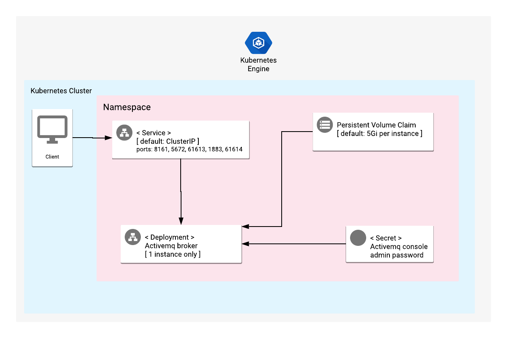

# Overview

Apache ActiveMQ is an open source and multi-protocol Java-based messaging server.

For more information, visit the ActiveMQ [official website](https://activemq.apache.org/).

## About Google Click to Deploy

Popular open stacks on Kubernetes, packaged by Google.

## Architecture



A Kubernetes Deployment manages ActiveMQ 5 single broker. 
This deployment is based on default ActiveMQ 5 broker which has no authentication enabled for the subscribers.
As a Database, it uses embedded KahaDB with persistent volume which is 5Gi by default in this deployment. 

Access to the ActiveMQ service is authenticated and credentials are stored in Kubernetes Secret resource.

# Installation

## Quick install with Google Cloud Marketplace

Get up and running with a few clicks! To install this ActiveMQ app to a Google
Kubernetes Engine cluster using Google Cloud Marketplace, follow the
[on-screen instructions](https://console.cloud.google.com/marketplace/details/google/activemq).

## Command-line instructions

You can use [Google Cloud Shell](https://cloud.google.com/shell/) or a local
workstation to follow the steps below.

[](https://console.cloud.google.com/cloudshell/editor?cloudshell_git_repo=https://github.com/GoogleCloudPlatform/click-to-deploy&cloudshell_open_in_editor=README.md&cloudshell_working_dir=k8s/activemq)

### Prerequisites

#### Set up command-line tools

You'll need the following tools in your development environment. If you are
using Cloud Shell, then `gcloud`, `kubectl`, Docker, and Git are installed in your
environment by default.

* [gcloud](https://cloud.google.com/sdk/gcloud/)
* [kubectl](https://kubernetes.io/docs/reference/kubectl/overview/)
* [docker](https://docs.docker.com/install/)
* [git](https://git-scm.com/book/en/v2/Getting-Started-Installing-Git)
* [openssl](https://www.openssl.org/)
* [helm](https://helm.sh/)

Configure `gcloud` as a Docker credential helper:

```shell
gcloud auth configure-docker
```

#### Create a Google Kubernetes Engine (GKE) cluster

Create a new cluster from the command line:

```shell
export CLUSTER=activemq-cluster
export ZONE=us-west1-a
export PROJECT_ID=<GCP_Project_ID>

gcloud container clusters create "$CLUSTER" --zone "$ZONE"
```

Configure `kubectl` to connect to the new cluster:

```shell
gcloud container clusters get-credentials "$CLUSTER" --zone "$ZONE"
```

#### Clone this repo

Clone this repo, and the associated tools repo:

```shell
git clone --recursive https://github.com/GoogleCloudPlatform/click-to-deploy.git
```

#### Install the Application resource definition

An Application resource is a collection of individual Kubernetes components,
such as Services, StatefulSets, and so on, that you can manage as a group.

To set up your cluster to understand Application resources, run the following
command:

```shell
kubectl apply -f "https://raw.githubusercontent.com/GoogleCloudPlatform/marketplace-k8s-app-tools/master/crd/app-crd.yaml"
```

You need to run this command once.

The Application resource is defined by the
[Kubernetes SIG-apps](https://github.com/kubernetes/community/tree/master/sig-apps)
community. The source code can be found at
[github.com/kubernetes-sigs/application](https://github.com/kubernetes-sigs/application).

### Install the app

Navigate to the `activemq` directory:

```shell
cd click-to-deploy/k8s/activemq
```

#### Configure the app with environment variables

Choose the instance name and namespace for the app. For most cases, you can use
the `default` namespace.

```shell
export APP_INSTANCE_NAME=activemq-1
export NAMESPACE=default
```

Configure the container images:

```shell
export TAG=5.15.10
export IMAGE_ACTIVEMQ="marketplace.gcr.io/google/activemq5"
```

Set or generate password for ActiveMQ console:

```shell
export ACTIVEMQ_ADMIN_PASSWORD=$(cat /dev/urandom | tr -dc 'a-zA-Z0-9' | fold -w 10 | head -n 1 | tr -d '\n')
```

Set the storage class for the persistent volume of ActiveMQ's embedded KahaDB:

 * Set the StorageClass name. You can select your existing StorageClass name for persistent disk of ActiveMQ broker.
 * Set the persistent disk's size. The default disk size is "5Gi".
> Note: "ssd" type storage is recommended for ActiveMQ, as it uses local disk to store and retrieve keys and values.
> To create a StorageClass for dynamic provisioning of SSD persistent volumes, check out [this documentation](https://cloud.google.com/kubernetes-engine/docs/how-to/persistent-volumes/ssd-pd) for more detailed instructions.
```shell
export STORAGE_CLASS="standard" # provide your StorageClass name if not "standard"
export PERSISTENT_DISK_SIZE="5Gi"
```

#### Create namespace in your Kubernetes cluster

If you use a different namespace than `default`, or the namespace does not exist
yet, run the command below to create a new namespace:

```shell
kubectl create namespace "${NAMESPACE}"
```

#### Expand the manifest template

Use `helm template` to expand the template. We recommend that you save the
expanded manifest file for future updates to your app.

```shell
helm template chart/activemq \
  --name "${APP_INSTANCE_NAME}" \
  --namespace "${NAMESPACE}" \
  --set "image.repo=${IMAGE_ACTIVEMQ}" \
  --set "image.tag=${TAG}" \
  --set "persistence.storageClass=${STORAGE_CLASS}" \
  --set "persistence.size=${PERSISTENT_DISK_SIZE}" \
  --set "consolePassword=${ACTIVEMQ_ADMIN_PASSWORD}" \
  > ${APP_INSTANCE_NAME}_manifest.yaml
```

#### Apply the manifest to your Kubernetes cluster

Use `kubectl` to apply the manifest to your Kubernetes cluster:

```shell
kubectl apply -f "${APP_INSTANCE_NAME}_manifest.yaml" --namespace "${NAMESPACE}"
```

#### View the app in the Google Cloud Console

To get the Cloud Console URL for your app, run the following command:

```shell
echo "https://console.cloud.google.com/kubernetes/application/${ZONE}/${CLUSTER}/${NAMESPACE}/${APP_INSTANCE_NAME}?project=${PROJECT_ID}"
```

To view the app, open the URL in your browser.

### Access to ActiveMQ web console

The deployed service of ActiveMQ is ClusterIP type, so you can reach to web console within a Kubernetes cluster by port-forwarding. To achieve this run below commands:

```shell
# Get admin user credentials of web console
ACTIVEMQ_ADMIN_PASSWORD=$(kubectl get secret --namespace \
  ${NAMESPACE} ${APP_INSTANCE_NAME}-activemq-secret \
  -o jsonpath="{.data.console-password}" | base64 --decode)

echo "username: admin"
echo "password: ${ACTIVEMQ_ADMIN_PASSWORD}"

# Forward ActiveMQ web console port to local workspace
kubectl port-forward svc/${APP_INSTANCE_NAME}-activemq --namespace ${NAMESPACE} 8161
```

Then visit [http://localhost:8161/admin](http://localhost:8161/admin) on
your web browser and login with `admin` user credentials.

# Scaling

This is a single-instance version of ActiveMQ. It is not intended to be scaled
up with its current configuration.

# Upgrade the app

## Prepare the environment

The steps below describe the upgrade procedure for the Docker image of ActiveMQ only.
They do not describe how to upgrade your ActiveMQ version.

> Note that during the upgrade, your ActiveMQ broker will be unavailable.

Set your environment variables to match the installation properties:

```shell
export APP_INSTANCE_NAME=activemq-1
export NAMESPACE=default
```

## Upgrade ActiveMQ

Start by assigning a new image to your StatefulSet definition:

```shell
kubectl set image deployment "${APP_INSTANCE_NAME}-activemq" \
  --namespace "${NAMESPACE}" activemq=[NEW_IMAGE_REFERENCE]
```

where `[NEW_IMAGE_REFERENCE]` is the new image.

To check that the Pods in the deployment running the `activemq` container are
updating, run the following command:

```shell
kubectl get pods -l app.kubernetes.io/name=${APP_INSTANCE_NAME} --namespace "${NAMESPACE}" -w
```

The deployment terminates each Pod, and then waits for it to transition
to `Running` and then `Ready`.

The final state of the Pods should be `Running`, with a value of `1/1` in the
**READY** column.

To verify the current image used for an `activemq` container, run the following
command:

```shell
kubectl get deployment "${APP_INSTANCE_NAME}-activemq" \
  --namespace "${NAMESPACE}" \
  --output jsonpath='{.spec.template.spec.containers[0].image}'
```

# Uninstall the app

## Using the Google Cloud Console

1.  In the Cloud Console, open
    [Kubernetes Applications](https://console.cloud.google.com/kubernetes/application).

2.  From the list of apps, click **Activemq**.

3.  On the Application Details page, click **Delete**.

## Using the command-line

### Prepare the environment

Set your installation name and Kubernetes namespace:

```shell
export APP_INSTANCE_NAME=activemq-1
export NAMESPACE=default
```

### Delete the resources

> **NOTE:** We recommend using a `kubectl` version that is the same as the
> version of your cluster. Using the same version for `kubectl` and the cluster
> helps to avoid unforeseen issues.

#### Delete the deployment with the generated manifest file

Run `kubectl` on the expanded manifest file:
> **WARNING:** This will also delete your `persistentVolumeClaim`
> for ActiveMQ, which means that you will lose all of your ActiveMQ data.

```shell
kubectl delete -f ${APP_INSTANCE_NAME}_manifest.yaml --namespace ${NAMESPACE}
```

#### Delete the deployment by deleting the application resource

If you don't have the expanded manifest file, delete the resources by using types
and a label:

```shell
kubectl delete application --namespace ${NAMESPACE} \
  --selector app.kubernetes.io/name=${APP_INSTANCE_NAME}
```

Deleting the `application` resource will delete all of your deployment's resources,
except for `persistenVolumeClaim`. To remove the PersistentVolumeClaims with their
attached persistent disks, run the following `kubectl` command:

```shell
kubectl delete persistentvolumeclaims \
  --namespace ${NAMESPACE}
  --selector app.kubernetes.io/name=${APP_INSTANCE_NAME}
```
