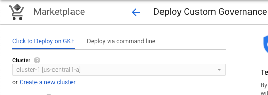
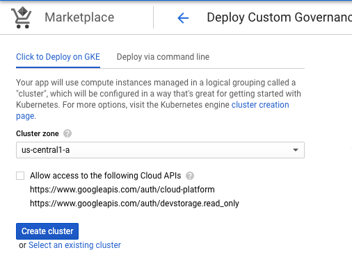
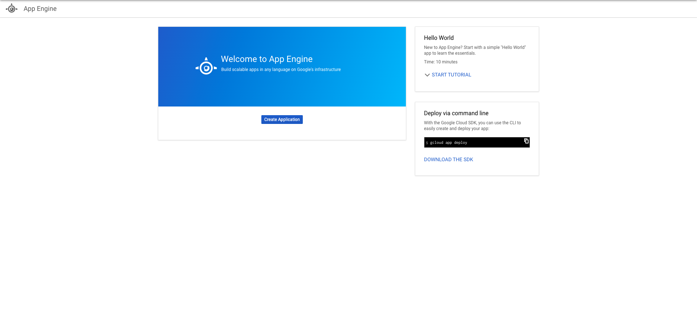
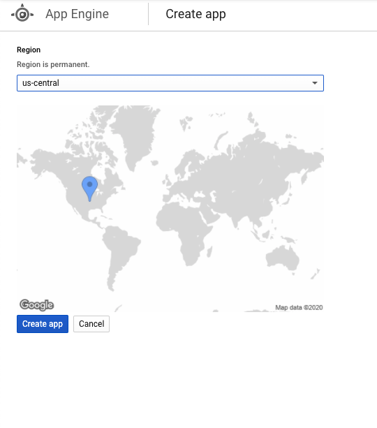
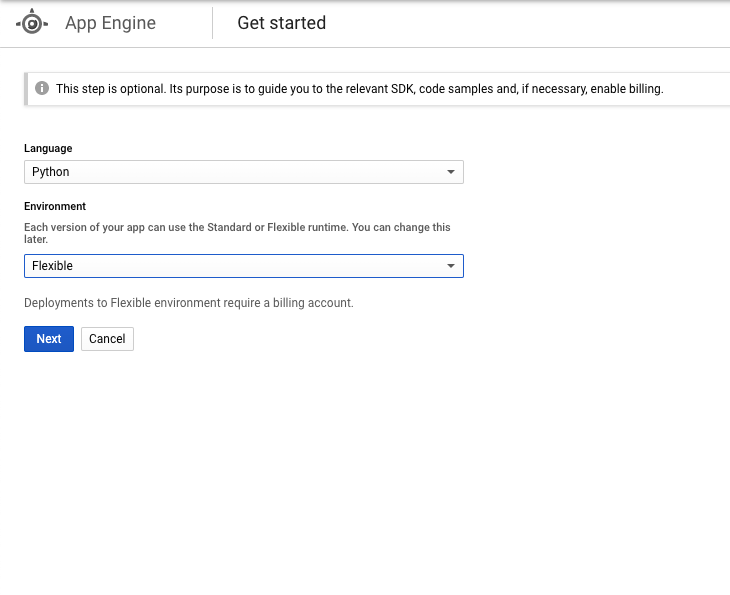

# Custom Governance Installation

These instructions are for installing Custom Governance through the Google Cloud Platform (GCP) Marketplace UI.

Custom Governance installed through Marketplace is a Kubernetes application on a Google Kubernetes Engine (GKE) cluster.

## Questions

Questions about Custom Governance? Go [here](https://docs.google.com/document/d/1o1x8wVrmNwWscnMDtXeTHBjK8cwBCvA6cidoSU0bEzM/edit#heading=h.huk25sxgebcs)

## Quick install with Google Cloud Marketplace

Get up and running with a few clicks! Install Custom Governance to a
Google Kubernetes Engine cluster using Google Cloud Marketplace. Follow the
[on-screen instructions](https://console.cloud.google.com/marketplace/details/aditum-marketplace-dev/custom-governance).

## Start Here: Installation Prerequisites


### Enable [Cloud Resource Manager](https://console.cloud.google.com/apis/api/cloudresourcemanager.googleapis.com)


*   CRM (Cloud Resource Manager) is used by Custom Governance to read Google Cloud Platform resource metadata. It is required for Custom Governance to run.


### GKE Cluster:


**You can use the Marketplace UI to create a cluster with the correct requirements for you:**






* Click “Create a new cluster” on the deployment configuration page.
* **Make sure to enable "Allow access to the following Cloud APIs".** This is required
for the Cluster to be able to network with GCP services.


If you wish to create a cluster manually:


  *   The Cloud Platform scope allows your cluster to communicate with Google Cloud Platform services.
  *   The scope can be set through Nodepool Security. While creating a new cluster through the UI- Click on Node Pools > Security > Set access for each API > Set Cloud Platform to enabled
  *   You can also create a cluster with the scope through the [gcloud command-line tool](https://cloud.google.com/sdk/gcloud):

        `gcloud container clusters create [YOUR-CLUSTER-NAME] --scopes=https://www.googleapis.com/auth/cloud-platform --region=[YOUR-REGION]`


### Setup OAuth Credentials for IAP (Identity Aware Proxy)

Learn more about IAP [here](https://cloud.google.com/iap)

You will need to pass OAuth Credentials to Marketplace UI to properly configure IAP. Follow the instructions to create OAuth Credentials:


*   [Configuring OAuth Consent Screen](https://cloud.google.com/iap/docs/enabling-kubernetes-howto#oauth-configure)
*   [Creating OAuth Credentials](https://cloud.google.com/iap/docs/enabling-kubernetes-howto#oauth-credentials)
  * Ensure you have set the OAuth authorized redirect URIs:
      * Required URI: https://iap.googleapis.com/v1/oauth/clientIds/CLIENT_ID:handleRedirect
      * Where CLIENT_ID is your OAuth Client ID


Once you have created your OAuth Credentials you will need the following to pass into Marketplace UI:


*   OAuth client ID
*   OAuth client secret


### Reserve Static External IP Address

Follow the instructions to reserve a static IP address:


*   [Reserving a static IP address](https://cloud.google.com/compute/docs/ip-addresses/reserve-static-external-ip-address)
*   The name for the static address will need to be passed into the Marketplace UI, note is down
*   You MUST choose Global as the IP address type


### DNS A Record

The [managed certificate](https://cloud.google.com/kubernetes-engine/docs/how-to/managed-certs) used by IAP requires hostname DNS verification.  Follow these instructions to retrieve your assigned IP address:


*   [Listing static IP addresses](https://cloud.google.com/compute/docs/ip-addresses/reserve-static-external-ip-address#list_ip)

You will need to create an A record with the assigned IP address in your DNS settings. These DNS settings are usually handled by your host provider. Set the TTL to the minimum amount to allow for quick propagation.

If you utilize Cloud DNS you can follow [these instructions for creating a new record](https://cloud.google.com/dns/docs/quickstart#create_a_new_record)


## Installation Process

Before deploying through Marketplace please [create a project](https://cloud.google.com/resource-manager/docs/creating-managing-projects#before_you_begin)
 where Custom Governance can be deployed.

Visit the Marketplace listing for [Custom Governance](https://console.cloud.google.com/marketplace/details/aditum-marketplace-dev/custom-governance) for information on Custom Governance.

When you are ready to deploy click on the “Configure” button, it will take you to the Deployment Configuration UI:


Here you will fill in the information we created in the Prerequisites section:


*   Cluster: The cluster list will list only clusters that meet the requirements, you can create a new cluster that meets the requirements by clicking “Create a new cluster”
*   Namespace: You can use the default namespace or create a new one in the dropdown
*   App Instance Name: Name of your application instance.
*   OAuth Client ID and OAuth Client Secret: Fill in the OAuth Client ID and OAuth Client Secret that you created in the [OAuth section](#bookmark=id.6dytd4218vwe)
*   Domain Name: the domain name that you pointed to the static IP address through the A record
*   Static Address Name: the name assigned to a static address resource that was created in the prerequisites section. Retrieve the static address name:
    *   [Listing static IP addresses](https://cloud.google.com/compute/docs/ip-addresses/reserve-static-external-ip-address#list_ip)
*   Kubernetes Service Account: If you select "Create a new service account" a new Kubernetes service account will be created using cluster edit and read roles to allow access to the Kubernetes Secrets
*   Initial User Email: will be the user email address that will be deploying/setting up Custom Governance. Custom Governance will check for this email address even after the user has passed through IAP.

Click “Deploy” when you are ready. Deployment will take a couple of minutes or longer. Even after deployment is successful the cg-ingress may take longer to become ready. This is completely normal.


## Post Deployment

### Configure Identity Aware Proxy (IAP)

After Marketplace Deployment has completed successfully you will need to configure
IAP and add any users that will require access to Custom Governance.

*   From the Cloud Console visit [Menu > Security > Identity-Aware-Proxy](https://cloud.google.com/security/iap)
*   Enable IAP if it is not already enabled
*   Review any Errors and Warning as well as review the firewalls
*   Via Cloud Console you can add users to IAP approved list. Visit
    [Menu > IAM & Admin > IAM](https://cloud.google.com/iam-admin/iam) and add
    the *IAP-secured Web App User* role to users you wish to grant access to


### Create App Engine application
The application uses Cloud Dataflow and requires an App Engine application to be created. From the Cloud Console visit [Menu > App Engine](https://cloud.google.com//appengine/start) to get started

1. Click *Create Application*

	
  
1. Select us-central as the region

	

1. Select *Python* as the language and *Flexible* as the environment. Click *Next* to
finish creating the app.

	


### Finish Deployment
Once deployment is complete you can visit your host address to start the Custom Governance post-deployment process. Custom Governance will walk you through the steps to deploy the necessary resources and permissions required.


## Troubleshooting


### “This site can't provide a secure connection”

The site is not loading your Managed Certificate yet. Make sure you are accessing Cloud Governance by the hostname, not the Load Balancer IP. Wait a few minutes for the Managed Certificate and Load Balancer to become ready. The Managed Certificate relies on your DNS to propagate the A record before it can provision correctly. Certificate provisioning can take up to an hour or even longer. You can check the status of your certificate through kubectl:

    gcloud container clusters get-credentials <cluster name>
    kubectl describe managedcertificate managed-certificate -n <namespace>


###  “Connection Closed”

If going to the hostname results in a “Connection Closed” error, the DNS was not updated in time and certificate provisioning failed. We will need to create a new certificate:


1. Visit the Kubernetes Engine Dashboard and navigate to [Services & Ingress](https://console.cloud.google.com/kubernetes/discovery)
2. Click on the service named “cg-ingress”
3. Locate the Load Balancer under the Ingress section and click on the associated load balancer
4. Edit the Load Balancer configuration
5. Select the Frontend Configuration for editing -> choose the HTTPS frontend configuration (Port 443)
6. Click on the Certificate dropdown and select “Create a new certificate”
7. Enter a name and select “Create Google-managed certificate”, enter your domain name
8. Finish creating the certificate and click “Update” on the load balancer to confirm your changes
9. You should now get through the application
10. Delete the old certificates that are no longer in use


### “Internal Server Error”

If you get an “Internal Server Error” try checking the logs to see what the issue is. You may have not configured the OAuth Credentials properly. You can check the pod logs through Cloud Console or [through kubectl](https://www.google.com/url?q=https://cloud.google.com/kubernetes-engine/docs/quickstart):


```
kubectl get pods
kubectl logs POD_NAME
```


### “Error: redirect_uri_mismatch”

If you are getting this error after logging in you have not[ setup OAuth](https://cloud.google.com/iap/docs/enabling-kubernetes-howto#oauth-credentials) authorized redirect URIs to include the universal redirect URL.

Add to your OAuth authorized redirect URIs:


```
 https://iap.googleapis.com/v1/oauth/clientIds/CLIENT_ID:handleRedirect
```


Where CLIENT_ID is your OAuth Client ID


## About Google Click to Deploy

Popular open source software stacks on Kubernetes packaged by Google and made
available in Google Cloud Marketplace.

# Installation
# Command line instructions

You can use [Google Cloud Shell](https://cloud.google.com/shell/) or a local
workstation to follow the steps below.

[](https://console.cloud.google.com/cloudshell/editor?cloudshell_git_repo=https://github.com/GoogleCloudPlatform/click-to-deploy&cloudshell_open_in_editor=README.md&cloudshell_working_dir=k8s/sample-app)

### Prerequisites

#### Set up command line tools

You'll need the following tools in your development environment. If you are
using Cloud Shell, `gcloud`, `kubectl`, Docker, and Git are installed in your
environment by default.

-   [gcloud](https://cloud.google.com/sdk/gcloud/)
-   [kubectl](https://kubernetes.io/docs/tasks/tools/install-kubectl/)
-   [docker](https://docs.docker.com/install/)
-   [openssl](https://www.openssl.org/)

Configure `gcloud` as a Docker credential helper:

```shell
gcloud auth configure-docker
```

#### Create a Google Kubernetes Engine cluster

Create a cluster from the command line. If you already have a cluster that you
want to use, this step is optional.

```shell
export CLUSTER=sample-app-cluster
export ZONE=us-west1-a

gcloud container clusters create "$CLUSTER" --zone "$ZONE"
```

#### Configure kubectl to connect to the cluster

```shell
gcloud container clusters get-credentials "$CLUSTER" --zone "$ZONE"
```

#### Clone this repo

Clone this repo and the associated tools repo:

```shell
git clone --recursive https://github.com/GoogleCloudPlatform/click-to-deploy.git
```

#### Install the Application resource definition

An Application resource is a collection of individual Kubernetes components,
such as Services, Deployments, and so on, that you can manage as a group.

To set up your cluster to understand Application resources, run the following
command:

```shell
kubectl apply -f "https://raw.githubusercontent.com/GoogleCloudPlatform/marketplace-k8s-app-tools/master/crd/app-crd.yaml"
```

You need to run this command once for each cluster.

The Application resource is defined by the
[Kubernetes SIG-apps](https://github.com/kubernetes/community/tree/master/sig-apps)
community. The source code can be found on
[github.com/kubernetes-sigs/application](https://github.com/kubernetes-sigs/application).

### Install the Application

Navigate to the `aditum` directory:

```shell
cd click-to-deploy/k8s/aditum
```

#### Configure the app with environment variables

Choose an instance name and
[namespace](https://kubernetes.io/docs/concepts/overview/working-with-objects/namespaces/)
for the app. In most cases, you can use the `default` namespace.

```shell
export APP_INSTANCE_NAME=cg-app-1
export NAMESPACE=default
```

Set the app parameter:

```shell
export OAUTH_CLIENT_ID=echo -n 'CLIENTID' | base64
export OAUTH_CLIENT_SECRET= echo -n 'CLIENTSECRET' | base64
export CERTIFICATE_HOSTNAME=<YOUR HOST NAME>
export INITIAL_EMAIL=<YOUR INITIAL_EMAIL>
export STATIC_NAME=<YOUR STATIC ADDRESS NAME>


```

Configure the container image:

```shell
export TAG=1.0
export IMAGE_CG="marketplace.gcr.io/aditum-marketplace-dev/custom-governance"
```

#### Create namespace in your Kubernetes cluster

If you use a different namespace than `default`, or the namespace does not exist
yet, run the command below to create a new namespace:

```shell
kubectl create namespace "${NAMESPACE}"
```

#### Expand the manifest template

Use `helm template` to expand the template. We recommend that you save the
expanded manifest file for future updates to your app.

```shell
helm template chart/aditum \
  --name "${APP_INSTANCE_NAME}" \
  --namespace "${NAMESPACE}" \
  --set "aditum.image.repo=${IMAGE_CG}" \
  --set "aditum.image.tag=${TAG}" \
  --set "oAuth.clientIDEncoded=${OAUTH_CLIENT_ID}" \
  --set "oAuth.clientSecretEncoded=${OAUTH_CLIENT_SECRET}" \
  --set "certificate.hostname=${CERTIFICATE_HOSTNAME}" \
  --set "setupAttributes.initialEmail=${INITIAL_EMAIL}" \
  --set "deployment.staticIP=${STATIC_NAME}" \
  > ${APP_INSTANCE_NAME}_manifest.yaml
```

#### Apply the manifest to your Kubernetes cluster

Use `kubectl` to apply the manifest to your Kubernetes cluster:

```shell
kubectl apply -f "${APP_INSTANCE_NAME}_manifest.yaml" --namespace "${NAMESPACE}"
```

#### View the app in the Google Cloud Console

To get the Cloud Console URL for your app, run the following command:

```shell
echo "https://console.cloud.google.com/kubernetes/application/${ZONE}/${CLUSTER}/${NAMESPACE}/${APP_INSTANCE_NAME}?project=${PROJECT_ID}"
```

To view the app, open the URL in your browser.
