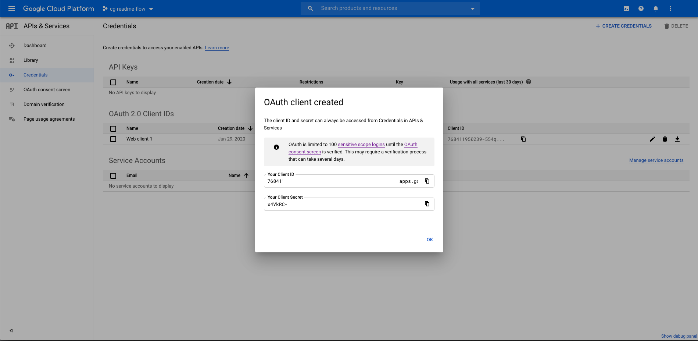

# Overview

Custom Governance (CG) is a customizable customer-managed governance platform which lets you coordinate the unique set of rules which make your business work as a native part of your cloud environment.

[Learn more.](https://console.cloud.google.com/marketplace/details/aditum-marketplace-dev/custom-governance)

## About Google Click to Deploy

Popular open stacks on Kubernetes, packaged by Google.

## Questions

Questions about Custom Governance? Go [here](https://docs.google.com/document/d/1o1x8wVrmNwWscnMDtXeTHBjK8cwBCvA6cidoSU0bEzM/edit#heading=h.huk25sxgebcs)

# Installation

## Before you get started

As of early summer 2020 the Custom Governance product is in Early Access stage. We are taking a limited number of new customers. To try out Custom Governance, [please fill out this intake form.](https://docs.google.com/forms/d/1ulI20NPs-S5-pAAZDSlZl4nAOhg5GRERtyoAr0XM6lg/viewform?edit_requested=true)

## Quick install with Google Cloud Marketplace

Get up and running with a few clicks! Install Custom Governance to a
Google Kubernetes Engine cluster using Google Cloud Marketplace. Follow the
[on-screen steps](https://console.cloud.google.com/marketplace/details/aditum-marketplace-dev/custom-governance).

Below are detailed instructions for installing Custom Governance through the Google Cloud Platform (GCP) Marketplace UI.

Custom Governance installed through Marketplace is a Kubernetes application on a Google Kubernetes Engine (GKE) cluster.

### Installation Process

1. [Create a project](https://cloud.google.com/resource-manager/docs/creating-managing-projects#before_you_begin)
 where Custom Governance can be deployed.

1. Enable [Cloud Resource Manager](https://console.cloud.google.com/apis/api/cloudresourcemanager.googleapis.com).
   *   CRM (Cloud Resource Manager) is used by Custom Governance to read Google Cloud Platform resource metadata. It is required for Custom Governance to run.
1. Visit the Marketplace listing for [Custom Governance](https://console.cloud.google.com/marketplace/details/aditum-marketplace-dev/custom-governance) for information on Custom Governance. We will start installation on this page.
   *   When you are ready to deploy click on the “Configure” button, it will take you to the Deployment Configuration UI:

        
   
   Please follow the below instructions to finish installation.
   1. **Create a cluster.** The cluster list will list only clusters that meet the requirements, you can create a new cluster that meets the requirements by clicking “Create a new cluster”. If you want to create the cluster manually, click [here](#Create-a-GKE-Cluster-Manually) for instruction.
      * **Make sure to enable "Allow access to the following Cloud APIs".** This is required
      for the Cluster to be able to network with GCP services.
   2. **Set up Namespace.** You can use the default namespace or create a new one in the dropdown.
   3. **Set up App instance name.** This is the name of your application instance, e.g. custom-governance.
   4. **Set up OAuth Client ID and OAuth Client Secret.** Please follow the [OAuth section](#Setup-OAuth-Credentials-for-IAP-Identity-Aware-Proxy) and fill in the OAuth Client ID and OAuth Client Secret that you created there.
   5. **Set up Name of Global Static IP Address.** Please follow the instructions here on [how to create a static ip](#Reserve-Static-External-IP-Address) and fill in the name of that ip address, e.g. cg-app-ip.
   6. **Set up Domain Name to serve Custom Governance and Name of Global Static IP Address.** After a static ip is reserved, please follow [DNS A Record](#DNS-A-Record). The Domain name which needs to be filled in here refers to the name that you pointed to the static IP address through the A record. e.g. cg.example.com.
   7. **Set up Kubernete Service Account. Please select *Create a new service account***
        *   A new Kubernetes service account will be created using cluster edit and read roles to allow access to the Kubernetes Secrets
   8. **Set up Initial User Email.** This will be the user email address that will be deploying/setting up Custom Governance. Custom Governance will check for this email address even after the user has passed through IAP.
   9. **Click “Deploy” when you are ready.** Deployment usually will take around ten minutes or longer. Even after deployment is successful the cg-ingress may take longer to become ready. This is completely normal. When you find cg-ingress is ready on [cloud console](https://console.cloud.google.com/kubernetes/discovery), it means that the deployment succeeds! You can jump to our [Post Deployment Section](#Post-Deployment) once it's ready. We still have a few steps before you can explore Custom Governance.

### Detailed Instructions

#### Create a GKE Cluster Manually:

  * You can create a cluster with the scope through the [gcloud command-line tool](https://cloud.google.com/sdk/gcloud). You can run this command in the Cloud Shell:

    `gcloud container clusters create [YOUR-CLUSTER-NAME] --scopes=https://www.googleapis.com/auth/cloud-platform --region=[YOUR-REGION]`

  * **Or** you can create a cluster through [Kubernetes Engine UI](https://console.cloud.google.com/kubernetes) if you wish to customize more on the cluster settings.
    *  **Recommended machine type for optimal performance: [n1-standard-8](https://cloud.google.com/compute/docs/machine-types)**
    *   **The scope can be set through Nodepool Security. Click on Node Pools > Security > Set access for each API > Set Cloud Platform to enable**
  
  * [Click here to continue with the rest installation steps](#Installation-Process)
#### Setup OAuth Credentials for IAP (Identity Aware Proxy)

Learn more about IAP [here](https://cloud.google.com/iap).

Custom Governance uses OAuth for authentication/authorization.
You will need to pass OAuth Credentials to Marketplace UI to properly configure IAP. Follow the instructions to create OAuth Credentials:

   1. Configuring OAuth Consent Screen. Below are detailed steps on how to configure the OAuth Consent Screen.
       1.  Via Cloud Console visit [Menu > API & Services > OAuth consent screen](https://console.cloud.google.com/apis/credentials/consent), select user type and click create.
            * Selecting External will allow accounts outside of your organization to access Custom Governance
            * Selecting Internal will allow accounts only inside your organization to access Custom Governance. **We recommend to choose Internal as the user type.**
       1.  Fill in the *App name*, *User support email* under App information, and *Email addresses* under Developer contact information. Then click save and continue.
            * *App name* is the Application name you want to display on the user consent screen. You can name it as Custom Governance.
            * For *User support email* and *Email address*, you can fill in with your own email address.
       1.  Continue clicking **SAVE AND CONTINUE** Button for the rest and it's done!

   2. Creating OAuth Credentials. Below are detailed steps on how to create the OAuth Credentials.
       1.  Via Cloud Console visit [Menu > API & Services > Credentials](https://console.cloud.google.com/apis/credentials)
       2.  Click *Create Credentials* and select *OAuth client ID*
       3.  Select *Web application* as the Application type
         
       4.  Create the OAuth Credentials by clicking *Create*
       5. Copy the Client ID from the OAuth confirmation modal
         
       6. Dismiss the modal and select the OAuth 2.0 Client ID that was just created
       7. Add a Authorized redirect URI that incorporates the client ID that you copied over
         

           * Required URI: https://iap.googleapis.com/v1/oauth/clientIds/CLIENT_ID:handleRedirect
           * Where CLIENT_ID is your OAuth Client ID


Once you have created your OAuth Credentials you will need the following to pass into Marketplace UI:

*   OAuth client ID
*   OAuth client secret

[Click here to continue with the rest installation steps](#Installation-Process)
### Reserve Static External IP Address

*   You can reservce static external IP address through the [gcloud command-line tool](https://cloud.google.com/sdk/gcloud). In order to meet IAP requirements, we'll neeed to reserve a **global** IP address. You can run this command in the Cloud Shell. This command will reserve a static IP, and the name of the IP is **cg-app-ip**. You'll need this name to be put in the Marketplace UI:

    `gcloud compute addresses create cg-app-ip --global`

*   **Or** you can reserve static external IP address through [cloud console UI](https://console.cloud.google.com/networking/addresses/add).
    *   **You MUST choose Global as the IP address type**
    *   The name for the static address will need to be passed into the Marketplace UI. For example, you can name it as **cg-app-ip**.

*  [Click here to continue with the rest installation steps](#Installation-Process)

### DNS A Record

*    Run the following gcloud command to retrieve your assigned IP address. If you specified a different IP name in the previous step, please replace **cg-app-ip** with your customized name:
    
      `gcloud compute addresses describe cg-app-ip --global`

*   **Or** retrieve the IP through [cloud console UI](https://console.cloud.google.com/networking/addresses/list). Find the **cg-app-ip** (or your customized name if different) and the External Address is the IP address.

Then you will need to **create an A record with the assigned IP address in your DNS settings**. These DNS settings are usually handled by your host provider. Set the TTL to the minimum amount to allow for quick propagation. The **full domain name** you entered will need to be passed into the Marketplace UI. For example, you can name it as cg.example.com.
The following command can help you quickly find out if your DNS is correctly set up and propagated:

`nslookup <your domain>`

If you utilize Cloud DNS you can follow [these instructions for creating a new record](https://cloud.google.com/dns/docs/quickstart#create_a_new_record).
Once this step is completed, [Click here to continue with the rest installation steps](#Installation-Process)

## Post Deployment

### Configure Identity-Aware Proxy (IAP)

After Marketplace Deployment has completed successfully you will need to configure
IAP and add any users that will require access to Custom Governance.

*   From the Cloud Console visit [Menu > Security > Identity-Aware-Proxy](https://console.cloud.google.com/security/iap).
*   Enable IAP if it is not already enabled.
*   Review any Errors and Warning as well as review the firewalls.
*   Via Cloud Console you can add users to IAP approved list. Visit
    [Menu > IAM & Admin > IAM](https://console.cloud.google.com/iam-admin/iam) and add
    the *IAP-secured Web App User* role to users you wish to grant access to
    * **Even if you are the Project Owner, you still need to be added to IAP approved list as well.**
    * **Note that IAP may need a couple of minutes to propagate.**


### Finish Deployment
Once deployment is complete you can visit your host address to start the Custom Governance post-deployment process. Custom Governance will walk you through the steps to deploy the necessary resources and permissions required.


## Troubleshooting

### "Some components have errors"

You may see this error in Cloud Console after the application is deployed if the components are not ready. It can take up to half an hour or longer for the Ingress and Deployment to become ready depending on your DNS TTL.

This warning may be accompanied by others:
*   Ingress: "All backend services are in UNHEALTHY state"
*   Deployment: "Does not have minimum availability"

Please allow some time for these warnings to resolve.

### “This site can't provide a secure connection”

The site is not loading your Managed Certificate yet. Make sure you are accessing Cloud Governance by the hostname, not the Load Balancer IP. Wait a few minutes for the Managed Certificate and Load Balancer to become ready. The Managed Certificate relies on your DNS to propagate the A record before it can provision correctly. Certificate provisioning can take up to an hour or even longer. You can check the status of your certificate through kubectl:

    gcloud container clusters get-credentials <cluster name>
    kubectl describe managedcertificate managed-certificate -n <namespace>


###  “Connection Closed”

If going to the hostname results in a “Connection Closed” error, the DNS was not updated in time and certificate provisioning failed. We will need to create a new certificate:


1. Visit the Kubernetes Engine Dashboard and navigate to [Services & Ingress](https://console.cloud.google.com/kubernetes/discovery)
2. Click on the service named “cg-ingress”
3. Locate the Load Balancer under the Ingress section and click on the associated load balancer
4. Edit the Load Balancer configuration
5. Select the Frontend Configuration for editing -> choose the HTTPS frontend configuration (Port 443)
6. Click on the Certificate dropdown and select “Create a new certificate”
7. Enter a name and select “Create Google-managed certificate”, enter your domain name
8. Finish creating the certificate and click “Update” on the load balancer to confirm your changes
9. You should now get through the application
10. Delete the old certificates that are no longer in use


### “Internal Server Error”

If you get an “Internal Server Error” try checking the logs to see what the issue is. You may have not configured the OAuth Credentials properly. You can check the pod logs through Cloud Console or [through kubectl](https://www.google.com/url?q=https://cloud.google.com/kubernetes-engine/docs/quickstart):


```
kubectl get pods
kubectl logs POD_NAME
```


### “Error: redirect_uri_mismatch”

If you are getting this error after logging in you have not[ setup OAuth](https://cloud.google.com/iap/docs/enabling-kubernetes-howto#oauth-credentials) authorized redirect URIs to include the universal redirect URL.

Add to your OAuth authorized redirect URIs:


```
 https://iap.googleapis.com/v1/oauth/clientIds/CLIENT_ID:handleRedirect
```


Where CLIENT_ID is your OAuth Client ID


## Command line instructions

You can use [Google Cloud Shell](https://cloud.google.com/shell/) or a local
workstation to follow the steps below.

[](https://console.cloud.google.com/cloudshell/editor?cloudshell_git_repo=https://github.com/GoogleCloudPlatform/click-to-deploy&cloudshell_open_in_editor=README.md&cloudshell_working_dir=k8s/sample-app)

### Prerequisites

#### Set up command line tools

You'll need the following tools in your development environment. If you are
using Cloud Shell, `gcloud`, `kubectl`, Docker, and Git are installed in your
environment by default.

-   [gcloud](https://cloud.google.com/sdk/gcloud/)
-   [kubectl](https://kubernetes.io/docs/tasks/tools/install-kubectl/)
-   [docker](https://docs.docker.com/install/)
-   [openssl](https://www.openssl.org/)

Configure `gcloud` as a Docker credential helper:

```shell
gcloud auth configure-docker
```

#### Create a Google Kubernetes Engine cluster

Create a cluster from the command line. If you already have a cluster that you
want to use, this step is optional.

```shell
export CLUSTER=sample-app-cluster
export ZONE=us-west1-a

gcloud container clusters create "$CLUSTER" --zone "$ZONE"
```

#### Configure kubectl to connect to the cluster

```shell
gcloud container clusters get-credentials "$CLUSTER" --zone "$ZONE"
```

#### Clone this repo

Clone this repo and the associated tools repo:

```shell
git clone --recursive https://github.com/GoogleCloudPlatform/click-to-deploy.git
```

#### Install the Application resource definition

An Application resource is a collection of individual Kubernetes components,
such as Services, Deployments, and so on, that you can manage as a group.

To set up your cluster to understand Application resources, run the following
command:

```shell
kubectl apply -f "https://raw.githubusercontent.com/GoogleCloudPlatform/marketplace-k8s-app-tools/master/crd/app-crd.yaml"
```

You need to run this command once for each cluster.

The Application resource is defined by the
[Kubernetes SIG-apps](https://github.com/kubernetes/community/tree/master/sig-apps)
community. The source code can be found on
[github.com/kubernetes-sigs/application](https://github.com/kubernetes-sigs/application).

### Install the Application

Navigate to the `aditum` directory:

```shell
cd click-to-deploy/k8s/aditum
```

#### Configure the app with environment variables

Choose an instance name and
[namespace](https://kubernetes.io/docs/concepts/overview/working-with-objects/namespaces/)
for the app. In most cases, you can use the `default` namespace.

```shell
export APP_INSTANCE_NAME=cg-app-1
export NAMESPACE=default
```

Set the app parameter:

```shell
export OAUTH_CLIENT_ID=echo -n 'CLIENTID' | base64
export OAUTH_CLIENT_SECRET= echo -n 'CLIENTSECRET' | base64
export CERTIFICATE_HOSTNAME=<YOUR HOST NAME>
export INITIAL_EMAIL=<YOUR INITIAL_EMAIL>
export STATIC_NAME=<YOUR STATIC ADDRESS NAME>


```

Configure the container image:

```shell
export TAG=1.0
export IMAGE_CG="marketplace.gcr.io/aditum-marketplace-dev/custom-governance"
```

#### Create namespace in your Kubernetes cluster

If you use a different namespace than `default`, or the namespace does not exist
yet, run the command below to create a new namespace:

```shell
kubectl create namespace "${NAMESPACE}"
```

#### Expand the manifest template

Use `helm template` to expand the template. We recommend that you save the
expanded manifest file for future updates to your app.

```shell
helm template chart/aditum \
  --name "${APP_INSTANCE_NAME}" \
  --namespace "${NAMESPACE}" \
  --set "aditum.image.repo=${IMAGE_CG}" \
  --set "aditum.image.tag=${TAG}" \
  --set "oAuth.clientIDEncoded=${OAUTH_CLIENT_ID}" \
  --set "oAuth.clientSecretEncoded=${OAUTH_CLIENT_SECRET}" \
  --set "certificate.hostname=${CERTIFICATE_HOSTNAME}" \
  --set "setupAttributes.initialEmail=${INITIAL_EMAIL}" \
  --set "deployment.staticIP=${STATIC_NAME}" \
  > ${APP_INSTANCE_NAME}_manifest.yaml
```

#### Apply the manifest to your Kubernetes cluster

Use `kubectl` to apply the manifest to your Kubernetes cluster:

```shell
kubectl apply -f "${APP_INSTANCE_NAME}_manifest.yaml" --namespace "${NAMESPACE}"
```

#### View the app in the Google Cloud Console

To get the Cloud Console URL for your app, run the following command:

```shell
echo "https://console.cloud.google.com/kubernetes/application/${ZONE}/${CLUSTER}/${NAMESPACE}/${APP_INSTANCE_NAME}?project=${PROJECT_ID}"
```

To view the app, open the URL in your browser.
