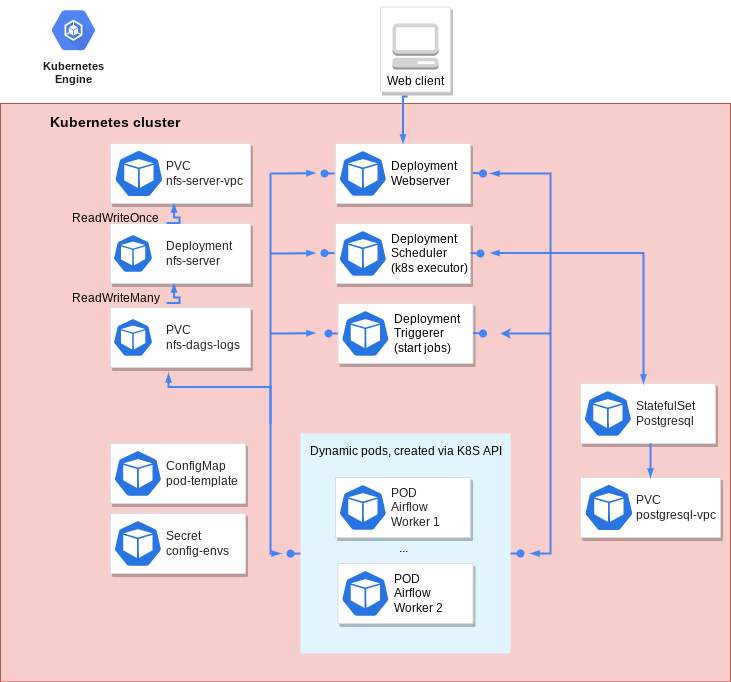

# Overview

Apache Airflow is an open-source tool to programmatically author, schedule, and monitor workflows.

For more information, visit the Airflow [official website](https://airflow.apache.org/).

## About Google Click to Deploy

Popular open stacks on Kubernetes, packaged by Google.

## Architecture

This app offers "list of resources".
