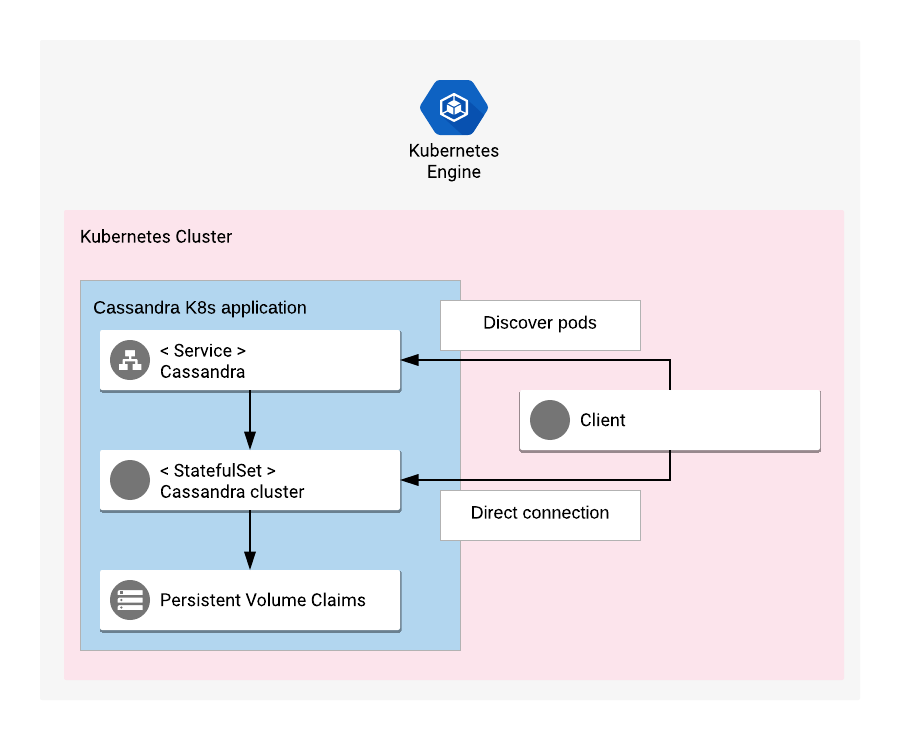

# Overview

Apache Cassandra is a database management system that replicates
large amounts of data across many servers, avoiding a single point of failure
and reducing latency.

[Learn more](https://cassandra.apache.org/).

## About Google Click to Deploy

Popular open stacks on Kubernetes packaged by Google.

## Design



### Solution Information

StatefulSet Kubernetes object is used to manage all Cassandra pods within this K8s application. Each pod runs a single instance of Cassandra process.

All pods are behind Service object. Cassandra service is not exposed to the external traffic as this Cassandra K8s application is meant to be an internal database
and access to Cassandra instances is not authenticated by default. Please configure authentication and other layers of protection, like firewalls, before exposing
Cassandra outside K8s cluster.

Cassandra service can be used to discover current number of pods and their addresses.

# Installation

## Quick install with Google Cloud Marketplace

Get up and running with a few clicks! Install this Cassandra app to a
Google Kubernetes Engine cluster using Google Cloud Marketplace. Follow the
[on-screen instructions](https://console.cloud.google.com/marketplace/details/google/cassandra).

## Command line instructions

You can use [Google Cloud Shell](https://cloud.google.com/shell/) or a local workstation in the
further instructions.

[](https://console.cloud.google.com/cloudshell/editor?cloudshell_git_repo=https://github.com/GoogleCloudPlatform/click-to-deploy&cloudshell_working_dir=k8s/cassandra)

### Prerequisites

#### Set up command-line tools

You'll need the following tools in your development environment:

- [gcloud](https://cloud.google.com/sdk/gcloud/)
- [kubectl](https://kubernetes.io/docs/reference/kubectl/overview/)
- [docker](https://docs.docker.com/install/)
- [git](https://git-scm.com/book/en/v2/Getting-Started-Installing-Git)
- [cqlsh](https://pypi.org/project/cqlsh/)

Configure `gcloud` as a Docker credential helper:

```shell
gcloud auth configure-docker
```

#### Create a Google Kubernetes Engine cluster

Create a new cluster from the command line:

```shell
export CLUSTER=cassandra-cluster
export ZONE=us-west1-a

gcloud container clusters create "$CLUSTER" --zone "$ZONE"
```

Configure `kubectl` to connect to the new cluster:

```shell
gcloud container clusters get-credentials "$CLUSTER" --zone "$ZONE"
```

#### Clone this repo

Clone this repo and the associated tools repo.

```shell
git clone --recursive https://github.com/GoogleCloudPlatform/click-to-deploy.git
```

#### Install the Application resource definition

An Application resource is a collection of individual Kubernetes components,
such as Services, Deployments, and so on, that you can manage as a group.

To set up your cluster to understand Application resources, run the following command:

```shell
kubectl apply -f "https://raw.githubusercontent.com/GoogleCloudPlatform/marketplace-k8s-app-tools/master/crd/app-crd.yaml"
```

You need to run this command once.

The Application resource is defined by the
[Kubernetes SIG-apps](https://github.com/kubernetes/community/tree/master/sig-apps)
community. The source code can be found on
[github.com/kubernetes-sigs/application](https://github.com/kubernetes-sigs/application).

### Install the Application

Navigate to the `cassandra` directory:

```shell
cd click-to-deploy/k8s/cassandra
```

#### Configure the app with environment variables

Choose an instance name and
[namespace](https://kubernetes.io/docs/concepts/overview/working-with-objects/namespaces/)
for the app. In most cases, you can use the `default` namespace.

```shell
export APP_INSTANCE_NAME=cassandra-1
export NAMESPACE=default
```

Set the number of replicas for Cassandra:

```shell
# Setting a single node in Cassandra cluster means single point of failure.
# For production environments, consider at least 3 replicas.
export REPLICAS=3
```

Enable Stackdriver Metrics Exporter:

> **NOTE:** Your GCP project should have Stackdriver enabled. For non-GCP clusters, export of metrics to Stackdriver is not supported yet.

By default the integration is disabled. To enable, change the value to `true`.

```shell
export METRICS_EXPORTER_ENABLED=false
```

Configure the container images:

```shell
TAG=3.11
export IMAGE_CASSANDRA="marketplace.gcr.io/google/cassandra:${TAG}"
export IMAGE_METRICS_EXPORTER="marketplace.gcr.io/google/cassandra/prometheus-to-sd:${TAG}"
```

The images above are referenced by
[tag](https://docs.docker.com/engine/reference/commandline/tag). We recommend
that you pin each image to an immutable
[content digest](https://docs.docker.com/registry/spec/api/#content-digests).
This ensures that the installed application always uses the same images,
until you are ready to upgrade. To get the digest for the image, use the
following script:

```shell
for i in "IMAGE_CASSANDRA" "IMAGE_METRICS_EXPORTER"; do
  repo=$(echo ${!i} | cut -d: -f1);
  digest=$(docker pull ${!i} | sed -n -e 's/Digest: //p');
  export $i="$repo@$digest";
  env | grep $i;
done
```

#### Create namespace in your Kubernetes cluster

If you use a different namespace than the `default`, run the command below to create a new namespace:

```shell
kubectl create namespace "$NAMESPACE"
```

#### Expand the manifest template

Use `helm template` to expand the template. We recommend that you save the
expanded manifest file for future updates to the application.

```shell
helm template chart/cassandra \
  --name $APP_INSTANCE_NAME \
  --namespace $NAMESPACE \
  --set cassandra.image=$IMAGE_CASSANDRA \
  --set cassandra.replicas=$REPLICAS \
  --set metrics.image=$IMAGE_METRICS_EXPORTER \
  --set metrics.enabled=$METRICS_EXPORTER_ENABLED > "${APP_INSTANCE_NAME}_manifest.yaml"
```

#### Apply the manifest to your Kubernetes cluster

Use `kubectl` to apply the manifest to your Kubernetes cluster:

```shell
kubectl apply -f "${APP_INSTANCE_NAME}_manifest.yaml" --namespace "${NAMESPACE}"
```

#### View the app in the Google Cloud Console

To get the Console URL for your app, run the following command:

```shell
echo "https://console.cloud.google.com/kubernetes/application/${ZONE}/${CLUSTER}/${NAMESPACE}/${APP_INSTANCE_NAME}"
```

To view your app, open the URL in your browser.

### Check the status of the Cassandra cluster

If your deployment is successful, you can check status of your Cassandra
cluster.

On one of the Cassandra containers, run the `nodetool status` command.
`nodetool` is a Cassandra utility for managing a cluster. It is part of
the Cassandra container image.

```shell
kubectl exec "${APP_INSTANCE_NAME}-cassandra-0" --namespace "${NAMESPACE}" -c cassandra -- nodetool status
```

### Connecting to Cassandra (internal access)

You can connect to the Cassandra service without exposing your cluster
for public access, using the following options:

*  From a container in your Kubernetes cluster, connect using the hostname
  `$APP_INSTANCE_NAME-cassandra-0.$APP_INSTANCE_NAME-cassandra-svc.$NAMESPACE.svc.cluster.local`

* Use port forwarding to access the service. In a separate terminal, run the
  following command:

    ```shell
    kubectl port-forward "${APP_INSTANCE_NAME}-cassandra-0" 9042:9042 --namespace "${NAMESPACE}"
    ```

    Then, in your main terminal, start `cqlsh`:

    ```shell
    cqlsh --cqlversion=3.4.4
    ```

    In the response, you see the Cassandra welcome message:

    ```shell
    Use HELP for help.
    cqlsh>
    ```

### Connecting to Cassandra using an external IP address

By default, the application does not have an external IP address.

If you want to expose your Cassandra cluster using an external IP address,
first [configure access control](https://www.datastax.com/dev/blog/role-based-access-control-in-cassandra).

#### Configuring the Cassandra service

To configure Cassandra as an external service, run the following command:

```shell
envsubst '${APP_INSTANCE_NAME}' < scripts/external.yaml.template > scripts/external.yaml
kubectl apply -f scripts/external.yaml --namespace "${NAMESPACE}"
```

An external IP address is provisioned for the Service. It might take
a few minutes to get the external IP address.

#### Get the IP address of the Service

Get the external IP address of the Cassandra service using the following
command:

```shell
CASSANDRA_IP=$(kubectl get svc $APP_INSTANCE_NAME-cassandra-external-svc \
  --namespace $NAMESPACE \
  --output jsonpath='{.status.loadBalancer.ingress[0].ip}')

echo $CASSANDRA_IP
```

Connect `cqlsh` to the external IP address, using the following command:

```shell
CQLSH_HOST=$CASSANDRA_IP cqlsh --cqlversion=3.4.4
```

# Application metrics

## Prometheus metrics

The application is configured to expose its metrics through
[JMX Exporter](https://github.com/prometheus/jmx_exporter)
in the [Prometheus format](https://github.com/prometheus/docs/blob/master/content/docs/instrumenting/exposition_formats.md).
For more detailed information about the plugin setup, see the [JMX Exporter documentation](https://github.com/prometheus/jmx_exporter/blob/master/README.md).
Metrics can be read on a single HTTP endpoint available at `[POD_IP]:9404/metrics`,
where `[POD_IP]` is the IP read from Kubernetes headless service `$APP_INSTANCE_NAME-cassandra-svc`.

## Configuring Prometheus to collect the metrics

Prometheus can be configured to automatically collect the application's metrics.
Follow the [Configuring Prometheus documentation](https://prometheus.io/docs/introduction/first_steps/#configuring-prometheus)
to enable metrics scrapping in your Prometheus server. The detailed specification
of `<scrape_config>` used to enable the metrics collection can be found
[here](https://prometheus.io/docs/prometheus/latest/configuration/configuration/#scrape_config).

## Exporting metrics to Stackdriver

If the option to export application metrics to Stackdriver is enabled,
the deployment includes a [`prometheus-to-sd`](https://github.com/GoogleCloudPlatform/k8s-stackdriver/tree/master/prometheus-to-sd)
(Prometheus to Stackdriver exporter) container.
Then the metrics will be automatically exported to Stackdriver and visible in
[Stackdriver Metrics Explorer](https://cloud.google.com/monitoring/charts/metrics-explorer).

Each metric of the application will have a name starting with the pod's name
(matching the variable `APP_INSTANCE_NAME-<number>` described above).

The exporting option might not be available for GKE on-prem clusters.

> Note: Please be aware that Stackdriver has [quotas](https://cloud.google.com/monitoring/quotas)
for the number of custom metrics created in a single GCP project. If the quota is met,
additional metrics will not be accepted by Stackdriver, which might cause that some metrics
from your application might not show up in the Stackdriver's Metrics Explorer.

Existing metric descriptors can be removed through
[Stackdriver's REST API](https://cloud.google.com/monitoring/api/ref_v3/rest/v3/projects.metricDescriptors/delete).

# Scaling the Cassandra app

### Scaling the cluster up

By default, the Cassandra app is deployed using 3 replicas. To change the number of replicas, use the following command:

```
kubectl scale statefulsets "$APP_INSTANCE_NAME-cassandra" \
  --namespace "$NAMESPACE" --replicas=[NEW_REPLICAS]
```

where `[NEW_REPLICAS]` is the new number.

### Scaling the cluster down

To scale down the number of replicas, use
[scripts/scale-down.sh](scripts/scale-down.sh), or manually scale down
the cluster.

To manually remove Cassandra nodes from your cluster, and then remove pods
from Kubernetes, start from the highest-numbered pod. For each node,
do following:

1. On the Cassandra container, Run `nodetool decommission`.
1. Scale down the StatefulSet by one, using the `kubectl scale sts` command.
1. Wait until the pod is removed from the cluster.
1. Remove any persistent volumes and persistent volume claims that belong to
   that replica.

Repeat this procedure until the Cassandra cluster has the number of pods you
want.

To scale down using the script, run the following command:

```shell
scripts/scale_down.sh --desired_number 3 \
                      --namespace "${NAMESPACE}" \
                      --app_instance_name "${APP_INSTANCE_NAME}"
```

For more information about scaling StatefulSets, see the
[Kubernetes documentation](https://kubernetes.io/docs/tasks/run-application/scale-stateful-set/#kubectl-scale).

# Backup and Restore

### Backing up your Cassandra data

These steps back up your Cassandra data, database schema, and token
information.

Set your installation name and Kubernetes namespace:

```shell
export APP_INSTANCE_NAME=cassandra-1
export NAMESPACE=default
```

The script [`scripts/backup.sh`](scripts/backup.sh) does the following:

1. Uploads the [`make_backup.sh`](scripts/make_backup.sh) script to each container.
1. Runs the script to create a backup package, using the `nodetool snapshot`
   command.
1. Downloads the backup to your machine.

After you run the script, the `backup-$NODENUMBER.tar.gz` file contains
the backup for each node.

Run the script using the following options:

```shell
scripts/backup.sh --keyspace demo \
                  --namespace "${NAMESPACE}" \
                  --app_instance_name "${APP_INSTANCE_NAME}"
```

This script generates one backup file for each Cassandra node. For your whole
cluster, one schema and one token ring is backed up.

### Restoring

Set your installation name and Kubernetes namespace:

```shell
export APP_INSTANCE_NAME=cassandra-1
export NAMESPACE=default
```

To restore Cassandra, you use the `sstableloader` tool. The restore process
is automated in [`scripts/restore.sh`](scripts/restore.sh). Your source and
destination clusters can have a different number of nodes.

In the directory that contains your backup files, run the restore script:

```shell
scripts/restore.sh --keyspace demo \
                   --namespace "${NAMESPACE}" \
                   --app_instance_name "${APP_INSTANCE_NAME}"
```

The script recreates the schema and uploads data to your cluster.

# Updating the app

For background information on rolling updates for Cassandra, see the
[Upgrade Guide](https://docs.datastax.com/en/upgrade/doc/upgrade/datastax_enterprise/upgrdDSE.html).

Before updating, we recommend backing up your data.

## Update the cluster nodes

### Patch the StatefulSet with the new image

Set your installation name and Kubernetes namespace:

```shell
export APP_INSTANCE_NAME=cassandra-1
export NAMESPACE=default
```

Assign the new image to your StatefulSet definition:

```shell
IMAGE_CASSANDRA=[NEW_MAGE_REFERENCE]

kubectl set image statefulset "${APP_INSTANCE_NAME}-cassandra" \
  --namespace "${NAMESPACE}" "cassandra=${IMAGE_CASSANDRA}"
```

After this operation, the StatefulSet has a new image configured for the
containers. However, because of the OnDelete update strategy on the
StatefulSet, the pods will not automatically restart.

### Run the `upgrade.sh` script

To start the rolling update, run the [`scripts/upgrade.sh`](scripts/upgrade.sh) script. The script
takes down and updates one replica at a time.

```shell
scripts/upgrade.sh --namespace "${NAMESPACE}" \
                   --app_instance_name "${APP_INSTANCE_NAME}"

```

# Uninstall the Application

## Using the Google Cloud Platform Console

1. In the GCP Console, open [Kubernetes Applications](https://console.cloud.google.com/kubernetes/application).

1. From the list of applications, click **Cassandra**.

1. On the Application Details page, click **Delete**.

## Using the command line

### Prepare the environment

Set your installation name and Kubernetes namespace:

```shell
export APP_INSTANCE_NAME=cassandra-1
export NAMESPACE=default
```

### Delete the resources

> **NOTE:** We recommend to use a kubectl version that is the same as the version of your cluster. Using the same versions of kubectl and the cluster helps avoid unforeseen issues.

To delete the resources, use the expanded manifest file used for the
installation.

Run `kubectl` on the expanded manifest file:

```shell
kubectl delete -f ${APP_INSTANCE_NAME}_manifest.yaml --namespace $NAMESPACE
```

Otherwise, delete the resources using types and a label:

```shell
kubectl delete application,statefulset,service \
  --namespace $NAMESPACE \
  --selector app.kubernetes.io/name=$APP_INSTANCE_NAME
```

### Delete the persistent volumes of your installation

By design, the removal of StatefulSets in Kubernetes does not remove
PersistentVolumeClaims that were attached to their Pods. This prevents your
installations from accidentally deleting stateful data.

To remove the PersistentVolumeClaims with their attached persistent disks, run
the following `kubectl` commands:

```shell
for pv in $(kubectl get pvc --namespace $NAMESPACE \
  --selector app.kubernetes.io/name=$APP_INSTANCE_NAME \
  --output jsonpath='{.items[*].spec.volumeName}');
do
  kubectl delete pv/$pv --namespace $NAMESPACE
done

kubectl delete persistentvolumeclaims \
  --namespace $NAMESPACE \
  --selector app.kubernetes.io/name=$APP_INSTANCE_NAME
```

### Delete the GKE cluster

Optionally, if you don't need the deployed application or the GKE cluster,
delete the cluster using this command:

```
gcloud container clusters delete "$CLUSTER" --zone "$ZONE"
```
