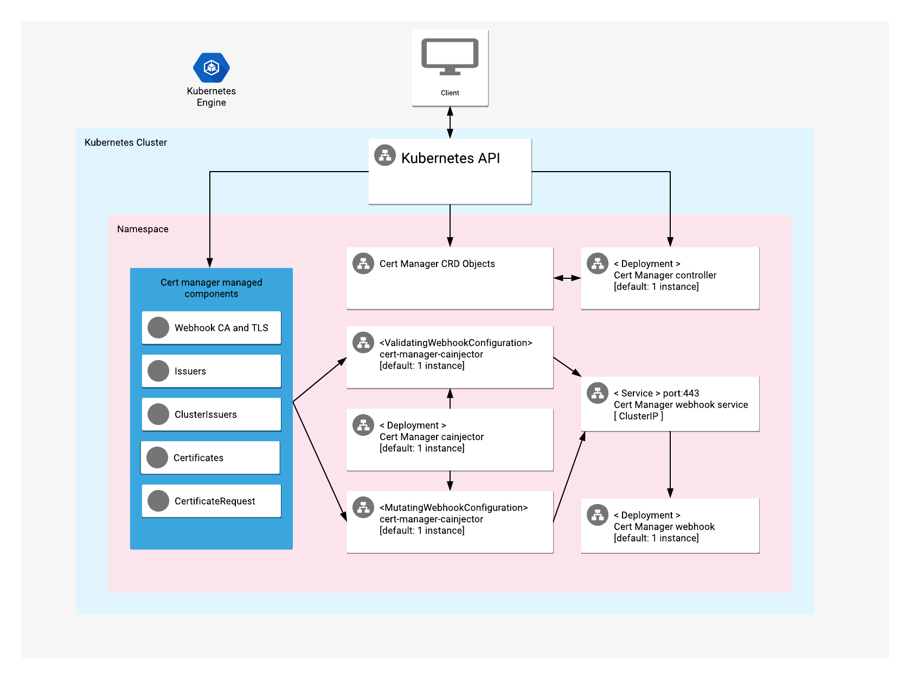

# Overview

Cert Manager provides native Kubernetes automation for creating and managing
Transport Layer Security (TLS) certificates.

It includes support for making self-signed certificates, using your own
Certificate Authority (CA), and using external services such as Let’s
Encrypt, HashiCorp Vault, and Venafi.

It checks that certificates are valid and up-to-date, and attempts to renew
certificates before they expire.

For more information, visit the
[Cert Manager official website](https://cert-manager.io/docs/).

## About Google Click to Deploy

Popular open stacks on Kubernetes, packaged by Google.

## Architecture



This app offers Cert Manager custom resource definitions (CRDs), WebHooks,
and deployments of Cert Manager on a Kubernetes cluster.

# Installation

## Quick install with Google Cloud Marketplace

Get up and running with a few clicks! To install this Cert Manager app to a
Google Kubernetes Engine cluster via Google Cloud Marketplace, follow the
[on-screen instructions](https://console.cloud.google.com/marketplace/details/google/cert-manager).

## Command-line instructions

### Prerequisites

#### Set up command-line tools

You'll need the following tools in your development environment. If you are
using Cloud Shell, then `gcloud`, `kubectl`, Docker, and Git are installed in
your environment by default.

- [gcloud](https://cloud.google.com/sdk/gcloud/)
- [kubectl](https://kubernetes.io/docs/reference/kubectl/overview/)
- [docker](https://docs.docker.com/install/)
- [git](https://git-scm.com/book/en/v2/Getting-Started-Installing-Git)
- [helm](https://helm.sh/)
- [envsubst](https://command-not-found.com/envsubst)

Configure `gcloud` as a Docker credential helper:

```shell
gcloud auth configure-docker
```

#### Create a Google Kubernetes Engine (GKE) cluster

Create a new cluster from the command-line:

```shell
export CLUSTER=cert-manager-cluster
export ZONE=us-west1-a

gcloud container clusters create "${CLUSTER}" --zone "${ZONE}"
```

Configure `kubectl` to connect to the new cluster:

```shell
gcloud container clusters get-credentials "${CLUSTER}" --zone "${ZONE}"
```

#### Clone this repo

Clone this repo, and its associated tools repo:

```shell
git clone --recursive https://github.com/GoogleCloudPlatform/click-to-deploy.git
```

#### Install the Application resource definition

An Application resource is a collection of individual Kubernetes components,
such as Services, Deployments, and so on, that you can manage as a group.

To set up your cluster to understand Application resources, run the following
command:

```shell
kubectl apply -f "https://raw.githubusercontent.com/GoogleCloudPlatform/marketplace-k8s-app-tools/master/crd/app-crd.yaml"
```

You need to run this command once.

The Application resource is defined by the
[Kubernetes SIG-apps](https://github.com/kubernetes/community/tree/master/sig-apps)
community. You can find the source code at
[github.com/kubernetes-sigs/application](https://github.com/kubernetes-sigs/application).

### Install the app

Navigate to the `cert-manager` directory:

```shell
cd click-to-deploy/k8s/cert-manager
```

#### Configure the app with environment variables

Choose an instance name and
[namespace](https://kubernetes.io/docs/concepts/overview/working-with-objects/namespaces/)
for the app. In most cases, you can use the `default` namespace.

```shell
export APP_INSTANCE_NAME=cert-manager-1
export NAMESPACE=default
```

Enable Cloud Monitoring:

> **NOTE:** Your Google Cloud Marketplace project must have Cloud Monitoring
> enabled. If you are using a non-Google Cloud cluster, you cannot export
your app's metrics to Cloud Monitoring.

By default, the app does not export metrics to Cloud Monitoring. To enable
this option, change the value to `true`.

```shell
export METRICS_EXPORTER_ENABLED=true
```

Set up the image tag:

It is advised to use a stable image reference, which you can find on
[Marketplace Container Registry](https://marketplace.gcr.io/google/cert-manager1).
For example:

```shell
export TAG="1.13"
```

Configure the container image:

```shell
export IMAGE_CONTROLLER="marketplace.gcr.io/google/cert-manager1"
export IMAGE_METRICS_EXPORTER="marketplace.gcr.io/google/cert-manager/prometheus-to-sd:${TAG}"
```

By default, each deployment has 1 replica, but you can choose to set the
number of replicas for Cert Manager controller, webhook and cainjector.

```shell
export CONTROLLER_REPLICAS=3
export WEBHOOK_REPLICAS=3
export CAINJECTOR_REPLICAS=3
```

#### Create namespace in your Kubernetes cluster

If you use a different namespace than the `default`, run the following
command to create a new namespace:

```shell
kubectl create namespace "${NAMESPACE}"
```

#### Expand the manifest template

Use `helm template` to expand the template. We recommend that you save the
expanded manifest file for future updates to your app.

```shell
helm template "${APP_INSTANCE_NAME}" chart/cert-manager \
  --namespace "${NAMESPACE}" \
  --set image.repository="${IMAGE_CONTROLLER}" \
  --set image.tag="${TAG}" \
  --set controller.replicas="${CONTROLLER_REPLICAS:-1}" \
  --set webhook.replicas="${WEBHOOK_REPLICAS:-1}" \
  --set cainjector.replicas="${CAINJECTOR_REPLICAS:-1}" \
  --set metrics.exporter.enabled="${METRICS_EXPORTER_ENABLED:-false}" \
  > "${APP_INSTANCE_NAME}_manifest.yaml"
```

#### Apply the manifest to your Kubernetes cluster

Use `kubectl` to apply the manifest to your Kubernetes cluster:

```shell
kubectl apply -f "${APP_INSTANCE_NAME}_manifest.yaml" --namespace "${NAMESPACE}"
```

#### View the app in the Google Cloud Console

To get the Cloud Console URL for your app, run the following command:

```shell
echo "https://console.cloud.google.com/kubernetes/application/${ZONE}/${CLUSTER}/${NAMESPACE}/${APP_INSTANCE_NAME}"
```

To view the app, open the URL in your browser.

# Deploy an Issuer and Cert request for a self-signed certificate

To deploy an Issuer instance:

```shell
kubectl apply --namespace "${NAMESPACE}" -f - <<EOF
apiVersion: cert-manager.io/v1alpha2
kind: Issuer
metadata:
  name: test-selfsigned
spec:
  selfSigned: {}
EOF
```

To request a self-signed certificate:

```shell
kubectl apply --namespace "${NAMESPACE}" -f - <<EOF
apiVersion: cert-manager.io/v1alpha2
kind: Certificate
metadata:
  name: selfsigned-cert
spec:
  dnsNames:
    - example.com
  secretName: selfsigned-cert-tls
  issuerRef:
    name: test-selfsigned
EOF
```

The created certificate is the Secret `selfsigned-cert-tls`.

You can also choose to deploy the Issuer and the certificate to another
namespace.

For additional configuration options, refer to the
[Cert Manager documentation](https://cert-manager.io/docs/usage/).

# Scaling up or down

To change the number of replicas of the controller, use the following
command, where `REPLICAS` is your desired number of replicas:

```shell
export REPLICAS=3
kubectl scale deployment "${APP_INSTANCE_NAME}-cert-manager" \
  --namespace "${NAMESPACE}" --replicas=$REPLICAS
```

To change the number of replicas of `cainjector`, use the following command,
where `REPLICAS` is your desired number of replicas:

```shell
export REPLICAS=3
kubectl scale deployment "${APP_INSTANCE_NAME}-cert-manager-cainjector" \
  --namespace "${NAMESPACE}" --replicas=$REPLICAS
```

To change the number of replicas of the webhook, use the following command,
where `REPLICAS` is your desired number of replicas:

```shell
export REPLICAS=3
kubectl scale deployment "${APP_INSTANCE_NAME}-cert-manager-webhook" \
  --namespace "${NAMESPACE}" --replicas=$REPLICAS
```

# Back up and restore

## Back up Cert Manager configuration data to your local environment

To back up Cert Manager resources, use the following command:

```shell
kubectl get --all-namespaces --output=yaml \
issuer,clusterissuer,certificates,certificaterequests > backup_file.yaml
```

## Restore Cert Manager configuration data from your local environment

```shell
kubectl apply -f backup_file.yaml
```

# Upgrading the app

To update your deployment of Cert Manager, refer to the
[official documentation](https://cert-manager.io/docs/installation/upgrading/)
for actions specific to your current version.

To avoid complications, create a backup before you update Cert Manager.

# Uninstall the app

## Using the Google Cloud Console

1. In the Cloud Console, open
   [Kubernetes Applications](https://console.cloud.google.com/kubernetes/application).

1. From the list of apps, click **Cert Manager**.

1. On the Application Details page, click **Delete**.

## Using the command-line

### Prepare your environment

Set your installation name and Kubernetes namespace:

```shell
export APP_INSTANCE_NAME=cert-manager-1
export NAMESPACE=default
```

### Delete the resources

> **NOTE:** We recommend that you use a `kubectl` version that is the same
> version as that of your cluster. Using the same versions for `kubectl` and
> the cluster helps to avoid unforeseen issues.

To delete the resources, use the expanded manifest file used for the
installation.

Run `kubectl` on the expanded manifest file:

```shell
kubectl delete -f ${APP_INSTANCE_NAME}_manifest.yaml --namespace ${NAMESPACE}
```

You can also delete the resources by using types and a label:

```shell
kubectl delete application \
  --namespace ${NAMESPACE} \
  --selector app.kubernetes.io/name=${APP_INSTANCE_NAME}
```

> **NOTE:** This will delete only the `cert-manager` app. All
> `cert-manager`-managed resources will remain available.

### Delete the GKE cluster

If you don't need the deployed app or the GKE cluster, delete the cluster
by using this command:

```shell
gcloud container clusters delete "${CLUSTER}" --zone "${ZONE}"
```
