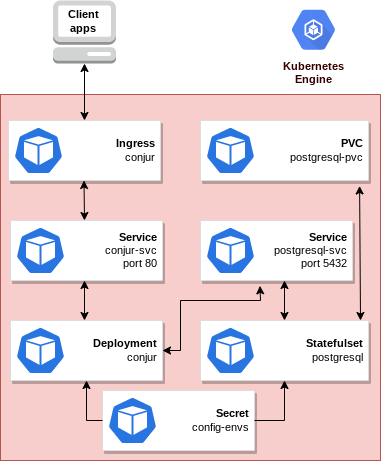

# conjur

Conjur is a seamless open source interface to securely authenticate, control and audit non-human access across tools, 
applications, containers and cloud environments via robust secrets management.

For more information, visit the Conjur [official website](https://www.conjur.org/).

## About Google Click to Deploy

Popular open stacks on Kubernetes, packaged by Google.

## Architecture



This app offers "list of resources".

# Installation

## Quick install with Google Cloud Marketplace

Get up and running with a few clicks! To install this Keycloak app to a
Google Kubernetes Engine cluster via Google Cloud Marketplace, follow the
[on-screen instructions](https://console.cloud.google.com/marketplace/details/google/conjur).

## Command-line instructions

### Prerequisites

#### Set up command-line tools

You'll need the following tools in your development environment. If you are
using Cloud Shell, then `gcloud`, `kubectl`, Docker, and Git are installed in
your environment by default.

- [gcloud](https://cloud.google.com/sdk/gcloud/)
- [kubectl](https://kubernetes.io/docs/reference/kubectl/overview/)
- [docker](https://docs.docker.com/install/)
- [git](https://git-scm.com/book/en/v2/Getting-Started-Installing-Git)
- [helm](https://helm.sh/)

Configure `gcloud` as a Docker credential helper:

```shell
gcloud auth configure-docker
```

#### Create a Google Kubernetes Engine (GKE) cluster

Create a new cluster from the command-line:

```shell
export CLUSTER=conjur-cluster
export ZONE=us-west1-a

gcloud container clusters create "${CLUSTER}" --zone "${ZONE}"
```

Configure `kubectl` to connect to the new cluster:

```shell
gcloud container clusters get-credentials "${CLUSTER}" --zone "${ZONE}"
```

#### Clone this repo

Clone this repo, and its associated tools repo:

```shell
git clone --recursive https://github.com/GoogleCloudPlatform/click-to-deploy.git
```

#### Install the Application resource definition

An Application resource is a collection of individual Kubernetes components,
such as Services, Deployments, and so on, that you can manage as a group.

To set up your cluster to understand Application resources, run the following
command:

```shell
kubectl apply -f "https://raw.githubusercontent.com/GoogleCloudPlatform/marketplace-k8s-app-tools/master/crd/app-crd.yaml"
```

You need to run this command once.

The Application resource is defined by the
[Kubernetes SIG-apps](https://github.com/kubernetes/community/tree/master/sig-apps)
community. You can find the source code at
[github.com/kubernetes-sigs/application](https://github.com/kubernetes-sigs/application).

### Install the app

Navigate to the `conjur` directory:

```shell
cd click-to-deploy/k8s/conjur
```

#### Configure the app with environment variables

Choose an instance name and
[namespace](https://kubernetes.io/docs/concepts/overview/working-with-objects/namespaces/)
for the app. In most cases, you can use the `default` namespace.

```shell
export APP_INSTANCE_NAME=conjur
export NAMESPACE=default
```

For the persistent disk provisioning of the PostgreSQL StatefulSet and NFS Shared Volume, you will need to:

- Set the StorageClass name. Check your available options using the command below:
  * ```kubectl get storageclass```
  * Or check how to create a new StorageClass in [Kubernetes Documentation](https://kubernetes.io/docs/concepts/storage/storage-classes/#the-storageclass-resource)

- Set the persistent disks size. The default disks size is "5Gi".

```shell
export DEFAULT_STORAGE_CLASS="standard" # provide your StorageClass name if not "standard"
export PSQL_PERSISTENT_DISK_SIZE="5Gi"
```

Set up the image tag:

It is advised to use a stable image reference, which you can find on:
- [Conjur - Marketplace Container Registry](gcr.io/ccm-ops-test-adhoc/conjur1).
- [PostgreSQL - Marketplace Container Registry](https://marketplace.gcr.io/google/postgresql13).
For example:

```shell
export CONJUR_TRACK=1.18
export POSTGRESQL_TRACK=13.4
export METRICS_EXPORTER_TAG=0.5
```

Configure the container images:

```shell
export IMAGE_CONJUR=gcr.io/ccm-ops-test-adhoc/conjur1
export IMAGE_POSTGRESQL=marketplace.gcr.io/google/postgresql13
export IMAGE_METRICS_EXPORTER=k8s.gcr.io/prometheus-to-sd:${METRICS_EXPORTER_TAG}
```

Generate a random DB password:

```shell
export POSTGRESQL_PASSWORD="$(cat /dev/urandom | tr -dc 'a-zA-Z0-9' |head -c16)"
```

Generate a Conjur data key:

```shell
export CONJUR_DATA_KEY="$(openssl rand -base64 32)"
```

By default, Conjur deployment has 1 replica, but you can choose to set the
number of replicas for Conjur webserver.

```shell
export CONJUR_REPLICAS=1 
```

(Optional) Expose the Service externally and configure Ingress:

By default, the Service is not exposed externally. To enable this option, change the value to true.

```shell
export PUBLIC_SERVICE_AND_INGRESS_ENABLED=false
```

(Optional) Enable Stackdriver Metrics Exporter:

> **NOTE:** Your GCP project must have Stackdriver enabled. If you are using a
> non-GCP cluster, you cannot export metrics to Stackdriver.

By default, the application does not export metrics to Stackdriver. To enable
this option, change the value to `true`.

```shell
export METRICS_EXPORTER_ENABLED=false
```

##### Create the Conjur Service Account

To create the Conjur Service Account and ClusterRoleBinding:

```shell
export CONJUR_SERVICE_ACCOUNT="${APP_INSTANCE_NAME}-serviceaccount"
cat resources/service-accounts.yaml \
  | envsubst '$NAMESPACE $PROMETHEUS_SERVICE_ACCOUNT $KUBE_STATE_METRICS_SERVICE_ACCOUNT $ALERTMANAGER_SERVICE_ACCOUNT $GRAFANA_SERVICE_ACCOUNT $NODE_EXPORTER_SERVICE_ACCOUNT' \
  > "${APP_INSTANCE_NAME}_sa_manifest.yaml"
kubectl apply -f "${APP_INSTANCE_NAME}_sa_manifest.yaml" \
  --namespace "${NAMESPACE}"
```

#### Expand the manifest template

Use `helm template` to expand the template. We recommend that you save the
expanded manifest file for future updates to your app.

```shell
helm template "${APP_INSTANCE_NAME}" chart/keycloak \
    --namespace "${NAMESPACE}" \
    --set conjur.image.repo="$IMAGE_CONJUR" \
    --set conjur.image.tag="$CONJUR_TRACK" \
    --set conjur.serviceAccount="${CONJUR_SERVICE_ACCOUNT}" \
    --set conjur.db.password="${POSTGRESQL_PASSWORD}" \
    --set conjur.data_key="${CONJUR_DATA_KEY}" \
    --set postgresql.image.repo="$IMAGE_POSTGRESQL" \
    --set postgresql.image.tag="$POSTGRESQL_TRACK" \
    --set postgresql.persistence.storageClass="${DEFAULT_STORAGE_CLASS}" \
    --set postgresql.persistence.size="${PSQL_PERSISTENT_DISK_SIZE}" \
    --set keycloak.replicas="${KEYCLOAK_REPLICAS:-1}" \
    --set enablePublicServiceAndIngress="${PUBLIC_SERVICE_AND_INGRESS_ENABLED}" \
    > "${APP_INSTANCE_NAME}_manifest.yaml"
```

#### Apply the manifest to your Kubernetes cluster

Use `kubectl` to apply the manifest to your Kubernetes cluster:

```shell
kubectl apply -f "${APP_INSTANCE_NAME}_manifest.yaml" --namespace "${NAMESPACE}"
```

#### View the app in the Google Cloud Console

To get the Cloud Console URL for your app, run the following command:

```shell
echo "https://console.cloud.google.com/kubernetes/application/${ZONE}/${CLUSTER}/${NAMESPACE}/${APP_INSTANCE_NAME}"
```

To view the app, open the URL in your browser.

