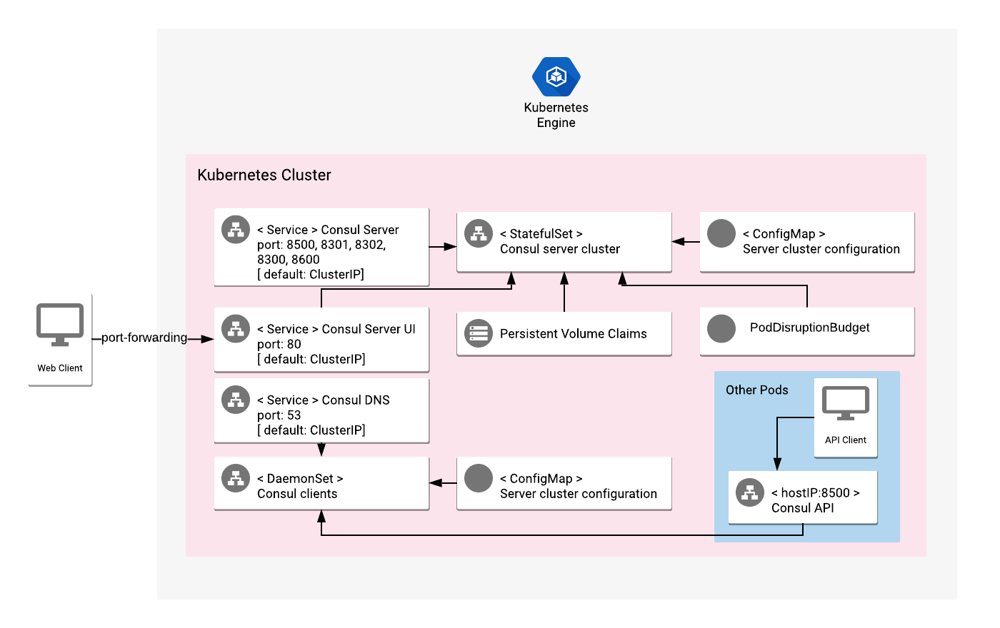

# Overview

Consul is a distributed high availability solution, based on the Raft consensus algorithm, which provides service and
node discovery, health checks, and support for storage of distributed key values. It offers users many different ways to
manage infrastructure, ensure content consistency, and gather information about nodes.

For more information on Consul, see the [Consul official website](https://www.consul.io/).

## About Google Click to Deploy

Popular open stacks on Kubernetes packaged by Google.

## Design



This application offers a stateful multi-instance installation of Consul on a Kubernetes cluster.

The application uses StatefulSet for Consul servers, and DaemonSet for Consul clients, for each Kubernetes cluster node.
Users can specify the number of Consul server instances used, but the default - and recommended - number of Consul server
instances is 3.

The application also has optional support for:
* gossip encryption between Consul servers and clients
* using Prometheus exporter to export metrics to Stackdriver

# Installation

## Quick install with Google Cloud Marketplace

Get up and running with just a few clicks! Install this Consul app to a Google Kubernetes Engine cluster by following the
[on-screen instructions](https://console.cloud.google.com/marketplace/details/google/consul) within Google Cloud Marketpalce.

## Command line instructions

### Prerequisites

#### Set up command-line tools

You'll need the following tools in your development environment:

- [gcloud](https://cloud.google.com/sdk/gcloud/)
- [kubectl](https://kubernetes.io/docs/reference/kubectl/overview/)
- [docker](https://docs.docker.com/install/)
- [git](https://git-scm.com/book/en/v2/Getting-Started-Installing-Git)
- [helm](https://helm.sh/)
- [envsubst](https://command-not-found.com/envsubst)

Configure `gcloud` as a Docker credential helper:

```shell
gcloud auth configure-docker
```

#### Create a Google Kubernetes Engine cluster

Create a new cluster from the command line:

```shell
export CLUSTER=consul-cluster
export ZONE=us-west1-a

gcloud container clusters create "${CLUSTER}" --zone "${ZONE}"
```

Configure `kubectl` to connect to the new cluster.

```shell
gcloud container clusters get-credentials "${CLUSTER}" --zone "${ZONE}"
```

#### Clone this repo

Clone this repo and its associated tools repo:

```shell
git clone --recursive https://github.com/GoogleCloudPlatform/click-to-deploy.git
```

#### Install the Application resource definition

An Application resource is a collection of individual Kubernetes components,
such as Services, Deployments, and so on, that you can manage as a group.

To set up your cluster to understand Application resources, run the following command:

```shell
kubectl apply -f "https://raw.githubusercontent.com/GoogleCloudPlatform/marketplace-k8s-app-tools/master/crd/app-crd.yaml"
```

You need to run this command once.

The Application resource is defined by the
[Kubernetes SIG-apps](https://github.com/kubernetes/community/tree/master/sig-apps) community.
The source code can be found on [github.com/kubernetes-sigs/application](https://github.com/kubernetes-sigs/application).

### Install the Application

Navigate to the `consul` directory:

```shell
cd click-to-deploy/k8s/consul
```

#### Configure the app with environment variables

Choose an instance name and
[namespace](https://kubernetes.io/docs/concepts/overview/working-with-objects/namespaces/)
for the app. In most cases, you can use the `default` namespace.

```shell
export APP_INSTANCE_NAME=consul-1
export NAMESPACE=default
```

For the persistent disk provisioning of the Consul StatefulSets, you will need to:

 * Set the StorageClass name. Check your available options using the command below:
   * ```kubectl get storageclass```
   * Or check how to create a new StorageClass in [Kubernetes Documentation](https://kubernetes.io/docs/concepts/storage/storage-classes/#the-storageclass-resource)

 * Set the persistent disk's size. The default disk size is "10Gi".

```shell
export STORAGE_CLASS="standard" # provide your StorageClass name if not "standard"
export PERSISTENT_DISK_SIZE="10Gi"


Set up the image tag:

It is advised to use stable image reference which you can find on
[Marketplace Container Registry](https://marketplace.gcr.io/google/consul).
Example:

```shell
export TAG="<BUILD_ID>"
```

Alternatively you can use short tag which points to the latest image for selected version.
> Warning: this tag is not stable and referenced image might change over time.

```shell
export TAG="1.14"
```

Configure the container image:

```shell
export IMAGE_CONSUL="marketplace.gcr.io/google/consul:${TAG}"
export IMAGE_CONSUL_EXPORTER="marketplace.gcr.io/google/consul/consul-exporter:${TAG}"
export IMAGE_METRICS_EXPORTER="marketplace.gcr.io/google/consul/prometheus-to-sd:${TAG}"
```

Optionally, you can set the number of replicas for Consul.
There must be at least 1 replica, but the default and recommended number of replicas is 3.

```shell
export REPLICAS=3
```

Set the Consul domain and datacenter:

```shell
exprot CONSUL_DOMAIN=consul
export CONSUL_DATACENTER=dc1
```

Enable the Prometheus sidecar exporter:

```shell
export PROMETHEUS_EXPORTER=true
```

If you want a gossip encryption key for Consul, create and configure it now:

```shell
export CONSUL_GOSSIP_KEY=$(cat /dev/urandom | tr -dc 'a-zA-Z0-9' | fold -w 16 | head -n 1 | tr -d '\n' | base64)
```

The following inputs are all optional. They enable you to set resource limits and requests for your Consul client and server.

```shell
export SERVER_RESOURCES_LIMITS_CPU=200m
export SERVER_RESOURCES_LIMITS_MEMORY=300Mi
export SERVER_RESOURCES_REQUESTS_CPU=100m
export SERVER_RESOURCES_REQUESTS_MEMORY=150Mi

export CLIENT_RESOURCES_LIMITS_CPU=200m
export CLIENT_RESOURCES_LIMITS_MEMORY=300Mi
export CLIENT_RESOURCES_REQUESTS_CPU=100m
export CLIENT_RESOURCES_REQUESTS_MEMORY=150Mi
```

You can also choose to define the storage capacity of your server; this is 10Gi by default.
```shell
export SERVER_STORAGE=10Gi
```

#### Create a namespace in your Kubernetes cluster

If you're using a namespace other than `default`, run the command below to create a new namespace:

```shell
kubectl create namespace "${NAMESPACE}"
```

##### Create dedicated Service Accounts

Define the environment variables:

```shell
export CONSUL_CLIENT_SERVICE_ACCOUNT="${APP_INSTANCE_NAME}-consul-client"
export CONSUL_SERVER_SERVICE_ACCOUNT="${APP_INSTANCE_NAME}-consul-server"
```

Expand the manifest to create Service Accounts:

```shell
cat resources/service-accounts.yaml \
  | envsubst '${APP_INSTANCE_NAME} \
              ${CONSUL_CLIENT_SERVICE_ACCOUNT} \
              ${CONSUL_SERVER_SERVICE_ACCOUNT}' \
    > "${APP_INSTANCE_NAME}_sa_manifest.yaml"
```

Use `kubectl` to create the accounts on the cluster:

```shell
kubectl apply -f "${APP_INSTANCE_NAME}_sa_manifest.yaml" \
--namespace "${NAMESPACE}"
```

#### Expand the manifest template

Use `helm template` to expand the template. We recommend that you save the
expanded manifest file for future updates to the application.


```shell
helm template "${APP_INSTANCE_NAME}" chart/consul \
  --namespace "$NAMESPACE" \
  --set global.image=${IMAGE_CONSUL} \
  --set server.prometheus_exporter.image=${IMAGE_CONSUL_EXPORTER} \
  --set metrics.image=${IMAGE_METRICS_EXPORTER} \
  --set global.domain=${CONSUL_DOMAIN} \
  --set global.datacenter=${CONSUL_DATACENTER} \
  --set server.persistence.storageClass=${STORAGE_CLASS} \
  --set server.persistence.size=${PERSISTENT_DISK_SIZE} \
  --set server.ServiceAccount=${CONSUL_SERVER_SERVICE_ACCOUNT} \
  --set client.ServiceAccount=${CONSUL_CLIENT_SERVICE_ACCOUNT} \
  $( [[ -n "${SERVER_STORAGE}" ]] && echo "--set server.storage=${SERVER_STORAGE}" ) \
  --set global.gossipEncryption.CreateSecretWithKey=${CONSUL_GOSSIP_KEY:-null} \
  --set metrics.exporter.enabled=${METRICS_EXPORTER_ENABLED:-false} \
  $( [[ -n "${REPLICAS}" ]] && echo "--set server.replicas=${REPLICAS}" ) \
  $( [[ -n "${SERVER_RESOURCES_LIMITS_CPU}" ]] && echo "--set server.resources.limits.cpu=${SERVER_RESOURCES_LIMITS_CPU}" ) \
  $( [[ -n "${SERVER_RESOURCES_LIMITS_MEMORY}" ]] && echo "--set server.resources.limits.memory=${SERVER_RESOURCES_LIMITS_MEMORY}" ) \
  $( [[ -n "${SERVER_RESOURCES_REQUESTS_CPU}" ]] && echo "--set server.resources.requests.cpu=${SERVER_RESOURCES_REQUESTS_CPU}" ) \
  $( [[ -n "${SERVER_RESOURCES_REQUESTS_MEMORY}" ]] && echo "--set server.resources.requests.memory=${SERVER_RESOURCES_REQUESTS_MEMORY}" ) \
  $( [[ -n "${CLIENT_RESOURCES_LIMITS_CPU}" ]] && echo "--set client.resources.limits.cpu=${CLIENT_RESOURCES_LIMITS_CPU}" ) \
  $( [[ -n "${CLIENT_RESOURCES_LIMITS_MEMORY}" ]] && echo "--set client.resources.limits.memory=${CLIENT_RESOURCES_LIMITS_MEMORY}" ) \
  $( [[ -n "${CLIENT_RESOURCES_REQUESTS_CPU}" ]] && echo "--set client.resources.requests.cpu=${CLIENT_RESOURCES_REQUESTS_CPU}" ) \
  $( [[ -n "${CLIENT_RESOURCES_REQUESTS_MEMORY}" ]] && echo "--set client.resources.requests.memory=${CLIENT_RESOURCES_REQUESTS_MEMORY}" ) \
  > ${APP_INSTANCE_NAME}_manifest.yaml
```

#### Apply the manifest to your Kubernetes cluster

Use `kubectl` to apply the manifest to your Kubernetes cluster:

```shell
kubectl apply -f "${APP_INSTANCE_NAME}_manifest.yaml" --namespace "${NAMESPACE}"
```

#### View the app in the Google Cloud Console

To get the Console URL for your app, run the following command:

```shell
echo "https://console.cloud.google.com/kubernetes/application/${ZONE}/${CLUSTER}/${NAMESPACE}/${APP_INSTANCE_NAME}"
```

To view the app, open the URL in your browser.

### Access Consul (internally)

You can connect to Consul without exposing it to public access, by using the
`consul` command line interface.

#### Connect to Consul via Pod

To do this, please identify Consul's Pod by using the following command:

```shell
kubectl get pods -o wide -l app.kubernetes.io/name=${APP_INSTANCE_NAME},app.kubernetes.io/component=consul-client --namespace "${NAMESPACE}"
```

Now you can access the Consul tool. For example, to get Consul's version info:

```shell
kubectl exec -it <pod name> --namespace "${NAMESPACE}" -- consul version
```

### Access Consul client directly in cluster

By default, the Consul client runs on every Kubernetes node in a cluster. To access the Consul client port, you can
connect directly to host IP:8500

Example of pod:
```yaml
apiVersion: v1
kind: Pod
metadata:
  name: consul-client-example
spec:
  containers:
    - name: consul-example
      image: alpine
      env:
        - name: HOST_IP
          valueFrom:
            fieldRef:
              fieldPath: status.hostIP
      command:
        - "/bin/sh"
        - "-ec"
        - |
            export CONSUL_HTTP_ADDR="${HOST_IP}:8500"
            echo ${CONSUL_HTTP_ADDR}
            apk add curl
            curl -v ${CONSUL_HTTP_ADDR}
  restartPolicy: Never
```

### Access Consul UI (externally)

By default, the application does not have an external IP address. To create one, run the following command:

> **WARNING:** This command exposes Consul externally, without any authentication
> or encryption enabled. Using such a configuration in
> production environments is not recommended.

```shell
kubectl patch svc "${APP_INSTANCE_NAME}-consul-ui" \
  --namespace "${NAMESPACE}" \
  --patch '{"spec": {"type": "LoadBalancer"}}'
```


### Access Consul UI service (locally)
The Consul UI will be available at [http://localhost:8500/](http://localhost:8500/)

```shell
kubectl port-forward svc/${APP_INSTANCE_NAME}-consul-ui --namespace ${NAMESPACE} 8500:80
```


# Scaling

## Scaling the cluster up

By default, the Consul Server application is deployed using 3 replicas.

To change the number of replicas:
1. [Back up](#backup-consul-data-to-your-local-environment) your Consul data
2. [Uninstall](#uninstall-the-application) the Consul Application
3. [Delete PersistentVolumes volumes](#delete-the-persistent-volumes-of-your-installation)
4. Retry the installation instructions, but this time with new number of replicas.
5. [Restore your data](#restore-consul-data-on-a-running-cluster)

> **NOTE:** Scaling via `kubectl scale` is not supported.

# Backup and Restore

The following steps are based on the [Consul documentation](https://www.consul.io/api/snapshot.html).

## Backup Consul data to your local environment

First, you need to enable local access to the Consul UI:

```shell
export APP_INSTANCE_NAME=consul-1
kubectl port-forward svc/${APP_INSTANCE_NAME}-consul-ui --namespace ${NAMESPACE} 8500:80
```

When port-forwarding is ready, you can run HTTP requests to the Consul API to create a snapshot:

```shell
curl http://127.0.0.1:8500/v1/snapshot -o snapshot.tgz
```

## Restore Consul data on a running cluster

Prepare port-forwarding similarly to how you prepared for the [backup step](#backup-consul-data-to-your-local-environment).
To push your snapshot to the Consul server, run the following command:

```shell
curl --request PUT --data-binary @snapshot.tgz http://127.0.0.1:8500/v1/snapshot
```

# Upgrading the app

Before upgrading, we recommend that you [prepare a backup](#backup-consul-data-to-your-local-environment) of your
Consul database.
For additional information about upgrades, see the [Consul documentation](https://www.consul.io/api/snapshot.html).

The Consul StatefulSet is configured to roll out updates automatically. First, patch
the StatefulSet with a new image reference:

```shell
kubectl set image statefulset ${APP_INSTANCE_NAME}-consul-server --namespace ${NAMESPACE} \
  "consul=[NEW_IMAGE_REFERENCE]"
```

In this case, `[NEW_IMAGE_REFERENCE]` should be the reference to the new Docker image that you want to use.

To check the status of Pods in the StatefulSet, and the progress of
the new image, run the following command:

```shell
kubectl get pods --selector app.kubernetes.io/name=${APP_INSTANCE_NAME} \
  --namespace ${NAMESPACE}
```

# Uninstall the Application

## Using the Google Cloud Platform Console

1. In the GCP Console, open [Kubernetes Applications](https://console.cloud.google.com/kubernetes/application).

1. From the list of applications, click **Consul**.

1. On the Application Details page, click **Delete**.

## Using the command line

### Prepare the environment

Set your installation name and Kubernetes namespace:

```shell
export APP_INSTANCE_NAME=consul-1
export NAMESPACE=default
```

### Delete the resources

> **NOTE:** We recommend to use a kubectl version that is the same as the version of your cluster.
Using the same versions of kubectl and the cluster helps avoid unforeseen issues.

To delete the resources, use the expanded manifest file that you used for the
installation.

Run `kubectl` on the expanded manifest file:

```shell
kubectl delete -f ${APP_INSTANCE_NAME}_manifest.yaml --namespace ${NAMESPACE}
```

Otherwise, delete the resources using types and a label:

```shell
kubectl delete application \
  --namespace ${NAMESPACE} \
  --selector app.kubernetes.io/name=${APP_INSTANCE_NAME}
```

### Delete the persistent volumes of your installation

By design, the removal of StatefulSets in Kubernetes does not remove
PersistentVolumeClaims that were attached to their Pods. This prevents your
installations from accidentally deleting stateful data.

To remove the PersistentVolumeClaims with their attached persistent disks, run
the following `kubectl` commands:

```shell
# specify the variables values matching your installation:
export APP_INSTANCE_NAME=consul-1
export NAMESPACE=default

kubectl delete persistentvolumeclaims \
  --namespace ${NAMESPACE} \
  --selector app.kubernetes.io/name=${APP_INSTANCE_NAME}
```

### Delete the GKE cluster

Optionally, if you don't need the deployed application or the GKE cluster,
you can use this command to delete the cluster:

```shell
gcloud container clusters delete "${CLUSTER}" --zone "${ZONE}"
```
