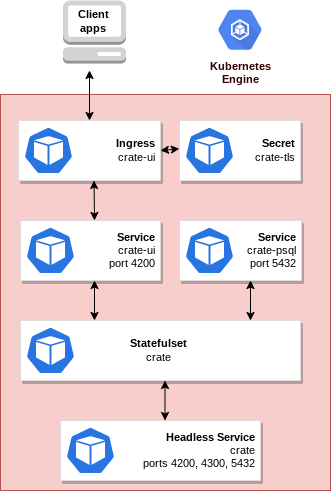

# Overview

CrateDB is a distributed SQL database that makes it simple to store and analyze massive amounts of data in real-time. 
CrateDB offers the benefits of an SQL database and the scalability and flexibility typically associated with NoSQL databases.

## About Google Click to Deploy

Popular open stacks on Kubernetes, packaged by Google.

## Architecture



This app offers "list of resources".

# Installation

## Quick install with Google Cloud Marketplace

Get up and running with a few clicks! To install this Crate app to a
Google Kubernetes Engine cluster via Google Cloud Marketplace, follow the
[on-screen instructions](https://console.cloud.google.com/marketplace/details/google/crate).

## Command-line instructions

### Prerequisites

#### Set up command-line tools

You'll need the following tools in your development environment. If you are
using Cloud Shell, then `gcloud`, `kubectl`, Docker, and Git are installed in
your environment by default.

- [gcloud](https://cloud.google.com/sdk/gcloud/)
- [kubectl](https://kubernetes.io/docs/reference/kubectl/overview/)
- [docker](https://docs.docker.com/install/)
- [git](https://git-scm.com/book/en/v2/Getting-Started-Installing-Git)
- [helm](https://helm.sh/)

Configure `gcloud` as a Docker credential helper:

```shell
gcloud auth configure-docker
```

#### Create a Google Kubernetes Engine (GKE) cluster

Create a new cluster from the command-line:

```shell
export CLUSTER=crate-cluster
export ZONE=us-west1-a

gcloud container clusters create "${CLUSTER}" --zone "${ZONE}"
```

Configure `kubectl` to connect to the new cluster:

```shell
gcloud container clusters get-credentials "${CLUSTER}" --zone "${ZONE}"
```

#### Clone this repo

Clone this repo, and its associated tools repo:

```shell
git clone --recursive https://github.com/GoogleCloudPlatform/click-to-deploy.git
```

#### Install the Application resource definition

An Application resource is a collection of individual Kubernetes components,
such as Services, Deployments, and so on, that you can manage as a group.

To set up your cluster to understand Application resources, run the following
command:

```shell
kubectl apply -f "https://raw.githubusercontent.com/GoogleCloudPlatform/marketplace-k8s-app-tools/master/crd/app-crd.yaml"
```

You need to run this command once.

The Application resource is defined by the
[Kubernetes SIG-apps](https://github.com/kubernetes/community/tree/master/sig-apps)
community. You can find the source code at
[github.com/kubernetes-sigs/application](https://github.com/kubernetes-sigs/application).

#### Configure the app with environment variables

Choose an instance name and
[namespace](https://kubernetes.io/docs/concepts/overview/working-with-objects/namespaces/)
for the app. In most cases, you can use the `default` namespace.

```shell
export APP_INSTANCE_NAME=crate
export NAMESPACE=default
```

For the persistent disk provisioning of the Crate StatefulSet, you will need to:

- Set the StorageClass name. Check your available options using the command below:
  * ```kubectl get storageclass```
  * Or check how to create a new StorageClass in [Kubernetes Documentation](https://kubernetes.io/docs/concepts/storage/storage-classes/#the-storageclass-resource)

- Set the persistent disks size. The default disks size is "2Gi".

```shell
export DEFAULT_STORAGE_CLASS="standard" # provide your StorageClass name if not "standard"
export CRATE_PERSISTENT_DISK_SIZE="5Gi"
```

Set up the image tag:

It is advised to use a stable image reference, which you can find on:
- [Crate - Marketplace Container Registry](https://marketplace.gcr.io/google/crate5).
For example:

```shell
export CRATE_TRACK=5.1
export METRICS_EXPORTER_TAG=0.5
```

Configure the container images:

```shell
export IMAGE_CRATE=marketplace.gcr.io/google/crate5
export IMAGE_METRICS_EXPORTER=k8s.gcr.io/prometheus-to-sd:${METRICS_EXPORTER_TAG}
```

By default, Crate statefulset has 3 replicas, but you can choose to set the number of replicas.

```shell
export CRATE_REPLICAS=3
```

By default, Java heapsize is 1Gb, but you can choose another size (in gigabytes):

```shell
export CRATE_HEAPSIZE=1
```

Expose the Service externally and configure Ingress:

By default, the Service isn't exposed externally. To enable this option, change
the value to `true`.

```shell
export PUBLIC_SERVICE_AND_INGRESS_ENABLED=false
```

(Optional) Enable Stackdriver Metrics Exporter:

> **NOTE:** Your GCP project must have Stackdriver enabled. If you are using a
> non-GCP cluster, you cannot export metrics to Stackdriver.

By default, the application does not export metrics to Stackdriver. To enable
this option, change the value to `true`.

```shell
export METRICS_EXPORTER_ENABLED=false
```

#### Create TLS certificate for Crate

> Note: You can skip this step if you have not set up external access.

1.  If you already have a certificate that you want to use, copy your
    certificate and key pair to the `/tmp/tls.crt`, and `/tmp/tls.key` files,
    then skip to the next step.

    To create a new certificate, run the following command:

    ```shell
    openssl req -x509 -nodes -days 365 -newkey rsa:2048 \
        -keyout /tmp/tls.key \
        -out /tmp/tls.crt \
        -subj "/CN=crate/O=crate"
    ```

2.  Set `TLS_CERTIFICATE_KEY` and `TLS_CERTIFICATE_CRT` variables:

    ```shell
    export TLS_CERTIFICATE_KEY="$(cat /tmp/tls.key | base64)"
    export TLS_CERTIFICATE_CRT="$(cat /tmp/tls.crt | base64)"
    ```

#### Expand the manifest template

Use `helm template` to expand the template. We recommend that you save the
expanded manifest file for future updates to your app.

```shell
helm template "${APP_INSTANCE_NAME}" chart/crate \
    --namespace "${NAMESPACE}" \
    --set crate.image.repo="${IMAGE_CRATE}" \
    --set crate.image.tag="${CRATE_TRACK}" \
    --set crate.persistence.storageClass="${DEFAULT_STORAGE_CLASS}" \
    --set crate.persistence.size="${CRATE_PERSISTENT_DISK_SIZE}" \
    --set crate.replicas="${CRATE_REPLICAS:-1}" \
    --set crate.heapsize="${CRATE_HEAPSIZE:-1}" \
    --set metrics.image="${IMAGE_METRICS_EXPORTER}" \
    --set metrics.exporter.enabled="${METRICS_EXPORTER_ENABLED}" \
    --set enablePublicServiceAndIngress="${PUBLIC_SERVICE_AND_INGRESS_ENABLED}" \
    --set tls.base64EncodedPrivateKey="${TLS_CERTIFICATE_KEY}" \
    --set tls.base64EncodedCertificate="${TLS_CERTIFICATE_CRT}" \
    > "${APP_INSTANCE_NAME}_manifest.yaml"
```

#### Apply the manifest to your Kubernetes cluster

Use `kubectl` to apply the manifest to your Kubernetes cluster:

```shell
kubectl apply -f "${APP_INSTANCE_NAME}_manifest.yaml" --namespace "${NAMESPACE}"
```

#### View the app in the Google Cloud Console

To get the Cloud Console URL for your app, run the following command:

```shell
echo "https://console.cloud.google.com/kubernetes/application/${ZONE}/${CLUSTER}/${NAMESPACE}/${APP_INSTANCE_NAME}"
```

### Access crate through an external IP address

By default, the application does not have an external IP address. To create an external IP address, run the following command:

```
kubectl patch svc "$APP_INSTANCE_NAME-crate-ui" \
  --namespace "$NAMESPACE" \
  --patch '{"spec": {"type": "LoadBalancer"}}'
```

> **NOTE:** It might take some time for the external IP to be provisioned.

### Access the Crate UI service

If you run your crate cluster behind a LoadBalancer, you can get the external IP of the UI service using the following command:

```shell
UI_IP=$(kubectl get svc ${APP_INSTANCE_NAME-crate-ui} \
  --namespace ${NAMESPACE} \
  --output jsonpath='{.status.loadBalancer.ingress[0].ip}')

echo "$UI_IP"

# App metrics

## Prometheus metrics

The app can be configured to expose crate metrics 
in the [Prometheus format](https://github.com/prometheus/docs/blob/master/content/docs/instrumenting/exposition_formats.md).

### Configuring Prometheus to collect the metrics

Prometheus can be configured to automatically collect the application's metrics.
Follow the steps in
[Configuring Prometheus](https://prometheus.io/docs/introduction/first_steps/#configuring-prometheus).

You configure the metrics in the
[`scrape_configs` section](https://prometheus.io/docs/prometheus/latest/configuration/configuration/#scrape_config).

## Exporting metrics to Stackdriver

The deployment includes a
[Prometheus to Stackdriver (`prometheus-to-sd`)](https://github.com/GoogleCloudPlatform/k8s-stackdriver/tree/master/prometheus-to-sd)
container. If you enabled the option to export metrics to Stackdriver, the
metrics are automatically exported to Stackdriver and visible in
[Stackdriver Metrics Explorer](https://cloud.google.com/monitoring/charts/metrics-explorer).
The name of each metric starts with the application's name, which you define in
the `APP_INSTANCE_NAME` environment variable.

The exporting option might not be available for GKE on-prem clusters.

> Note: Stackdriver has [quotas](https://cloud.google.com/monitoring/quotas) for
> the number of custom metrics created in a single GCP project. If the quota is
> met, additional metrics might not show up in the Stackdriver Metrics Explorer.

You can remove existing metric descriptors using
[Stackdriver's REST API](https://cloud.google.com/monitoring/api/ref_v3/rest/v3/projects.metricDescriptors/delete).

# Scaling up or down

To change the number of crate replicas, use the following
command, where `REPLICAS` is your desired number of replicas:

```shell
export REPLICAS=3
kubectl scale statefulset "${APP_INSTANCE_NAME}-crate" --namespace ${NAMESPACE} --replicas=${REPLICAS}
```

# Backup and restore

To back up the application, you must back up the database.

### Set up your local environment

Set up environment variables to match your crate installation:

```shell
export APP_INSTANCE_NAME=crate
export NAMESPACE=default
export TABLENAME=test
```

## Backing up data

To back up the database, you should copy required tables.
Use the following script:
```shell
# `--app`, `--namespace` and `--table` are required
scripts/backup.sh --app ${APP_INSTANCE_NAME} --namespace ${NAMESPACE} --table ${TABLENAME}
```

### Restore your database

To restore the database, you should use the script and restore dumped tables. 
Put all jsons to the `/tmp/crate` folder. 
Use the following commands:

```shell
# `--app`, `--namespace` and `--table` are required
scripts/restore.sh --app ${APP_INSTANCE_NAME} --namespace ${NAMESPACE} --table ${TABLENAME}
```

# Uninstall the app

## Using the Google Cloud Console

- In the Cloud Console, open
   [Kubernetes Applications](https://console.cloud.google.com/kubernetes/application).

- From the list of apps, click **crate**.

- On the Application Details page, click **Delete**.

## Using the command-line

### Prepare your environment

Set your installation name and Kubernetes namespace:

```shell
export APP_INSTANCE_NAME=crate
export NAMESPACE=default
```

### Delete the resources

> **NOTE:** We recommend that you use a `kubectl` version that is the same
> version as that of your cluster. Using the same versions for `kubectl` and
> the cluster helps to avoid unforeseen issues.

To delete the resources, use the expanded manifest file used for the
installation.

Run `kubectl` on the expanded manifest file:

```shell
kubectl delete -f ${APP_INSTANCE_NAME}_manifest.yaml --namespace ${NAMESPACE}
```

You can also delete the resources by using types and a label:

```shell
kubectl delete application --namespace ${NAMESPACE} --selector app.kubernetes.io/name=${APP_INSTANCE_NAME}
```

### Delete the persistent volumes of your installation

By design, the removal of StatefulSets in Kubernetes does not remove
PersistentVolumeClaims that were attached to their Pods. This prevents your
installations from accidentally deleting stateful data.

To remove the PersistentVolumeClaims with their attached persistent disks, run
the following `kubectl` commands:

```shell
for pv in $(kubectl get pvc --namespace ${NAMESPACE} \
  --selector app.kubernetes.io/name=${APP_INSTANCE_NAME} \
  --output jsonpath='{.items[*].spec.volumeName}');
do
  kubectl delete pv/$pv --namespace $NAMESPACE
done

kubectl delete persistentvolumeclaims \
  --namespace ${NAMESPACE} \
  --selector app.kubernetes.io/name=${APP_INSTANCE_NAME}
```

### Delete the GKE cluster

If you don't need the deployed app or the GKE cluster, delete the cluster
by using this command:

```shell
gcloud container clusters delete "${CLUSTER}" --zone "${ZONE}"
```

