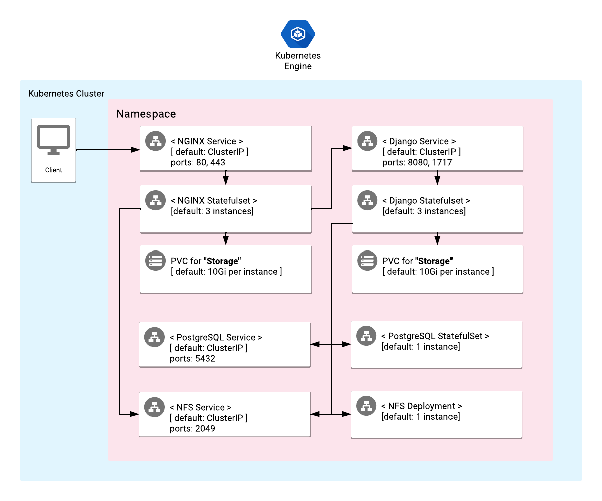

# Overview

Django is a free, open-source and high-level Python web framework that encourages
rapid development and clean, pragmatic design. Solution runs on UWSGI application
server and can be exposed for tcp or http connections.

To learn more about Django, view the [Django website](https://www.djangoproject.com/).

This application uses NGINX as a web server, it is configured to serve static
content and as a gateway to an UWSGI deployment along with Django project.

Django website is automatically created in startup and hosted in a NFS deployment.

## About Google Click to Deploy

Popular open stacks on Kubernetes packaged by Google.

## Architecture



This application uses NGINX to serve static web content. Django content
is processed by an UWSGI/Django deployment.

This application exposes two endpoints: HTTP on port 80 and HTTPS on port 443.

A NFS deployment and a PostgreSQL stateful are deployed along with Django solution.

# Installation

## Quick install with Google Cloud Marketplace

Get up and running with a few clicks! Install this Django app to a Google
Kubernetes Engine cluster using Google Cloud Marketplace. Follow the
[on-screen instructions](https://console.cloud.google.com/marketplace/details/google/django).

## Command line instructions

You can use [Google Cloud Shell](https://cloud.google.com/shell/) or a local
workstation to complete the following steps.

[](https://console.cloud.google.com/cloudshell/editor?cloudshell_git_repo=https://github.com/GoogleCloudPlatform/click-to-deploy&cloudshell_open_in_editor=README.md&cloudshell_working_dir=k8s/django)

### Prerequisites

#### Set up command-line tools

You'll need the following tools in your development environment. If you are
using Cloud Shell, `gcloud`, `kubectl`, Docker, and Git are installed in your
environment by default.

-   [gcloud](https://cloud.google.com/sdk/gcloud/)
-   [kubectl](https://kubernetes.io/docs/reference/kubectl/overview/)
-   [docker](https://docs.docker.com/install/)
-   [git](https://git-scm.com/book/en/v2/Getting-Started-Installing-Git)
-   [helm](https://helm.sh/)

Configure `gcloud` as a Docker credential helper:

```shell
gcloud auth configure-docker
```

#### Create a Google Kubernetes Engine cluster

Create a new cluster from the command line:

```shell
export CLUSTER=django-cluster
export ZONE=us-west1-a

gcloud container clusters create "$CLUSTER" --zone "$ZONE"
```

Configure `kubectl` to connect to the new cluster.

```shell
gcloud container clusters get-credentials "$CLUSTER" --zone "$ZONE"
```

#### Clone this repo

Clone this repo and the associated tools repo.

```shell
git clone --recursive https://github.com/GoogleCloudPlatform/click-to-deploy.git
```

#### Install the Application resource definition

An Application resource is a collection of individual Kubernetes components,
such as Services, Deployments, and so on, that you can manage as a group.

To set up your cluster to understand Application resources, run the following
command:

```shell
kubectl apply -f "https://raw.githubusercontent.com/GoogleCloudPlatform/marketplace-k8s-app-tools/master/crd/app-crd.yaml"
```

You need to run this command once.

The Application resource is defined by the
[Kubernetes SIG-apps](https://github.com/kubernetes/community/tree/master/sig-apps)
community. The source code can be found on
[github.com/kubernetes-sigs/application](https://github.com/kubernetes-sigs/application).

### Install the Application

Navigate to the `django` directory:

```shell
cd click-to-deploy/k8s/django
```

#### Configure the app with environment variables

Choose the instance name and namespace for the app:

```shell
export APP_INSTANCE_NAME=django-1
export NAMESPACE=default
```

Set the number of replicas per component and the website name:

```shell
export NGINX_REPLICAS=3
export DJANGO_REPLICAS=3
export DJANGO_SITE_NAME="mysite"
```

Set the PostgreSQL credentials:

```shell
export POSTGRES_PASSWORD="$(cat /dev/urandom | tr -dc 'a-zA-Z0-9' | fold -w 20 | head -n 1 | tr -d '\n' | base64)"
```

For the persistent disk provisioning of the StatefulSets, you will need to:

 * Set the StorageClass name. Check your available options using the command below:
   * ```kubectl get storageclass```
   * Or check how to create a new StorageClass in [Kubernetes Documentation](https://kubernetes.io/docs/concepts/storage/storage-classes/#the-storageclass-resource)

 * Set the persistent disk's sizes.

```shell
export DEFAULT_STORAGE_CLASS="standard" # provide your StorageClass name if not "standard"
export DJANGO_DISK_SIZE="10Gi"
export NGINX_DISK_SIZE="10Gi"
export POSTGRESQL_DISK_SIZE="10Gi"
export NFS_PERSISTENT_DISK_SIZE="10Gi"
```

Enable Stackdriver Metrics Exporter:

> **NOTE:** Your GCP project must have Stackdriver enabled. If you are using a
> non-GCP cluster, you cannot export metrics to Stackdriver.

To keep backward compatibility, users can still export metrics as custom metrics.
To enable this option, change the value of `METRICS_EXPORTER_ENABLED` to `true`.

```shell
export METRICS_EXPORTER_ENABLED=false
```

Set up the image tag:

It is advised to use stable image reference which you can find on
[Marketplace Container Registry](https://marketplace.gcr.io/google/django).
Example:

```shell
export TAG="<BUILD_ID>"
```

Alternatively you can use short tag which points to the latest image for selected version.
> Warning: this tag is not stable and referenced image might change over time.

```shell
export TAG="4.1"
```

Configure the container images:

```shell
export IMAGE_DJANGO="marketplace.gcr.io/google/django"
export IMAGE_DJANGO_EXPORTER="${IMAGE_DJANGO}/uwsgi-exporter:${TAG}"
export IMAGE_NGINX="${IMAGE_DJANGO}/nginx"
export IMAGE_NGINX_INIT="${IMAGE_DJANGO}/debian:${TAG}"
export IMAGE_NGINX_EXPORTER="${IMAGE_DJANGO}/nginx-exporter:${TAG}"
export IMAGE_NFS="${IMAGE_DJANGO}/nfs"
export IMAGE_POSTGRESQL="${IMAGE_DJANGO}/postgresql:${TAG}"
export IMAGE_POSTGRESQL_EXPORTER="${IMAGE_DJANGO}/postgresql-exporter:${TAG}"
export IMAGE_METRICS_EXPORTER="${IMAGE_DJANGO}/prometheus-to-sd:${TAG}"
```

#### Create TLS certificate for NGINX

1.  If you already have a certificate that you want to use, copy your
    certificate and key pair to the `/tmp/tls.crt`, and `/tmp/tls.key` files,
    then skip to the next step.

    To create a new certificate, run the following command:

    ```shell
    openssl req -x509 -nodes -days 365 -newkey rsa:2048 \
        -keyout /tmp/tls.key \
        -out /tmp/tls.crt \
        -subj "/CN=nginx/O=nginx"
    ```

2.  Set `TLS_CERTIFICATE_KEY` and `TLS_CERTIFICATE_CRT` variables:

    ```shell
    export TLS_CERTIFICATE_KEY="$(cat /tmp/tls.key | base64)"
    export TLS_CERTIFICATE_CRT="$(cat /tmp/tls.crt | base64)"
    ```

#### Create a namespace in your Kubernetes cluster

If you use a different namespace than `default`, run the command below to create
a new namespace:

```shell
kubectl create namespace "$NAMESPACE"
```

#### Expand the manifest template

Use `helm template` to expand the template. We recommend that you save the
expanded manifest file for future updates to the application.

```shell
helm template "${APP_INSTANCE_NAME}" chart/django \
  --set django.image.repo="${IMAGE_DJANGO}" \
  --set django.image.tag="${TAG}" \
  --set django.replicas="${DJANGO_REPLICAS}" \
  --set django.persistence.storageClass="${DEFAULT_STORAGE_CLASS}" \
  --set django.persistence.size="${DJANGO_DISK_SIZE}" \
  --set django.site_name="${DJANGO_SITE_NAME}" \
  --set django.exporter.image="${IMAGE_DJANGO_EXPORTER}" \
  --set nginx.image.repo="${IMAGE_NGINX}" \
  --set nginx.image.tag="${TAG}" \
  --set nginx.exporter.image="${IMAGE_NGINX_EXPORTER}" \
  --set nginx.initImage="${IMAGE_NGINX_INIT}" \
  --set nginx.replicas="${NGINX_REPLICAS}" \
  --set nginx.persistence.storageClass="${DEFAULT_STORAGE_CLASS}" \
  --set nginx.persistence.size="${NGINX_DISK_SIZE}" \
  --set nginx.tls.base64EncodedPrivateKey="${TLS_CERTIFICATE_KEY}" \
  --set nginx.tls.base64EncodedCertificate="${TLS_CERTIFICATE_CRT}" \
  --set nfs.image.repo="${IMAGE_NFS}" \
  --set nfs.image.tag="${TAG}" \
  --set nfs.persistence.storageClass="${DEFAULT_STORAGE_CLASS}" \
  --set nfs.persistence.size="${NFS_PERSISTENT_DISK_SIZE}" \
  --set metrics.image="${IMAGE_METRICS_EXPORTER}" \
  --set metrics.exporter.enabled="${METRICS_EXPORTER_ENABLED}" \
  --set postgresql.image="${IMAGE_POSTGRESQL}" \
  --set postgresql.exporter.image="${IMAGE_POSTGRESQL_EXPORTER}" \
  --set postgresql.user="${DJANGO_SITE_NAME}" \
  --set postgresql.password="${POSTGRES_PASSWORD}" \
  --set postgresql.postgresDatabase="${DJANGO_SITE_NAME}" \
  --set postgresql.persistence.size="${POSTGRESQL_DISK_SIZE}" \
  > "${APP_INSTANCE_NAME}_manifest.yaml"
```

#### Apply the manifest to your Kubernetes cluster

Use `kubectl` to apply the manifest to your Kubernetes cluster:

```shell
kubectl apply -f "${APP_INSTANCE_NAME}_manifest.yaml" --namespace "${NAMESPACE}"
```

#### View the app in the Google Cloud Console

To get the GCP Console URL for your app, run the following command:

```shell
echo "https://console.cloud.google.com/kubernetes/application/${ZONE}/${CLUSTER}/${NAMESPACE}/${APP_INSTANCE_NAME}"
```

To view your app, open the URL in your browser.

# Using the app

You can get the IP addresses for your Django solution either from the command
line, or from the Google Cloud Platform Console.

In the GCP Console, do the following:

1.  Open the
    [Kubernetes Engine Services](https://console.cloud.google.com/kubernetes/discovery)
    page.
1.  Identify the Django solution using its name (typically `${APP_INSTANCE_NAME}-django-svc`)
1.  From the Endpoints column, note the IP addresses for ports 80 and 443.

If you are using the command line, run the following command:

```shell
kubectl get svc -l app.kubernetes.io/name=$APP_INSTANCE_NAME --namespace "$NAMESPACE"
```

# Application metrics

## Prometheus metrics

The application is configured to expose its metrics through the following exporters:

* [UWSGI Exporter](https://github.com/timonwong/uwsgi_exporter)
* [NGINX Exporter](https://github.com/nginxinc/nginx-prometheus-exporter)
* [Postgres Exporter](https://github.com/prometheus-community/postgres_exporter)

### Configuring Prometheus to collect metrics

Prometheus can be configured to automatically collect the application's metrics.
Follow the steps in
[Configuring Prometheus](https://prometheus.io/docs/introduction/first_steps/#configuring-prometheus).

You configure the metrics in the
[`scrape_configs` section](https://prometheus.io/docs/prometheus/latest/configuration/configuration/#scrape_config).

## Exporting metrics to Stackdriver

The deployment includes a
[Prometheus to Stackdriver (`prometheus-to-sd`)](https://github.com/GoogleCloudPlatform/k8s-stackdriver/tree/master/prometheus-to-sd)
container. If you enabled the option to export metrics to Stackdriver, the
metrics are automatically exported to Stackdriver and visible in
[Stackdriver Metrics Explorer](https://cloud.google.com/monitoring/charts/metrics-explorer).
The name of each metric starts with the application's name, which you define in
the `APP_INSTANCE_NAME` environment variable.

The exporting option might not be available for GKE on-prem clusters.

> Note: Stackdriver has [quotas](https://cloud.google.com/monitoring/quotas) for
> the number of custom metrics created in a single GCP project. If the quota is
> met, additional metrics might not show up in the Stackdriver Metrics Explorer.

You can remove existing metric descriptors using
[Stackdriver's REST API](https://cloud.google.com/monitoring/api/ref_v3/rest/v3/projects.metricDescriptors/delete).

# Scaling

By default, the Django application is deployed using 3 replicas. You can manually
scale it up or down the NGINX or Django workloads using the following command:

For scaling Django, use:

```shell
kubectl scale statefulsets "$APP_INSTANCE_NAME-django" \
  --namespace "$NAMESPACE" \
  --replicas=[NEW_REPLICAS]
```

For scaling NGINX use:

```shell
kubectl scale statefulsets "$APP_INSTANCE_NAME-nginx" \
  --namespace "$NAMESPACE" \
  --replicas=[NEW_REPLICAS]
```

where `[NEW_REPLICAS]` is the new number of replicas.

# Updating the application

These steps assume that you have a new image for the Django container available
to your Kubernetes cluster. The new image is used in the following commands as
`[NEW_IMAGE_REFERENCE]`.

In the Django StatefulSet, modify the image used for the Pod template:

```shell
kubectl set image statefulset "$APP_INSTANCE_NAME-django" \
  --namespace "$NAMESPACE" nginx=[NEW_IMAGE_REFERENCE]
```

where `[NEW_IMAGE_REFERENCE]` is the new image.

To check the status of Pods in the StatefulSet, and the progress of deploying
the new image, run the following command:

```shell
kubectl get pods -l app.kubernetes.io/name=$APP_INSTANCE_NAME --namespace "$NAMESPACE"
```

To check the current image used by Pods in the `Django` Kubernetes application,
run the following command:

```shell
kubectl get pods -l app.kubernetes.io/name=$APP_INSTANCE_NAME --namespace "$NAMESPACE" -o=jsonpath='{range .items[*]}{"\n"}{.metadata.name}{":\t"}{range .spec.containers[*]}{.image}{", "}{end}{end}' | sort
```

# Uninstalling the app

You can delete the Django application using the Google Cloud Platform Console, or
using the command line.

## Using the Google Cloud Platform Console

1.  In the GCP Console, open
    [Kubernetes Applications](https://console.cloud.google.com/kubernetes/application).

2.  From the list of applications, click **Django**.

3.  On the Application Details page, click **Delete**.

## Using the command line

1.  Navigate to the `django` directory.

    ```shell
    cd click-to-deploy/k8s/django
    ```

1.  Run the `kubectl delete` command:

    ```shell
    kubectl delete -f ${APP_INSTANCE_NAME}_manifest.yaml --namespace $NAMESPACE
    ```

Optionally, if you don't need the deployed application or the Kubernetes Engine
cluster, delete the cluster using this command:

```shell
gcloud container clusters delete "$CLUSTER" --zone "$ZONE"
```
