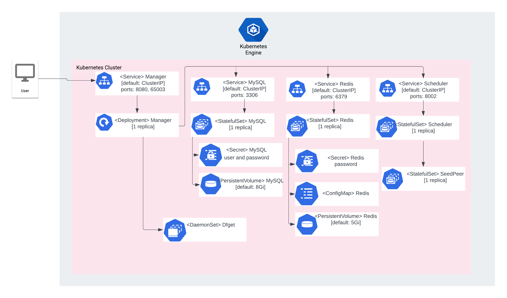

# Overview

Dragonfly is a p2p-based image and file distribution system based on an intelligent scheduling system. 
It is designed to improve the efficiency and speed of large-scale file distribution. It is widely used in the fields of application distribution, cache distribution, log distribution and image distribution.
For more information, visit the Dragonfly
[official website](https://d7y.io/docs/).

## About Google Click to Deploy

Popular open stacks on Kubernetes, packaged by Google.

## Architecture



By default, Dragonfly Manager UI is exposed using a ClusterIP Service on port 8080.

Separate Deployment, StatefulSets and DaemonSet Kubernetes objects are used to manage the Dragonfly components,
MySQL and Redis instances. A single instance of each Dragonfly component is deployed as a single Pod,
using a Kubernetes StatefulSet, Deployment or Daemonset.

The Dragonfly Manager instance connects to MySQL over port `3306`. Dragonfly stores
information in the `dragonfly` database. A single instance of MySQL is deployed
as a Pod, using a Kubernetes StatefulSet.

MySQL credentials are stored in the `[APP_INSTANCE_NAME]-mysql-secret`
Secret resource.

*   The password for the MySQL `root` user is stored in the `root-password` secret.
*   The username and password required to access the `dragonfly` database are stored in
    the `dragonfly-user` and `dragonfly-password` Secrets, respectively.

The Dragonfly Manager and Scheduler connect to Redis over port `6379`. A single instance of Redis is deployed as a Pod, using a Kubernetes Statefulset.
Redis credentials are stored in the

`[APP_INSTANCE_NAME]-redis-secret` Secret resource.


# Installation

## Quick install with Google Cloud Marketplace

Get up and running with a few clicks! Install this Dragonfly app to a Google Kubernetes Engine cluster in Google Cloud Marketplace by following these [on-screen instructions](https://console.cloud.google.com/marketplace/details/google/dragonfly).

## Command line instructions

### Prerequisites

#### Set up command line tools

You'll need the following tools in your development environment. If you're using Cloud Shell, `gcloud`, `kubectl`, Docker, and Git are installed in your environment by default.

- [gcloud](https://cloud.google.com/sdk/gcloud/)
- [kubectl](https://kubernetes.io/docs/reference/kubectl/overview/)
- [docker](https://docs.docker.com/install/)
- [git](https://git-scm.com/book/en/v2/Getting-Started-Installing-Git)
- [helm](https://helm.sh/)

Configure `gcloud` as a Docker credential helper:

```shell
gcloud auth configure-docker
```

#### Create a Google Kubernetes Engine cluster

Create a new cluster from the command line:

```shell
export CLUSTER=dragonfly-cluster
export ZONE=us-west1-a

gcloud container clusters create "${CLUSTER}" --zone "${ZONE}"
```

Configure `kubectl` to connect to the new cluster:

```shell
gcloud container clusters get-credentials "${CLUSTER}" --zone "${ZONE}"
```

#### Clone this repo

Clone this repo, as well as the associated tools repo:

```shell
git clone --recursive https://github.com/GoogleCloudPlatform/click-to-deploy.git
```

#### Install the Application resource definition

An Application resource is a collection of individual Kubernetes components,
such as Services, Deployments, and so on, that you can manage as a group.

To set up your cluster to understand Application resources, run the following command:

```shell
kubectl apply -f "https://raw.githubusercontent.com/GoogleCloudPlatform/marketplace-k8s-app-tools/master/crd/app-crd.yaml"
```

You need to run this command once.

The Application resource is defined by the [Kubernetes SIG-apps](https://github.com/kubernetes/community/tree/master/sig-apps) community. The source code can be found on [github.com/kubernetes-sigs/application](https://github.com/kubernetes-sigs/application).

### Install the app

Navigate to the `dragonfly` directory:

```shell
cd click-to-deploy/k8s/dragonfly
```

#### Configure the app with environment variables

Choose an instance name and [namespace](https://kubernetes.io/docs/concepts/overview/working-with-objects/namespaces/) for the app. In most cases, you can use the `default` namespace.

```shell
export APP_INSTANCE_NAME=dragonfly-1
export NAMESPACE=default
```

For the persistent disk provisioning of the MySQL and Redis StatefulSets, you will need to:

 * Set the StorageClass name. Check your available options using the command below:
   * ```kubectl get storageclass```
   * Or check how to create a new StorageClass in [Kubernetes Documentation](https://kubernetes.io/docs/concepts/storage/storage-classes/#the-storageclass-resource)

 * Set the persistent disk's size. The default disk size for MySQL is "8Gi" and for redis is "5Gi".

```shell
export DEFAULT_STORAGE_CLASS="standard" # provide your StorageClass name if not "standard"
export DB_PERSISTENT_DISK_SIZE="10Gi"
export REDIS_PERSISTENT_DISK_SIZE="10Gi"
```

(Optional) Enable Stackdriver Metrics Exporter:

> **NOTE:** Your GCP project must have Stackdriver enabled. If you are using a
> non-GCP cluster, you cannot export metrics to Stackdriver.

By default, the app does not export metrics to Stackdriver. To enable this option, change the value to `true`.

```shell
export METRICS_EXPORTER_ENABLED=false
```

Set up the image tag:

It is advised to use stable image reference which you can find on
[Marketplace Container Registry](https://marketplace.gcr.io/google/dragonfly).
Example:

```shell
export TAG="<BUILD_ID>"
```

Alternatively you can use short tag which points to the latest image for selected version.
> Warning: this tag is not stable and referenced image might change over time.

```shell
export TAG="2.0"
```

Configure the container images:

```shell
export IMAGE_REGISTRY="marketplace.gcr.io/google"

export IMAGE_DRAGONFLY_MANAGER="${IMAGE_REGISTRY}/dragonfly-manager2:${TAG}"
export IMAGE_DRAGONFLY_SCHEDULER="${IMAGE_REGISTRY}/dragonfly-scheduler2:${TAG}"
export IMAGE_DRAGONFLY_SEEDPEER="${IMAGE_REGISTRY}/dragonfly-seedpeer2:${TAG}"
export IMAGE_DRAGONFLY_DFGET="${IMAGE_REGISTRY}/dragonfly-dfget2:${TAG}"
export IMAGE_MYSQL="${IMAGE_REGISTRY}/mysql:${TAG}"
export IMAGE_REDIS="${IMAGE_REGISTRY}/redis:${TAG}"
export IMAGE_ELASTICSEARCH="${IMAGE_REGISTRY}/elasticsearch:${TAG}"
export IMAGE_MYSQL_EXPORTER="${IMAGE_REGISTRY}/mysql-exporter:${TAG}"
export IMAGE_REDIS_EXPORTER="${IMAGE_REGISTRY}/redis-exporter:${TAG}"
export IMAGE_METRICS_EXPORTER="${IMAGE_REGISTRY}/prometheus-to-sd:${TAG}"
```

Set or generate the passwords:

```shell
# Set mysql root and user passwords
export DB_USER_PASSWORD="dragonfly_password"
export DB_ROOT_PASSWORD="root_password"

# Set mysqld-exporter user password
export DB_EXPORTER_PASSWORD="exporter_password"

# Set redis-server password
export REDIS_PASSWORD="redis_password"
```

#### Create namespace in your Kubernetes cluster

If you use a different namespace than the `default`, run the command below to create a new namespace:

```shell
kubectl create namespace "${NAMESPACE}"
```

#### Expand the manifest template

Use `helm template` to expand the template. We recommend that you save the
expanded manifest file for future updates to your app.

```shell
helm template chart/dragonfly \
    --name "${APP_INSTANCE_NAME}" \
    --namespace "${NAMESPACE}" \
    --set persistence.storageClass="${DEFAULT_STORAGE_CLASS}" \
    --set manager.image.repo="${IMAGE_REGISTRY}" \
    --set manager.image.tag="${TAG}" \
    --set scheduler.image="${IMAGE_DRAGONFLY_SCHEDULER}"
    --set seedPeer.image="${IMAGE_DRAGONFLY_SEEDPEER}"
    --set dfget.image="${IMAGE_DRAGONFLY_DFGET}"
    --set db.image="${IMAGE_MYSQL}" \
    --set db.rootPassword="${DB_ROOT_PASSWORD}" \
    --set db.dragonflyPassword="${DB_USER_PASSWORD}" \
    --set db.exporter.password="${DB_EXPORTER_PASSWORD}" \
    --set db.exporter.image="${IMAGE_MYSQL_EXPORTER}" \
    --set redis.image="${IMAGE_REDIS}" \
    --set redis.password="${REDIS_PASSWORD}" \
    --set redis.exporter.image="${IMAGE_REDIS_EXPORTER}" \
    --set metrics.image="${IMAGE_METRICS_EXPORTER}" \
    --set metrics.exporter.enabled="${METRICS_EXPORTER_ENABLED}" \
    > "${APP_INSTANCE_NAME}_manifest.yaml"
```

#### Apply the manifest to your Kubernetes cluster

Use `kubectl` to apply the manifest to your Kubernetes cluster:

```shell
kubectl apply -f "${APP_INSTANCE_NAME}_manifest.yaml" --namespace "${NAMESPACE}"
```

#### View the app in the Google Cloud Console

To get the Cloud Console URL for your app, run the following command:

```shell
echo "https://console.cloud.google.com/kubernetes/application/${ZONE}/${CLUSTER}/${NAMESPACE}/${APP_INSTANCE_NAME}"
```

To view the app, open the URL in your browser.

### Accessing Dragonfly Manager UI

To connect to UI, you can either expose a public service endpoint, or keep it private,but connect from you local environment with `kubectl port-forward`.
## Forward Dragonfly manager port in local environmentYou can use the port forwarding feature of `kubectl` to forward Dragonfly managers's port to your local
      machine. Run the following command in the background:

```shell
kubectl port-forward \
--namespace ${NAMESPACE} \
svc/${APP_INSTANCE_NAME}-manager-service \
8080:8080
```
Now you can access the Dragonfly manager UI [http://localhost:8080](http://localhost:8080)

```
# App metrics

## Prometheus metrics

The app can be configured to expose its metrics through the [MySQL Server Exporter](https://github.com/GoogleCloudPlatform/mysql-docker/tree/master/exporter), and [Redis Exporter](https://github.com/GoogleCloudPlatform/redis-docker/tree/master/exporter), in the [Prometheus format](https://github.com/prometheus/docs/blob/master/content/docs/instrumenting/exposition_formats.md).

1.  You can access the Redis metrics at `[REDIS-SERVICE]:9121/metrics`, where `[REDIS-SERVICE]` is the
    [Kubernetes Service](https://kubernetes.io/docs/concepts/services-networking/service/) `${APP_INSTANCE_NAME}-redis-svc`.

2.  You can access the MySQL metrics at `[MYSQL-SERVICE]:9104/metrics`, where `[MYSQL-SERVICE]` is the
    [Kubernetes Service](https://kubernetes.io/docs/concepts/services-networking/service/) `${APP_INSTANCE_NAME}-mysql-svc`.

### Configuring Prometheus to collect the metrics

Prometheus can be configured to automatically collect the app's metrics. Follow the steps in [Configuring Prometheus](https://prometheus.io/docs/introduction/first_steps/#configuring-prometheus).

You configure the metrics in the [`scrape_configs` section](https://prometheus.io/docs/prometheus/latest/configuration/configuration/#scrape_config).

## Exporting metrics to Stackdriver

The deployment includes a [Prometheus to Stackdriver (`prometheus-to-sd`)](https://github.com/GoogleCloudPlatform/k8s-stackdriver/tree/master/prometheus-to-sd) container. If you enabled the option to export metrics to Stackdriver, the metrics are exported to Stackdriver automatically, and visible in [Stackdriver Metrics Explorer](https://cloud.google.com/monitoring/charts/metrics-explorer).

The name of each metric starts with the component's name (`redis` for Redis Server and `mysql` for MySQL)
Metrics are labeled with `app.kubernetes.io/name`, which includes the app's name as defined in the `APP_INSTANCE_NAME` environment variable.

The export option may not be available for GKE on-prem clusters.

> Note: Stackdriver has [quotas](https://cloud.google.com/monitoring/quotas) for
> the number of custom metrics created in a single GCP project. If the quota is
> met, additional metrics might not show up in the Stackdriver Metrics Explorer.

To remove existing metric descriptors, use [Stackdriver's REST API](https://cloud.google.com/monitoring/api/ref_v3/rest/v3/projects.metricDescriptors/delete).

# Scaling

This is a single-instance version of Dragonfly. It is not intended to be scaled up in its current configuration.

# Upgrading the app

Start by assigning a new image to your Deployment,StatefulSet or DaemonSet definition:

```shell
kubectl set image deployment "$APP_INSTANCE_NAME-manager" \
  --namespace "$NAMESPACE" manager=[NEW_IMAGE_REFERENCE]
```

where `[NEW_IMAGE_REFERENCE]` is the new image.

To check that the Pods in the Deployment running the `manager` container are
updating, run the following command:

```shell
kubectl get pods -l app.kubernetes.io/name=$APP_INSTANCE_NAME --namespace "$NAMESPACE" -w
```

The controller terminates each Pod, and waits for it to transition
to `Running` and `Ready` before updating the next Pod.

The final state of the Pods should be `Running`, with a value of `1/1` in the
**READY** column.

To verify the current image used for a `manager` container, run the following
command:

```shell
kubectl get statefulsets "$APP_INSTANCE_NAME-manager" \
  --namespace "$NAMESPACE" \
  --output jsonpath='{.spec.template.spec.containers[0].image}'
```


# Uninstall the app

## Using the Google Cloud Console

1. In the Cloud Console, open [Kubernetes Applications](https://console.cloud.google.com/kubernetes/application).

1. From the list of apps, select **dragonfly**.

1. On the Application Details page, click **Delete**.

## Using the command line

### Prepare the environment

Set your installation name and Kubernetes namespace:

```shell
export APP_INSTANCE_NAME=dragonfly-1
export NAMESPACE=default
```

### Delete the resources

> **NOTE:** We recommend to use a kubectl version that is the same as the version of your cluster. Using the same versions of kubectl and the cluster helps avoid unforeseen issues.

To delete the resources, use the expanded manifest file used for the
installation.

Run `kubectl` on the expanded manifest file:

```shell
kubectl delete -f "${APP_INSTANCE_NAME}_manifest.yaml" --namespace "${NAMESPACE}"
```

Alternately, you can delete the resources by using types and a label:

```shell
kubectl delete application \
  --namespace "${NAMESPACE}" \
  --selector "app.kubernetes.io/name=${APP_INSTANCE_NAME}"
```

### Delete the persistent volumes of your installation

By design, the removal of StatefulSets in Kubernetes does not remove the PersistentVolumeClaims that were attached to their Pods. This prevents your installations from accidentally deleting stateful data.

To remove the PersistentVolumeClaims along with their attached persistent disks, run the following `kubectl` commands:

```shell
# specify the variables values matching your installation:
export APP_INSTANCE_NAME=dragonfly-1
export NAMESPACE=default

kubectl delete persistentvolumeclaims \
  --namespace "${NAMESPACE}" \
  --selector "app.kubernetes.io/name=${APP_INSTANCE_NAME}"
```

### Delete the GKE cluster

Optionally, if you no longer need the deployed app or the GKE cluster to which it is deployed, you can delete the cluster by running the following command:

```shell
gcloud container clusters delete "${CLUSTER}" --zone "${ZONE}"
```
