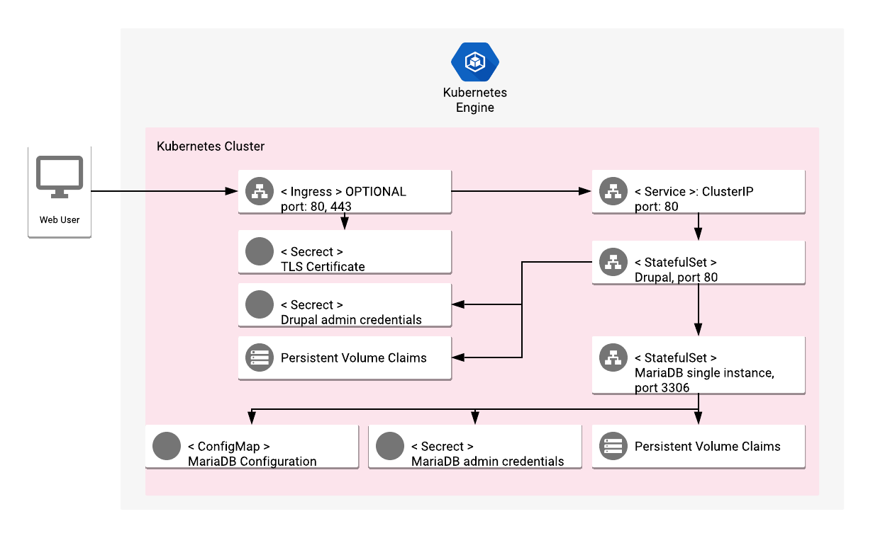

# Overview

Drupal is content management software that is used to create websites.

For more information, visit the Drupal [official website](https://www.drupal.org/).

## About Google Click to Deploy

Popular open stacks on Kubernetes, packaged by Google.

## Architecture

> **NOTE:** The following diagram shows the architecture with the app
> (optionally) exposed externally, using an Ingress and TLS configuration. The
> steps to enable the Ingress resource are in the sections below.



By default, Drupal is exposed using a ClusterIP Service on port 80.
Optionally, if you enable the option to expose the service externally, the
Drupal interface is exposed to ports `80` and `443` using an Ingress
resource. The TLS certificates are stored in the `[APP_INSTANCE_NAME]-tls`
Secret resource.

Separate StatefulSet Kubernetes objects are used to manage the Drupal and
MariaDB instances. A single instance of Drupal is deployed as a single Pod,
using a Kubernetes StatefulSet.

The Drupal instance connects to MariaDB over port `3306`. Drupal stores
information in the `drupal` database. A single instance of MariaDB is deployed
as a Pod, using a Kubernetes StatefulSet.

MariaDB credentials are stored in the `[APP_INSTANCE_NAME]-mariadb-secret`
Secret resource.

*   The password for the MariaDB `root` user is stored in the `root-password` secret.
*   The username and password required to access the `drupal` database are stored in
    the `drupal-user` and `drupal-password` Secrets, respectively.

The credentials for Drupal are stored in the
`[APP_INSTANCE_NAME]-drupal-secret` Secret resource.

*   The username and password to access the administrator panel
    are stored in the `drupal-user` and `drupal-password` Secrets, respectively.

# Installation

## Quick install with Google Cloud Marketplace

Get up and running with a few clicks! Install this Drupal app to a Google
Kubernetes Engine cluster using Google Cloud Marketplace. Follow the
[on-screen instructions](https://console.cloud.google.com/marketplace/details/google/drupal).

## Command line instructions

You can use [Google Cloud Shell](https://cloud.google.com/shell/) or a local
workstation to follow the steps below.

[](https://console.cloud.google.com/cloudshell/editor?cloudshell_git_repo=https://github.com/GoogleCloudPlatform/click-to-deploy&cloudshell_open_in_editor=README.md&cloudshell_working_dir=k8s/drupal)

### Prerequisites

#### Set up command-line tools

You'll need the following tools in your development environment. If you are
using Cloud Shell, then `gcloud`, `kubectl`, Docker, and Git are installed in your
environment by default.

* [gcloud](https://cloud.google.com/sdk/gcloud/)
* [kubectl](https://kubernetes.io/docs/reference/kubectl/overview/)
* [docker](https://docs.docker.com/install/)
* [git](https://git-scm.com/book/en/v2/Getting-Started-Installing-Git)
* [openssl](https://www.openssl.org/)
* [helm](https://helm.sh/)

Configure `gcloud` as a Docker credential helper:

```shell
gcloud auth configure-docker
```

#### Create a Google Kubernetes Engine (GKE) cluster

Create a new cluster from the command line:

```shell
export CLUSTER=drupal-cluster
export ZONE=us-west1-a
export PROJECT_ID=<GCP_Project_ID>

gcloud container clusters create "$CLUSTER" --zone "$ZONE"
```

Configure `kubectl` to connect to the new cluster:

```shell
gcloud container clusters get-credentials "$CLUSTER" --zone "$ZONE"
```

#### Clone this repo

Clone this repo, and the associated tools repo:

```shell
git clone --recursive https://github.com/GoogleCloudPlatform/click-to-deploy.git
```

#### Install the Application resource definition

An Application resource is a collection of individual Kubernetes components,
such as Services, StatefulSets, and so on, that you can manage as a group.

To set up your cluster to understand Application resources, run the following
command:

```shell
kubectl apply -f "https://raw.githubusercontent.com/GoogleCloudPlatform/marketplace-k8s-app-tools/master/crd/app-crd.yaml"
```

You need to run this command once.

The Application resource is defined by the
[Kubernetes SIG-apps](https://github.com/kubernetes/community/tree/master/sig-apps)
community. The source code can be found at
[github.com/kubernetes-sigs/application](https://github.com/kubernetes-sigs/application).

### Install the app

Navigate to the `drupal` directory:

```shell
cd click-to-deploy/k8s/drupal
```

#### Configure the app with environment variables

Choose the instance name and namespace for the app. For most cases, you can use
the `default` namespace.

```shell
export APP_INSTANCE_NAME=drupal-1
export NAMESPACE=default
```

For the persistent disk provisioning of the Drupal application StatefulSets, you will need to:

 * Set the StorageClass name. Check your available options using the command below:
   * ```kubectl get storageclass```
   * Or check how to create a new StorageClass in [Kubernetes Documentation](https://kubernetes.io/docs/concepts/storage/storage-classes/#the-storageclass-resource)

 * Set the persistent disk's size. The default disk size is "8Gi for Drupal and 5Gi for MariaDB".

```shell
export DEFAULT_STORAGE_CLASS="standard" # provide your StorageClass name if not "standard"
export DRUPAL_PERSISTENT_DISK_SIZE="8Gi"
export DB_PERSISTENT_DISK_SIZE="5Gi"
```

Expose the Service externally, and configure Ingress:

```shell
export PUBLIC_SERVICE_AND_INGRESS_ENABLED=false
```

By default, the Service isn't exposed externally. To enable this option, change
the value to `true`.

Enable Stackdriver Metrics Exporter:

> **NOTE:** Your GCP project must have Stackdriver enabled. If you are using a
> non-GCP cluster, you cannot export metrics to Stackdriver.

By default, the app does not export metrics to Stackdriver. To enable
this option, change the value to `true`.

```shell
export METRICS_ENABLED=false
```

Set up the image tag:

It is advised to use stable image reference which you can find on
[Marketplace Container Registry](https://marketplace.gcr.io/google/drupal).
Example:

```shell
export TAG="10.0.10-<BUILD_ID>"
```

Alternatively you can use short tag which points to the latest image for selected version.
> Warning: this tag is not stable and referenced image might change over time.

```shell
export TAG="10.0"
```

Configure the container images:

```shell
export IMAGE_DRUPAL="marketplace.gcr.io/google/drupal"
export IMAGE_APACHE_EXPORTER="marketplace.gcr.io/google/drupal/apache-exporter:${TAG}"
export IMAGE_MARIADB="marketplace.gcr.io/google/drupal/mariadb:${TAG}"
export IMAGE_MYSQL_EXPORTER="marketplace.gcr.io/google/drupal/mysqld-exporter:${TAG}"
export IMAGE_METRICS_EXPORTER="marketplace.gcr.io/google/drupal/prometheus-to-sd:${TAG}"
```

Set or generate passwords:

```shell
# Set alias for password generation
alias generate_pwd="cat /dev/urandom | tr -dc 'a-zA-Z0-9' | fold -w 10 | head -n 1 | tr -d '\n'"

# Set the root and Drupal database passwords
export ROOT_DB_PASSWORD="$(generate_pwd)"
export DRUPAL_DB_PASSWORD=$(generate_pwd)

# Set mysqld-exporter user password.
export EXPORTER_DB_PASSWORD=$(generate_pwd)

# Set password for Drupal admin panel
export DRUPAL_PASSWORD=$(generate_pwd)
```

#### Create TLS certificate for Drupal

> Note: You can skip this step if you have not set up external access.

1.  If you already have a certificate that you want to use, copy your
    certificate and key pair to the `/tmp/tls.crt` and `/tmp/tls.key` files,
    then skip to the next step.

    To create a new certificate, run the following command:

    ```shell
    openssl req -x509 -nodes -days 365 -newkey rsa:2048 \
        -keyout /tmp/tls.key \
        -out /tmp/tls.crt \
        -subj "/CN=drupal/O=drupal"
    ```

2.  Set the `TLS_CERTIFICATE_KEY` and `TLS_CERTIFICATE_CRT` variables:

    ```shell
    export TLS_CERTIFICATE_KEY="$(cat /tmp/tls.key | base64)"
    export TLS_CERTIFICATE_CRT="$(cat /tmp/tls.crt | base64)"
    ```

#### Create namespace in your Kubernetes cluster

If you use a different namespace than `default`, or the namespace does not exist
yet, run the command below to create a new namespace:

```shell
kubectl create namespace "$NAMESPACE"
```

#### Expand the manifest template

Use `helm template` to expand the template. We recommend that you save the
expanded manifest file for future updates to the app.

```shell
helm template "${APP_INSTANCE_NAME}" chart/drupal \
  --namespace "${NAMESPACE}" \
  --set drupal.image.repo="${IMAGE_DRUPAL}" \
  --set drupal.image.tag="${TAG}" \
  --set drupal.password="${DRUPAL_PASSWORD}" \
  --set drupal.persistence.storageClass="${DEFAULT_STORAGE_CLASS}" \
  --set drupal.persistence.size="${DRUPAL_PERSISTENT_DISK_SIZE}" \
  --set db.image="${IMAGE_MARIADB}" \
  --set db.rootPassword="${ROOT_DB_PASSWORD}" \
  --set db.drupalPassword="${DRUPAL_DB_PASSWORD}" \
  --set db.persistence.size="${DB_PERSISTENT_DISK_SIZE}" \
  --set db.exporter.image="${IMAGE_MYSQL_EXPORTER}" \
  --set db.exporter.password="${EXPORTER_DB_PASSWORD}" \
  --set apache.exporter.image="${IMAGE_APACHE_EXPORTER}" \
  --set metrics.image="${IMAGE_METRICS_EXPORTER}" \
  --set metrics.exporter.enabled="${METRICS_ENABLED}" \
  --set enablePublicServiceAndIngress="${PUBLIC_SERVICE_AND_INGRESS_ENABLED}" \
  --set tls.base64EncodedPrivateKey="${TLS_CERTIFICATE_KEY}" \
  --set tls.base64EncodedCertificate="${TLS_CERTIFICATE_CRT}" \
  --set metrics.exporter.enabled="${METRICS_EXPORTER_ENABLED}" \
  > "${APP_INSTANCE_NAME}_manifest.yaml"
```

#### Apply the manifest to your Kubernetes cluster

Use `kubectl` to apply the manifest to your Kubernetes cluster:

```shell
kubectl apply -f "${APP_INSTANCE_NAME}_manifest.yaml" --namespace "${NAMESPACE}"
```

#### View the app in the Google Cloud Console

To get the Cloud Console URL for your app, run the following command:

```shell
echo "https://console.cloud.google.com/kubernetes/application/${ZONE}/${CLUSTER}/${NAMESPACE}/${APP_INSTANCE_NAME}?project=${PROJECT_ID}"
```

To view the app, open the URL in your browser.

### Open your Drupal site

If your Drupal site has internal access only (`PUBLIC_SERVICE_AND_INGRESS_ENABLED=false`), you can use port-forward to get access to the site:

```shell
kubectl port-forward --namespace $NAMESPACE \
  svc/$APP_INSTANCE_NAME-drupal-svc 8080:80
```

Now you can access Drupal UI with [http://localhost:8080](http://localhost:8080).

Get the external IP of your Drupal site (`PUBLIC_SERVICE_AND_INGRESS_ENABLED=true`) using the following command:

```shell
SERVICE_IP=$(kubectl get ingress $APP_INSTANCE_NAME-drupal-ingress \
  --namespace $NAMESPACE \
  --output jsonpath='{.status.loadBalancer.ingress[0].ip}')

echo "https://${SERVICE_IP}/"
```

The output shows you the URL of your site.

# App metrics

## Prometheus metrics

The app can be configured to expose its metrics through the
[MySQL Server Exporter](https://github.com/GoogleCloudPlatform/mysql-docker/tree/master/exporter)
and the
[Apache Exporter](https://github.com/GoogleCloudPlatform/drupal-docker/tree/master/exporter)
in the
[Prometheus format](https://github.com/prometheus/docs/blob/master/content/docs/instrumenting/exposition_formats.md).

1.  You can access the MariaDB metrics at `[MARIADB-SERVICE]:9104/metrics`, where
    `[MARIADB-SERVICE]` is the
    [Kubernetes Service](https://kubernetes.io/docs/concepts/services-networking/service/).

    For example, to access the metrics locally, run the following command:

    ```shell
    kubectl port-forward "svc/${APP_INSTANCE_NAME}-mysqld-exporter-svc" 9104 --namespace "${NAMESPACE}"
    ```

    Then, navigate to the
    [http://localhost:9104/metrics](http://localhost:9104/metrics) endpoint.

2.  You can acccess the metrics for the Apache HTTP server at
    `[APACHE-SERVICE]:9117/metrics`, where `[APACHE-SERVICE]` is the
    [Kubernetes Service](https://kubernetes.io/docs/concepts/services-networking/service/).

    For example, to access the metrics locally, run the following command:

    ```shell
    kubectl port-forward "svc/${APP_INSTANCE_NAME}-apache-exporter-svc" 9117 --namespace "${NAMESPACE}"
    ```

    Then, navigate to the
    [http://localhost:9117/metrics](http://localhost:9117/metrics) endpoint.

### Configuring Prometheus to collect the metrics

Prometheus can be configured to automatically collect the app's metrics.
To set this up, follow the steps in
[Configuring Prometheus](https://prometheus.io/docs/introduction/first_steps/#configuring-prometheus).

You configure the metrics in the
[`scrape_configs` section](https://prometheus.io/docs/prometheus/latest/configuration/configuration/#scrape_config).

## Exporting metrics to Stackdriver

The deployment includes a
[Prometheus to Stackdriver (`prometheus-to-sd`)](https://github.com/GoogleCloudPlatform/k8s-stackdriver/tree/master/prometheus-to-sd)
container. If you enabled the option to export metrics to Stackdriver, the
metrics are automatically exported to Stackdriver and visible in
[Stackdriver Metrics Explorer](https://cloud.google.com/monitoring/charts/metrics-explorer).

The name of each metric starts with the component's name (`mariadb` for MariaDB and `apache-drupal` for Drupal).
Metrics are labeled with `app.kubernetes.io/name`, which inclues the app's name,
as defined in the `APP_INSTANCE_NAME` environment variable.

The export option may not be available for GKE on-prem clusters.

> Note: Stackdriver has [quotas](https://cloud.google.com/monitoring/quotas) for
> the number of custom metrics created in a single GCP project. If the quota is
> met, additional metrics might not show up in the Stackdriver Metrics Explorer.

You can remove existing metric descriptors using
[Stackdriver's REST API](https://cloud.google.com/monitoring/api/ref_v3/rest/v3/projects.metricDescriptors/delete).

# Scaling

This is a single-instance version of Drupal. It is not intended to be scaled
up with its current configuration.

# Backup and restore

## Using the Drupal module

Drupal provides a dedicated module called the [Backup and Migrate module](https://www.drupal.org/project/backup_migrate).

# Upgrade the app

## Prepare the environment

To update Drupal, please visit the [official documentation](https://www.drupal.org/docs/8/update)

The steps below describe the upgrade procedure for the Docker images only (Apache, Debian, MariaDB).
They do not describe how to upgrade your Drupal version.

Before upgrading, we recommend that you backup your Drupal app
using the [backup step](#create-the-backup).

> Note that during the upgrade, your Drupal site will be unavailable.

Set your environment variables to match the installation properties:

```shell
export APP_INSTANCE_NAME=drupal-1
export NAMESPACE=default
```

## Upgrade Drupal

Start by assigning a new image to your StatefulSet definition:

```shell
kubectl set image statefulset "$APP_INSTANCE_NAME-drupal" \
  --namespace "$NAMESPACE" drupal=[NEW_IMAGE_REFERENCE]
```

where `[NEW_IMAGE_REFERENCE]` is the new image.

To check that the Pods in the StatefulSet running the `drupal` container are
updating, run the following command:

```shell
kubectl get pods -l app.kubernetes.io/name=$APP_INSTANCE_NAME --namespace "$NAMESPACE" -w
```

The StatefulSet controller terminates each Pod, and waits for it to transition
to `Running` and `Ready` before updating the next Pod.

The final state of the Pods should be `Running`, with a value of `1/1` in the
**READY** column.

To verify the current image used for a `drupal` container, run the following
command:

```shell
kubectl get statefulsets "$APP_INSTANCE_NAME-drupal" \
  --namespace "$NAMESPACE" \
  --output jsonpath='{.spec.template.spec.containers[0].image}'
```

## Upgrade MariaDB

The upgrade process is the same as the process for updating Drupal - just
replace `drupal` with `mariadb`.

## Update TLS certificate for Drupal

If you want to update the certificate that the app uses, copy the new
certificate and key pair in to the `/tmp/tls.crt` and `/tmp/tls.key` files, and
execute the following command:

```shell
kubectl --namespace $NAMESPACE create secret tls $APP_INSTANCE_NAME-tls \
  --cert=/tmp/tls.crt --key=/tmp/tls.key --dry-run -o yaml | kubectl apply -f -
```

# Uninstall the app

## Using the Google Cloud Platform Console

1.  In the Cloud Console, open
    [Kubernetes Applications](https://console.cloud.google.com/kubernetes/application).

2.  From the list of apps, click **Drupal**.

3.  On the Application Details page, click **Delete**.

## Using the command line

### Prepare the environment

Set your installation name and Kubernetes namespace:

```shell
export APP_INSTANCE_NAME=drupal-1
export NAMESPACE=default
```

### Delete the resources

> **NOTE:** We recommend using a `kubectl` version that is the same as the
> version of your cluster. Using the same version for `kubectl` and the cluster
> helps to avoid unforeseen issues.

To delete the resources, use the expanded manifest file used for the
installation.

Run `kubectl` on the expanded manifest file:

```shell
kubectl delete -f ${APP_INSTANCE_NAME}_manifest.yaml --namespace $NAMESPACE
```

If you don't have the expanded manifest, delete the resources by using types and a label:

```shell
kubectl delete application --namespace $NAMESPACE \
  --selector app.kubernetes.io/name=$APP_INSTANCE_NAME
```

### Delete the PersistentVolumeClaims

By design, the removal of StatefulSets in Kubernetes does not remove
PersistentVolumeClaims that were attached to their Pods. This prevents your
installations from accidentally deleting stateful data.

To remove the PersistentVolumeClaims with their attached persistent disks, run
the following `kubectl` commands:

```shell
# specify the variables values matching your installation:
export APP_INSTANCE_NAME=drupal-1
export NAMESPACE=default

kubectl delete persistentvolumeclaims \
  --namespace $NAMESPACE
  --selector app.kubernetes.io/name=$APP_INSTANCE_NAME
```
