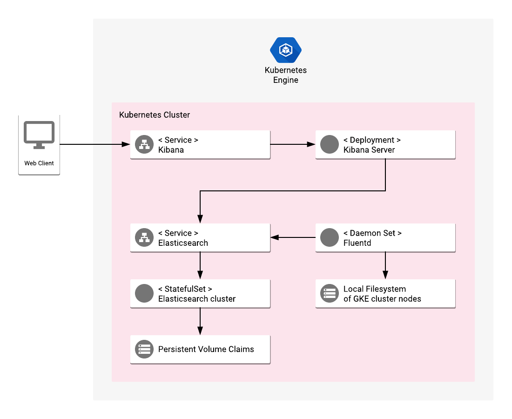

# Overview

Elastic GKE Logging is an application that provides a fully functional
solution for collecting and analyzing logs from a Kubernetes cluster. It is
built on top of popular open-source systems, including Fluentd for collecting
logs, and Elasticsearch with Kibana for searching and analyzing data.

[Learn more](https://www.elastic.co/).

## About Google Click to Deploy

Popular open stacks on Kubernetes packaged by Google.

## Design



The application is designed to collect and present the log messages from
a GKE cluster. It consists of the following components:
* **Fluentd DaemonSet** - for collecting logs from each Kubernetes node in
  a cluster and exporting them to Elasticsearch.
* **Elasticsearch StatefulSet** - a database for storing and searching the logs.
* **Kibana Deployment** - a visualization tool connected to Elasticsearch
  for presenting and querying the logs.

None of the components is designed to be exposed publicly or autoscale in case
of the resources growth.

## Configuration

**Fluentd** - it contains a ConfigMap defining a few files for logs locations
  and formats. It exports logs to Elasticsearch daily indexes, starting with
  “logstash-\*” prefix.

**Elasticsearch** - forms a cluster with a configurable number of replicas
  (specified by user before the installation); It uses a dedicated disk
  (VolumeClaim) for storing data in a stateful manner.

**Kibana** - it stores all the configuration in Elasticsearch index, this is
  why Kibana itself is installed in a single-replica, “stateless” Deployment.
  Kibana has initial configuration represented by JSON payloads that are used
  against Kibana’s REST API to set an index pattern for “logstash-\*” and some
  useful saved searches.

# Installation

## Quick install with Google Cloud Marketplace

Get up and running with a few clicks! Install this Elastic GKE Logging app to a
Google Kubernetes Engine cluster using Google Cloud Marketplace. Follow the
[on-screen instructions](https://console.cloud.google.com/marketplace/details/google/elastic-gke-logging).

## Command line instructions

You can use [Google Cloud Shell](https://cloud.google.com/shell/) or a local workstation in the
further instructions.

[](https://console.cloud.google.com/cloudshell/editor?cloudshell_git_repo=https://github.com/GoogleCloudPlatform/click-to-deploy&cloudshell_working_dir=k8s/elastic-gke-logging)

### Prerequisites

#### Set up command-line tools

You'll need the following tools in your development environment:

- [gcloud](https://cloud.google.com/sdk/gcloud/)
- [kubectl](https://kubernetes.io/docs/reference/kubectl/overview/)
- [docker](https://docs.docker.com/install/)
- [git](https://git-scm.com/book/en/v2/Getting-Started-Installing-Git)

Configure `gcloud` as a Docker credential helper:

```shell
gcloud auth configure-docker
```

#### Create a Google Kubernetes Engine cluster

Create a new cluster from the command line:

```shell
export CLUSTER=elastic-gke-logging-cluster
export ZONE=us-west1-a

gcloud container clusters create "$CLUSTER" --zone "$ZONE"
```

Configure `kubectl` to connect to the new cluster:

```shell
gcloud container clusters get-credentials "$CLUSTER" --zone "$ZONE"
```

#### Clone this repo

Clone this repo and the associated tools repo:

```shell
git clone --recursive https://github.com/GoogleCloudPlatform/click-to-deploy.git
```

#### Install the Application resource definition

An Application resource is a collection of individual Kubernetes components,
such as Services, Deployments, and so on, that you can manage as a group.

To set up your cluster to understand Application resources, run the following command:

```shell
kubectl apply -f "https://raw.githubusercontent.com/GoogleCloudPlatform/marketplace-k8s-app-tools/master/crd/app-crd.yaml"
```

You need to run this command once.

The Application resource is defined by the
[Kubernetes SIG-apps](https://github.com/kubernetes/community/tree/master/sig-apps)
community. The source code can be found on
[github.com/kubernetes-sigs/application](https://github.com/kubernetes-sigs/application).

### Install the Application

Navigate to the `elastic-gke-logging` directory:

```shell
cd click-to-deploy/k8s/elastic-gke-logging
```

#### Configure the app with environment variables

Choose an instance name and
[namespace](https://kubernetes.io/docs/concepts/overview/working-with-objects/namespaces/)
for the app. In most cases, you can use the `default` namespace.

```shell
export APP_INSTANCE_NAME=elastic-logging-1
export NAMESPACE=default
```

Specify the number of replicas for the Elasticsearch server:

```shell
export ELASTICSEARCH_REPLICAS=2
```

Enable Stackdriver Metrics Exporter:

> **NOTE:** Your GCP project should have Stackdriver enabled. For non-GCP clusters, export of metrics to Stackdriver is not supported yet.

By default the integration is disabled. To enable, change the value to `true`.

```shell
export METRICS_EXPORTER_ENABLED=false
```

Configure the container images:

```shell
TAG=6.3
export IMAGE_ELASTICSEARCH="marketplace.gcr.io/google/elastic-gke-logging:${TAG}"
export IMAGE_KIBANA="marketplace.gcr.io/google/elastic-gke-logging/kibana:${TAG}"
export IMAGE_FLUENTD="marketplace.gcr.io/google/elastic-gke-logging/fluentd:${TAG}"
export IMAGE_INIT="marketplace.gcr.io/google/elastic-gke-logging/ubuntu16_04:${TAG}"
export IMAGE_METRICS_EXPORTER="marketplace.gcr.io/google/elastic-gke-logging/prometheus-to-sd:${TAG}"
```

The images above are referenced by
[tag](https://docs.docker.com/engine/reference/commandline/tag). We recommend
that you pin each image to an immutable
[content digest](https://docs.docker.com/registry/spec/api/#content-digests).
This ensures that the installed application always uses the same images,
until you are ready to upgrade. To get the digest for the image, use the
following script:

```shell
for i in IMAGE_ELASTICSEARCH IMAGE_KIBANA IMAGE_FLUENTD IMAGE_INIT IMAGE_METRICS_EXPORTER; do
  repo=$(echo ${!i} | cut -d: -f1);
  digest=$(docker pull ${!i} | sed -n -e 's/Digest: //p');
  export $i="$repo@$digest";
  env | grep $i;
done
```

#### Create namespace in your Kubernetes cluster

If you use a different namespace than the `default`, run the command below to create a new namespace:

```shell
kubectl create namespace "$NAMESPACE"
```

#### Create Fluentd service account

Create Fluentd service account and role binding:

```shell
export FLUENTD_SERVICE_ACCOUNT="$APP_INSTANCE_NAME-fluentdserviceaccount"
kubectl create serviceaccount $FLUENTD_SERVICE_ACCOUNT --namespace $NAMESPACE
kubectl create clusterrole $FLUENTD_SERVICE_ACCOUNT-role --verb=get,list,watch --resource=pods,namespaces
kubectl create clusterrolebinding $FLUENTD_SERVICE_ACCOUNT-rule --clusterrole=$FLUENTD_SERVICE_ACCOUNT-role --serviceaccount=$NAMESPACE:$FLUENTD_SERVICE_ACCOUNT
```

#### Expand the manifest template

Use `helm template` to expand the template. We recommend that you save the
expanded manifest file for future updates to the application.

```shell
helm template chart/elastic-gke-logging \
  --name $APP_INSTANCE_NAME \
  --namespace $NAMESPACE \
  --set elasticsearch.replicas=$ELASTICSEARCH_REPLICAS \
  --set fluentd.serviceAccount=$FLUENTD_SERVICE_ACCOUNT \
  --set initImage=$IMAGE_INIT \
  --set elasticsearch.image=$IMAGE_ELASTICSEARCH \
  --set kibana.image=$IMAGE_KIBANA \
  --set fluentd.image=$IMAGE_FLUENTD \
  --set metrics.image=$IMAGE_METRICS_EXPORTER \
  --set metrics.enabled=$METRICS_EXPORTER_ENABLED > "${APP_INSTANCE_NAME}_manifest.yaml"
```

#### Apply the manifest to your Kubernetes cluster

Use `kubectl` to apply the manifest to your Kubernetes cluster:

```shell
kubectl apply -f "${APP_INSTANCE_NAME}_manifest.yaml" --namespace "${NAMESPACE}"
```

> NOTE: Elasticsearch Pods have an [Init Container](https://kubernetes.io/docs/concepts/workloads/pods/init-containers/)
  that sets the system property of `vm.max_map_count` set at least to 262144
  on the hosting node. For background information, see the
  [Elasticsearch documentation](https://www.elastic.co/guide/en/elasticsearch/reference/current/vm-max-map-count.html).

#### View the app in the Google Cloud Console

To get the Console URL for your app, run the following command:

```shell
echo "https://console.cloud.google.com/kubernetes/application/${ZONE}/${CLUSTER}/${NAMESPACE}/${APP_INSTANCE_NAME}"
```

To view your app, open the URL in your browser.

### (Optional) Make the Elasticsearch and Kibana services externally available

By default, the application does not have an external IP. To expose an
external IP for Elasticsearch service, run the following command:

```
kubectl patch svc "$APP_INSTANCE_NAME-elasticsearch-svc" \
  --namespace "$NAMESPACE" \
  --patch '{"spec": {"type": "LoadBalancer"}}'
```

And the following to expose Kibana service:

```
kubectl patch svc "$APP_INSTANCE_NAME-kibana-svc" \
  --namespace "$NAMESPACE" \
  --patch '{"spec": {"type": "LoadBalancer"}}'
```

# Get the Elasticsearch URL

If you run your Elasticsearch cluster behind a LoadBalancer service, get
the service IP to run administrative operations against the REST API:

```
SERVICE_IP=$(kubectl get svc $APP_INSTANCE_NAME-elasticsearch-svc \
  --namespace $NAMESPACE \
  --output jsonpath='{.status.loadBalancer.ingress[0].ip}')

ELASTIC_URL="http://${SERVICE_IP}:9200"
```

It might take some time for the external IP address to be created.

If you haven't exposed your Elasticsearch service externally, use a local proxy to access the service. In a background terminal, run the following
command:

```shell
# select a local port for the proxy
KUBE_PROXY_PORT=8080
kubectl proxy -p $KUBE_PROXY_PORT
```

And then in your main terminal, run:

```shell
KUBE_PROXY_PORT=8080
PROXY_BASE_URL=http://localhost:$KUBE_PROXY_PORT/api/v1/proxy
ELASTIC_URL=$PROXY_BASE_URL/namespaces/$NAMESPACE/services/$APP_INSTANCE_NAME-elasticsearch-svc:http
```

In both cases, the `ELASTIC_URL` environment variable points to your
Elasticsearch base URL. Verify the variable using `curl`:

```shell
curl "${ELASTIC_URL}"
```

In the response, you should see a message including Elasticsearch's tagline:

```shell
"tagline" : "You Know, for Search"
```

# Get the Kibana URL

To get the Kibana URL, follow the same steps as for Elasticsearch.

If you want to expose the Kibana service externally, run the following command:

```shell
SERVICE_IP=$(kubectl get svc $APP_INSTANCE_NAME-kibana-svc \
  --namespace $NAMESPACE \
  --output jsonpath='{.status.loadBalancer.ingress[0].ip}')

KIBANA_URL="http://${SERVICE_IP}:5601"
```

If you don't want to expose the service externally, create a local proxy:

```shell
KUBE_PROXY_PORT=8080
PROXY_BASE_URL=http://localhost:$KUBE_PROXY_PORT/api/v1/proxy
KIBANA_URL=$PROXY_BASE_URL/namespaces/$NAMESPACE/services/$APP_INSTANCE_NAME-kibana-svc:http
```

In both cases, the environment variable `KIBANA_URL` points to your Kibana
URL. To see the URL, run:

```shell
echo $KIBANA_URL
```

# Application metrics

## Prometheus metrics

The application is configured to expose its metrics through
[Elasticsearch Exporter](https://github.com/justwatchcom/elasticsearch_exporter)
in the [Prometheus format](https://github.com/prometheus/docs/blob/master/content/docs/instrumenting/exposition_formats.md).
For more detailed information about the plugin setup, see the [Elasticsearch Exporter documentation](https://github.com/justwatchcom/elasticsearch_exporter/blob/master/README.md).

Metrics can be read on a single HTTP endpoint available at `[POD_IP]:9108/metrics`,
where `[POD_IP]` is the IP read from Kubernetes headless service `$APP_INSTANCE_NAME-elasticsearch-exporter-svc`.

## Configuring Prometheus to collect the metrics

Prometheus can be configured to automatically collect the application's metrics.
Follow the [Configuring Prometheus documentation](https://prometheus.io/docs/introduction/first_steps/#configuring-prometheus)
to enable metrics scrapping in your Prometheus server. The detailed specification
of `<scrape_config>` used to enable the metrics collection can be found
[here](https://prometheus.io/docs/prometheus/latest/configuration/configuration/#scrape_config).

## Exporting metrics to Stackdriver

If the option to export application metrics to Stackdriver is enabled,
the deployment includes a [`prometheus-to-sd`](https://github.com/GoogleCloudPlatform/k8s-stackdriver/tree/master/prometheus-to-sd)
(Prometheus to Stackdriver exporter) container.
Then the metrics will be automatically exported to Stackdriver and visible in
[Stackdriver Metrics Explorer](https://cloud.google.com/monitoring/charts/metrics-explorer).

Each metric of the application will have a name starting with the application's name
(matching the variable `APP_INSTANCE_NAME` described above).

The exporting option might not be available for GKE on-prem clusters.

> Note: Please be aware that Stackdriver has [quotas](https://cloud.google.com/monitoring/quotas)
for the number of custom metrics created in a single GCP project. If the quota is met,
additional metrics will not be accepted by Stackdriver, which might cause that some metrics
from your application might not show up in the Stackdriver's Metrics Explorer.

Existing metric descriptors can be removed through
[Stackdriver's REST API](https://cloud.google.com/monitoring/api/ref_v3/rest/v3/projects.metricDescriptors/delete).

# Discover the logs

## Index Pattern

Your installation includes a default Index Pattern to be tracked by Kibana. The
index pattern matches the Fluentd DaemonSet configuration and is
`logstash-*`.

After you have installed the app, open the Kibana UI, and in the main menu,
click **Discover**.

To get the direct URL for the Discover page, run:

```shell
echo "${KIBANA_URL}/app/kibana#/discover"
```

## Saved searches

To see the searches included with this installation of Kibana, open the
Discover page, and in the top menu, click **Open**. The list of searches
includes logs from Kubernetes Engine Apps, Kubelet, Docker, `kernel`,
and others.

### Scale the Elasticsearch cluster

Scale the number of master node replicas by the following command:

```
kubectl scale statefulsets "$APP_INSTANCE_NAME-elasticsearch" \
  --namespace "$NAMESPACE" --replicas=[NEW_REPLICAS]
```

By default, there are 2 replicas to satisfy the minimum master quorum.
To increase resilience, we recommend that you scale the number of replicas
to at least 3.

For more information about scaling StatefulSets, see the
[Kubernetes documentation](https://kubernetes.io/docs/tasks/run-application/scale-stateful-set/#kubectl-scale).

# Snapshot and restore

The following steps are based on the Elasticsearch documentation about
[Snapshot And Restore](https://www.elastic.co/guide/en/elasticsearch/reference/current/modules-snapshots.html).

These steps use NFS storage on top of a StatefulSet in Kubernetes. You could
use other NFS providers, or one of the repository plugins supported by Elasticsearch.

The stateful data for Kibana is stored in an Elasticsearch index called
`.kibana`, so it requires no additional backup steps.

The Fluentd DaemonSet is stateless by design, and so requires no backup.

## Snapshot

### Create a backup infrastructure

To create a NFS server on Kubernetes and create a shared disk for the
backup, run [`scripts/create-backup-infra.sh`](scripts/create-backup-infra.sh):

```shell
scripts/create-backup-infra.sh \
  --app elasticsearch-1 \
  --namespace default \
  --disk-size 10Gi \
  --backup-claim elasticsearch-1-backup
```

### Patch the Elasticsearch StatefulSet to mount a backup disk

Your Elasticsearch StatefulSet needs to be patched to mount the backup disk.
To run the patch and automatically perform a rolling update on the StatefulSet,
run [`scripts/patch-sts-for-backup.sh`](scripts/patch-sts-for-backup.sh).

```shell
scripts/patch-sts-for-backup.sh \
  --app elasticsearch-1 \
  --namespace default \
  --backup-claim elasticsearch-1-backup
```

### Register the snapshot repository in the Elasticsearch cluster

[Get the URL for the Elasticsearch API](#get-the-elasticsearch-url). The
`ELASTIC_URL` variable points to the Elasticsearch REST API.

To register your new backup repository, run the following command:

```shell
curl -X PUT "$ELASTIC_URL/_snapshot/es_backup" -H 'Content-Type: application/json' -d '{
  "type": "fs",
  "settings": {
    "location": "/usr/share/elasticsearch/backup"
  }
}'
```

### Create a snapshot

To create a snapshot of data in your indices, call the REST API:

```shell
curl -X PUT "$ELASTIC_URL/_snapshot/es_backup/snapshot_1?wait_for_completion=true"
```

## Restore

These steps assume that you have a clean installation of
Elasticsearch on your cluster, and you want to restore all data from a
snapshot.

### Patch the Elasticsearch StatefulSet to mount a backup disk

These steps assume that the `ES_BACKUP_CLAIM` environment variable contains
the name of a Persistent Volume Claim that was used as a snapshot repository
in Elasticsearch cluster, and that the version of the Claim is
compatible with the new cluster.

Run the following command to run a rolling update that mounts the disk to all
the Elasticsearch Pods in your installation:

```shell
scripts/patch-sts-for-backup.sh \
  --app elasticsearch-1 \
  --namespace default \
  --backup-claim "$ES_BACKUP_CLAIM"
```

### Register the snapshot repository

Repeat [the steps](#register-the-snapshot-repository-in-the-elasticsearch-cluster)
to register a snapshot repository for your backup.

After the repository is mounted, list all of the available snapshots to be
restored:

```shell
curl "$ELASTIC_URL/_snapshot/es_backup/_all"
```

To restore a snapshot called `snapshot_1`, run the following command:

```shell
curl -X POST "$ELASTIC_URL/_snapshot/es_backup/snapshot_1/_restore"
```

# Updating the app

## Updating Elasticsearch

For background information about rolling updates to Elasticsearch, see the
[Elasticsearch documentation](https://www.elastic.co/guide/en/elasticsearch/reference/current/rolling-upgrades.html).

Before starting the update procedure on your cluster, we recommend that you
back up your installation, to eliminate the risk of losing your data.

After updating Elasticsearch, you must also update Kibana. The Elasticsearch
and Kibana versions must match.

## Update the Elasticsearch cluster nodes

### Patch the StatefulSet with the new image

Start with assigning the new image to your StatefulSet definition:

```
IMAGE_ELASTICSEARCH=[NEW_IMAGE_REFERENCE]

kubectl set image statefulset "${APP_INSTANCE_NAME}-elasticsearch" \
  --namespace "${NAMESPACE}" elasticsearch="${IMAGE_ELASTICSEARCH}"
```

After this operation, the StatefulSet has a new image configured for the
containers. However, because of the OnDelete update strategy on the
StatefulSet, the pods will not automatically restart.

### Run the `upgrade.sh` script to run the rolling update

Make sure that the cluster is healthy before proceeding:

```shell
curl $ELASTIC_URL/_cluster/health?pretty
```

Run [`scripts/upgrade.sh`](scripts/upgrade.sh). The script
takes down and updates one replica at a time.

## Update Kibana

After successfully updating Elasticsearch, update the Kibana StatefulSet with
the new image:

```shell
IMAGE_KIBANA=[NEW_IMAGE_REFERENCE]

kubectl set image deployment "${APP_INSTANCE_NAME}-kibana" \
  --namespace "${NAMESPACE}" kibana="${IMAGE_KIBANA}"
```

The Kibana deployment automatically starts creating new Pods with the new image, and deletes the old Pods.

## Update the Fluentd Daemonset

To update Fluentd, follow the installation steps in the
[Fluentd documentation](https://docs.fluentd.org/v1.0/articles/quickstart).
Make sure that the configuration format in `${APP_INSTANCE_NAME}-fluentd-es-config` ConfigMap
is compatible with the new application version.

To update the Fluentd image, run the following command:

```shell
IMAGE_FLUENTD=[NEW_IMAGE_REFERENCE]

kubectl set image ds/${APP_INSTANCE_NAME}-fluentd-es fluentd-es="${IMAGE_FLUENTD}"
```

# Uninstall the Application

## Using the Google Cloud Platform Console

1. In the GCP Console, open [Kubernetes Applications](https://console.cloud.google.com/kubernetes/application).

1. From the list of applications, click **Elasticsearch**.

1. On the Application Details page, click **Delete**.

## Using the command line

### Prepare the environment

Set your installation name and Kubernetes namespace:

```shell
export APP_INSTANCE_NAME=elastic-logging-1
export NAMESPACE=default
```

### Delete the resources

> **NOTE:** We recommend that you use a kubectl version that is the same as the version of your cluster. Using the same versions of `kubectl` and the cluster helps avoid unforeseen issues.

To delete the resources, use the expanded manifest file used for the
installation.

Run `kubectl` on the expanded manifest file:

```shell
kubectl delete -f ${APP_INSTANCE_NAME}_manifest.yaml --namespace $NAMESPACE
```

If you don't have the expanded manifest file, delete the resources using types and a label:

```shell
kubectl delete deployment,statefulset,service,configmap,serviceaccount,clusterrole,clusterrolebinding,application,job \
  --namespace $NAMESPACE \
  --selector app.kubernetes.io/name=$APP_INSTANCE_NAME
```

### Delete the persistent volumes for your installation

By design, the removal of StatefulSets in Kubernetes does not remove
PersistentVolumeClaims that were attached to their Pods. This prevents your
installations from accidentally deleting stateful data.

To remove the PersistentVolumeClaims with their attached persistent disks, run
the following `kubectl` commands:

```shell
# specify the variables values matching your installation:
export APP_INSTANCE_NAME=elastic-logging-1
export NAMESPACE=default

kubectl delete persistentvolumeclaims \
  --namespace $NAMESPACE \
  --selector app.kubernetes.io/name=$APP_INSTANCE_NAME
```

### Delete the GKE cluster

Optionally, if you don't need the deployed application or the GKE cluster,
delete the cluster using this command:

```
gcloud container clusters delete "$CLUSTER" --zone "$ZONE"
```
