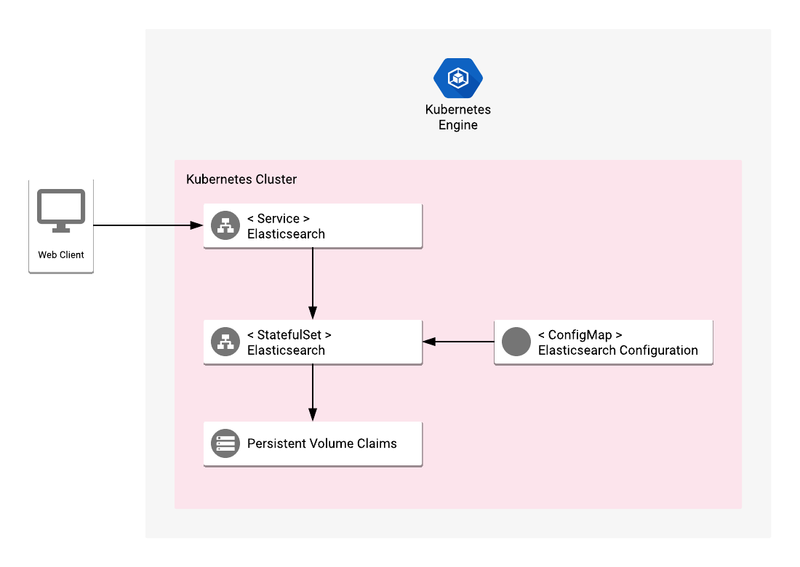

# Overview

Elasticsearch is an open-source search engine that provides a distributed,
multitenant-capable full-text search engine with an HTTP web interface and
schema-free JSON documents.

[Learn more](https://www.elastic.co/).

## About Google Click to Deploy

Popular open stacks on Kubernetes packaged by Google.

## Design



The application offers a vanilla installation of Elasticsearch.

Elasticsearch server is run inside a StatefulSet, with configuration files
(elasticsearch.yml and log4j2.properties) attached through a ConfigMap.

The Service exposing Elasticsearch is configured by default to serve only
private connections (by the type of ClusterIP, exposing a private IP only).
It accepts connections on ports 9200 and 9300.

Elasticsearch requires having an appropriate virtual memory configuration
on the host operating system, specifically setting a minimum value of 262144
for `vm.max_map_count`. This application handles this operation through running
a privileged InitContainer, which assures the proper configuration
on the hosting node.

# Installation

## Quick install with Google Cloud Marketplace

Get up and running with a few clicks! Install this Elasticsearch app to a
Google Kubernetes Engine cluster using Google Cloud Marketplace. Follow the
[on-screen instructions](https://console.cloud.google.com/marketplace/details/google/elasticsearch).

## Command line instructions

You can use [Google Cloud Shell](https://cloud.google.com/shell/) or a local workstation in the
further instructions.

[](https://console.cloud.google.com/cloudshell/editor?cloudshell_git_repo=https://github.com/GoogleCloudPlatform/click-to-deploy&cloudshell_working_dir=k8s/elasticsearch)

### Prerequisites

#### Set up command-line tools

You'll need the following tools in your development environment:

- [gcloud](https://cloud.google.com/sdk/gcloud/)
- [kubectl](https://kubernetes.io/docs/reference/kubectl/overview/)
- [docker](https://docs.docker.com/install/)
- [git](https://git-scm.com/book/en/v2/Getting-Started-Installing-Git)

Configure `gcloud` as a Docker credential helper:

```shell
gcloud auth configure-docker
```

#### Create a Google Kubernetes Engine cluster

Create a new cluster from the command line:

```shell
export CLUSTER=elasticsearch-cluster
export ZONE=us-west1-a

gcloud container clusters create "$CLUSTER" --zone "$ZONE"
```

Configure `kubectl` to connect to the new cluster.

```shell
gcloud container clusters get-credentials "$CLUSTER" --zone "$ZONE"
```

#### Clone this repo

Clone this repo and the associated tools repo:

```shell
git clone --recursive https://github.com/GoogleCloudPlatform/click-to-deploy.git
```

#### Install the Application resource definition

An Application resource is a collection of individual Kubernetes components,
such as Services, Deployments, and so on, that you can manage as a group.

To set up your cluster to understand Application resources, run the following command:

```shell
kubectl apply -f "https://raw.githubusercontent.com/GoogleCloudPlatform/marketplace-k8s-app-tools/master/crd/app-crd.yaml"
```

You need to run this command once.

The Application resource is defined by the
[Kubernetes SIG-apps](https://github.com/kubernetes/community/tree/master/sig-apps) community. The source code can be found on
[github.com/kubernetes-sigs/application](https://github.com/kubernetes-sigs/application).

### Install the Application

Navigate to the `elasticsearch` directory:

```shell
cd click-to-deploy/k8s/elasticsearch
```

#### Configure the app with environment variables

Choose an instance name and
[namespace](https://kubernetes.io/docs/concepts/overview/working-with-objects/namespaces/)
for the app. In most cases, you can use the `default` namespace.

```shell
export APP_INSTANCE_NAME=elasticsearch-1
export NAMESPACE=default
```

Specify the number of replicas for the Elasticsearch cluster:

```shell
export REPLICAS=2
```
Enable Stackdriver Metrics Exporter:

 > **NOTE:** Your GCP project should have Stackdriver enabled. For non-GCP clusters, export of metrics to Stackdriver is not supported yet.
By default the integration is disabled. To enable, change the
METRICS_EXPORTER_ENABLED variable value to `true`.

 ```shell
export METRICS_EXPORTER_ENABLED=false
```

Configure the container images:

```shell
TAG=6.3
export IMAGE_ELASTICSEARCH="marketplace.gcr.io/google/elasticsearch:${TAG}"
export IMAGE_INIT="marketplace.gcr.io/google/elasticsearch/ubuntu16_04:${TAG}"
export IMAGE_METRICS_EXPORTER="marketplace.gcr.io/google/elasticsearch/prometheus-to-sd:${TAG}"
```

The images above are referenced by
[tag](https://docs.docker.com/engine/reference/commandline/tag). We recommend
that you pin each image to an immutable
[content digest](https://docs.docker.com/registry/spec/api/#content-digests).
This ensures that the installed application always uses the same images,
until you are ready to upgrade. To get the digest for the image, use the
following script:

```shell
for i in "IMAGE_ELASTICSEARCH" "IMAGE_INIT" "IMAGE_METRICS_EXPORTER"; do
  repo=$(echo ${!i} | cut -d: -f1);
  digest=$(docker pull ${!i} | sed -n -e 's/Digest: //p');
  export $i="$repo@$digest";
  env | grep $i;
done
```

#### Create namespace in your Kubernetes cluster

If you use a different namespace than the `default`, run the command below to create a new namespace:

```shell
kubectl create namespace "$NAMESPACE"
```

#### Expand the manifest template

Use `helm template` to expand the template. We recommend that you save the
expanded manifest file for future updates to the application.

```shell
helm template chart/elasticsearch \
  --name $APP_INSTANCE_NAME \
  --namespace $NAMESPACE \
  --set elasticsearch.initImage=$IMAGE_INIT \
  --set elasticsearch.image=$IMAGE_ELASTICSEARCH \
  --set elasticsearch.replicas=$REPLICAS \
  --set metrics.image=$IMAGE_METRICS_EXPORTER \
  --set metrics.enabled=$METRICS_EXPORTER_ENABLED > "${APP_INSTANCE_NAME}_manifest.yaml"
```

#### Apply the manifest to your Kubernetes cluster

Use `kubectl` to apply the manifest to your Kubernetes cluster:

```shell
kubectl apply -f "${APP_INSTANCE_NAME}_manifest.yaml" --namespace "${NAMESPACE}"
```

> NOTE: Elasticsearch Pods have an [Init Container](https://kubernetes.io/docs/concepts/workloads/pods/init-containers/)
  that sets the system property of `vm.max_map_count` set at least to 262144
  on the hosting node. For background information, see the
  [Elasticsearch documentation](https://www.elastic.co/guide/en/elasticsearch/reference/current/vm-max-map-count.html).

#### View the app in the Google Cloud Console

To get the Console URL for your app, run the following command:

```shell
echo "https://console.cloud.google.com/kubernetes/application/${ZONE}/${CLUSTER}/${NAMESPACE}/${APP_INSTANCE_NAME}"
```

To view the app, open the URL in your browser.

### (Optional) Expose Elasticsearch service externally

By default, the application does not have an external IP. To create an external
IP address, run the following command:

```
kubectl patch svc "$APP_INSTANCE_NAME-elasticsearch-svc" \
  --namespace "$NAMESPACE" \
  --patch '{"spec": {"type": "LoadBalancer"}}'
```

It might take some time for the external IP address to be created.

# Get the Elasticsearch URL

If you run your Elasticsearch cluster behind a LoadBalancer service, use the
following command to get the IP address. You can use the IP address to run
administrative operations using the REST API:

```
SERVICE_IP=$(kubectl get svc $APP_INSTANCE_NAME-elasticsearch-svc \
  --namespace $NAMESPACE \
  --output jsonpath='{.status.loadBalancer.ingress[0].ip}')

ELASTIC_URL="http://${SERVICE_IP}:9200"
```

If you haven't exposed your Elasticsearch service externally, use a local proxy to access the service. In a separate terminal, run the following command:

```shell
# select a local port as the proxy
KUBE_PROXY_PORT=8080
kubectl proxy -p $KUBE_PROXY_PORT
```

In your main terminal, run the following commands:

```shell
KUBE_PROXY_PORT=8080
PROXY_BASE_URL=http://localhost:$KUBE_PROXY_PORT/api/v1/proxy
ELASTIC_URL=$PROXY_BASE_URL/namespaces/$NAMESPACE/services/$APP_INSTANCE_NAME-elasticsearch-svc:http
```

In both cases, the `ELASTIC_URL` environment variable points to your
Elasticsearch base URL. Verify the variable using `curl`:

```shell
curl "${ELASTIC_URL}"
```

In the response, you should see a message including Elasticsearch's tagline:

```shell
"tagline" : "You Know, for Search"
```

# Application metrics

## Prometheus metrics

The application is configured to expose its metrics through
[Elasticsearch Exporter](https://github.com/justwatchcom/elasticsearch_exporter)
in the [Prometheus format](https://github.com/prometheus/docs/blob/master/content/docs/instrumenting/exposition_formats.md).
For more detailed information about the plugin setup, see the [Elasticsearch Exporter documentation](https://github.com/justwatchcom/elasticsearch_exporter/blob/master/README.md).
Metrics can be read on a single HTTP endpoint available at `[POD_IP]:9108/metrics`,
where `[POD_IP]` is the IP read from Kubernetes headless service `$APP_INSTANCE_NAME-elasticsearch-prometheus-svc`.

## Configuring Prometheus to collect the metrics

Prometheus can be configured to automatically collect the application's metrics.
Follow the [Configuring Prometheus documentation](https://prometheus.io/docs/introduction/first_steps/#configuring-prometheus)
to enable metrics scrapping in your Prometheus server. The detailed specification
of `<scrape_config>` used to enable the metrics collection can be found
[here](https://prometheus.io/docs/prometheus/latest/configuration/configuration/#scrape_config).

## Exporting metrics to Stackdriver

If the option to export application metrics to Stackdriver is enabled,
the deployment includes a [`prometheus-to-sd`](https://github.com/GoogleCloudPlatform/k8s-stackdriver/tree/master/prometheus-to-sd)
(Prometheus to Stackdriver exporter) container.
Then the metrics will be automatically exported to Stackdriver and visible in
[Stackdriver Metrics Explorer](https://cloud.google.com/monitoring/charts/metrics-explorer).

Each metric of the application will have a name starting with the application's name
(matching the variable `APP_INSTANCE_NAME` described above).

The exporting option might not be available for GKE on-prem clusters.

> Note: Please be aware that Stackdriver has [quotas](https://cloud.google.com/monitoring/quotas)
for the number of custom metrics created in a single GCP project. If the quota is met,
additional metrics will not be accepted by Stackdriver, which might cause that some metrics
from your application might not show up in the Stackdriver's Metrics Explorer.
 Existing metric descriptors can be removed through
[Stackdriver's REST API](https://cloud.google.com/monitoring/api/ref_v3/rest/v3/projects.metricDescriptors/delete).


### Scale the cluster

Scale the number of master node replicas by the following command:

```
kubectl scale statefulsets "$APP_INSTANCE_NAME-elasticsearch" \
  --namespace "$NAMESPACE" --replicas=<new-replicas>
```

By default, there are 2 replicas to satisfy the minimum master quorum.
To increase resilience, it is recommended to scale the number of replicas
to at least 3.

For more information about scaling StatefulSets, see the
[Kubernetes documentation](https://kubernetes.io/docs/tasks/run-application/scale-stateful-set/#kubectl-scale).

# Snapshot and restore

The following steps are based on the Elasticsearch documentation about
[Snapshot And Restore](https://www.elastic.co/guide/en/elasticsearch/reference/current/modules-snapshots.html).

These steps use NFS storage on top of a StatefulSet in Kubernetes. You could
use other NFS providers, or one of the repository plugins supported by Elasticsearch.

## Snapshot

### Create a backup infrastructure

To create a NFS server on Kubernetes and create a shared disk for the
backup, run [`scripts/create-backup-infra.sh`](scripts/create-backup-infra.sh):

```shell
scripts/create-backup-infra.sh \
  --app elasticsearch-1 \
  --namespace default \
  --disk-size 10Gi \
  --backup-claim elasticsearch-1-backup
```

### Patch the Elasticsearch StatefulSet to mount a backup disk

Your Elasticsearch StatefulSet needs to be patched to mount the backup disk.
To run the patch and automatically perform a rolling update on the StatefulSet,
run [`scripts/patch-sts-for-backup.sh`](scripts/patch-sts-for-backup.sh).

```shell
scripts/patch-sts-for-backup.sh \
  --app elasticsearch-1 \
  --namespace default \
  --backup-claim elasticsearch-1-backup
```

### Register the snapshot repository in the Elasticsearch cluster

[Get the URL for the Elasticsearch API](#get-the-elasticsearch-url). The
`ELASTIC_URL` points to the Elasticsearch REST API.

To register your new backup repository, run the following command:

```shell
curl -X PUT "$ELASTIC_URL/_snapshot/es_backup" -H 'Content-Type: application/json' -d '{
  "type": "fs",
  "settings": {
    "location": "/usr/share/elasticsearch/backup"
  }
}'
```

### Create a snapshot

To create a snapshot of data in your indices, call the REST API:

```shell
curl -X PUT "$ELASTIC_URL/_snapshot/es_backup/snapshot_1?wait_for_completion=true"
```

## Restore

These steps assume that you have a clean installation of
Elasticsearch on your cluster, and you want to restore all data from a
snapshot.

### Patch the Elasticsearch StatefulSet to mount a backup disk

These steps assume that the `ES_BACKUP_CLAIM` environment variable contains
the name of a Persistent Volume Claim that was used as a snapshot repository
in Elasticsearch cluster, and that the version of the Claim is
compatible with the new cluster.

Run the following command to run a rolling update that mounts the disk to all
the Elasticsearch Pods in your installation:

```shell
scripts/patch-sts-for-backup.sh \
  --app elasticsearch-1 \
  --namespace default \
  --backup-claim "$ES_BACKUP_CLAIM"
```

### Register the snapshot repository

Repeat [the steps](#register-the-snapshot-repository-in-elasticsearch-cluster) for registering a snapshot repository for your backup.

After the repository is mounted, list all the available snapshots using
the following command:

```shell
curl "$ELASTIC_URL/_snapshot/es_backup/_all"
```

To restore a snapshot called `snapshot_1`, run the following command:

```shell
curl -X POST "$ELASTIC_URL/_snapshot/es_backup/snapshot_1/_restore"
```

# Updating the app

For background information about rolling updates to Elasticsearch, see the
[Elasticsearch documentation](https://www.elastic.co/guide/en/elasticsearch/reference/current/rolling-upgrades.html).

Before starting the update procedure on your cluster, we recommend that you
back up your installation, to eliminate the risk of losing your data.

## Perform the update on cluster nodes

### Patch the StatefulSet with the new image

Start with assigning the new image to your StatefulSet definition:

```
IMAGE_ELASTICSEARCH=[NEW_IMAGE_REFERENCE]

kubectl set image statefulset "${APP_INSTANCE_NAME}-elasticsearch" \
  --namespace $NAMESPACE elasticsearch="${IMAGE_ELASTICSEARCH}"
```

After this operation, the StatefulSet has a new image configured for the
containers. However, because of the OnDelete update strategy on the
StatefulSet, the pods will not automatically restart.

### Run the `upgrade.sh` script to run the rolling update

Make sure that the cluster is healthy before proceeding:

```shell
curl $ELASTIC_URL/_cluster/health?pretty
```

Run [`scripts/upgrade.sh`](scripts/upgrade.sh). The script
takes down and updates one replica at a time.

# Uninstall the Application

## Using the Google Cloud Platform Console

1. In the GCP Console, open [Kubernetes Applications](https://console.cloud.google.com/kubernetes/application).

1. From the list of applications, click **Elasticsearch**.

1. On the Application Details page, click **Delete**.

## Using the command line

### Prepare the environment

Set your installation name and Kubernetes namespace:

```shell
export APP_INSTANCE_NAME=elasticsearch-1
export NAMESPACE=default
```

### Delete the resources

> **NOTE:** We recommend to use a kubectl version that is the same as the version of your cluster. Using the same versions of kubectl and the cluster helps avoid unforeseen issues.

To delete the resources, use the expanded manifest file used for the
installation.

Run `kubectl` on the expanded manifest file:

```shell
kubectl delete -f ${APP_INSTANCE_NAME}_manifest.yaml --namespace $NAMESPACE
```

If you don't have the expanded manifest file, delete the resources using types and a label:

```shell
kubectl delete application,statefulset,service,configmap \
  --namespace $NAMESPACE \
  --selector app.kubernetes.io/name=$APP_INSTANCE_NAME
```

### Delete the persistent volumes of your installation

By design, the removal of StatefulSets in Kubernetes does not remove
PersistentVolumeClaims that were attached to their Pods. This prevents your
installations from accidentally deleting stateful data.

To remove the PersistentVolumeClaims with their attached persistent disks, run
the following `kubectl` commands:

```shell
# specify the variables values matching your installation:
export APP_INSTANCE_NAME=elasticsearch-1
export NAMESPACE=default

kubectl delete persistentvolumeclaims \
  --namespace $NAMESPACE \
  --selector app.kubernetes.io/name=$APP_INSTANCE_NAME
```
