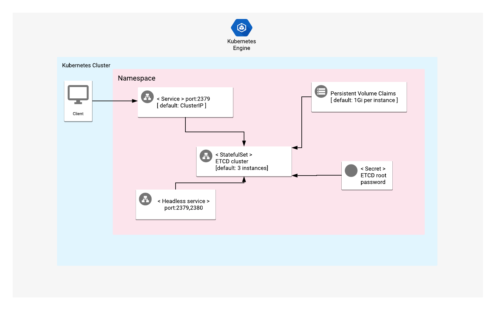

# Overview

etcd is a distributed key-value store designed for distributed systems.
It offers a gRPC API, automatic TLS encryption, and optional client certificate authentication.

etcd uses the Raft consensus algorithm for highly available data replication.
It provides a reliable way to store data across a cluster of servers, and it serves as the backbone of many distributed systems.
It works on a variety of operating systems, including Linux, BSD, and OS X.

For more information about etcd, please refer to the [etcd official repository](https://github.com/etcd-io/etcd) and [Official website](https://etcd.io/).

## About Google Click to Deploy

Popular open stacks on Kubernetes packaged by Google.

## Architecture



A Kubernetes StatefulSet manages all of the etcd Pods in this application. Each Pod runs a single instance of etcd, and each instance of etcd communicates with the others by using peer port 2380. Connections between cluster members are automatically encrypted with TLS certificates.

Each instance of etcd generates its own TLS certificate at the time that cluster service is started.

Access to the etcd service is authenticated by default.

# Installation

## Quick install with Google Cloud Marketplace

Get up and running with a few clicks! Install this etcd app to a Google Kubernetes Engine cluster in Google Cloud Marketplace by following these
[on-screen instructions](https://console.cloud.google.com/marketplace/details/google/etcd).

## Command line instructions

### Prerequisites

#### Set up command-line tools

You'll need the following tools in your development environment:

- [gcloud](https://cloud.google.com/sdk/gcloud/)
- [kubectl](https://kubernetes.io/docs/reference/kubectl/overview/)
- [docker](https://docs.docker.com/install/)
- [git](https://git-scm.com/book/en/v2/Getting-Started-Installing-Git)
- [helm](https://helm.sh/)

Configure `gcloud` as a Docker credential helper:

```shell
gcloud auth configure-docker
```

#### Create a Google Kubernetes Engine cluster

Create a new cluster from the command line:

```shell
export CLUSTER=etcd-cluster
export ZONE=us-west1-a

gcloud container clusters create "${CLUSTER}" --zone "${ZONE}"
```

Configure `kubectl` to connect to the new cluster:

```shell
gcloud container clusters get-credentials "${CLUSTER}" --zone "${ZONE}"
```

#### Clone this repo

Clone this repo, as well as the associated tools repo:

```shell
git clone --recursive https://github.com/GoogleCloudPlatform/click-to-deploy.git
```

#### Install the Application resource definition

An Application resource is a collection of individual Kubernetes components,
such as Services, Deployments, and so on, that you can manage as a group.

To set up your cluster to understand Application resources, run the following command:

```shell
kubectl apply -f "https://raw.githubusercontent.com/GoogleCloudPlatform/marketplace-k8s-app-tools/master/crd/app-crd.yaml"
```

You need to run this command once.

The Application resource is defined by the
[Kubernetes SIG-apps](https://github.com/kubernetes/community/tree/master/sig-apps) community. The source code can be found on
[github.com/kubernetes-sigs/application](https://github.com/kubernetes-sigs/application).

### Install the Application

Navigate to the `etcd` directory:

```shell
cd click-to-deploy/k8s/etcd
```

#### Configure the app with environment variables

Choose an instance name and
[namespace](https://kubernetes.io/docs/concepts/overview/working-with-objects/namespaces/)
for the app. In most cases, you can use the `default` namespace.

```shell
export APP_INSTANCE_NAME=etcd-1
export NAMESPACE=default
```

Enable Stackdriver Metrics Exporter:

> **NOTE:** Your GCP project must have Stackdriver enabled. If you are using a
> non-GCP cluster, you cannot export metrics to Stackdriver.

By default, the application does not export metrics to Stackdriver. To enable
this option, change the value to `true`.

```shell
export METRICS_EXPORTER_ENABLED=true
```

Set up the image tag:

It is advised to use stable image reference which you can find on
[Marketplace Container Registry](https://marketplace.gcr.io/google/etcd).
Example:

```shell
export TAG="3.5-<BUILD_ID>"
```

Alternatively you can use short tag which points to the latest image for selected version.
> Warning: this tag is not stable and referenced image might change over time.

```shell
export TAG="3.5"
```

Configure the container image:

```shell
export IMAGE_ETCD="marketplace.gcr.io/google/etcd"
export IMAGE_METRICS_EXPORTER="marketplace.gcr.io/google/etcd/prometheus-to-sd:${TAG}"
```

For the persistent disk provisioning of the etcd servers, you will need to:

 * Set the StorageClass name. You should select your existing StorageClass name for persistent disk provisioning for etcd servers.
 * Set the persistent disk's size. The default disk size is "1Gi".
> Note: "ssd" type storage is recommended for etcd, as it uses local disk to store and retrieve keys and values.
> To create a StorageClass for dynamic provisioning of SSD persistent volumes, check out [this documentation](https://cloud.google.com/kubernetes-engine/docs/how-to/persistent-volumes/ssd-pd) for more detailed instructions.
```shell
export ETCD_STORAGE_CLASS="standard" # provide your StorageClass name if not "standard"
export PERSISTENT_DISK_SIZE="1Gi"
```

Set the number of replicas for etcd:

```shell
export REPLICAS=3
```

Configure the etcd root user password:

```shell
export ETCD_ROOT_PASSWORD=$(cat /dev/urandom | tr -dc 'a-zA-Z0-9' | fold -w 10 | head -n 1 | tr -d '\n')
```

#### Create namespace in your Kubernetes cluster

If you use a different namespace than the `default`, run the command below to create a new namespace:

```shell
kubectl create namespace "${NAMESPACE}"
```

#### Expand the manifest template

Use `helm template` to expand the template. We recommend that you save the
expanded manifest file for future updates to the application.

```shell
helm template "${APP_INSTANCE_NAME}" chart/etcd \
  --namespace "${NAMESPACE}" \
  --set image.repo="${IMAGE_ETCD}" \
  --set image.tag="${TAG}" \
  --set persistence.storageClass="${ETCD_STORAGE_CLASS}" \
  --set persistence.size="${PERSISTENT_DISK_SIZE}" \
  --set metrics.image="${IMAGE_METRICS_EXPORTER}" \
  --set metrics.exporter.enabled="${METRICS_EXPORTER_ENABLED}" \
  --set auth.rbac.rootPassword="${ETCD_ROOT_PASSWORD}" \
  --set replicas="${REPLICAS}" \
  > "${APP_INSTANCE_NAME}_manifest.yaml"
```

#### Apply the manifest to your Kubernetes cluster

Use `kubectl` to apply the manifest to your Kubernetes cluster:

```shell
kubectl apply -f "${APP_INSTANCE_NAME}_manifest.yaml" --namespace "${NAMESPACE}"
```

#### View the app in the Google Cloud Console

To get the Console URL for your app, run the following command:

```shell
echo "https://console.cloud.google.com/kubernetes/application/${ZONE}/${CLUSTER}/${NAMESPACE}/${APP_INSTANCE_NAME}"
```

To view the app, open the URL in your browser.

### Access etcd (internally)

You can connect to etcd without exposing it to public access by using the `etcdctl` command line interface.

#### Connect to etcd via Pod

To do this, please identify etcd's Pods by using the following command:

```shell
kubectl get pods -o wide -l app.kubernetes.io/name=${APP_INSTANCE_NAME} --namespace "${NAMESPACE}"
```

You can then access etcd, and list its users:

```shell
# Get etcd root user password from secret object
ETCD_ROOT_PASSWORD=$(kubectl get secret --namespace "${NAMESPACE}" ${APP_INSTANCE_NAME}-etcd -o jsonpath="{.data.etcd-root-password}" | base64 --decode)
# List users using root credentials
kubectl exec -it "${APP_INSTANCE_NAME}-etcd-0" --namespace "${NAMESPACE}" -- etcdctl --user root:${ETCD_ROOT_PASSWORD} user list
```

#### Interact with etcd service using port-forwarding

To connect to the etcd service from your machine, install the latest release of the [etcd binaries](https://github.com/etcd-io/etcd/releases).

Forward the etcd service client port to your machine by using the following command:
```shell
kubectl port-forward svc/${APP_INSTANCE_NAME}-etcd --namespace "${NAMESPACE}" 2379
```
Then, in another terminal window, run the following commands:
```shell
# Get etcd root user password
ETCD_ROOT_PASSWORD=$(kubectl get secret --namespace "${NAMESPACE}" ${APP_INSTANCE_NAME}-etcd -o jsonpath="{.data.etcd-root-password}" | base64 --decode)

# Use API v3
export ETCDCTL_API=3

## Put sample value using credentials
etcdctl --user root:${ETCD_ROOT_PASSWORD} --endpoints=http://localhost:2379 put foo bar

## Get value
etcdctl --user root:${ETCD_ROOT_PASSWORD} --endpoints=http://localhost:2379 get foo
```

### Access etcd (externally)

By default, the application does not have an external IP. To create an external IP address, run the following command:

```shell
kubectl patch svc "${APP_INSTANCE_NAME}-etcd" \
  --namespace "${NAMESPACE}" \
  --patch '{"spec": {"type": "LoadBalancer"}}'
```
> **NOTE:** It might take some time for the external IP to be provisioned.

#### Connect to etcd service through external IP address
If you run your etcd cluster behind a LoadBalancer, you can get the external IP of the etcd service by using the following command:
```shell
EXTERNAL_IP=$(kubectl get svc ${APP_INSTANCE_NAME}-etcd \
  --namespace ${NAMESPACE} \
  --output jsonpath='{.status.loadBalancer.ingress[0].ip}')

# Get root user password from secret object
ETCD_ROOT_PASSWORD=$(kubectl get secret --namespace "${NAMESPACE}" ${APP_INSTANCE_NAME}-etcd -o jsonpath="{.data.etcd-root-password}" | base64 --decode)

# connect to external etcd cluster via etcd client and list users
ETCDCTL_API=3 etcdctl --user root:${ETCD_ROOT_PASSWORD} --endpoints=http://${EXTERNAL_IP}:2379 user list
```

# Application metrics
Each etcd server exports metrics under the `/metrics` path on its client port.

For example, you can access the metrics locally via `curl` by running the following commands:
```shell
# Forward client port to local workstation
kubectl port-forward "svc/${APP_INSTANCE_NAME}-etcd" 2379 --namespace "${NAMESPACE}"

# Fetch metrics locally through different terminal
curl -L http://localhost:2379/metrics | grep -v debugging # ignore unstable debugging metrics
```
### Configuring Prometheus to collect the metrics

Prometheus can be configured to automatically collect your application's metrics.
To set this up, follow the steps in
[Configuring Prometheus](https://prometheus.io/docs/introduction/first_steps/#configuring-prometheus).

You configure the metrics in the
[`scrape_configs` section](https://prometheus.io/docs/prometheus/latest/configuration/configuration/#scrape_config).

## Exporting metrics to Stackdriver

Application includes an option to inject a [Prometheus to Stackdriver (`prometheus-to-sd`)](https://github.com/GoogleCloudPlatform/k8s-stackdriver/tree/master/prometheus-to-sd) sidecar to each etcd Pod to export `/metrics` to Stackdriver.
If you enabled the option (`export METRICS_EXPORTER_ENABLED=true`) for exporting metrics to Stackdriver, the
metrics are automatically exported to Stackdriver, and visible in [Stackdriver Metrics Explorer](https://cloud.google.com/monitoring/charts/metrics-explorer).

Metrics are labeled as `app.kubernetes.io/name`, with `name` substituted for the name of your application, as defined in the `APP_INSTANCE_NAME` environment variable.

The exporting option might not be available for GKE on-prem clusters.

> Note: Stackdriver has [quotas](https://cloud.google.com/monitoring/quotas) for
> the number of custom metrics created in a single GCP project. If the quota is
> met, additional metrics might not show up in the Stackdriver Metrics Explorer.

You can remove existing metric descriptors by using
[Stackdriver's REST API](https://cloud.google.com/monitoring/api/ref_v3/rest/v3/projects.metricDescriptors/delete).

### Scaling
#### Scaling the cluster up or down
> **NOTE:** etcd clusters are not recommended to be scaled up or down. The recommended number of replicas for an etcd cluster is 3 or 5.
> A reasonable scaling is to upgrade a 3-member cluster to 5-member cluster.
> More information can be found in the [official Kubernetes Documentation](https://kubernetes.io/docs/tasks/administer-cluster/configure-upgrade-etcd/#scaling-up-etcd-clusters).

By default, etcd cluster is deployed with 3 replicas. To change the number of replicas, use the following command, where `REPLICAS` is desired number of replicas:

```shell
export REPLICAS=5
kubectl scale statefulsets "${APP_INSTANCE_NAME}-etcd" \
  --namespace "${NAMESPACE}" --replicas=$REPLICAS
```

In the case of scaling down, this option reduces the number of replicas without disconnecting nodes from the cluster.
Scaling down will also leave the `persistentvolumeclaims` of your StatefulSet untouched.


### Backup
#### Backup etcd cluster data to your local workstation
You must ensure that your etcd pod has enough disk space to temporarily store the database backup file.
```shell
# Get etcd root user password from secret file
ETCD_ROOT_PASSWORD=$(kubectl get secret --namespace "${NAMESPACE}" ${APP_INSTANCE_NAME}-etcd -o jsonpath="{.data.etcd-root-password}" | base64 --decode)
# Save snapshot backup file inside the pod
kubectl exec -it ${APP_INSTANCE_NAME}-etcd-0 -- etcdctl --user root:${ETCD_ROOT_PASSWORD} snapshot save etcd-snapshot.db
# Copy snapshot backup file from target pod to your local workstation
kubectl cp ${APP_INSTANCE_NAME}-etcd-0:etcd-snapshot.db .
```

### Upgrading
> **NOTE:** Before upgrading, we recommend that you back up your etcd cluster database.
> For required compatibilities between etcd versions and additional information about upgrades, see the [official etcd documentation](https://github.com/etcd-io/etcd/blob/master/Documentation/upgrades/upgrading-etcd.md).

The etcd StatefulSet is configured to roll out updates automatically.
To start an update, patch the StatefulSet with a new image reference:
```shell
kubectl set image statefulset ${APP_INSTANCE_NAME}-etcd --namespace ${NAMESPACE} \
  "etcd=[NEW_IMAGE_REFERENCE]"
```
Where [NEW_IMAGE_REFERENCE] is the Docker image reference of the new image that you want to use.

To check the status of Pods in the StatefulSet, and the progress of
the new image, run the following command:

```shell
kubectl get pods --selector app.kubernetes.io/name=${APP_INSTANCE_NAME} \
  --namespace ${NAMESPACE}
```

# Uninstall the Application

## Using the Google Cloud Platform Console

1. In the GCP Console, open [Kubernetes Applications](https://console.cloud.google.com/kubernetes/application).

1. Click on **etcd** in the list of applications.

1. On the Application Details page, click **Delete**.

## Using the command line

### Prepare the environment

Set your installation name and Kubernetes namespace:

```shell
export APP_INSTANCE_NAME=etcd-1
export NAMESPACE=default
```

### Delete the resources

> **NOTE:** We recommend that you use a kubectl version that is the same as the version of your cluster. Using the same versions of kubectl and the cluster helps avoid unforeseen issues.

To delete the resources, use the expanded manifest file used for the
installation.

Run `kubectl` on the expanded manifest file:

```shell
kubectl delete -f ${APP_INSTANCE_NAME}_manifest.yaml --namespace ${NAMESPACE}
```

Otherwise, delete the resources using types and a label:

```shell
kubectl delete application \
  --namespace ${NAMESPACE} \
  --selector app.kubernetes.io/name=${APP_INSTANCE_NAME}
```

### Delete the persistent volumes of your installation

By design, the removal of StatefulSets in Kubernetes does not remove any
PersistentVolumeClaims that were attached to their Pods. This prevents your
installations from accidentally deleting stateful data.

To remove the PersistentVolumeClaims with their attached persistent disks, run
the following `kubectl` commands:

```shell
# specify the variables values matching your installation:
export APP_INSTANCE_NAME=etcd-1
export NAMESPACE=default

kubectl delete persistentvolumeclaims \
  --namespace ${NAMESPACE} \
  --selector app.kubernetes.io/name=${APP_INSTANCE_NAME}
```

### Delete the GKE cluster

Optionally, if you don't need the deployed application or the GKE cluster,
you can use this command to delete the cluster:

```shell
gcloud container clusters delete "${CLUSTER}" --zone "${ZONE}"
```
