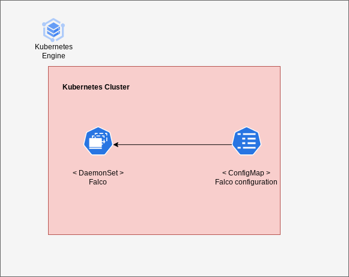

# Overview

Falco is the first runtime security project to join CNCF as an incubation-level project. Falco acts as a security camera detecting abnormal behavior, intrusions, and data theft in real time.

Falco uses system calls to secure and monitor a system, by:
- Parsing the Linux system calls from the kernel at runtime
- Asserting the stream against a powerful rules engine
- Alerting when a rule is violated

For more information on Falco, see the [Falco Project official documentation](https://falco.org/docs/).


## About Google Click to Deploy

Popular open stacks on Kubernetes packaged by Google.

## Architecture

The application offers the Falco application deployed as DaemonSet to work on every node on Kubernetes cluster.



The eBPF support for Falco is enabled by default instead of `falco-probe` kernel module (see: [Third Party Integrations](https://falco.org/docs/getting-started/third-party/production/#gke)).

Falco configuration files located in the `/etc/falco` are automatically generated in the application
through a Kubernetes ConfigMap.

# Installation

## Quick install with Google Cloud Marketplace

Get up and running with a few clicks! Install this Falco app to a Google
Kubernetes Engine cluster using Google Cloud Marketplace. Follow the
[on-screen instructions](https://console.cloud.google.com/marketplace/details/google/falco).

## Command line instructions

You can use [Google Cloud Shell](https://cloud.google.com/shell/) or a local
workstation to complete these steps.

[](https://console.cloud.google.com/cloudshell/editor?cloudshell_git_repo=https://github.com/GoogleCloudPlatform/click-to-deploy&cloudshell_open_in_editor=README.md&cloudshell_working_dir=k8s/falco)

### Prerequisites

#### Set up command-line tools

You'll need the following tools in your development environment. If you are
using Cloud Shell, `gcloud`, `kubectl`, Docker, and Git are installed in your
environment by default.

-   [gcloud](https://cloud.google.com/sdk/gcloud/)
-   [kubectl](https://kubernetes.io/docs/reference/kubectl/overview/)
-   [docker](https://docs.docker.com/install/)
-   [git](https://git-scm.com/book/en/v2/Getting-Started-Installing-Git)
-   [helm](https://helm.sh/)

Configure `gcloud` as a Docker credential helper:

```shell
gcloud auth configure-docker
```

#### Create a Google Kubernetes Engine cluster

Create a new cluster from the command line:

```shell
export CLUSTER=falco-cluster
export ZONE=us-west1-a

gcloud container clusters create "$CLUSTER" --zone "$ZONE"
```

Configure `kubectl` to connect to the new cluster:

```shell
gcloud container clusters get-credentials "$CLUSTER" --zone "$ZONE"
```

#### Clone this repo

Clone this repo and the associated tools repo.

```shell
git clone --recursive https://github.com/GoogleCloudPlatform/click-to-deploy.git
```

#### Install the Application resource definition

An Application resource is a collection of individual Kubernetes components,
such as Services, Deployments, and so on, that you can manage as a group.

To set up your cluster to understand Application resources, run the following
command:

```shell
kubectl apply -f "https://raw.githubusercontent.com/GoogleCloudPlatform/marketplace-k8s-app-tools/master/crd/app-crd.yaml"
```

You need to run this command once.

The Application resource is defined by the
[Kubernetes SIG-apps](https://github.com/kubernetes/community/tree/master/sig-apps)
community. The source code can be found on
[github.com/kubernetes-sigs/application](https://github.com/kubernetes-sigs/application).

### Install the Application

Navigate to the `falco` directory:

```shell
cd click-to-deploy/k8s/falco
```

#### Configure the app with environment variables

Choose an instance name and
[namespace](https://kubernetes.io/docs/concepts/overview/working-with-objects/namespaces/)
for the app. In most cases, you can use the `default` namespace.

```shell
export APP_INSTANCE_NAME=falco-1
export NAMESPACE=default
```

Enable Stackdriver Metrics Exporter:

> **NOTE:** Your GCP project must have Stackdriver enabled. If you are using a
> non-GCP cluster, you cannot export metrics to Stackdriver.

By default, the application does not export metrics to Stackdriver. To enable
this option, change the value to `true`.

```shell
export METRICS_EXPORTER_ENABLED=false
```

Set up the image tag:

It is advised to use stable image reference which you can find on
[Marketplace Container Registry](https://marketplace.gcr.io/google/falco).
Example:

```shell
export TAG="0.34.1-<BUILD_ID>"
```

Alternatively you can use short tag which points to the latest image for selected version.
> Warning: this tag is not stable and referenced image might change over time.

```shell
export TAG="0.34"
```

Configure the container images:

```shell
export SOURCE_REGISTRY="marketplace.gcr.io/google"
export IMAGE_FALCO="${SOURCE_REGISTRY}/falco"
export IMAGE_FALCO_EXPORTER="${SOURCE_REGISTRY}/falco/falco-exporter:${TAG}"
export IMAGE_METRICS_EXPORTER="${SOURCE_REGISTRY}/falco/prometheus-to-sd:${TAG}"
```

Configure minimum rule priority level to load and run:

Every Falco rule has a priority which indicates how serious a violation of the rule is. The priority is included in the message/JSON output/etc. Here are the available priorities. Can be one of `emergency`, `alert`, `critical`, `error`, `warning`, `notice`, `informational`, `debug`. For more information see: [Falco Rule Priorities](https://falco.org/docs/rules/#rule-priorities).

```shell
export FALCO_PRIORITY="debug"
```

#### Create namespace in your Kubernetes cluster

If you use a different namespace than `default`, run the command below to create
a new namespace:

```shell
kubectl create namespace "$NAMESPACE"
```

#### Expand the manifest template

Use `helm template` to expand the template. We recommend that you save the
expanded manifest file for future updates to the application.

```shell
helm template "${APP_INSTANCE_NAME}" chart/falco \
  --namespace "${NAMESPACE}" \
  --set falco.image.repo="${IMAGE_FALCO}" \
  --set falco.image.tag="${TAG}" \
  --set falco.exporter.image="${IMAGE_FALCO_EXPORTER}" \
  --set falco.priority="${FALCO_PRIORITY}" \
  --set metrics.image="${IMAGE_METRICS_EXPORTER}" \
  --set metrics.exporter.enabled="${METRICS_EXPORTER_ENABLED}" > "${APP_INSTANCE_NAME}"_manifest.yaml
```

#### Apply the manifest to your Kubernetes cluster

Use `kubectl` to apply the manifest to your Kubernetes cluster:

```shell
kubectl apply -f "${APP_INSTANCE_NAME}_manifest.yaml" --namespace "${NAMESPACE}"
```

#### View the app in the Google Cloud Console

To get the Console URL for your app, run the following command:

```shell
echo "https://console.cloud.google.com/kubernetes/application/${ZONE}/${CLUSTER}/${NAMESPACE}/${APP_INSTANCE_NAME}"
```

To view your app, open the URL in your browser.

# Access Falco

The Falco application is deployed as a DaemonSet to work on every node on Kubernetes cluster.
To monitor security events detected by Falco run:

```shell
kubectl logs -l app.kubernetes.io/component=falco
```

# Application metrics

## Prometheus metrics

The application is configured to natively expose its metrics in the
[Prometheus format](https://github.com/prometheus/docs/blob/master/content/docs/instrumenting/exposition_formats.md).

You can access the metrics at `[EXPORTER_SVC_URL]:9376/metrics`, where
`[EXPORTER_SVC_URL]` is the IP address of the `falco-exporter` Service. For example, you can access the metrics at the
[http://localhost:8080/metrics](http://localhost:8080/metrics) endpoint using port forwarding as below:

```shell
kubectl port-forward svc/${APP_INSTANCE_NAME}-exporter-svc 8080:9376
```

## Configuring Prometheus to collect the metrics

To configure Prometheus to automatically collect metrics, follow the steps in
[Configuring Prometheus](https://prometheus.io/docs/introduction/first_steps/#configuring-prometheus).
You configure the metrics in the
[`scrape_configs` section](https://prometheus.io/docs/prometheus/latest/configuration/configuration/#scrape_config).

## Exporting metrics to Stackdriver

The deployment includes a
[Prometheus to Stackdriver (`prometheus-to-sd`)](https://github.com/GoogleCloudPlatform/k8s-stackdriver/tree/master/prometheus-to-sd)
container. If you enabled the option to export metrics to Stackdriver, the
metrics are automatically exported to Stackdriver and visible in
[Stackdriver Metrics Explorer](https://cloud.google.com/monitoring/charts/metrics-explorer).

The name of each metric starts with the application's name, which you define in
the `APP_INSTANCE_NAME` environment variable.

The exporting option might not be available for GKE on-prem clusters.

> Note: Stackdriver has [quotas](https://cloud.google.com/monitoring/quotas) for
> the number of custom metrics created in a single GCP project. If the quota is
> met, additional metrics might not show up in the Stackdriver Metrics Explorer.

You can remove existing metric descriptors using
[Stackdriver's REST API](https://cloud.google.com/monitoring/api/ref_v3/rest/v3/projects.metricDescriptors/delete).

# Scaling

This installation of Falco is not intended to be scaled up.

# Upgrading the app

The Falco DaemonSet is configured to roll out updates automatically. Start
the update by patching the DaemonSet with a new image reference:

```shell
kubectl set image daemonset ${APP_INSTANCE_NAME} --namespace ${NAMESPACE} \
  "falco=[NEW_IMAGE_REFERENCE]"
```

Where `[NEW_IMAGE_REFERENCE]` is the Docker image reference of the new image
that you want to use.

To check the status of Pods in the DaemonSet, and the progress of the new
image, run the following command:

```shell
kubectl get pods --selector app.kubernetes.io/name=$APP_INSTANCE_NAME \
  --namespace ${NAMESPACE}
```

# Uninstalling the Application

## Using the Google Cloud Platform Console

1.  In the GCP Console, open
    [Kubernetes Applications](https://console.cloud.google.com/kubernetes/application).
1.  From the list of applications, click **Falco**.
1.  On the Application Details page, click **Delete**.

## Using the command line

### Delete the resources

> **NOTE:** We recommend that you use a `kubectl` version that is the same as
> the version of your cluster. Using the same versions of `kubectl` and the
> cluster helps avoid unforeseen issues.

To delete the resources, use the expanded manifest file used for the
installation.

Run `kubectl` on the expanded manifest file:

```shell
kubectl delete -f ${APP_INSTANCE_NAME}_manifest.yaml --namespace ${NAMESPACE}
```

If you don't have the expanded manifest, delete the resources using types and a
label:

```shell
kubectl delete daemonset,service,configmap,application \
  --namespace ${NAMESPACE} \
  --selector app.kubernetes.io/name=${APP_INSTANCE_NAME}
```

### Delete the GKE cluster

Optionally, if you don't need the deployed application or the GKE cluster,
delete the cluster using this command:

```shell
gcloud container clusters delete "${CLUSTER}" --zone "${ZONE}"
```
