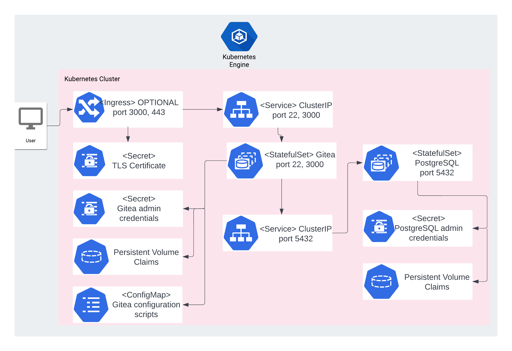

# Overview

Gitea is community managed, self-hosted, painless, lightweight Git service.

For more information, visit the Gitea
[official website](https://gitea.io/en-us/).

## About Google Click to Deploy

Popular open stacks on Kubernetes, packaged by Google.

## Architecture



A Kubernetes StatefulSet manages a single-instance Gitea solution.

By default, a ClusterIP Service exposes Gitea externally, using the
following three ports:

* `22`, for SSH connections
* `3000`, for HTTP interface

Seperate StatefulSet is used to manage PostgreSQL instance. Gitea connects to `gitea` database on port `5432` using
credentials stored in `[APP_INSTANCE_NAME]-postgresql-secret`

To customize your Gitea instance, provide configurations by using Secret.
For more information on available configuration options, refer to the
[Gitea Docs](https://docs.gitea.io/en-us/).

# Installation

## Quick install with Google Cloud Marketplace

Get up and running with a few clicks! To install this Gitea app to a Google
Kubernetes Engine cluster via Google Cloud Marketplace, follow these
[on-screen instructions](https://console.cloud.google.com/marketplace/details/google/gitea).

## Command-line instructions

### Prerequisites

#### Setting up command-line tools

You need the following tools in your development environment:

- [gcloud](https://cloud.google.com/sdk/gcloud/)
- [kubectl](https://kubernetes.io/docs/reference/kubectl/overview/)
- [Docker](https://docs.docker.com/install/)
- [Git](https://git-scm.com/book/en/v2/Getting-Started-Installing-Git)
- [Helm](https://helm.sh/)

Configure `gcloud` as a Docker credential helper:

```shell
gcloud auth configure-docker
```

#### Creating a Google Kubernetes Engine (GKE) cluster

Create a new cluster from the command line:

```shell
export CLUSTER=gitea-cluster
export ZONE=us-west1-a

gcloud container clusters create "${CLUSTER}" --zone "${ZONE}"
```

Configure `kubectl` to connect to the new cluster:

```shell
gcloud container clusters get-credentials "${CLUSTER}" --zone "${ZONE}"
```

#### Cloning this repo

Clone this repo, as well as its associated tools repo:

```shell
git clone --recursive https://github.com/GoogleCloudPlatform/click-to-deploy.git
```

#### Installing the Application resource definition

An Application resource is a collection of individual Kubernetes
components, such as Services, StatefulSets, and so on, that you can
manage as a group.

To set up your cluster to understand Application resources, run the
following command:

```shell
kubectl apply -f "https://raw.githubusercontent.com/GoogleCloudPlatform/marketplace-k8s-app-tools/master/crd/app-crd.yaml"
```

You need to run this command once.

The Application resource is defined by the
[Kubernetes SIG-apps](https://github.com/kubernetes/community/tree/master/sig-apps)
community. You can find the source code at
[github.com/kubernetes-sigs/application](https://github.com/kubernetes-sigs/application).

### Installing the app

Navigate to the `gitea` directory:

```shell
cd click-to-deploy/k8s/gitea
```

#### Configuring the app with environment variables

Choose an instance name and
[namespace](https://kubernetes.io/docs/concepts/overview/working-with-objects/namespaces/)
for the app. In most cases, you can use the `default` namespace.

```shell
export APP_INSTANCE_NAME=gitea-1
export NAMESPACE=default
```
(Optional) Expose the Service externally and configure Ingress:

By default, the Service is not exposed externally. To enable this option, change the value to true.

```shell
export PUBLIC_SERVICE_AND_INGRESS_ENABLED=false
```

Enable Cloud Monitoring:

> **NOTE:** Your Google Cloud Marketplace project must have
> Cloud Monitoring enabled. If you are using a non-Google Cloud
> cluster, you cannot export metrics to Cloud Monitoring.

By default, the app does not export metrics to Cloud Monitoring. To enable
this option, change the value to `true`.

```shell
export METRICS_EXPORTER_ENABLED=false
```

Set up the image tag:

It is advised to use a stable image reference, such as the one
in the
[Marketplace Container Registry](https://marketplace.gcr.io/google/gitea).

Example:

```shell
export TAG="<BUILD_ID>"
```

Alternatively, you can use a short tag to point to the latest
image for your selected version.

> Warning: This tag is not stable, and the image that it references
> might change over time.

```shell
export TAG="1.19"
```

Configure the container images:

```shell
export IMAGE_REGISTRY="marketplace.gcr.io/google"

export IMAGE_GITEA="${IMAGE_REGISTRY}/gitea"
export IMAGE_POSTGRESQL="${IMAGE_REGISTRY}/gitea/postgresql:${TAG}"
export IMAGE_POSTGRESQL_EXPORTER="${IMAGE_REGISTRY}/gitea/postgresql-exporter0:${TAG}"
export IMAGE_METRICS_EXPORTER="${IMAGE_REGISTRY}/gitea/prometheus-to-sd:${TAG}"
```

Set or generate the password for the Gitea services:

```shell
# Set alias for password generation
alias generate_pwd="cat /dev/urandom | tr -dc 'a-zA-Z0-9' | fold -w 20 | head -n 1 | tr -d '\n'"

# Generate password for Gitea, Redis, and PostgreSQL
export GITEA_ADMIN_PASSWORD="$(generate_pwd)"
export POSTGRES_PASSWORD="$(generate_pwd)"
```

For persistent disk provisioning of the Gitea StatefulSets, you will need to
specify the StorageClass name, or create a new StorageClass.

To check your available options, use the following command:

```shell
kubectl get storageclass
```

For steps to create a new StorageClass, refer to the
[Kubernetes documentation](https://kubernetes.io/docs/concepts/storage/storage-classes/#the-storageclass-resource)

```shell
export DEFAULT_STORAGE_CLASS="standard" 
#### (Optional) Creating a Transport Layer Security (TLS) certificate for Gitea

1.  If you already have a certificate that you want to use, copy your
    certificate and key pair to the `/tmp/tls.crt` and `/tmp/tls.key` files,
    respectively, then skip to the next step.

    To create a new certificate, run the following command:

    ```shell
    openssl req -x509 -nodes -days 365 -newkey rsa:2048 \
        -keyout /tmp/tls.key \
        -out /tmp/tls.crt \
        -subj "/CN=gitea/O=gitea"
    ```

2.  Set the `TLS_CERTIFICATE_KEY` and `TLS_CERTIFICATE_CRT` variables:

    ```shell
    export TLS_CERTIFICATE_KEY="$(cat /tmp/tls.key | base64)"
    export TLS_CERTIFICATE_CRT="$(cat /tmp/tls.crt | base64)"
    ```


#### Creating namespace in your Kubernetes cluster

If you use a different namespace than the `default`, create a new namespace by
running the following command:

```shell
kubectl create namespace "${NAMESPACE}"
```

#### Expanding the manifest template

Use `helm template` to expand the template. We recommend that you save the
expanded manifest file for future updates to your app.

```shell
helm template chart/gitea \
  --name "${APP_INSTANCE_NAME}" \
  --namespace "${NAMESPACE}" \
  --set gitea.image.repo="${IMAGE_GITEA}" \
  --set gitea.image.tag="${TAG}" \
  --set gitea.admin.password="${GITEA_ADMIN_PASSWORD}" \
  --set postgresql.image="${IMAGE_POSTGRESQL}" \
  --set postgresql.exporter.image="${IMAGE_POSTGRESQL_EXPORTER}" \
  --set postgresql.password="${POSTGRES_PASSWORD}" \
  --set persistence.storageClass="${DEFAULT_STORAGE_CLASS}" \
  --set metrics.image="${IMAGE_METRICS_EXPORTER}" \
  --set tls.base64EncodedPrivateKey="${TLS_CERTIFICATE_KEY}" \
  --set tls.base64EncodedCertificate="${TLS_CERTIFICATE_CRT}" \
  > "${APP_INSTANCE_NAME}_manifest.yaml"
```

#### Applying the manifest to your Kubernetes cluster

To apply the manifest to your Kubernetes cluster, use `kubectl`:

```shell
kubectl apply -f "${APP_INSTANCE_NAME}_manifest.yaml" --namespace "${NAMESPACE}"
```

#### Viewing your app in the Google Cloud Console

To get the Cloud Console URL for your app, run the following command:

```shell
echo "https://console.cloud.google.com/kubernetes/application/${ZONE}/${CLUSTER}/${NAMESPACE}/${APP_INSTANCE_NAME}"
```

To view the app, open the URL in your browser.

### Accessing the Gitea User Interface

To get the external IP address of your Gitea website, use the following
command:

```shell
SERVICE_IP="$(kubectl get "service/${APP_INSTANCE_NAME}-gitea-svc" \
          --namespace "${NAMESPACE}" \
          --output jsonpath='{.status.loadBalancer.ingress[0].ip}')"
echo "http://${SERVICE_IP}/"
```

Use the Gitea admin password you generated earlier to sign in or create another account.

# Backing up

To perform a backup follow the steps based on the official
[Gitea backup/restore documentation](https://docs.gitea.io/en-us/backup-and-restore/) .


# Restoring a backup

For the Gitea restore prerequisites, refer to the
[Gitea documentation](https://docs.gitea.io/en-us/backup-and-restore/#restore-command-restore).

# Scaling

This is a single-instance version of Gitea. It is not intended to be scaled
up with its current configuration.

# Upgrading the app

## Preparing your environment

The steps below describe the upgrade procedure with the new version of the
Gitea Docker image.

> Note: During the upgrade, your Gitea instance will be unavailable.

Set your environment variables to match the installation properties:

```shell
export APP_INSTANCE_NAME=gitea-1
export NAMESPACE=default
```

## Upgrading your app

The Gitea StatefulSet is configured to roll out updates automatically. To
start an update, patch the StatefulSet with a new image reference:

```shell
kubectl set image statefulset "${APP_INSTANCE_NAME}-gitea" \
  --namespace "${NAMESPACE}" gitea=[NEW_IMAGE_REFERENCE]
```

where `[NEW_IMAGE_REFERENCE]` is the Docker image reference of the new image
that you want to use.

To check the status of Pods in the StatefulSet, and the progress of the new
image, run the following command:

```shell
kubectl get pods -l app.kubernetes.io/name=${APP_INSTANCE_NAME} \
  --namespace "${NAMESPACE}"
```

To verify the current image being used for an `gitea` container, run the
following command:

```shell
kubectl get statefulset "${APP_INSTANCE_NAME}-gitea" \
  --namespace "${NAMESPACE}" \
  --output jsonpath='{.spec.template.spec.containers[0].image}'
```

# Uninstalling the app

## Using the Google Cloud Console

1.  In the Cloud Console, open
    [Kubernetes Applications](https://console.cloud.google.com/kubernetes/application).

2.  From the list of apps, choose your app installation.

3.  On the **Application Details** page, click **Delete**.

## Using the command-line

### Preparing your environment

Set your installation name and Kubernetes namespace:

```shell
export APP_INSTANCE_NAME=gitea-1
export NAMESPACE=default
```

### Deleting your resources

> **NOTE:** We recommend using a `kubectl` version that is the same as the
> version of your cluster. Using the same version for `kubectl` and the cluster
> helps to avoid unforeseen issues.

#### Deleting the deployment with the generated manifest file

Run `kubectl` on the expanded manifest file:

```shell
kubectl delete -f ${APP_INSTANCE_NAME}_manifest.yaml --namespace ${NAMESPACE}
```

#### Deleting the deployment by deleting the Application resource

If you don't have the expanded manifest file, delete the resources by using
types and a label:

```shell
kubectl delete application,statefulset,secret,service,ingress \
  --namespace ${NAMESPACE} \
  --selector app.kubernetes.io/name=${APP_INSTANCE_NAME}
```

### Deleting the persistent volumes of your installation

By design, removing StatefulSets in Kubernetes does not remove any
PersistentVolumeClaims that were attached to their Pods. This prevents your
installations from accidentally deleting stateful data.

To remove the PersistentVolumeClaims with their attached persistent disks, run
the following `kubectl` command:

```shell
kubectl delete persistentvolumeclaims \
  --namespace ${NAMESPACE} \
  --selector app.kubernetes.io/name=${APP_INSTANCE_NAME}
```
