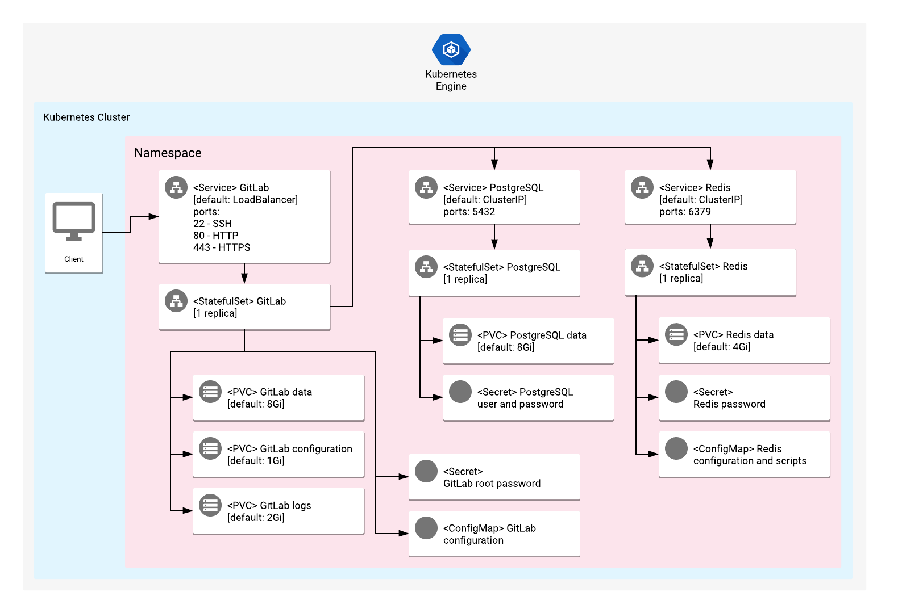

# Overview

GitLab is a DevOps tool for the entire software development and operations
life cycle. It offers tools for planning and managing backlogs, source code
management, built-in continuous integration and continuous delivery (CI/CD)
pipelines, package and artifact management, and issue-tracking and monitoring
tools.

For more information, visit the GitLab
[official website](https://gitlab.com/).

## About Google Click to Deploy

Popular open stacks on Kubernetes, packaged by Google.

## Architecture



A Kubernetes StatefulSet manages a single-instance GitLab Enterprise Edition
solution.

By default, a LoadBalancer Service exposes GitLab externally, using the
following three ports:

* `22`, for SSH connections
* `80`, for HTTP interface
* `443`, for HTTPS interface

You use a StatefulSet object to manage the GitLab workload, with a container
based on [omnibus-gitlab](https://gitlab.com/gitlab-org/omnibus-gitlab/).
This means that you should have one replica as part of your StatefulSet.

Additional workloads are available for separate PostgreSQL and Redis
single-instance solutions. Both deployments are not exposed externally. To
connect to them internally, use the following ports:

* `6379`, for the Redis instance
* `5432`, for the PostgreSQL instance

To customize your GitLab instance, provide configurations by using Configmap.
For more information on available configuration options, refer to the
[GitLab Docs](https://docs.gitlab.com/omnibus/settings/configuration.html).

# Installation

## Quick install with Google Cloud Marketplace

Get up and running with a few clicks! To install this GitLab app to a Google
Kubernetes Engine cluster via Google Cloud Marketplace, follow these
[on-screen instructions](https://console.cloud.google.com/marketplace/details/google/gitlab).

## Command-line instructions

### Prerequisites

#### Setting up command-line tools

You need the following tools in your development environment:

- [gcloud](https://cloud.google.com/sdk/gcloud/)
- [kubectl](https://kubernetes.io/docs/reference/kubectl/overview/)
- [Docker](https://docs.docker.com/install/)
- [Git](https://git-scm.com/book/en/v2/Getting-Started-Installing-Git)
- [OpenSSL](https://www.openssl.org/)
- [Helm](https://helm.sh/)

Configure `gcloud` as a Docker credential helper:

```shell
gcloud auth configure-docker
```

#### Creating a Google Kubernetes Engine (GKE) cluster

Create a new cluster from the command line:

```shell
export CLUSTER=gitlab-cluster
export ZONE=us-west1-a

gcloud container clusters create "${CLUSTER}" --zone "${ZONE}"
```

Configure `kubectl` to connect to the new cluster:

```shell
gcloud container clusters get-credentials "${CLUSTER}" --zone "${ZONE}"
```

#### Cloning this repo

Clone this repo, as well as its associated tools repo:

```shell
git clone --recursive https://github.com/GoogleCloudPlatform/click-to-deploy.git
```

#### Installing the Application resource definition

An Application resource is a collection of individual Kubernetes
components, such as Services, StatefulSets, and so on, that you can
manage as a group.

To set up your cluster to understand Application resources, run the
following command:

```shell
kubectl apply -f "https://raw.githubusercontent.com/GoogleCloudPlatform/marketplace-k8s-app-tools/master/crd/app-crd.yaml"
```

You need to run this command once.

The Application resource is defined by the
[Kubernetes SIG-apps](https://github.com/kubernetes/community/tree/master/sig-apps)
community. You can find the source code at
[github.com/kubernetes-sigs/application](https://github.com/kubernetes-sigs/application).

### Installing the app

Navigate to the `gitlab` directory:

```shell
cd click-to-deploy/k8s/gitlab
```

#### Configuring the app with environment variables

Choose an instance name and
[namespace](https://kubernetes.io/docs/concepts/overview/working-with-objects/namespaces/)
for the app. In most cases, you can use the `default` namespace.

```shell
export APP_INSTANCE_NAME=gitlab-1
export NAMESPACE=default
```

Enable Cloud Monitoring:

> **NOTE:** Your Google Cloud Marketplace project must have
> Cloud Monitoring enabled. If you are using a non-Google Cloud
> cluster, you cannot export metrics to Cloud Monitoring.

By default, the app does not export metrics to Cloud Monitoring. To enable
this option, change the value to `true`.

```shell
export METRICS_EXPORTER_ENABLED=false
```

Set up the image tag:

It is advised to use a stable image reference, such as the one
in the
[Marketplace Container Registry](https://marketplace.gcr.io/google/gitlab).

Example:

```shell
export TAG="14.8.2-<BUILD_ID>"
```

Alternatively, you can use a short tag to point to the latest
image for your selected version.

> Warning: This tag is not stable, and the image that it references
> might change over time.

```shell
export TAG="14.8"
```

Configure the container images:

```shell
export IMAGE_REGISTRY="marketplace.gcr.io/google"

export IMAGE_GITLAB="${IMAGE_REGISTRY}/gitlab"
export IMAGE_REDIS="${IMAGE_REGISTRY}/gitlab/redis:${TAG}"
export IMAGE_REDIS_EXPORTER="${IMAGE_REGISTRY}/gitlab/redis-exporter:${TAG}"
export IMAGE_POSTGRESQL="${IMAGE_REGISTRY}/gitlab/postgresql:${TAG}"
export IMAGE_POSTGRESQL_EXPORTER="${IMAGE_REGISTRY}/gitlab/postgresql-exporter:${TAG}"
export IMAGE_DEPLOYER="${IMAGE_REGISTRY}/gitlab/deployer:${TAG}"
export IMAGE_METRICS_EXPORTER="${IMAGE_REGISTRY}/gitlab/prometheus-to-sd:${TAG}"
```

Set or generate the password for the GitLab services:

```shell
# Set alias for password generation
alias generate_pwd="cat /dev/urandom | tr -dc 'a-zA-Z0-9' | fold -w 20 | head -n 1 | tr -d '\n'"

# Generate password for GitLab, Redis, and PostgreSQL
export GITLAB_ROOT_PASSWORD="$(generate_pwd)"
export REDIS_ROOT_PASSWORD="$(generate_pwd)"
export POSTGRES_PASSWORD="$(generate_pwd)"
```

For persistent disk provisioning of the GitLab StatefulSets, you will need to
specify the StorageClass name, or create a new StorageClass.

To check your available options, use the following command:

```shell
kubectl get storageclass
```

For steps to create a new StorageClass, refer to the
[Kubernetes documentation](https://kubernetes.io/docs/concepts/storage/storage-classes/#the-storageclass-resource)

```shell
export DEFAULT_STORAGE_CLASS="standard" # provide your StorageClass name if not "standard"
```

#### (Optional) Setting your GitLab domain name

Optionally, you can set a `DOMAIN_NAME` variable to configure the URL of your
GitLab instance.

```shell
export DOMAIN_NAME="gitlab.example.com"
```

If you want to configure your GitLab instance with an automatically-provided
external IP address, leave this variable empty.

```shell
unset DOMAIN_NAME
```

#### Configuring GitLab Secure Sockets Layer (SSL)

This Helm chart offers several possible Secure Sockets Layer (SSL)
configurations, which have different results in combination with the
`DOMAIN_NAME` variable.

Example configurations:

* Dynamic external IP with SSL disabled:

  ```shell
  unset DOMAIN_NAME
  export SSL_CONFIGURATION="Default"
  ```

* Dynamic external IP with a self-signed certificate:
  
  ```shell
  unset DOMAIN_NAME
  export SSL_CONFIGURATION="Self-signed"
  ```

* Domain name with a Let's Encrypt certificate:

  > Important: A valid domain name should be provided in this option. The
  > DNS provided must be resolvable, or Let's Encrypt will not be able to
  > create a valid certificate, and your deployment will fail.

  ```shell
  export DOMAIN_NAME="gitlab.example.com"
  export SSL_CONFIGURATION="Default"
  ```

#### (Optional) Creating a Transport Layer Security (TLS) certificate for GitLab

> This step is optional and should be used only if `SSL_CONFIGURATION` is set
> as `Self-signed`.

1.  If you already have a certificate that you want to use, copy your
    certificate and key pair to the `/tmp/tls.crt` and `/tmp/tls.key` files,
    respectively, then skip to the next step.

    To create a new certificate, run the following command:

    ```shell
    openssl req -x509 -nodes -days 365 -newkey rsa:2048 \
        -keyout /tmp/tls.key \
        -out /tmp/tls.crt \
        -subj "/CN=gitlab/O=gitlab"
    ```

2.  Set the `TLS_CERTIFICATE_KEY` and `TLS_CERTIFICATE_CRT` variables:

    ```shell
    export TLS_CERTIFICATE_KEY="$(cat /tmp/tls.key | base64)"
    export TLS_CERTIFICATE_CRT="$(cat /tmp/tls.crt | base64)"
    ```


#### Creating namespace in your Kubernetes cluster

If you use a different namespace than the `default`, create a new namespace by
running the following command:

```shell
kubectl create namespace "${NAMESPACE}"
```

#### Creating the GitLab Service Account

To create the GitLab Service Account and ClusterRoleBinding:

```shell
export GITLAB_SERVICE_ACCOUNT="${APP_INSTANCE_NAME}-serviceaccount"
kubectl create serviceaccount "${GITLAB_SERVICE_ACCOUNT}" --namespace "${NAMESPACE}"
kubectl create clusterrole "${GITLAB_SERVICE_ACCOUNT}-role" --verb=get,list,watch --resource=services,nodes,pods,namespaces
kubectl create clusterrolebinding "${GITLAB_SERVICE_ACCOUNT}-rule" --clusterrole="${GITLAB_SERVICE_ACCOUNT}-role" --serviceaccount="${NAMESPACE}:${GITLAB_SERVICE_ACCOUNT}"
```

#### Expanding the manifest template

Use `helm template` to expand the template. We recommend that you save the
expanded manifest file for future updates to your app.

```shell
helm template chart/gitlab \
  --name "${APP_INSTANCE_NAME}" \
  --namespace "${NAMESPACE}" \
  --set gitlab.image.repo="${IMAGE_GITLAB}" \
  --set gitlab.image.tag="${TAG}" \
  --set gitlab.rootPassword="${GITLAB_ROOT_PASSWORD}" \
  --set gitlab.serviceAccountName="${GITLAB_SERVICE_ACCOUNT}" \
  --set gitlab.domainName="${DOMAIN_NAME}" \
  --set gitlab.sslConfiguration="${SSL_CONFIGURATION}" \
  --set redis.image="${IMAGE_REDIS}" \
  --set redis.exporter.image="${IMAGE_REDIS_EXPORTER}" \
  --set redis.password="${REDIS_ROOT_PASSWORD}" \
  --set postgresql.image="${IMAGE_POSTGRESQL}" \
  --set postgresql.exporter.image="${IMAGE_POSTGRESQL_EXPORTER}" \
  --set postgresql.password="${POSTGRES_PASSWORD}" \
  --set persistence.storageClass="${DEFAULT_STORAGE_CLASS}" \
  --set deployer.image="${IMAGE_DEPLOYER}" \
  --set metrics.image="${IMAGE_METRICS_EXPORTER}" \
  --set tls.base64EncodedPrivateKey="${TLS_CERTIFICATE_KEY}" \
  --set tls.base64EncodedCertificate="${TLS_CERTIFICATE_CRT}" \
  > "${APP_INSTANCE_NAME}_manifest.yaml"
```

#### Applying the manifest to your Kubernetes cluster

To apply the manifest to your Kubernetes cluster, use `kubectl`:

```shell
kubectl apply -f "${APP_INSTANCE_NAME}_manifest.yaml" --namespace "${NAMESPACE}"
```

#### Viewing your app in the Google Cloud Console

To get the Cloud Console URL for your app, run the following command:

```shell
echo "https://console.cloud.google.com/kubernetes/application/${ZONE}/${CLUSTER}/${NAMESPACE}/${APP_INSTANCE_NAME}"
```

To view the app, open the URL in your browser.

### Accessing the GitLab User Interface

To get the external IP address of your GitLab website, use the following
command:

```shell
SERVICE_IP="$(kubectl get "service/${APP_INSTANCE_NAME}-gitlab-svc" \
          --namespace "${NAMESPACE}" \
          --output jsonpath='{.status.loadBalancer.ingress[0].ip}')"
echo "http://${SERVICE_IP}/"
```

Use the GitLab root password you generated earlier to sign in.

# Backing up

The below steps are based on the official
[GitLab backup/restore documentation](https://docs.gitlab.com/ee/raketasks/backup_restore.html#back-up-gitlab) .

```
APP_INSTANCE_NAME=gitlab-1
NAMESPACE=default
```

Run the backup command:

```
kubectl --namespace ${NAMESPACE} exec -it \
  "${APP_INSTANCE_NAME}-gitlab-0" -- bash -c "gitlab-backup create"
```

You can see the created backup files in the output of the backup command, or
by running the following command:

```
kubectl --namespace ${NAMESPACE} exec -it \
  "${APP_INSTANCE_NAME}-gitlab-0" -- bash -c \
  "ls /var/opt/gitlab/backups/"
```

Copy the backup file to your local workstation:

```
BACKUP_TAR="<STAMP>_gitlab_backup.tar"

kubectl --namespace ${NAMESPACE} cp \
  ${APP_INSTANCE_NAME}-gitlab-0:/var/opt/gitlab/backups/${BACKUP_TAR} ${BACKUP_TAR}
```

> GitLab does not back up any configuration files, SSL certificates, or
> system files.  We recommend that you read about storing configuration files
> in the
> [GitLab documentation](https://docs.gitlab.com/ee/raketasks/backup_restore.html#storing-configuration-files).

Manually copy secret files:

```
for secret in "gitlab-secrets.json" "gitlab.rb"; do
  kubectl --namespace ${NAMESPACE} cp ${APP_INSTANCE_NAME}-gitlab-0:/etc/gitlab/$secret $secret
done
```

Save your root password for this database to your local workstation:

```
kubectl --namespace ${NAMESPACE} get secret \
  ${APP_INSTANCE_NAME}-gitlab-secret \
  -ojsonpath='{.data.gitlab-root-password}' > root-password-base64.txt
```

# Restoring a backup

For the Gitlab restore prerequisites, refer to the
[GitLab documentation](https://docs.gitlab.com/ee/raketasks/backup_restore.html#restore-prerequisites).

The following steps are based on the official
[GitLab backup/restore documentation](https://docs.gitlab.com/ee/raketasks/backup_restore.html#restore-for-omnibus-gitlab-installations).

If you followed the previous steps for creating your backup, you should have
the following files on your local workstation:

 * `<STAMP>_gitlab_backup.tar` - Gitlab backup TAR file
 * `gitlab.rb` and `gitlab-secrets.json` - Database-encryption-key-related
   secret files. For more information, refer to the
   [GitLab documentation](https://docs.gitlab.com/ee/raketasks/backup_restore.html#storing-configuration-files).
 * `root-password-base64.txt` - A file containining the encoded root password.

Export mandatory variables:

```
APP_INSTANCE_NAME=gitlab-1
NAMESPACE=default
```

Copy the Gitlab backup TAR file to your running GitLab instance:

```
BACKUP_TAR="<STAMP>_gitlab_backup.tar"

kubectl --namespace ${NAMESPACE} cp ${BACKUP_TAR} \
  ${APP_INSTANCE_NAME}-gitlab-0:/var/opt/gitlab/backups/
```

Change ownership of the file to `git` user:

```
kubectl --namespace ${NAMESPACE} exec -it \
  "${APP_INSTANCE_NAME}-gitlab-0" -- bash -c \
  "chown git:git /var/opt/gitlab/backups/*"
```

Run the restore command and follow its output:

```
kubectl --namespace ${NAMESPACE} exec -it \
  "${APP_INSTANCE_NAME}-gitlab-0" -- bash -c \
  "gitlab-backup restore"
```

Copy database-encryption-key-related secret files to your instance. These will
likely be in your current directory.

```
for secret in "gitlab-secrets.json" "gitlab.rb"; do
  kubectl --namespace ${NAMESPACE} cp $secret ${APP_INSTANCE_NAME}-gitlab-0:/etc/gitlab/
done
```

If you deployed with a different root password than the one you most recently
created, you should restore that root password as well:

```
# COPY encoded old password
OLD_PASS=$(cat root-password-base64.txt)

# Patch secret resource with encoded root password
kubectl --namespace $NAMESPACE patch secret \
  $APP_INSTANCE_NAME-gitlab-secret \
  --patch='{"data":{"gitlab-root-password": "'${OLD_PASS}'"}}'
```

# Scaling

This is a single-instance version of GitLab. It is not intended to be scaled
up with its current configuration.

# Upgrading the app

## Preparing your environment

The steps below describe the upgrade procedure with the new version of the
GitLab Docker image.

> Note: During the upgrade, your GitLab instance will be unavailable.

Set your environment variables to match the installation properties:

```shell
export APP_INSTANCE_NAME=gitlab-1
export NAMESPACE=default
```

## Upgrading your app

The GitLab StatefulSet is configured to roll out updates automatically. To
start an update, patch the StatefulSet with a new image reference:

```shell
kubectl set image statefulset "${APP_INSTANCE_NAME}-gitlab" \
  --namespace "${NAMESPACE}" gitlab=[NEW_IMAGE_REFERENCE]
```

where `[NEW_IMAGE_REFERENCE]` is the Docker image reference of the new image
that you want to use.

To check the status of Pods in the StatefulSet, and the progress of the new
image, run the following command:

```shell
kubectl get pods -l app.kubernetes.io/name=${APP_INSTANCE_NAME} \
  --namespace "${NAMESPACE}"
```

To verify the current image being used for an `gitlab` container, run the
following command:

```shell
kubectl get statefulset "${APP_INSTANCE_NAME}-gitlab" \
  --namespace "${NAMESPACE}" \
  --output jsonpath='{.spec.template.spec.containers[0].image}'
```

# Uninstalling the app

## Using the Google Cloud Console

1.  In the Cloud Console, open
    [Kubernetes Applications](https://console.cloud.google.com/kubernetes/application).

2.  From the list of apps, choose your app installation.

3.  On the **Application Details** page, click **Delete**.

## Using the command-line

### Preparing your environment

Set your installation name and Kubernetes namespace:

```shell
export APP_INSTANCE_NAME=gitlab-1
export NAMESPACE=default
```

### Deleting your resources

> **NOTE:** We recommend using a `kubectl` version that is the same as the
> version of your cluster. Using the same version for `kubectl` and the cluster
> helps to avoid unforeseen issues.

#### Deleting the deployment with the generated manifest file

Run `kubectl` on the expanded manifest file:

```shell
kubectl delete -f ${APP_INSTANCE_NAME}_manifest.yaml --namespace ${NAMESPACE}
```

#### Deleting the deployment by deleting the Application resource

If you don't have the expanded manifest file, delete the resources by using
types and a label:

```shell
kubectl delete application,statefulset,secret,service,configmap \
  --namespace ${NAMESPACE} \
  --selector app.kubernetes.io/name=${APP_INSTANCE_NAME}
```

### Deleting the persistent volumes of your installation

By design, removing StatefulSets in Kubernetes does not remove any
PersistentVolumeClaims that were attached to their Pods. This prevents your
installations from accidentally deleting stateful data.

To remove the PersistentVolumeClaims with their attached persistent disks, run
the following `kubectl` command:

```shell
kubectl delete persistentvolumeclaims \
  --namespace ${NAMESPACE} \
  --selector app.kubernetes.io/name=${APP_INSTANCE_NAME}
```
