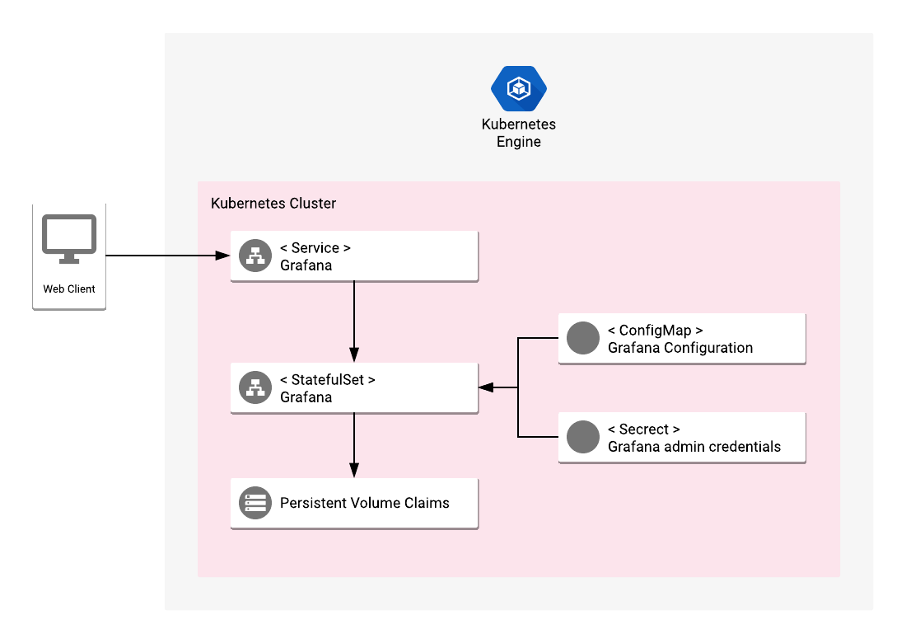

# Overview

Grafana is an open-source platform for data visualization and monitoring. A large number of
supported data sources makes it a universal visualization tool for many popular open source
data collection systems - including Prometheus, InfluxDB, Elasticsearch, MySQL or PostgreSQL.

## About Google Click to Deploy

Popular open stacks on Kubernetes packaged by Google.

## Design



The application offers a vanilla deployment of stateful, single-node
Grafana installation on a Kubernetes cluster.

Administrative user credentials are automatically configured in the application
through a Kubernetes Secret. Configuration file (/etc/grafana/grafana.ini) is
defined in a ConfigMap and mounted to Grafana StatefulSet.

By default, the Service exposing Grafana server is of type ClusterIP, which makes
it accessible only in a private network. It listens on port 3000.

# Installation

## Quick install with Google Cloud Marketplace

Get up and running with a few clicks! Install this Grafana app to a
Google Kubernetes Engine cluster using Google Cloud Marketplace. Follow the
[on-screen instructions](https://console.cloud.google.com/marketplace/details/google/grafana).

## Command line instructions

You can use [Google Cloud Shell](https://cloud.google.com/shell/) or a local workstation in the
future instructions.

[](https://console.cloud.google.com/cloudshell/editor?cloudshell_git_repo=https://github.com/GoogleCloudPlatform/click-to-deploy&cloudshell_working_dir=k8s/grafana)

### Prerequisites

#### Set up command-line tools

You'll need the following tools in your development environment:

- [gcloud](https://cloud.google.com/sdk/gcloud/)
- [kubectl](https://kubernetes.io/docs/reference/kubectl/overview/)
- [docker](https://docs.docker.com/install/)
- [git](https://git-scm.com/book/en/v2/Getting-Started-Installing-Git)

Configure `gcloud` as a Docker credential helper:

```shell
gcloud auth configure-docker
```

#### Create a Google Kubernetes Engine cluster

Create a new cluster from the command line:

```shell
export CLUSTER=grafana-cluster
export ZONE=us-west1-a

gcloud container clusters create "$CLUSTER" --zone "$ZONE"
```

Configure `kubectl` to connect to the new cluster:

```shell
gcloud container clusters get-credentials "$CLUSTER" --zone "$ZONE"
```

#### Clone this repo

Clone this repo and the associated tools repo.

```shell
git clone --recursive https://github.com/GoogleCloudPlatform/click-to-deploy.git
```

#### Install the Application resource definition

An Application resource is a collection of individual Kubernetes components,
such as Services, Deployments, and so on, that you can manage as a group.

To set up your cluster to understand Application resources, run the following command:

```shell
kubectl apply -f "https://raw.githubusercontent.com/GoogleCloudPlatform/marketplace-k8s-app-tools/master/crd/app-crd.yaml"
```

You need to run this command once.

The Application resource is defined by the
[Kubernetes SIG-apps](https://github.com/kubernetes/community/tree/master/sig-apps)
community. The source code can be found on
[github.com/kubernetes-sigs/application](https://github.com/kubernetes-sigs/application).

### Install the Application

Navigate to the `grafana` directory:

```shell
cd click-to-deploy/k8s/grafana
```

#### Configure the app with environment variables

Choose an instance name and
[namespace](https://kubernetes.io/docs/concepts/overview/working-with-objects/namespaces/)
for the app. In most cases, you can use the `default` namespace.

```shell
export APP_INSTANCE_NAME=grafana-1
export NAMESPACE=default
```

Configure the container images:

```shell
TAG=5.3
export IMAGE_GRAFANA="marketplace.gcr.io/google/grafana:${TAG}"
export IMAGE_GRAFANA_INIT="marketplace.gcr.io/google/grafana/debian9:${TAG}"
```

The images above are referenced by
[tag](https://docs.docker.com/engine/reference/commandline/tag). We recommend
that you pin each image to an immutable
[content digest](https://docs.docker.com/registry/spec/api/#content-digests).
This ensures that the installed application always uses the same images,
until you are ready to upgrade. To get the digest for the image, use the
following script:

```shell
for i in "IMAGE_GRAFANA" \
         "IMAGE_GRAFANA_INIT"; do
  repo=$(echo ${!i} | cut -d: -f1);
  digest=$(docker pull ${!i} | sed -n -e 's/Digest: //p');
  export $i="$repo@$digest";
  env | grep $i;
done
```

#### Create namespace in your Kubernetes cluster

If you use a different namespace than the `default`, run the command below to create a new namespace:

```shell
kubectl create namespace "$NAMESPACE"
```

#### Expand the manifest template

Use `envsubst` to expand the template. We recommend that you save the
expanded manifest file for future updates to the application.

```shell
awk 'FNR==1 {print "---"}{print}' manifest/* \
  | envsubst '$APP_INSTANCE_NAME $NAMESPACE $IMAGE_GRAFANA $IMAGE_GRAFANA_INIT' \
  > "${APP_INSTANCE_NAME}_manifest.yaml"
```

#### Apply the manifest to your Kubernetes cluster

Use `kubectl` to apply the manifest to your Kubernetes cluster:

```shell
kubectl apply -f "${APP_INSTANCE_NAME}_manifest.yaml" --namespace "${NAMESPACE}"
```

#### View the app in the Google Cloud Console

To get the Console URL for your app, run the following command:

```shell
echo "https://console.cloud.google.com/kubernetes/application/${ZONE}/${CLUSTER}/${NAMESPACE}/${APP_INSTANCE_NAME}"
```

To view your app, open the URL in your browser.

# Access the Grafana UI

Grafana is exposed as a ClusterIP-only service, called
`${APP_INSTANCE_NAME}-grafana`. To connect to the Grafana UI, you can either
expose a public service endpoint or keep it private and connect
from you local environment using `kubectl port-forward`.

## Expose the Grafana service publicly

To expose Grafana with a publicly available IP address, run the following command:

```shell
kubectl patch svc "${APP_INSTANCE_NAME}-grafana" \
  --namespace "${NAMESPACE}" \
  -p '{"spec": {"type": "LoadBalancer"}}'
```

It might take a while for the service to be publicly available. After the
process is finished, get the public IP address with:

```shell
SERVICE_IP=$(kubectl get svc ${APP_INSTANCE_NAME}-grafana \
  --namespace ${NAMESPACE} \
  --output jsonpath='{.status.loadBalancer.ingress[0].ip}')
echo "http://${SERVICE_IP}:3000/"
```

## Expose the Grafana service internally, using port forwarding

As an alternative to exposing Grafana publicly, you can use local port
forwarding. In a background terminal, run the following command:

```shell
kubectl port-forward --namespace ${NAMESPACE} ${APP_INSTANCE_NAME}-grafana-0 3000
```

With the port forwarded locally, you can access Grafana UI with `http://localhost:3000/`.

## Login to Grafana

Grafana is configured to require authentication. To get your username and
password, run the following commands:

```shell
GRAFANA_USERNAME="$(kubectl get secret ${APP_INSTANCE_NAME}-grafana \
                      --namespace ${NAMESPACE} \
                      --output=jsonpath='{.data.admin-user}' | base64 --decode)"
GRAFANA_PASSWORD="$(kubectl get secret ${APP_INSTANCE_NAME}-grafana \
                      --namespace ${NAMESPACE} \
                      --output=jsonpath='{.data.admin-password}' | base64 --decode)"
echo "Grafana credentials:"
echo "- user: ${GRAFANA_USERNAME}"
echo "- pass: ${GRAFANA_PASSWORD}"
```

# Scaling

This installation of Grafana is not intended to be scaled up. Please use it
with a single replica.

# Backup and restore

## Backup the Grafana database

The Grafana container stores its stateful data in an SQLite database, located
in `/var/lib/grafana/grafana.db`.

To backup the current version of the database file, run the following command:

```shell
kubectl cp ${NAMESPACE}/${APP_INSTANCE_NAME}-grafana-0:var/lib/grafana/grafana.db \
  [YOUR_BACKUP_FILE_PATH]
```

To secure your data, we recommend that you upload the backup file to
a reliable remote location, such as a Google Cloud Storage bucket.

## Restore the database

To restore the Grafana database, you overwrite the `grafana.db` file with
an earlier backup, and recreate the Grafana server's Pod. Note that your
username and password are also restored from the earlier backup.

Run the following commands:

```shell
kubectl cp [YOUR_BACKUP_FILE_PATH] \
  ${NAMESPACE}/${APP_INSTANCE_NAME}-grafana-0:var/lib/grafana/grafana.db
kubectl delete pod --namespace ${NAMESPACE} ${APP_INSTANCE_NAME}-grafana-0
```

It might take a while for the Pod to get recreated, and change its status to
`Ready`. When the Pod is ready, your backup should be restored.

# Upgrading the app

Before upgrading, we recommend that you prepare a backup of your Grafana
database, using the step above. For additional information about Grafana
upgrades, see the
[Grafana documentation](http://docs.grafana.org/installation/upgrading/).

The Grafana StatefulSet is configured to roll out updates automatically.
Start the update by patching the StatefulSet with a new image reference:

```shell
kubectl set image statefulset ${APP_INSTANCE_NAME}-grafana --namespace ${NAMESPACE} \
  "grafana=[NEW_IMAGE_REFERENCE]"
```

Where `[NEW_IMAGE_REFERENCE]` is the Docker image reference of the new image that you want to use.

To check the status of Pods in the StatefulSet, and the progress of
the new image, run the following command:

```shell
kubectl get pods --selector app.kubernetes.io/name=$APP_INSTANCE_NAME \
  --namespace ${NAMESPACE}
```

# Uninstall the Application

## Using the Google Cloud Platform Console

1. In the GCP Console, open [Kubernetes Applications](https://console.cloud.google.com/kubernetes/application).
1. From the list of applications, click **Grafana**.
1. On the Application Details page, click **Delete**.

## Using the command line

### Delete the resources

> **NOTE:** We recommend that you use a `kubectl` version that is the same as
the version of your cluster. Using the same versions of `kubectl` and the
cluster helps avoid unforeseen issues.

To delete the resources, use the expanded manifest file used for the
installation.

Run `kubectl` on the expanded manifest file:

```shell
kubectl delete -f ${APP_INSTANCE_NAME}_manifest.yaml --namespace ${NAMESPACE}
```

If you don't have the expanded manifest, delete the resources using types and
a label:

```shell
kubectl delete statefulset,service,configmap,secret,application \
  --namespace ${NAMESPACE} \
  --selector app.kubernetes.io/name=${APP_INSTANCE_NAME}
```

By design, the removal of StatefulSets in Kubernetes does not remove
PersistentVolumeClaims that were attached to their Pods. This prevents your
installations from accidentally deleting stateful data.

To remove the PersistentVolumeClaim with their attached persistent disks, run
the following `kubectl` commands:

```shell
kubectl delete persistentvolumeclaims \
  --namespace ${NAMESPACE} \
  --selector app.kubernetes.io/name=${APP_INSTANCE_NAME}
```

### Delete the GKE cluster

Optionally, if you don't need the deployed application or the GKE cluster,
delete the cluster using this command:

```shell
gcloud container clusters delete "${CLUSTER}" --zone "${ZONE}"
```
