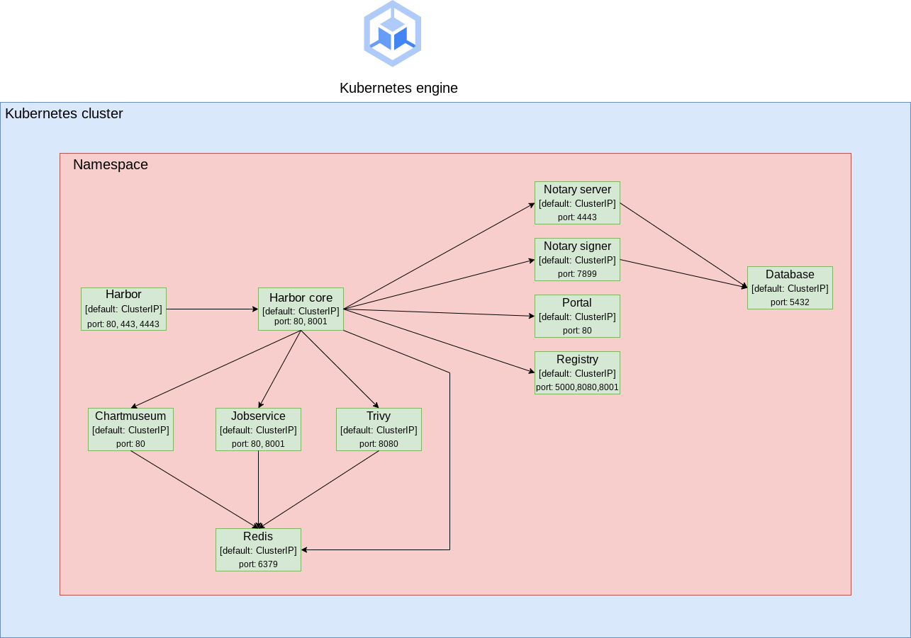

# Overview

Harbor is an open source trusted cloud native registry project that stores, signs, and scans content. Harbor extends the open source Docker Distribution by adding the functionalities usually required by users such as security, identity and management.

For more information, see the Harbor [GitHub](https://github.com/goharbor/harbor) and [official documentation](https://goharbor.io/docs/2.2.0/).


## About Google Click to Deploy

Popular open stacks on Kubernetes packaged by Google.

## Architecture

The application offers the Harbor application deployed as Deployment with all dependencies required to fully operate.



Harbor configuration file `/etc/core/app.conf` is automatically generated in the application
through a Kubernetes ConfigMap. It's good to know that to modify ConfigMaps you wish you should remove the corresponding Pod to reload the Harbor configuration.

# Installation

## Quick install with Google Cloud Marketplace

Get up and running with a few clicks! Install this Harbor app to a Google
Kubernetes Engine cluster using Google Cloud Marketplace. Follow the
[on-screen instructions](https://console.cloud.google.com/marketplace/details/google/harbor).

## Command line instructions

You can use [Google Cloud Shell](https://cloud.google.com/shell/) or a local
workstation to complete these steps.

[](https://console.cloud.google.com/cloudshell/editor?cloudshell_git_repo=https://github.com/GoogleCloudPlatform/click-to-deploy&cloudshell_open_in_editor=README.md&cloudshell_working_dir=k8s/harbor)

### Prerequisites

#### Set up command-line tools

You'll need the following tools in your development environment. If you are
using Cloud Shell, `gcloud`, `kubectl`, Docker, and Git are installed in your
environment by default.

-   [gcloud](https://cloud.google.com/sdk/gcloud/)
-   [kubectl](https://kubernetes.io/docs/reference/kubectl/overview/)
-   [docker](https://docs.docker.com/install/)
-   [git](https://git-scm.com/book/en/v2/Getting-Started-Installing-Git)
-   [helm](https://helm.sh/)

Configure `gcloud` as a Docker credential helper:

```shell
gcloud auth configure-docker
```

#### Create a Google Kubernetes Engine cluster

Create a new cluster from the command line:

```shell
export CLUSTER=harbor-cluster
export ZONE=us-west1-a

gcloud container clusters create "$CLUSTER" --zone "$ZONE"
```

Configure `kubectl` to connect to the new cluster:

```shell
gcloud container clusters get-credentials "$CLUSTER" --zone "$ZONE"
```

#### Clone this repo

Clone this repo and the associated tools repo.

```shell
git clone --recursive https://github.com/GoogleCloudPlatform/click-to-deploy.git
```

#### Install the Application resource definition

An Application resource is a collection of individual Kubernetes components,
such as Services, Deployments, and so on, that you can manage as a group.

To set up your cluster to understand Application resources, run the following
command:

```shell
kubectl apply -f "https://raw.githubusercontent.com/GoogleCloudPlatform/marketplace-k8s-app-tools/master/crd/app-crd.yaml"
```

You need to run this command once.

The Application resource is defined by the
[Kubernetes SIG-apps](https://github.com/kubernetes/community/tree/master/sig-apps)
community. The source code can be found on
[github.com/kubernetes-sigs/application](https://github.com/kubernetes-sigs/application).

### Install the Application

Navigate to the `harbor` directory:

```shell
cd click-to-deploy/k8s/harbor
```

#### Configure the app with environment variables

Choose an instance name and
[namespace](https://kubernetes.io/docs/concepts/overview/working-with-objects/namespaces/)
for the app. In most cases, you can use the `default` namespace.

```shell
export APP_INSTANCE_NAME=harbor-1
export NAMESPACE=default
```

Enable Stackdriver Metrics Exporter:

> **NOTE:** Your GCP project must have Stackdriver enabled. If you are using a
> non-GCP cluster, you cannot export metrics to Stackdriver.

By default, the application does not export metrics to Stackdriver. To enable
this option, change the value to `true`.

```shell
export METRICS_EXPORTER_ENABLED=false
```

Set up the image tag:

It is advised to use a stable image reference, which you can find on:
- [Harbor](https://hub.docker.com/r/goharbor/harbor-core/tags).
- [Metrics exporter](https://marketplace.gcr.io/google/harbor/prometheus-to-sd).

```shell
export TAG="v2.5.4"
export TAG_METRICS_EXPORTER="2.5"
```

Configure the container images:

```shell
export HARBOR_SOURCE_REGISTRY=goharbor
export IMAGE_HARBOR_CORE="${HARBOR_SOURCE_REGISTRY}/harbor-core:${TAG}"
export IMAGE_HARBOR_CHARTMUSEUM="${HARBOR_SOURCE_REGISTRY}/chartmuseum-photon:${TAG}"
export IMAGE_HARBOR_DATABASE="${HARBOR_SOURCE_REGISTRY}/harbor-db:${TAG}"
export IMAGE_HARBOR_JOBSERVICE="${HARBOR_SOURCE_REGISTRY}/harbor-jobservice:${TAG}"
export IMAGE_HARBOR_NOTARY_SERVER="${HARBOR_SOURCE_REGISTRY}/notary-server-photon:${TAG}"
export IMAGE_HARBOR_NOTARY_SIGNER="${HARBOR_SOURCE_REGISTRY}/notary-signer-photon:${TAG}"
export IMAGE_HARBOR_PORTAL="${HARBOR_SOURCE_REGISTRY}/harbor-portal:${TAG}"
export IMAGE_HARBOR_REDIS="${HARBOR_SOURCE_REGISTRY}/redis-photon:${TAG}"
export IMAGE_HARBOR_REGISTRY="${HARBOR_SOURCE_REGISTRY}/registry-photon:${TAG}"
export IMAGE_HARBOR_REGISTRYCTL="${HARBOR_SOURCE_REGISTRY}/harbor-registryctl:${TAG}"
export IMAGE_HARBOR_TRIVY="${HARBOR_SOURCE_REGISTRY}/trivy-adapter-photon:${TAG}"
export IMAGE_HARBOR_NGINX="${HARBOR_SOURCE_REGISTRY}/nginx-photon:${TAG}"
export IMAGE_METRICS_EXPORTER="marketplace.gcr.io/google/harbor/prometheus-to-sd:${TAG_METRICS_EXPORTER}"
```

Set how to expose the service - you can choose the type as `ingress` or `clusterIP`.

```shell
export HARBOR_EXPOSE_TYPE="clusterIP"
```

Set the initial password of Harbor admin. You can change it from portal after launching Harbor.

```shell
export HARBOR_ADMIN_PASSWORD="Harbor12345"
```

#### Create namespace in your Kubernetes cluster

If you use a different namespace than `default`, run the command below to create
a new namespace:

```shell
kubectl create namespace "$NAMESPACE"
```

#### Expand the manifest template

Use `helm template` to expand the template. We recommend that you save the
expanded manifest file for future updates to the application.

```shell
helm template "${APP_INSTANCE_NAME}" chart/harbor \
  --namespace "${NAMESPACE}" \
  --set expose.type="${HARBOR_EXPOSE_TYPE}" \
  --set harborAdminPassword="${HARBOR_ADMIN_PASSWORD}" \
  --set core.image.repo="${IMAGE_HARBOR_CORE}" \
  --set core.image.tag="${TAG}" \
  --set chartmuseum.image.repo="${IMAGE_HARBOR_CHARTMUSEUM}" \
  --set chartmuseum.image.tag="${TAG}" \
  --set database.image.repo="${IMAGE_HARBOR_DATABASE}" \
  --set database.image.tag="${TAG}" \
  --set jobservice.image.repo="${IMAGE_HARBOR_JOBSERVICE}" \
  --set jobservice.image.tag="${TAG}" \
  --set notary.server.image.repo="${IMAGE_HARBOR_NOTARY_SERVER}" \
  --set notary.server.image.tag="${TAG}" \
  --set notary.signer.image.repo="${IMAGE_HARBOR_NOTARY_SIGNER}" \
  --set notary.signer.image.tag="${TAG}" \
  --set portal.image.repo="${IMAGE_HARBOR_PORTAL}" \
  --set portal.image.tag="${TAG}" \
  --set redis.image.repo="${IMAGE_HARBOR_REDIS}" \
  --set redis.image.tag="${TAG}" \
  --set registry.registry.image.repo="${IMAGE_HARBOR_REGISTRY}" \
  --set registry.registry.image.tag="${TAG}" \
  --set registry.controller.image.repo="${IMAGE_HARBOR_REGISTRYCTL}" \
  --set registry.controller.image.tag="${TAG}" \
  --set trivy.image.repo="${IMAGE_HARBOR_TRIVY}" \
  --set trivy.image.tag="${TAG}" \
  --set nginx.image.repo="${IMAGE_HARBOR_NGINX}" \
  --set nginx.image.tag="${TAG}" \
  --set metrics.image="${IMAGE_METRICS_EXPORTER}" \
  --set metrics.exporter.enabled="${METRICS_EXPORTER_ENABLED}" > "${APP_INSTANCE_NAME}"_manifest.yaml
```

#### Apply the manifest to your Kubernetes cluster

Use `kubectl` to apply the manifest to your Kubernetes cluster:

```shell
kubectl apply -f "${APP_INSTANCE_NAME}_manifest.yaml" --namespace "${NAMESPACE}"
```

#### View the app in the Google Cloud Console

To get the Console URL for your app, run the following command:

```shell
echo "https://console.cloud.google.com/kubernetes/application/${ZONE}/${CLUSTER}/${NAMESPACE}/${APP_INSTANCE_NAME}"
```

To view your app, open the URL in your browser.

# Application metrics

## Prometheus metrics

The application is configured to natively expose its metrics in the
[Prometheus format](https://github.com/prometheus/docs/blob/master/content/docs/instrumenting/exposition_formats.md).

You can access the metrics at `[EXPORTER_SVC_URL]:8001/metrics`. For example, you can access the metrics at the
[http://localhost:8080/metrics](http://localhost:8080/metrics) endpoint using port forwarding as below:

```shell
kubectl port-forward svc/${APP_INSTANCE_NAME}-exporter 8080:8001
```

## Configuring Prometheus to collect the metrics

To configure Prometheus to automatically collect metrics, follow the steps in
[Configuring Prometheus](https://prometheus.io/docs/introduction/first_steps/#configuring-prometheus).
You configure the metrics in the
[`scrape_configs` section](https://prometheus.io/docs/prometheus/latest/configuration/configuration/#scrape_config).

## Exporting metrics to Stackdriver

The deployment includes a
[Prometheus to Stackdriver (`prometheus-to-sd`)](https://github.com/GoogleCloudPlatform/k8s-stackdriver/tree/master/prometheus-to-sd)
container. If you enabled the option to export metrics to Stackdriver, the
metrics are automatically exported to Stackdriver and visible in
[Stackdriver Metrics Explorer](https://cloud.google.com/monitoring/charts/metrics-explorer).

The name of each metric starts with the application's name, which you define in
the `APP_INSTANCE_NAME` environment variable.

The exporting option might not be available for GKE on-prem clusters.

> Note: Stackdriver has [quotas](https://cloud.google.com/monitoring/quotas) for
> the number of custom metrics created in a single GCP project. If the quota is
> met, additional metrics might not show up in the Stackdriver Metrics Explorer.

You can remove existing metric descriptors using
[Stackdriver's REST API](https://cloud.google.com/monitoring/api/ref_v3/rest/v3/projects.metricDescriptors/delete).

# Scaling

You can use the `kubectl scale` commands to scale all Harbor components.

For example:

```shell
$ kubectl scale deployment harbor-1-core --replicas=3
deployment.apps/harbor-1-core scaled

$ k get pods | grep harbor-1-core
harbor-1-core-749ffb546c-824bp            1/1     Running
harbor-1-core-749ffb546c-9wlcr            1/1     Running
harbor-1-core-749ffb546c-ccfwh            1/1     Running
```

# Backup and restore

To backup Harbor application you need to create a PostgreSQL backup - you can follow the instructions from the [official documentation](https://www.postgresql.org/docs/current/continuous-archiving.html#BACKUP-LOWLEVEL-BASE-BACKUP).

You can also back up a specific database with the `pg_dump` command.

# Uninstalling the Application

## Using the Google Cloud Platform Console

1.  In the GCP Console, open
    [Kubernetes Applications](https://console.cloud.google.com/kubernetes/application).
1.  From the list of applications, click **Falco**.
1.  On the Application Details page, click **Delete**.

## Using the command line

### Delete the resources

> **NOTE:** We recommend that you use a `kubectl` version that is the same as
> the version of your cluster. Using the same versions of `kubectl` and the
> cluster helps avoid unforeseen issues.

To delete the resources, use the expanded manifest file used for the
installation.

Run `kubectl` on the expanded manifest file:

```shell
kubectl delete -f ${APP_INSTANCE_NAME}_manifest.yaml --namespace ${NAMESPACE}
```

If you don't have the expanded manifest, delete the resources using types and a
label:

```shell
kubectl delete daemonset,service,configmap,application \
  --namespace ${NAMESPACE} \
  --selector app.kubernetes.io/name=${APP_INSTANCE_NAME}
```

### Delete the GKE cluster

Optionally, if you don't need the deployed application or the GKE cluster,
delete the cluster using this command:

```shell
gcloud container clusters delete "${CLUSTER}" --zone "${ZONE}"
```
