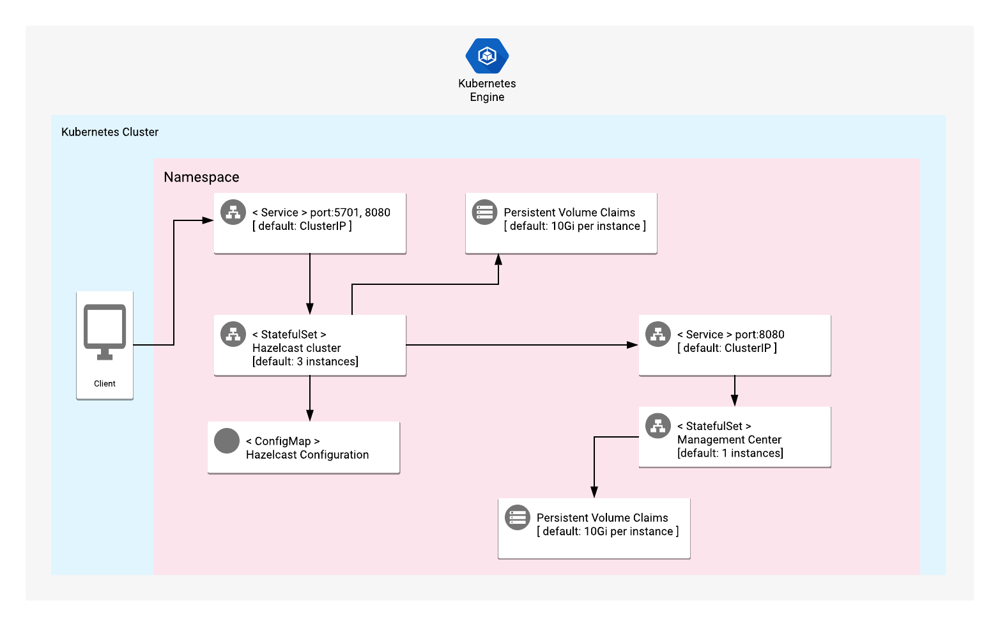

# Overview

Hazelcast IMDG (In-Memory Data Grid) is an in-memory data store
based on Java, which offers caching solutions to ensure that data
is in the right place when it’s needed for optimal performance.
Hazelcast's clustered data grid is backed by physical or virtual
instances. It is primarily a key-value datastore, which can be
applied to a wide variety of use cases, such as web session
clustering solutions, caching layers, or NoSQL data stores.

For more general information about Hazelcast IMDG, visit the
product page of the
[Hazelcast official website](https://hazelcast.org/), or refer to
the
[Hazelcast documentation](https://hazelcast.org/documentation/).

## About Google Click to Deploy

Popular open stacks on Kubernetes, packaged by Google.

## Architecture



By default, Hazelcast is exposed internally using a ClusterIP
Service on port 5701. The Hazelcast Management Center is exposed
internally on port 8080.

Separate StatefulSet Kubernetes objects are used to manage the
Hazelcast and Management Center workloads. By default, 3 Hazelcast
replicas are deployed as a part of a StatefulSet. Management
Center is deployed as a single instance, also through a
StatefulSet.

The Hazelcast instances connect to Management Center over port
`8080`.

Hazelcast's credentials are set the first time it accesses
Management Center.

# Installation

## Quick install with Google Cloud Marketplace

Get up and running with a few clicks! To install this Hazelcast
app to a Google Kubernetes Engine cluster via Google Cloud
Marketplace, follow these
[on-screen instructions](https://console.cloud.google.com/marketplace/details/google/hazelcast).

## Command-line instructions

### Prerequisites

#### Set up command-line tools

You'll need the following tools in your development environment:

- [gcloud](https://cloud.google.com/sdk/gcloud/)
- [kubectl](https://kubernetes.io/docs/reference/kubectl/overview/)
- [docker](https://docs.docker.com/install/)
- [git](https://git-scm.com/book/en/v2/Getting-Started-Installing-Git)
- [helm](https://helm.sh/)

Configure `gcloud` as a Docker credential helper:

```shell
gcloud auth configure-docker
```

#### Create a Google Kubernetes Engine (GKE) cluster

Create a new cluster from the command-line:

```shell
export CLUSTER=hazelcast-cluster
export ZONE=us-west1-a

gcloud container clusters create "${CLUSTER}" --zone "${ZONE}"
```

Configure `kubectl` to connect to the new cluster:

```shell
gcloud container clusters get-credentials "${CLUSTER}" --zone "${ZONE}"
```

#### Clone this repo

Clone this repo, as well as its associated tools repo:

```shell
git clone --recursive https://github.com/GoogleCloudPlatform/click-to-deploy.git
```

#### Install the Application resource definition

An Application resource is a collection of individual Kubernetes
components, such as Services, Deployments, and so on, that you can
manage as a group.

To set up your cluster to understand Application resources, run
the following command:

```shell
kubectl apply -f "https://raw.githubusercontent.com/GoogleCloudPlatform/marketplace-k8s-app-tools/master/crd/app-crd.yaml"
```

You need to run this command once.

The Application resource is defined by the
[Kubernetes SIG-apps](https://github.com/kubernetes/community/tree/master/sig-apps)
community. You can find the source code at
[github.com/kubernetes-sigs/application](https://github.com/kubernetes-sigs/application).

### Install the app

Navigate to the `hazelcast` directory:

```shell
cd click-to-deploy/k8s/hazelcast
```

#### Configure the app with environment variables

Choose an instance name and
[namespace](https://kubernetes.io/docs/concepts/overview/working-with-objects/namespaces/)
for your app. In most cases, you can use the `default`
namespace.

```shell
export APP_INSTANCE_NAME=hazelcast-1
export NAMESPACE=default
```

Enable Cloud Monitoring:

> **NOTE:** Your Google Cloud Marketplace project must have
> Cloud Monitoring enabled. If you are using a non-Google Cloud
> cluster, you cannot export metrics to Cloud Monitoring.

By default, the application does not export metrics to Cloud
Monitoring. To enable this option, change the value to `true`.

```shell
export METRICS_EXPORTER_ENABLED=false
```

Set up the image tag:

It is advised to use a stable image reference, such as the one
in the
[Marketplace Container Registry](https://marketplace.gcr.io/google/hazelcast).

Example:

```shell
export TAG="5.2.1-<BUILD_ID>"
```

Alternatively, you can use a short tag to point to the latest
image for your selected version.

> Warning: this tag is not stable, and the image that it references
> might change over time.

```shell
export TAG="5.2"
```

Configure the container image:

```shell
export IMAGE_REGISTRY="marketplace.gcr.io/google"
export IMAGE_HAZELCAST="${IMAGE_REGISTRY}/hazelcast3"
export IMAGE_HAZELCASTMC="${IMAGE_REGISTRY}/hazelcast-mc3"
export IMAGE_METRICS_EXPORTER="${IMAGE_REGISTRY}/hazelcast/prometheus-to-sd:${TAG}"
```

For the persistent disk provisioning of the Hazelcast servers,
you will need to:

 * Set the StorageClass name. To ensure persistent disk provisioning
 for your Hazelcast servers, you should select your existing
 StorageClass name.
 * Set the persistent disk's size. The default disk size is "10Gi".

> Note: "ssd" type storage is recommended for Hazelcast, as it uses
> local disk to store and retrieve keys and values. To create a
> StorageClass for dynamic provisioning of persistent SSD volumes,
> follow
> [these instructions](https://cloud.google.com/kubernetes-engine/docs/how-to/persistent-volumes/ssd-pd).

```shell
export HAZELCAST_STORAGE_CLASS="standard" # provide your StorageClass name if not "standard"
export PERSISTENT_DISK_SIZE="10Gi"
```

#### Create namespace in your Kubernetes cluster

If you use a different namespace than the `default`, run the
command below to create a new namespace:

```shell
kubectl create namespace "${NAMESPACE}"
```

#### Create the Hazelcast Service Account

To create the Hazelcast Service Account and ClusterRoleBinding:

```shell
export HAZELCAST_SERVICE_ACCOUNT="${APP_INSTANCE_NAME}-serviceaccount"
kubectl create serviceaccount "${HAZELCAST_SERVICE_ACCOUNT}" --namespace "${NAMESPACE}"
kubectl create clusterrole "${HAZELCAST_SERVICE_ACCOUNT}-role" --verb=get,list,watch --resource=pods,namespaces
kubectl create clusterrolebinding "${HAZELCAST_SERVICE_ACCOUNT}-rule" --clusterrole="${HAZELCAST_SERVICE_ACCOUNT}-role" --serviceaccount="${NAMESPACE}:${HAZELCAST_SERVICE_ACCOUNT}"
```

#### Expand the manifest template

Use `helm template` to expand the template. We recommend that you
save the expanded manifest file for future updates to your app.

```shell
helm template "${APP_INSTANCE_NAME}" chart/hazelcast \
  --namespace "${NAMESPACE}" \
  --set hazelcast.image.repo="${IMAGE_HAZELCAST}" \
  --set hazelcast.image.tag="${TAG}" \
  --set hazelcast.persistence.storageClass="${HAZELCAST_STORAGE_CLASS}" \
  --set hazelcast.persistence.size="${PERSISTENT_DISK_SIZE}" \
  --set hazelcast.serviceAccount="${HAZELCAST_SERVICE_ACCOUNT}" \
  --set mancenter.image.repo="${IMAGE_HAZELCASTMC}" \
  --set mancenter.image.tag="${TAG}" \
  --set mancenter.persistence.storageClass="${HAZELCAST_STORAGE_CLASS}" \
  --set mancenter.persistence.size="${PERSISTENT_DISK_SIZE}" \
  --set metrics.image="${IMAGE_METRICS_EXPORTER}" \
  --set metrics.exporter.enabled="${METRICS_EXPORTER_ENABLED}" \
  > "${APP_INSTANCE_NAME}_manifest.yaml"
```

#### Apply the manifest to your Kubernetes cluster

Use `kubectl` to apply the manifest to your Kubernetes cluster:

```shell
kubectl apply -f "${APP_INSTANCE_NAME}_manifest.yaml" --namespace "${NAMESPACE}"
```

#### View the app in the Google Cloud Console

To get the Cloud Console URL for your app, run the following
command:

```shell
echo "https://console.cloud.google.com/kubernetes/application/${ZONE}/${CLUSTER}/${NAMESPACE}/${APP_INSTANCE_NAME}"
```

To view the app, open the URL in your browser.

### Access Hazelcast internally

To connect to Hazelcast without exposing it publicly, use the
`curl` command-line tool, or any other HTTP client.

#### Connect to Hazelcast via Pod

To identify Hazelcast's Pods, use the following command:

```shell
kubectl get pods -o wide -l app.kubernetes.io/name=${APP_INSTANCE_NAME} --namespace "${NAMESPACE}"
```

You can then check the status of the cluster's members:

```shell
# List cluster members
kubectl exec -it "${APP_INSTANCE_NAME}-hazelcast-0" --namespace "${NAMESPACE}" -- curl -v "http://localhost:5701/hazelcast/rest/cluster"
```

The returned output looks something like:

```
< HTTP/1.1 200 OK
< Content-Length: 119

Members [3] {
  Member [10.20.17.1:5701] this
  Member [10.20.17.2:5701]
  Member [10.20.17.4:5701]
}

ConnectionCount: 5
AllConnectionCount: 20
```

#### Create and retrieve items from a map store

To manipulate data in a Hazelcast data store, use the REST API for
the `/maps` resource.

A POST request creates the map and the data:

```shell
# Create an item where key is 'foo' and value is 'bar'
kubectl exec -it "${APP_INSTANCE_NAME}-hazelcast-0" --namespace "${NAMESPACE}" -- curl -v -X POST -d "bar" "http://localhost:5701/hazelcast/rest/maps/mapName/foo"
```

The returned output looks something like:

```
< HTTP/1.1 200 OK
< Content-Type: text/plain
< Content-Length: 0
```

To retrieve the data from all of the replicas after a specific
number of seconds:

```shell
kubectl exec -it "${APP_INSTANCE_NAME}-hazelcast-0" --namespace "${NAMESPACE}" -- curl -v "http://localhost:5701/hazelcast/rest/maps/mapName/foo"
kubectl exec -it "${APP_INSTANCE_NAME}-hazelcast-1" --namespace "${NAMESPACE}" -- curl -v "http://localhost:5701/hazelcast/rest/maps/mapName/foo"
kubectl exec -it "${APP_INSTANCE_NAME}-hazelcast-2" --namespace "${NAMESPACE}" -- curl -v "http://localhost:5701/hazelcast/rest/maps/mapName/foo"
```

Your returned output looks something like:

```
< HTTP/1.1 200 OK
< Content-Type: text/plain
< Content-Length: 3
bar
```

#### Interact with Management Service by using port-forwarding

To forward the Hazelcast Management Service port to your machine,
use the following command:

```shell
kubectl port-forward svc/${APP_INSTANCE_NAME}-mancenter-svc --namespace "${NAMESPACE}" 5050:8080
```

In a browser window, navigate to:
http://localhost:5050/hazelcast-mancenter.

Before your first access, you should define your `root`
credentials. You can find more information at the
[Management Center Getting Started page](https://docs.hazelcast.org/docs/management-center/3.8.3/manual/html/Getting_Started.html).


### Access Hazelcast externally

By default, the app does not have an external IP address. To
create an external IP address, run the following command:

```shell
kubectl patch svc "${APP_INSTANCE_NAME}-svc" \
  --namespace "${NAMESPACE}" \
  --patch '{"spec": {"type": "LoadBalancer"}}'
```

> **NOTE:** It might take some time for the external IP to be
provisioned.

# App metrics

Each Hazelcast server exports metrics under the `/` path, on
`8080` port.

You can access the metrics locally via `curl`:

```shell
# Forward client port to local workstation
kubectl port-forward "svc/${APP_INSTANCE_NAME}-svc" 8080 --namespace "${NAMESPACE}"

# Fetch metrics locally through different terminal
curl -L http://localhost:8080/
```

### Configuring Prometheus to collect metrics

To configure Prometheus to automatically collect your app's
metrics. To set this up, follow the steps at
[Configuring Prometheus](https://prometheus.io/docs/introduction/first_steps/#configuring-prometheus).

You configure the metrics in the
[`scrape_configs` section](https://prometheus.io/docs/prometheus/latest/configuration/configuration/#scrape_config).

## Exporting metrics to Cloud Monitoring

This app includes an option to inject a
[Prometheus to Stackdriver (`prometheus-to-sd`)](https://github.com/GoogleCloudPlatform/k8s-stackdriver/tree/master/prometheus-to-sd)
sidecar to each Hazelcast Pod, to export `localhost:8080/` to
Cloud Monitoring.

If you enabled the option `export METRICS_EXPORTER_ENABLED=true`,
your app's metrics are automatically exported to Cloud Monitoring,
and visible in
[Metrics Explorer](https://cloud.google.com/monitoring/charts/metrics-explorer).

Metrics are labeled as `app.kubernetes.io/name`, with `name`
representing the name of your app, as defined in the
`APP_INSTANCE_NAME` environment variable.

This option may not be available for GKE on-prem clusters.

> Note: Cloud Monitoring has
> [quotas](https://cloud.google.com/monitoring/quotas) for the
> number of custom metrics created in a single GCP project. If
> the quota is met, additional metrics might not show up in 
> Metrics Explorer.

To remove existing metric descriptors, use
[Stackdriver's REST API](https://cloud.google.com/monitoring/api/ref_v3/rest/v3/projects.metricDescriptors/delete).

### Scaling

#### Scaling the cluster up or down

Hazelcast clusters can easily be scaled up or down.

> **NOTE:** To scale Hazelcast Open Source Cluster to more than
> 3 replicas, you must have a valid license key. For more
> information, refer to the
> [Hazelcast documentation](https://hazelcast.com/blog/how-to-scale-hazelcast-imdg-on-kubernetes/).

By default, the Hazelcast cluster is deployed with 3 replicas. To
change the number of replicas, use the following command, where
`REPLICAS` sets the desired number of replicas:

```shell
export REPLICAS=2
kubectl scale statefulsets "${APP_INSTANCE_NAME}-hazelcast" \
  --namespace "${NAMESPACE}" --replicas=$REPLICAS
```

If you want to scale your app down, use this command to reduce the
number of replicas, which disconnects nodes from the cluster.
Scaling down does not affect your StatefulSet's
`PersistentVolumeClaims`.

### Upgrading

The Hazelcast StatefulSet is configured to roll out updates
automatically. To start an update, patch the StatefulSet with a
new image reference:

```shell
kubectl set image statefulset ${APP_INSTANCE_NAME}-hazelcast --namespace ${NAMESPACE} \
  "hazelcast=[NEW_IMAGE_REFERENCE]"
```

where `[NEW_IMAGE_REFERENCE]` is the Docker image reference of the
new image that you want to use.

To check the status of Pods in the StatefulSet, and the progress
of the new image, run the following command:

```shell
kubectl get pods --selector app.kubernetes.io/name=${APP_INSTANCE_NAME} \
  --namespace ${NAMESPACE}
```

# Uninstall the app

## Using the Google Cloud Console

1.  In the Cloud Console, open
    [Kubernetes Applications](https://console.cloud.google.com/kubernetes/application).

2.  From the list of apps, click **Hazelcast**.

3.  On the Application Details page, click **Delete**.

## Using the command-line

### Prepare the environment

Set your installation name and Kubernetes namespace:

```shell
export APP_INSTANCE_NAME=hazelcast-1
export NAMESPACE=default
```

### Delete the resources

> **NOTE:** We recommend using a `kubectl` version that is the
> same as the version of your cluster. Using the same version
> for `kubectl` and the cluster helps to avoid unforeseen
> issues.

#### Delete the deployment with the generated manifest file

Run `kubectl` on the expanded manifest file:

> **WARNING:** This will also delete your `PersistentVolumeClaims`
> for Hazelcast, which means that you will lose all of your
> Hazelcast data.

```shell
kubectl delete -f ${APP_INSTANCE_NAME}_manifest.yaml --namespace ${NAMESPACE}
```

#### Delete the deployment by deleting the Application resource

If you don't have the expanded manifest file, delete the
resources by using types and a label:

```shell
kubectl delete application,statefulset,secret,service \
  --namespace ${NAMESPACE} \
  --selector app.kubernetes.io/name=${APP_INSTANCE_NAME}
```

Deleting the `Application` resource will delete all of your
deployment's resources, except for `PersistentVolumeClaim`. To
remove the `PersistentVolumeClaim`s with their attached persistent
disks, run the following `kubectl` command:

```shell
kubectl delete persistentvolumeclaims \
  --namespace ${NAMESPACE} \
  --selector app.kubernetes.io/name=${APP_INSTANCE_NAME}
```

### Delete the GKE cluster

If you don't need the deployed app or its GKE cluster, delete the
cluster with the following command:

```shell
gcloud container clusters delete "${CLUSTER}" --zone "${ZONE}"
```
