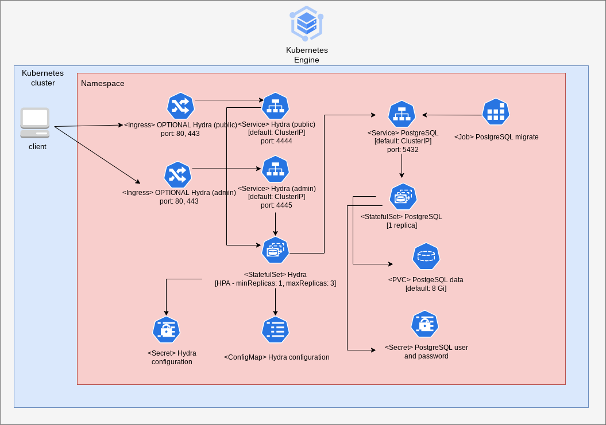

# Overview

Ory Hydra is a hardened, OpenID Certified OAuth 2.0 Server and OpenID Connect Provider optimized for low-latency, high throughput, and low resource consumption. Ory Hydra is not an identity provider (user sign up, user login, password reset flow), but connects to your existing identity provider through a login and consent app. Implementing the login and consent app in a different language is easy, and exemplary consent apps (Node) and SDKs for common languages are provided.

For more information on Ory Hydra, see the Ory Hydra [GitHub](https://github.com/ory/hydra) and [official documentation](https://www.ory.sh/docs/welcome).


## About Google Click to Deploy

Popular open stacks on Kubernetes packaged by Google.

## Architecture

The application offers the Ory Hydra application deployed as StatefulSet with PostgreSQL as a database.



Ory Hydra configuration file `/etc/config/config.yaml` is automatically generated in the application
through a Kubernetes ConfigMap. It's good to know that you can modify this ConfigMap and then remove the Hydra Pod (it is managed by StatefulSet so the Pod will be recreated) to reload the Hydra configuration.

# Installation

For sample deployment of Ory Hydra based on this repository and an exemplary User Login & Consent App refer to [Ory Hydra quick setup](docs/ORY_HYDRA_QUICK_SETUP.md). 
## Quick install with Google Cloud Marketplace

Get up and running with a few clicks! Install this Ory Hydra app to a Google
Kubernetes Engine cluster using Google Cloud Marketplace. Follow the
[on-screen instructions](https://console.cloud.google.com/marketplace/details/google/hydra).

## Command line instructions

You can use [Google Cloud Shell](https://cloud.google.com/shell/) or a local
workstation to complete these steps.

[](https://console.cloud.google.com/cloudshell/editor?cloudshell_git_repo=https://github.com/GoogleCloudPlatform/click-to-deploy&cloudshell_open_in_editor=README.md&cloudshell_working_dir=k8s/hydra)

### Prerequisites

#### Set up command-line tools

You'll need the following tools in your development environment. If you are
using Cloud Shell, `gcloud`, `kubectl`, Docker, and Git are installed in your
environment by default.

-   [gcloud](https://cloud.google.com/sdk/gcloud/)
-   [kubectl](https://kubernetes.io/docs/reference/kubectl/overview/)
-   [docker](https://docs.docker.com/install/)
-   [git](https://git-scm.com/book/en/v2/Getting-Started-Installing-Git)
-   [helm](https://helm.sh/)

Configure `gcloud` as a Docker credential helper:

```shell
gcloud auth configure-docker
```

#### Create a Google Kubernetes Engine cluster

Create a new cluster from the command line:

```shell
export CLUSTER=hydra-cluster
export ZONE=us-west1-a

gcloud container clusters create "$CLUSTER" --zone "$ZONE"
```

Configure `kubectl` to connect to the new cluster:

```shell
gcloud container clusters get-credentials "$CLUSTER" --zone "$ZONE"
```

#### Clone this repo

Clone this repo and the associated tools repo.

```shell
git clone --recursive https://github.com/GoogleCloudPlatform/click-to-deploy.git
```

#### Install the Application resource definition

An Application resource is a collection of individual Kubernetes components,
such as Services, Deployments, and so on, that you can manage as a group.

To set up your cluster to understand Application resources, run the following
command:

```shell
kubectl apply -f "https://raw.githubusercontent.com/GoogleCloudPlatform/marketplace-k8s-app-tools/master/crd/app-crd.yaml"
```

You need to run this command once.

The Application resource is defined by the
[Kubernetes SIG-apps](https://github.com/kubernetes/community/tree/master/sig-apps)
community. The source code can be found on
[github.com/kubernetes-sigs/application](https://github.com/kubernetes-sigs/application).

### Install the Application

Navigate to the `hydra` directory:

```shell
cd click-to-deploy/k8s/hydra
```

#### Configure the app with environment variables

Choose an instance name and
[namespace](https://kubernetes.io/docs/concepts/overview/working-with-objects/namespaces/)
for the app. In most cases, you can use the `default` namespace.

```shell
export APP_INSTANCE_NAME=hydra-1
export NAMESPACE=default
```

Enable Stackdriver Metrics Exporter:

> **NOTE:** Your GCP project must have Stackdriver enabled. If you are using a
> non-GCP cluster, you cannot export metrics to Stackdriver.

By default, the application does not export metrics to Stackdriver. To enable
this option, change the value to `true`.

```shell
export METRICS_EXPORTER_ENABLED=false
```

Set up the image tag:

It is advised to use stable image reference which you can find on
[Marketplace Container Registry](https://marketplace.gcr.io/google/hydra).
Example:

```shell
export TAG="2.0.3-<BUILD_ID>"
```

Alternatively you can use short tag which points to the latest image for selected version.
> Warning: this tag is not stable and referenced image might change over time.

```shell
export TAG="2.0"
```

Configure the container images:

```shell
export SOURCE_REGISTRY="marketplace.gcr.io/google"
export IMAGE_HYDRA="${SOURCE_REGISTRY}/hydra"
export IMAGE_POSTGRESQL="${IMAGE_REGISTRY}/hydra/postgresql:${TAG}"
export IMAGE_POSTGRESQL_EXPORTER="${IMAGE_REGISTRY}/hydra/postgresql-exporter:${TAG}"
export IMAGE_METRICS_EXPORTER="${SOURCE_REGISTRY}/hydra/prometheus-to-sd:${TAG}"
```

Request the amount of memory and CPU for Hydra Pod:

```shell
export HYDRA_MEMORY_REQUEST=128Mi
export HYDRA_CPU_REQUEST=100m
```

Set the persistent disks size. The default disks size is "5Gi".

```shell
export DEFAULT_STORAGE_CLASS="standard" # provide your StorageClass name if not "standard"
export PSQL_PERSISTENT_DISK_SIZE="8Gi"
```

Set or generate the password for the PostgreSQL service:

```shell
# Set alias for password generation
alias generate_pwd="cat /dev/urandom | tr -dc 'a-zA-Z0-9' | fold -w 20 | head -n 1 | tr -d '\n'"
export POSTGRES_PASSWORD="$(generate_pwd)"
```

Set the login, logout and consent endpoint of the User Login & Consent flow.
> **NOTE:** It should point to your User Login & Consent App.

```shell
export URLS_LOGIN=<URLS_LOGIN>
export URLS_LOGOUT=<URLS_LOGOUT>
export URLS_CONSENT=<URLS_CONSENT>
```

Specify the value to be used as the "issuer" in access and ID tokens:

```shell
export URLS_SELF_ISSUER=<URLS_SELF_ISSUER>
```

#### (Optional) Expose Public/Admin API Endpoint
You can enable Ingress for Public or Admin API Endpoint by changing the value to `true` for the `INGRESS_PUBLIC_ENABLED` and `INGRESS_ADMIN_ENABLED` variables:

```shell
export INGRESS_PUBLIC_ENABLED=false
export INGRESS_ADMIN_ENABLED=false
```

#### (Optional) Creating a Transport Layer Security (TLS) certificate for GitLab

> It is always better to use valid certificate signed by CA instead of a self-signed one. This step is optional and should be used only if Ingress for Public or Admin API Endpoint is enabled.

1.  If you already have a certificate that you want to use, copy your
    certificate and key pair to the `/tmp/tls.crt` and `/tmp/tls.key` files,
    respectively, then skip to the next step.

    To create a new certificate, run the following command:

    ```shell
    openssl req -x509 -nodes -days 365 -newkey rsa:2048 \
        -keyout /tmp/tls-admin.key \
        -out /tmp/tls-admin.crt \
        -subj "/CN=admin.hydra.com/O=hydra"

    openssl req -x509 -nodes -days 365 -newkey rsa:2048 \
        -keyout /tmp/tls-public.key \
        -out /tmp/tls-public.crt \
        -subj "/CN=public.hydra.com/O=hydra"
    ```

2.  Set the `TLS_CERTIFICATE_ADMIN_KEY` & `TLS_CERTIFICATE_PUBLIC_KEY` and `TLS_CERTIFICATE_ADMIN_CRT` & `TLS_CERTIFICATE_PUBLIC_CRT` variables:

    ```shell
    export TLS_CERTIFICATE_ADMIN_KEY="$(cat /tmp/tls-admin.key | base64)"
    export TLS_CERTIFICATE_ADMIN_CRT="$(cat /tmp/tls-admin.crt | base64)"

    export TLS_CERTIFICATE_PUBLIC_KEY="$(cat /tmp/tls-public.key | base64)"
    export TLS_CERTIFICATE_PUBLIC_CRT="$(cat /tmp/tls-public.crt | base64)"
    ```

#### (Optional) Enable HTTP/2 over TLS (HTTPS)

If you would like to use https instead of http, you need to set the `FORCE_HTTP_ENABLED` to `false`.

> **NOTE:** With this option enabled you may need to configure a few other options. For more information see the [official Ory Hydra documentation](https://www.ory.sh/docs/welcome).

```shell
export FORCE_HTTP_ENABLED=true
```

#### Create namespace in your Kubernetes cluster

If you use a different namespace than `default`, run the command below to create
a new namespace:

```shell
kubectl create namespace "$NAMESPACE"
```

#### Expand the manifest template

Use `helm template` to expand the template. We recommend that you save the
expanded manifest file for future updates to the application.

```shell
helm template "${APP_INSTANCE_NAME}" chart/hydra \
  --namespace "${NAMESPACE}" \
  --set hydra.image.repo="${IMAGE_HYDRA}" \
  --set hydra.image.tag="${TAG}" \
  --set postgresql.image="${IMAGE_POSTGRESQL}" \
  --set postgresql.exporter.image="${IMAGE_POSTGRESQL_EXPORTER}" \
  --set postgresql.password="${POSTGRES_PASSWORD}" \
  --set postgresql.persistence.storageClass="${DEFAULT_STORAGE_CLASS}" \
  --set postgresql.persistence.size="${PSQL_PERSISTENT_DISK_SIZE}" \
  --set hydra.memoryRequest="${HYDRA_MEMORY_REQUEST}" \
  --set hydra.cpuRequest="${HYDRA_CPU_REQUEST}" \
  --set ingress.public.enabled="${INGRESS_PUBLIC_ENABLED}" \
  --set ingress.admin.enabled="${INGRESS_ADMIN_ENABLED}" \
  --set hydra.config.urls.login="${URLS_LOGIN}" \
  --set hydra.config.urls.logout="${URLS_LOGOUT}" \
  --set hydra.config.urls.consent="${URLS_CONSENT}" \
  --set hydra.dangerousForceHttp="${FORCE_HTTP_ENABLED}" \
  --set ingress.admin.tls.base64EncodedPrivateKey="${TLS_CERTIFICATE_ADMIN_KEY}" \
  --set ingress.admin.tls.base64EncodedCertificate="${TLS_CERTIFICATE_ADMIN_CRT}" \
  --set ingress.public.tls.base64EncodedPrivateKey="${TLS_CERTIFICATE_PUBLIC_KEY}" \
  --set ingress.public.tls.base64EncodedCertificate="${TLS_CERTIFICATE_PUBLIC_CRT}" \
  --set hydra.config.urls.self.issuer="${URLS_SELF_ISSUER}" \
  --set metrics.image="${IMAGE_METRICS_EXPORTER}" \
  --set metrics.exporter.enabled="${METRICS_EXPORTER_ENABLED}" > "${APP_INSTANCE_NAME}"_manifest.yaml
```

#### Apply the manifest to your Kubernetes cluster

Use `kubectl` to apply the manifest to your Kubernetes cluster:

```shell
kubectl apply -f "${APP_INSTANCE_NAME}_manifest.yaml" --namespace "${NAMESPACE}"
```

#### View the app in the Google Cloud Console

To get the Console URL for your app, run the following command:

```shell
echo "https://console.cloud.google.com/kubernetes/application/${ZONE}/${CLUSTER}/${NAMESPACE}/${APP_INSTANCE_NAME}"
```

To view your app, open the URL in your browser.

# Application metrics

## Prometheus metrics

The application is configured to natively expose its metrics in the
[Prometheus format](https://github.com/prometheus/docs/blob/master/content/docs/instrumenting/exposition_formats.md).

You can access the metrics at `[HYDRA_ADMIN_SVC_URL]:4445/admin/metrics/prometheus`, where
`[HYDRA_ADMIN_SVC_URL]` is the IP address of the `hydra-admin` Service. For example, you can access the metrics at the
[http://localhost:8080/metrics/prometheus](http://localhost:8080/admin/metrics/prometheus) endpoint using port forwarding as below:

```shell
kubectl port-forward svc/${APP_INSTANCE_NAME}-admin 8080:4445
```

## Configuring Prometheus to collect the metrics

To configure Prometheus to automatically collect metrics, follow the steps in
[Configuring Prometheus](https://prometheus.io/docs/introduction/first_steps/#configuring-prometheus).
You configure the metrics in the
[`scrape_configs` section](https://prometheus.io/docs/prometheus/latest/configuration/configuration/#scrape_config).

## Exporting metrics to Stackdriver

The deployment includes a
[Prometheus to Stackdriver (`prometheus-to-sd`)](https://github.com/GoogleCloudPlatform/k8s-stackdriver/tree/master/prometheus-to-sd)
container. If you enabled the option to export metrics to Stackdriver, the
metrics are automatically exported to Stackdriver and visible in
[Stackdriver Metrics Explorer](https://cloud.google.com/monitoring/charts/metrics-explorer).

The name of each metric starts with the application's name, which you define in
the `APP_INSTANCE_NAME` environment variable.

The exporting option might not be available for GKE on-prem clusters.

> Note: Stackdriver has [quotas](https://cloud.google.com/monitoring/quotas) for
> the number of custom metrics created in a single GCP project. If the quota is
> met, additional metrics might not show up in the Stackdriver Metrics Explorer.

You can remove existing metric descriptors using
[Stackdriver's REST API](https://cloud.google.com/monitoring/api/ref_v3/rest/v3/projects.metricDescriptors/delete).

# Scaling

This installation of Hydra by default is deployed with the `HorizontalPodAutoscaler` (`minReplicas: 1` & `maxReplicas: 3`).

# Upgrading the app

See: [Apply Upgrades](https://www.ory.sh/docs/hydra/guides/upgrade)

# Backup and restore
The Ory Hydra works in SQL mode - all data is stored in the PostgreSQL database. To create a backup we need to back up a PostgreSQL Database. To back up your database, please refer to [Backing up PostgreSQL](https://github.com/GoogleCloudPlatform/click-to-deploy/tree/master/k8s/postgresql#backing-up-postgresql).

# Uninstalling the Application

## Using the Google Cloud Platform Console

1.  In the GCP Console, open
    [Kubernetes Applications](https://console.cloud.google.com/kubernetes/application).
1.  From the list of applications, click **Falco**.
1.  On the Application Details page, click **Delete**.

## Using the command line

### Delete the resources

> **NOTE:** We recommend that you use a `kubectl` version that is the same as
> the version of your cluster. Using the same versions of `kubectl` and the
> cluster helps avoid unforeseen issues.

To delete the resources, use the expanded manifest file used for the
installation.

Run `kubectl` on the expanded manifest file:

```shell
kubectl delete -f ${APP_INSTANCE_NAME}_manifest.yaml --namespace ${NAMESPACE}
```

If you don't have the expanded manifest, delete the resources using types and a
label:

```shell
kubectl delete daemonset,service,configmap,application \
  --namespace ${NAMESPACE} \
  --selector app.kubernetes.io/name=${APP_INSTANCE_NAME}
```

### Delete the GKE cluster

Optionally, if you don't need the deployed application or the GKE cluster,
delete the cluster using this command:

```shell
gcloud container clusters delete "${CLUSTER}" --zone "${ZONE}"
```
