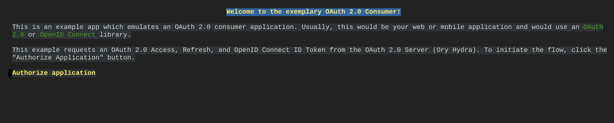
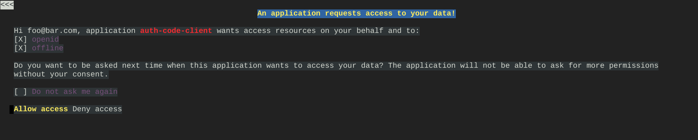
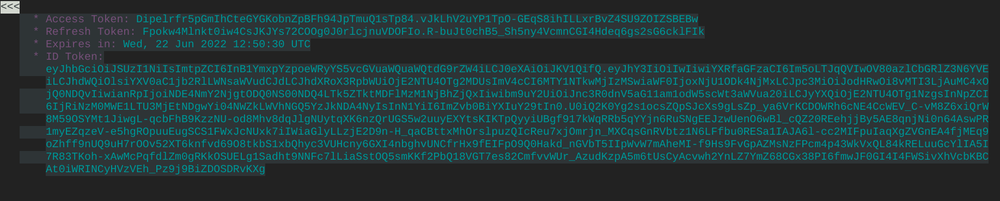

## Quick setup of Ory Hydra and an exemplary User Login & Consent App

In this tutorial we will deploy Ory Hydra based on this repository and an exemplary User Login & Consent App using the `oryd/hydra-login-consent-node:v1.11.8` image.

First, let's set all the configuration variables:

```shell
export APP_INSTANCE_NAME=hydra-1
export NAMESPACE=default
export METRICS_EXPORTER_ENABLED=false
export TAG="1.11"
export SOURCE_REGISTRY="marketplace.gcr.io/google"
export IMAGE_HYDRA="${SOURCE_REGISTRY}/hydra"
export IMAGE_POSTGRESQL="${IMAGE_REGISTRY}/hydra/postgresql:${TAG}"
export IMAGE_POSTGRESQL_EXPORTER="${IMAGE_REGISTRY}/hydra/postgresql-exporter:${TAG}"
export IMAGE_METRICS_EXPORTER="${SOURCE_REGISTRY}/hydra/prometheus-to-sd:${TAG}"

# Set alias for password generation
alias generate_pwd="cat /dev/urandom | tr -dc 'a-zA-Z0-9' | fold -w 20 | head -n 1 | tr -d '\n'"
export POSTGRES_PASSWORD="$(generate_pwd)"

# Set the login, logout and consent endpoints of the User Login & Consent flow.
export URLS_LOGIN=http://app-1:3000/login
export URLS_LOGOUT=http://app-1:3000/logout
export URLS_CONSENT=http://app-1:3000/consent

export INGRESS_PUBLIC_ENABLED=false
export INGRESS_ADMIN_ENABLED=false

export FORCE_HTTP_ENABLED=true
export URLS_SELF_ISSUER=http://127.0.0.1:4444
```

Then create the `app-1` User Login & Consent App using the following manifest:

```shell
cat <<EOF | kubectl apply -f -
apiVersion: v1
kind: Pod
metadata:
  labels:
    run: app-1
  name: app-1
  namespace: ${NAMESPACE}
spec:
  containers:
  - image: oryd/hydra-login-consent-node:v1.11.8
    name: app-1
    env:
    - name: HYDRA_ADMIN_URL
      value: "http://${APP_INSTANCE_NAME}-admin:4445"
EOF
```

After creating the `app-1`, we need to expose it:

```
kubectl expose pod app-1 --port=3000
service/app-1 exposed

kubectl get svc | grep app-1
app-1               ClusterIP   10.16.14.66    <none>        3000/TCP
```

Now it's time to create the Ory Hydra application based on the previously created configuration variables:

```shell
helm template "${APP_INSTANCE_NAME}" chart/hydra \
  --namespace "${NAMESPACE}" \
  --set hydra.image.repo="${IMAGE_HYDRA}" \
  --set hydra.image.tag="${TAG}" \
  --set postgresql.image="${IMAGE_POSTGRESQL}" \
  --set postgresql.exporter.image="${IMAGE_POSTGRESQL_EXPORTER}" \
  --set postgresql.password="${POSTGRES_PASSWORD}" \
  --set ingress.public.enabled="${INGRESS_PUBLIC_ENABLED}" \
  --set ingress.admin.enabled="${INGRESS_ADMIN_ENABLED}" \
  --set hydra.config.urls.login="${URLS_LOGIN}" \
  --set hydra.config.urls.logout="${URLS_LOGOUT}" \
  --set hydra.config.urls.consent="${URLS_CONSENT}" \
  --set hydra.dangerousForceHttp="${FORCE_HTTP_ENABLED}" \
  --set hydra.config.urls.self.issuer="${URLS_SELF_ISSUER}" \
  --set metrics.image="${IMAGE_METRICS_EXPORTER}" \
  --set metrics.exporter.enabled="${METRICS_EXPORTER_ENABLED}" > "${APP_INSTANCE_NAME}"_manifest.yaml

kubectl apply -f "${APP_INSTANCE_NAME}"_manifest.yaml
serviceaccount/hydra-sa created
serviceaccount/hydra-migration-sa created
secret/hydra-1-postgresql-secret configured
secret/hydra-1 configured
configmap/hydra-1 configured
service/hydra-1-postgresql-svc created
service/hydra-1-postgresql-exporter-svc created
service/hydra-1-admin created
service/hydra-1-public created
deployment.apps/hydra-1 created
horizontalpodautoscaler.autoscaling/hydra-1 unchanged
statefulset.apps/hydra-1-postgresql created
job.batch/hydra-1-automigrate created
application.app.k8s.io/hydra-1 created
```

After a few seconds, we can check if everything works as expected:

```shell
kubectl get pods
NAME                        READY   STATUS      RESTARTS   
app-1                       1/1     Running     0         
hydra-1-c47497f8-bvnwm      1/1     Running     0         
hydra-1-automigrate-g88qh   0/1     Completed   0        
hydra-1-postgresql-0        2/2     Running     0        
```

Next we will connect to the `hydra-1` Pod and create the OAuth 2.0 Client, perform the client credentials grant, create a client that's capable of performing the the OAuth 2.0 Authorization Code Grant and finally perform the OAuth 2.0 Authorization Code Grant:

```shell
kubectl exec -it hydra-1-c47497f8-bvnwm -c hydra -- bash

_apt@hydra-1-c47497f8-bvnwm:/$ /opt/hydra clients create \
    --endpoint http://127.0.0.1:4445/ \
    --id my-client \
    --secret secret \
    --grant-types client_credentials
OAuth 2.0 Client ID: my-client

_apt@hydra-1-c47497f8-bvnwm:/$ /opt/hydra token client \
    --endpoint http://127.0.0.1:4444/ \
    --client-id my-client \
    --client-secret secret
_TuMhZhZFNP-FnayxwUGdBSO7h1II1DiOa9_XCHjuiI.Ugy-8nr7kwS2A0RChbplyV8-O8a1-9um8bAXM6EQgGI

_apt@hydra-1-c47497f8-bvnwm:/$ /opt/hydra clients create \
    --endpoint http://127.0.0.1:4445 \
    --id auth-code-client \
    --secret secret \
    --grant-types authorization_code,refresh_token \
    --response-types code,id_token \
    --scope openid,offline \
    --callbacks http://127.0.0.1:5555/callback
OAuth 2.0 Client ID: auth-code-client

_apt@hydra-1-c47497f8-bvnwm:/$ /opt/hydra token user \
    --client-id auth-code-client \
    --client-secret secret \
    --endpoint http://127.0.0.1:4444/ \
    --port 5555 \
    --scope openid,offline
Setting up home route on http://127.0.0.1:5555/
Setting up callback listener on http://127.0.0.1:5555/callback
Press ctrl + c on Linux / Windows or cmd + c on OSX to end the process.
If your browser does not open automatically, navigate to:

        http://127.0.0.1:5555/
```


Finally, we need to check that everything is correct. From another terminal window connect to the `hydra-1` Pod and using the text web browser [lynx](https://lynx.invisible-island.net/) log in, and authorize the application:

```shell
kubectl exec -it hydra-1-c47497f8-bvnwm -c hydra -- bash
_apt@hydra-1-c47497f8-bvnwm:/$ lynx http://127.0.0.1:5555/
```






