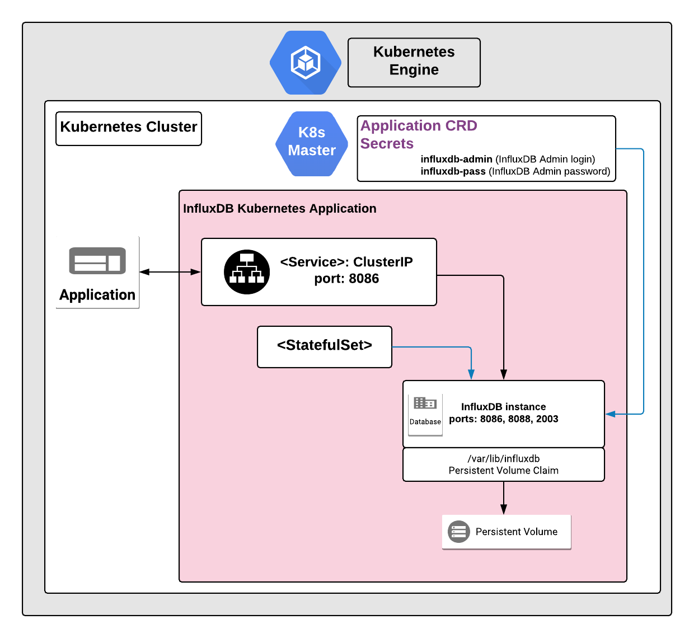

# Overview

InfluxDB is an open source database for storing time series data, such as data
from from logging and monitoring systems, or from IoT devices.

This is a single-instance version of InfluxDB. The multi-instance version of
InfluxDB requires a commercial license.

If you are interested in the enterprise version of InfluxDB visit the
[InfluxDB website](https://www.influxdata.com/).

## About Google Click to Deploy

Popular open stacks on Kubernetes packaged by Google.

## Architecture



This application is single-instance InfluxDB Kubernetes solution implemented
using a StatefulSet. A multi-instance implementation of InfluxDB requires a
commercial license from InfluxData.

A single Pod runs the InfluxDB container as a Service. By default, the Pod is
configured not to communication outside of Kubernetes cluster.

The following ports are configured by default:

*   8086 - for communication with the InfluxDB instance, and to connect the
    Grafana monitoring application.

*   8088 - for administrative access, such as to run an InfluxDB backup.

*   2003 - for monitoring. For example, you can use this port to connect
    Graphite monitoring application.

### Solution configuration

By default, this application has administrative account enabled.

You can set the admin username in the `INFLUXDB_ADMIN_USER` environment
variable.

The password for the administrative account is auto-generated and stored in the
`INFLUXDB_ADMIN_PASSWORD` environment variable.

# Installation

## Quick install with Google Cloud Marketplace

Get up and running with a few clicks! Install this InfluxDB app to a Google
Kubernetes Engine cluster using Google Cloud Marketplace. Follow the
[on-screen instructions](https://console.cloud.google.com/marketplace/details/google/influxdb).

## Command line instructions

You can use [Google Cloud Shell](https://cloud.google.com/shell/) or a local
workstation to complete the following steps.

[](https://console.cloud.google.com/cloudshell/editor?cloudshell_git_repo=https://github.com/GoogleCloudPlatform/click-to-deploy&cloudshell_open_in_editor=README.md&cloudshell_working_dir=k8s/influxdb)

### Prerequisites

#### Set up command-line tools

You'll need the following tools in your development environment. If you are
using Cloud Shell, `gcloud`, `kubectl`, Docker, and Git are installed in your
environment by default.

-   [gcloud](https://cloud.google.com/sdk/gcloud/)
-   [kubectl](https://kubernetes.io/docs/reference/kubectl/overview/)
-   [docker](https://docs.docker.com/install/)
-   [git](https://git-scm.com/book/en/v2/Getting-Started-Installing-Git)
-   [helm](https://helm.sh/)

Configure `gcloud` as a Docker credential helper:

```shell
gcloud auth configure-docker
```

#### Create a Google Kubernetes Engine cluster

Create a new cluster from the command line:

```shell
export CLUSTER=influxdb-cluster
export ZONE=us-west1-a

gcloud container clusters create "$CLUSTER" --zone "$ZONE"
```

Configure `kubectl` to connect to the new cluster.

```shell
gcloud container clusters get-credentials "$CLUSTER" --zone "$ZONE"
```

#### Clone this repo

Clone this repo and the associated tools repo:

```shell
git clone --recursive https://github.com/GoogleCloudPlatform/click-to-deploy.git
```

#### Install the Application resource definition

An Application resource is a collection of individual Kubernetes components,
such as Services, Deployments, and so on, that you can manage as a group.

To set up your cluster to understand Application resources, run the following
command:

```shell
kubectl apply -f "https://raw.githubusercontent.com/GoogleCloudPlatform/marketplace-k8s-app-tools/master/crd/app-crd.yaml"
```

You need to run this command once.

The Application resource is defined by the
[Kubernetes SIG-apps](https://github.com/kubernetes/community/tree/master/sig-apps)
community. The source code can be found on
[github.com/kubernetes-sigs/application](https://github.com/kubernetes-sigs/application).

### Install the Application

Navigate to the `influxdb` directory:

```shell
cd click-to-deploy/k8s/influxdb
```

#### Configure the app with environment variables

Choose an instance name and
[namespace](https://kubernetes.io/docs/concepts/overview/working-with-objects/namespaces/)
for the app. In most cases, you can use the `default` namespace.

```shell
export APP_INSTANCE_NAME=influxdb-1
export NAMESPACE=default
```

For the persistent disk provisioning of the InfluxDB StatefulSets, you will need to:

 * Set the StorageClass name. Check your available options using the command below:
   * ```kubectl get storageclass```
   * Or check how to create a new StorageClass in [Kubernetes Documentation](https://kubernetes.io/docs/concepts/storage/storage-classes/#the-storageclass-resource)

 * Set the persistent disk's size. The default disk size is "1Gi".

```shell
export INFLUXDB_STORAGE_CLASS="standard" # provide your StorageClass name if not "standard"
export PERSISTENT_DISK_SIZE="1Gi"
```

Configure the InfluxDB administrator account:

```shell
export INFLUXDB_ADMIN_USER=influxdb-admin
```

Configure password for InfluxDB administrator account (the value must be encoded
in base64)

```shell
export INFLUXDB_ADMIN_PASSWORD=$(cat /dev/urandom | tr -dc 'a-zA-Z0-9' | fold -w 12 | head -n 1 | tr -d '\n')
```

Enable Stackdriver Metrics Exporter:

> **NOTE:** Your GCP project must have Stackdriver enabled. If you are using a
> non-GCP cluster, you cannot export metrics to Stackdriver.

By default, application does not export metrics to Stackdriver. To enable this
option, change the value to `true`.

```shell
export METRICS_EXPORTER_ENABLED=false
```

Configure the container image:

```shell
export TAG=1.8
export IMAGE_INFLUXDB="marketplace.gcr.io/google/influxdb"
export IMAGE_METRICS_EXPORTER="marketplace.gcr.io/google/influxdb/prometheus-to-sd:${TAG}"
```

The images above are referenced by
[tag](https://docs.docker.com/engine/reference/commandline/tag). We recommend
that you pin each image to an immutable
[content digest](https://docs.docker.com/registry/spec/api/#content-digests).
This ensures that the installed application always uses the same images, until
you are ready to upgrade. To get the digest for the image, use the following
script:

```shell
for i in "IMAGE_INFLUXDB" "IMAGE_METRICS_EXPORTER"; do
  repo=$(echo ${!i} | cut -d: -f1);
  digest=$(docker pull ${!i} | sed -n -e 's/Digest: //p');
  export $i="$repo@$digest";
  env | grep $i;
done
```

#### Create namespace in your Kubernetes cluster

If you use a different namespace than `default`, run the command below to create
a new namespace:

```shell
kubectl create namespace "$NAMESPACE"
```

#### Expand the manifest template

Use `helm template` to expand the template. We recommend that you save the
expanded manifest file for future updates to the application.

```shell
helm template chart/influxdb \
  --name $APP_INSTANCE_NAME \
  --namespace $NAMESPACE \
  --set influxdb.image.repo=$IMAGE_INFLUXDB \
  --set influxdb.image.tag=$TAG \
  --set influxdb.persistence.storageClass=$INFLUXDB_STORAGE_CLASS \
  --set influxdb.persistence.size=$PERSISTENT_DISK_SIZE \
  --set admin.user=$INFLUXDB_ADMIN_USER \
  --set admin.password=$INFLUXDB_ADMIN_PASSWORD \
  --set metrics.image=$IMAGE_METRICS_EXPORTER \
  --set metrics.exporter.enabled=$METRICS_EXPORTER_ENABLED > ${APP_INSTANCE_NAME}_manifest.yaml
```

#### Apply the manifest to your Kubernetes cluster

Use `kubectl` to apply the manifest to your Kubernetes cluster:

```shell
kubectl apply -f "${APP_INSTANCE_NAME}_manifest.yaml" --namespace "${NAMESPACE}"
```

#### View the app in the Google Cloud Console

To get the GCP Console URL for your app, run the following command:

```shell
echo "https://console.cloud.google.com/kubernetes/application/${ZONE}/${CLUSTER}/${NAMESPACE}/${APP_INSTANCE_NAME}"
```

To view the app, open the URL in your browser.

### Access InfluxDB (internally)

You connect to InfluxDB without exposing it to external access using the
`influx` tool.

For information about using `influx`, and steps to upload sample data to your
instance, see the
[InfluxDB Getting Started guide](https://docs.influxdata.com/influxdb/v1.7/introduction/getting-started/).

#### Connect to the InfluxDB Pod

To connect to the InfluxDB Pod, first identify the Pod using the following
command:

```shell
kubectl get pods -o wide -l app.kubernetes.io/name=$APP_INSTANCE_NAME --namespace "$NAMESPACE"
```

Then, access InfluxDB using the `influx` tool:

```shell
kubectl exec -it "$APP_INSTANCE_NAME-influxdb-0" --namespace "$NAMESPACE" -- influx -host localhost -port 8086 -username <admin username> -password <admin password>
```

#### Connect to InfluxDB using port forwarding

The following steps assume that you have the `influx` tool on your local
machine. For steps to install `influx`, see the
[InfluxDB installation guide](https://docs.influxdata.com/influxdb/v1.7/introduction/installation/).

You can also use a local proxy to access an InfluxDB application that is not
exposed externally. Run the following command in a separate background terminal:

```shell
kubectl port-forward "${APP_INSTANCE_NAME}-influxdb-0" 8086 --namespace "${NAMESPACE}"
```

In your main terminal, you can now run `influx`:

```shell
influx -host localhost -port 8086 -username <admin username> -password <admin password>
```

### Access InfluxDB (externally)

This specific InfluxDB configuration is meant to be used as internal component
in your system, such as a part of a log collection system that includes
Prometheus, InfluxDB, and Grafana.

If you want to expose InfluxDB externally, we recommend securing the connection
to the database using SSL/TLS, which is out of the scope of this tutorial.

If you want to expose InfluxDB regardless, such as for testing, run the
following command:

```
kubectl patch svc "$APP_INSTANCE_NAME-influxdb-svc" \
  --namespace "$NAMESPACE" \
  --patch '{"spec": {"type": "LoadBalancer"}}'
```

It might take a few minutes for the external IP to be provisioned and available.

#### Extract IP address

Get the external IP of your InfluxDB instance using the following command:

```shell
INFLUXDB_IP=$(kubectl get svc $APP_INSTANCE_NAME-influxdb-svc \
  --namespace $NAMESPACE \
  --output jsonpath='{.status.loadBalancer.ingress[0].ip}')

echo $INFLUXDB_IP
```

# Application metrics

## Prometheus metrics

The application is configured to natively expose its metrics in the
[Prometheus format](https://github.com/prometheus/docs/blob/master/content/docs/instrumenting/exposition_formats.md).

You can access the metrics at `[APP_BASE_URL]:8086/metrics`, where
`[APP_BASE_URL]` is the base URL address of the application. For example, you
can
[connect to InfluxDB using port forwarding](#connect-to-influxdb-using-port-forwarding),
and then access the metrics by navigating to
[http://localhost:8086/metrics](http://localhost:8086/metrics).

### Configuring Prometheus to collect metrics

Prometheus can be configured to automatically collect the application's metrics.
Follow the steps in
[Configuring Prometheus](https://prometheus.io/docs/introduction/first_steps/#configuring-prometheus).

You configure the metrics in the
[`scrape_configs` section](https://prometheus.io/docs/prometheus/latest/configuration/configuration/#scrape_config).

## Exporting metrics to Stackdriver

The deployment includes a
[Prometheus to Stackdriver (`prometheus-to-sd`)](https://github.com/GoogleCloudPlatform/k8s-stackdriver/tree/master/prometheus-to-sd)
container. If you enabled the option to export metrics to Stackdriver, the
metrics are automatically exported to Stackdriver and visible in
[Stackdriver Metrics Explorer](https://cloud.google.com/monitoring/charts/metrics-explorer).
The name of each metric starts with the application's name, which you define in
the `APP_INSTANCE_NAME` environment variable.

The exporting option might not be available for GKE on-prem clusters.

> Note: Stackdriver has [quotas](https://cloud.google.com/monitoring/quotas) for
> the number of custom metrics created in a single GCP project. If the quota is
> met, additional metrics might not show up in the Stackdriver Metrics Explorer.

You can remove existing metric descriptors using
[Stackdriver's REST API](https://cloud.google.com/monitoring/api/ref_v3/rest/v3/projects.metricDescriptors/delete).

# Scaling

This is a single-instance version of InfluxDB. You cannot scale it.

If you are interested in a multi-instance/enterprise version of InfluxDB, see
the [InfluxDB website](https://www.influxdata.com/).

# Backup and Restore

The following steps are based on the
[InfluxDB documentation](https://docs.influxdata.com/influxdb/v1.7/administration/backup_and_restore/).

For backing up and restoring the database, use the `influxd backup` and `influxd
restore` commands respectively.

To access the admin interface for InfluxDB, you need connectivity on port 8088.

Before you begin, create an `influxdb-backup` directory on your local computer,
and make sure that is empty.

## Backup InfluxDB data to your local computer

Navigate to the `influxdb/scripts` directory:

```shell
cd click-to-deploy/k8s/influxdb/scripts
```

Run the [`make_backup.sh`](scripts/make_backup.sh) script, passing the name of
your InfluxDB instance as an argument.

```shell
./make_backup.sh $APP_INSTANCE_NAME $NAMESPACE [BACKUP_FOLDER]
```

The backup is stored in the `influxdb-backup` directory on your local computer.

## Restore InfluxDB data on running InfluxDB instance

Navigate to the `influxdb/scripts` directory:

```shell
cd click-to-deploy/k8s/influxdb/scripts
```

Run the [`make_restore.sh`](scripts/make_restore.sh) script, passing the name of
your InfluxDB instance as an argument.

```shell
./make_restore.sh $APP_INSTANCE_NAME $NAMESPACE [BACKUP_FOLDER]
```

The data is restored from the backup in the `influxdb-backup` directory on your
local computer.

# Upgrading the app

Because this is a single-instance InfluxDB solution, note that an upgrade causes
some downtime for your application. Your InfluxDB configuration and data are
retained after the upgrade.

The following steps assume that a new image for the InfluxDB container is
published and available to your Kubernetes cluster. The new image is used in the
commands below as `[NEW_IMAGE_REFERENCE]`.

In the InfluxDB StatefulSet, modify the image used for the Pod template:

```shell
kubectl set image statefulset "$APP_INSTANCE_NAME-influxdb" \
  --namespace "$NAMESPACE" influxdb=[NEW_IMAGE_REFERENCE]
```

where `[NEW_IMAGE_REFERENCE]` is the new image.

To check the status of Pods in the StatefulSet and the progress of deploying the
new image, run the following command:

```shell
kubectl get pods -l app.kubernetes.io/name=$APP_INSTANCE_NAME --namespace "$NAMESPACE"
```

To check the current image used by Pods in the application, run the following
command:

```shell
kubectl get pods -l app.kubernetes.io/name=$APP_INSTANCE_NAME --namespace "$NAMESPACE" -o=jsonpath='{range .items[*]}{"\n"}{.metadata.name}{":\t"}{range .spec.containers[*]}{.image}{", "}{end}{end}' | sort
```

# Uninstall the Application

## Using the Google Cloud Platform Console

1.  In the GCP Console, open
    [Kubernetes Applications](https://console.cloud.google.com/kubernetes/application).

1.  From the list of applications, click **InfluxDB**.

1.  On the Application Details page, click **Delete**.

## Using the command line

### Prepare the environment

Set your installation name and Kubernetes namespace:

```shell
export APP_INSTANCE_NAME=influxdb-1
export NAMESPACE=default
```

### Delete the resources

> **NOTE:** We recommend using a `kubectl` version that is the same as the
> version of your cluster. Using the same versions of `kubectl` and the cluster
> helps avoid unforeseen issues.

To delete the resources, use the expanded manifest file used for the
installation.

Run `kubectl` on the expanded manifest file:

```shell
kubectl delete -f ${APP_INSTANCE_NAME}_manifest.yaml --namespace $NAMESPACE
```

Otherwise, delete the resources using types and a label:

```shell
kubectl delete application,statefulset,service \
  --namespace $NAMESPACE \
  --selector app.kubernetes.io/name=$APP_INSTANCE_NAME
```

### Delete the PersistentVolumeClaims

By design, the removal of StatefulSets in Kubernetes does not remove
PersistentVolumeClaims that were attached to their Pods. This prevents your
installations from accidentally deleting stateful data.

To remove the PersistentVolumeClaims with their attached persistent disks, run
the following `kubectl` commands:

```shell
# specify the variables values matching your installation:
export APP_INSTANCE_NAME=influxdb-1
export NAMESPACE=default

kubectl delete persistentvolumeclaims \
  --namespace $NAMESPACE \
  --selector app.kubernetes.io/name=$APP_INSTANCE_NAME
```

### Delete the GKE cluster

Optionally, if you don't need the deployed application or the GKE cluster,
delete the cluster using this command:

```
gcloud container clusters delete "$CLUSTER" --zone "$ZONE"
```
