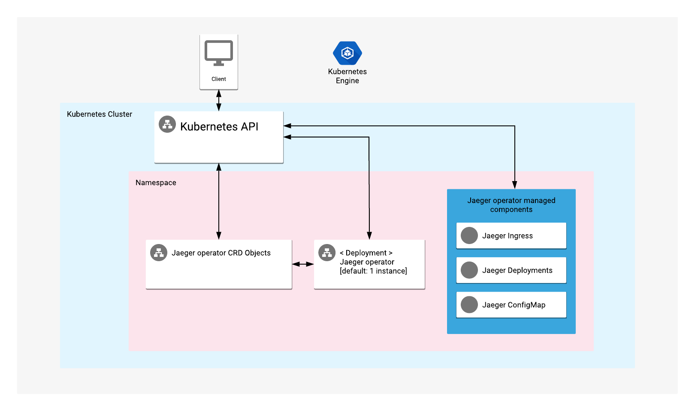

# Overview

Jaeger operator provides a deployment instance of Jaeger tracing tool, designed
for microservices-based distributed systems.

For more information, visit the [Jaeger official website](https://www.jaegertracing.io/docs/1.15/operator/).

## About Google Click to Deploy

Popular open stacks on Kubernetes packaged by Google.

## Architecture



The application offers Jaeger operator CRDs and deployments of Jaeger operator on a Kubernetes cluster.

Installation requires access to a Docker registry to build and deploy Jaeger applications.

# Installation

## Quick install with Google Cloud Marketplace

Get up and running with a few clicks! Install this Jaeger operator app to a
Google Kubernetes Engine cluster using Google Cloud Marketplace. Follow the
[on-screen instructions](https://console.cloud.google.com/marketplace/details/google/jaeger-operator).

## Command line instructions

### Prerequisites

#### Set up command-line tools

You'll need the following tools in your development environment. If you are
using Cloud Shell, `gcloud`, `kubectl`, Docker, and Git are installed in your
environment by default.

- [gcloud](https://cloud.google.com/sdk/gcloud/)
- [kubectl](https://kubernetes.io/docs/reference/kubectl/overview/)
- [docker](https://docs.docker.com/install/)
- [git](https://git-scm.com/book/en/v2/Getting-Started-Installing-Git)
- [helm](https://helm.sh/)

Configure `gcloud` as a Docker credential helper:

```shell
gcloud auth configure-docker
```

#### Create a Google Kubernetes Engine (GKE) cluster

Create a new cluster from the command line:

```shell
export CLUSTER=jaeger-operator-cluster
export ZONE=us-west1-a

gcloud container clusters create "${CLUSTER}" --zone "${ZONE}"
```

Configure `kubectl` to connect to the new cluster.

```shell
gcloud container clusters get-credentials "${CLUSTER}" --zone "${ZONE}"
```

#### Clone this repo

Clone this repo and the associated tools repo:

```shell
git clone --recursive https://github.com/GoogleCloudPlatform/click-to-deploy.git
```

#### Install the Application resource definition

An Application resource is a collection of individual Kubernetes components,
such as Services, Deployments, and so on, that you can manage as a group.

To set up your cluster to understand Application resources, run the following command:

```shell
kubectl apply -f "https://raw.githubusercontent.com/GoogleCloudPlatform/marketplace-k8s-app-tools/master/crd/app-crd.yaml"
```

You need to run this command once.

The Application resource is defined by the
[Kubernetes SIG-apps](https://github.com/kubernetes/community/tree/master/sig-apps) community.
The source code can be found on [github.com/kubernetes-sigs/application](https://github.com/kubernetes-sigs/application).

### Install the Application

Navigate to the `jaeger-operator` directory:

```shell
cd click-to-deploy/k8s/jaeger-operator
```

#### Configure the app with environment variables

Choose an instance name and
[namespace](https://kubernetes.io/docs/concepts/overview/working-with-objects/namespaces/)
for the app. In most cases, you can use the `default` namespace.

```shell
export APP_INSTANCE_NAME=jaeger-operator-1
export NAMESPACE=default
```

Configure the container image:

```shell
export TAG=1.15
export IMAGE_OPERATOR="marketplace.gcr.io/google/jaeger-operator"
```

#### Create namespace in your Kubernetes cluster

If you use a different namespace than the `default`, run the command below to create a new namespace:

```shell
kubectl create namespace "${NAMESPACE}"
```

##### Create dedicated Service Accounts

Define the environment variables:

```shell
export OPERATOR_SERVICE_ACCOUNT="${APP_INSTANCE_NAME}-jaeger-operator"
export CRD_SERVICE_ACCOUNT="${APP_INSTANCE_NAME}-crd-creator-job"
```

Expand the manifest to create Service Accounts:

```shell
cat resources/service-accounts.yaml \
  | envsubst '${APP_INSTANCE_NAME} \
              ${NAMESPACE} \
              ${OPERATOR_SERVICE_ACCOUNT} \
              ${CRD_SERVICE_ACCOUNT}' \
    > "${APP_INSTANCE_NAME}_sa_manifest.yaml"
```

Create the accounts on the cluster with `kubectl`:

```shell
kubectl apply -f "${APP_INSTANCE_NAME}_sa_manifest.yaml" \
    --namespace "${NAMESPACE}"
```

#### Expand the manifest template

Use `helm template` to expand the template. We recommend that you save the
expanded manifest file for future updates to the application.

```shell
helm template chart/jaeger-operator \
  --name ${APP_INSTANCE_NAME} \
  --namespace="${NAMESPACE}" \
  --set operator.image.repository=${IMAGE_OPERATOR} \
  --set operator.image.tag=${TAG} \
  --set deployerHelm.image="gcr.io/cloud-marketplace-tools/k8s/deployer_helm:0.8.0" \
  --set operator.serviceAccountName=${OPERATOR_SERVICE_ACCOUNT} \
  --set CDRJobServiceAccount=${CRD_SERVICE_ACCOUNT} \
  > ${APP_INSTANCE_NAME}_manifest.yaml
```

#### Apply the manifest to your Kubernetes cluster

Use `kubectl` to apply the manifest to your Kubernetes cluster:

```shell
kubectl apply -f "${APP_INSTANCE_NAME}_manifest.yaml" --namespace "${NAMESPACE}"
```

#### View the app in the Google Cloud Console

To get the Cloud Console URL for your app, run the following command:

```shell
echo "https://console.cloud.google.com/kubernetes/application/${ZONE}/${CLUSTER}/${NAMESPACE}/${APP_INSTANCE_NAME}"
```

To view the app, open the URL in your browser.


# Deploy an instance of Jaeger

Run the following command to deploy a Jaeger instance:

```shell
kubectl apply --namespace "${NAMESPACE}" -f - <<EOF
apiVersion: jaegertracing.io/v1
kind: Jaeger
metadata:
  name: example
EOF
```

Optionally you can deploy Jaeger instance to another namespace.

You can find additional configuration options on [official documentation page](https://www.jaegertracing.io/docs/1.15/operator/#configuring-the-custom-resource)

### Get detailed information about example Jaeger deployment
Run the following command:

```shelll
kubectl get Jaeger example --namespace "${NAMESPACE}" -o yaml
```

### Get access to the example Jaeger Dashboard

Jaeger query interface will be available at [http://localhost:16686/](http://localhost:16686/)

Run the following command to start port forwarding:
```shell
kubectl --namespace "${NAMESPACE}" port-forward \
    service/example-query  16686:16686
```

# Scaling up or down

Scaling is not supported for Jaeger operator.

# Backup and Restore

## Backup Jaeger configuration data to your local environment

Backup Jaeger resources using the following command:

```shell
export NAMESPACE=default
kubectl --namespace "${NAMESPACE}" get crd \
   jaegers.jaegertracing.io
   --output=yaml > backup_file.yaml
```

## Restore Jaeger configuration from local environment

```shell
kubectl --namespace "${NAMESPACE}" apply -f backup_file.yaml
```

# Upgrading the app

The Jaeger operator Deployments is configured to roll out updates automatically.
Start the update by patching the Deployment with a new image reference:

```shell
kubectl set image deployment ${APP_INSTANCE_NAME}-jaeger-operator --namespace ${NAMESPACE} \
  "jaeger-operator=[NEW_OPERATOR_IMAGE_REFERENCE]"
```

Where `[NEW_OPERATOR_IMAGE_REFERENCE]` are the Docker image references of the new images that you want to use.

To check the status of Pods in the StatefulSet, and the progress of
the new image, run the following command:

```shell
kubectl get pods --selector app.kubernetes.io/name=${APP_INSTANCE_NAME} \
  --namespace ${NAMESPACE}
```

# Uninstall the Application

## Using the Google Cloud Platform Console

1. In the GCP Console, open [Kubernetes Applications](https://console.cloud.google.com/kubernetes/application).
1. From the list of applications, click **Jaeger**.

1. On the Application Details page, click **Delete**.

## Using the command line

### Prepare the environment

Set your installation name and Kubernetes namespace:

```shell
export APP_INSTANCE_NAME=jaeger-operator-1
export NAMESPACE=default
```

### Delete the resources

> **NOTE:** We recommend to use a kubectl version that is the same as the version of your cluster.
Using the same versions of kubectl and the cluster helps avoid unforeseen issues.

To delete the resources, use the expanded manifest file used for the
installation.

Run `kubectl` on the expanded manifest file:

```shell
kubectl delete -f ${APP_INSTANCE_NAME}_manifest.yaml --namespace ${NAMESPACE}
```

Otherwise, delete the resources using types and a label:

```shell
kubectl delete application \
  --namespace ${NAMESPACE} \
  --selector app.kubernetes.io/name=${APP_INSTANCE_NAME}
```

> **NOTE:** It will delete only the jaeger-operator application. All jaeger-operator managed resources will be available.

### Delete the GKE cluster

Optionally, if you don't need the deployed application or the GKE cluster,
delete the cluster using this command:

```shell
gcloud container clusters delete "${CLUSTER}" --zone "${ZONE}"
```
