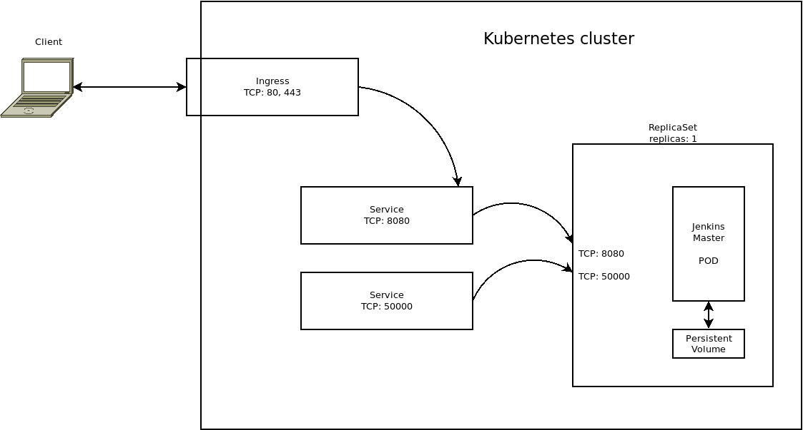

# Overview

Jenkins is the leading open source automation server. It provides hundreds of
plugins that you can use to build, deploy, and automate any project.

For more information on Jenkins, visit the
[official Jenkins website](https://jenkins.io/).

## About Google Click to Deploy

Popular open source software stacks on Kubernetes, packaged by Google.

## Architecture



This solution installs a single instance of Jenkins Server on your Kubernetes
cluster.

The Jenkins Pod is managed by a StatefulSet, with the number of replicas set
to 1. The Jenkins Pod uses a PersistentVolume to store data, a LoadBalancer
Service to expose the Agent Connector port to the cluster, and an Ingress to
expose the UI to external users. If you need to limit access to the Jenkins UI,
you must configure Google Cloud firewall rules.

To install the app, you must
[generate or provide a TLS key and certificate](#create-tls-certificate-for-jenkins).

# Installation

## Quick install with Google Cloud Marketplace

Get up and running with a few clicks! To install this Jenkins app to a Google
Kubernetes Engine cluster using Google Cloud Marketplace, follow the
[on-screen instructions](https://console.cloud.google.com/marketplace/details/google/jenkins).

## Command-line instructions

You can use [Google Cloud Shell](https://cloud.google.com/shell/) or a local
workstation to complete these steps.

[](https://console.cloud.google.com/cloudshell/editor?cloudshell_git_repo=https://github.com/GoogleCloudPlatform/click-to-deploy&cloudshell_open_in_editor=README.md&cloudshell_working_dir=k8s/jenkins)

### Prerequisites

#### Set up command-line tools

You'll need the following tools in your environment. If you are using Cloud
Shell, `gcloud`, `kubectl`, Docker, and Git are installed in your environment by
default.

-   [gcloud](https://cloud.google.com/sdk/gcloud/)
-   [kubectl](https://kubernetes.io/docs/tasks/tools/install-kubectl/)
-   [docker](https://docs.docker.com/install/)
-   [git](https://git-scm.com/book/en/v2/Getting-Started-Installing-Git)
-   [helm](https://helm.sh/)

Configure `gcloud` as a Docker credential helper:

```shell
gcloud auth configure-docker
```

#### Create a Google Kubernetes Engine cluster

Create a cluster from the command-line. If you already have a cluster that you
want to use, skip this step.

```shell
export CLUSTER=jenkins-cluster
export ZONE=us-west1-a
```

```shell
gcloud container clusters create "$CLUSTER" --zone "$ZONE"
```

#### Configure `kubectl` to connect to the cluster

```shell
gcloud container clusters get-credentials "$CLUSTER" --zone "$ZONE"
```

#### Clone this repo

Clone this repo and its associated tools repo:

```shell
git clone --recursive https://github.com/GoogleCloudPlatform/click-to-deploy.git
```

#### Install the Application resource definition

An Application resource is a collection of individual Kubernetes components,
such as Services, Deployments, and so on, that you can manage as a group.

To set up your cluster to understand Application resources, run the following
command:

```shell
kubectl apply -f "https://raw.githubusercontent.com/GoogleCloudPlatform/marketplace-k8s-app-tools/master/crd/app-crd.yaml"
```

You need to run this command once for each cluster.

The Application resource is defined by the
[Kubernetes SIG-apps](https://github.com/kubernetes/community/tree/master/sig-apps)
community. The source code can be found on
[github.com/kubernetes-sigs/application](https://github.com/kubernetes-sigs/application).

### Install the app

Navigate to the `jenkins` directory:

```shell
cd click-to-deploy/k8s/jenkins
```

#### Configure the app with environment variables

Choose an instance name and
[namespace](https://kubernetes.io/docs/concepts/overview/working-with-objects/namespaces/)
for the app. In most cases, you can use the `default` namespace.

```shell
export APP_INSTANCE_NAME=jenkins-1
export NAMESPACE=default
```

For the persistent disk provisioning of the Jenkins application StatefulSets, you will need to:

 * Set the StorageClass name. Check your available options using the command below:
   * ```kubectl get storageclass```
   * Or check how to create a new StorageClass in [Kubernetes Documentation](https://kubernetes.io/docs/concepts/storage/storage-classes/#the-storageclass-resource)

 * Set the persistent disk's size. The default disk size is "8Gi".

```shell
export JENKINS_STORAGE_CLASS="standard" # provide your StorageClass name if not "standard"
export JENKINS_PERSISTENT_DISK_SIZE="8Gi"
```

Configure the container images:

```shell
export IMAGE_JENKINS_TAG=2.190
export IMAGE_JENKINS_REPO="marketplace.gcr.io/google/jenkins"
export IMAGE_JENKINS="${IMAGE_JENKINS_REPO}:${IMAGE_JENKINS_TAG}"
```

The image above is referenced by
[tag](https://docs.docker.com/engine/reference/commandline/tag). We recommend
that you pin each image to an immutable
[content digest](https://docs.docker.com/registry/spec/api/#content-digests).
This ensures that the installed app always uses the same images, until
you are ready to upgrade. To get the digest for the image, use the following
script:

```shell
export IMAGE_JENKINS=$(docker pull $IMAGE_JENKINS | awk -F: "/^Digest:/ {print gensub(\":.*$\", \"\", 1, \"$IMAGE_JENKINS\")\"@sha256:\"\$3}")
```

#### Create a TLS certificate for Jenkins

> Note: You can skip this step if you have not set up external access.

1.  If you already have a certificate that you want to use, copy your
    certificate and key pair to the `/tmp/tls.crt` and `/tmp/tls.key` files,
    respectively, and then skip to the next step.

    To create a new certificate, run the following command:

    ```shell
    openssl req -x509 -nodes -days 365 -newkey rsa:2048 \
        -keyout /tmp/tls.key \
        -out /tmp/tls.crt \
        -subj "/CN=jenkins/O=jenkins"
    ```

1.  Set the `TLS_CERTIFICATE_KEY` and `TLS_CERTIFICATE_CRT` variables:

    ```shell
    export TLS_CERTIFICATE_KEY="$(cat /tmp/tls.key | base64)"
    export TLS_CERTIFICATE_CRT="$(cat /tmp/tls.crt | base64)"
    ```

#### Expand the manifest template

Use `helm template` to expand the template. We recommend that you save the
expanded manifest file for future updates to your app.

```shell
helm template $APP_INSTANCE_NAME chart/jenkins \
  --namespace $NAMESPACE \
  --set "jenkins.image.repo=$IMAGE_JENKINS_REPO" \
  --set "jenkins.image.tag=$IMAGE_JENKINS_TAG" \
  --set "jenkins.persistence.storageClass=$JENKINS_STORAGE_CLASS" \
  --set "jenkins.persistence.size=$JENKINS_PERSISTENT_DISK_SIZE" \
  --set "tls.base64EncodedPrivateKey=$TLS_CERTIFICATE_KEY" \
  --set "tls.base64EncodedCertificate=$TLS_CERTIFICATE_CRT" \
  > ${APP_INSTANCE_NAME}_manifest.yaml
```

#### Apply the manifest to your Kubernetes cluster

Use `kubectl` to apply the manifest to your Kubernetes cluster. This
installation creates:

-   An Application resource, which collects all the deployment resources into
    one logical entity.
-   A PersistentVolume and PersistentVolumeClaim. If an installation is deleted, the
    volume is not deleted with it. If you delete an installation, then recreate it
    with the same name, the new installation will use the same PersistentVolume. As
    a result, there will be no app initialization, and the old configuration will
    be used.
-   A StatefulSet.
-   Two Services, which expose Jenkins Master UI (8080) and Agents Connector
    (50000) ports to the cluster.
-   An Ingress, which exposes the Jenkins Master UI externally.

```shell
kubectl apply -f "${APP_INSTANCE_NAME}_manifest.yaml" --namespace "${NAMESPACE}"
```

#### View the app in the Google Cloud Console

To get the Cloud Console URL for your app, run the following command:

```shell
echo "https://console.cloud.google.com/kubernetes/application/${ZONE}/${CLUSTER}/${NAMESPACE}/${APP_INSTANCE_NAME}"
```

To view the app, open the URL in your browser.

# Using the app

## Sign in to your new Jenkins instance

To sign in to Jenkins, get the Jenkins HTTP/HTTPS address and the Jenkins master
Pod name:

```shell
EXTERNAL_IP=$(kubectl -n$NAMESPACE get ingress -l "app.kubernetes.io/name=$APP_INSTANCE_NAME" \
  -ojsonpath="{.items[0].status.loadBalancer.ingress[0].ip}")
MASTER_POD=$(kubectl -n$NAMESPACE get pod -oname | sed -n /\\/$APP_INSTANCE_NAME-jenkins/s.pods\\?/..p)

echo https://$EXTERNAL_IP/
```

When you access your cluster using HTTPS, you might have to accept a temporary
certificate.

To get your Jenkins password, run the following command:

```shell
kubectl -n $NAMESPACE exec $MASTER_POD cat /var/jenkins_home/secrets/initialAdminPassword
```

## Follow the on-screen steps

To set up Jenkins and customize your installation, follow these on-screen steps:

*   Install plugins
*   Create the first admin user
*   Optionally, configure the Jenkins URL; you can also change the URL later

# Deploying Jenkins agents using Kubernetes

For information about using Jenkins with Kubernetes, refer to [Integrate Jenkins and Kubernetes](docs/CONFIGURE_K8S_PLUGIN_IN_JENKINS.md)

# App metrics

## Prometheus metrics

The app is configured to expose its metrics through the
[Jenkins Monitoring plugin](https://wiki.jenkins.io/display/JENKINS/Monitoring)
in the
[Prometheus format](https://github.com/prometheus/docs/blob/master/content/docs/instrumenting/exposition_formats.md).

You can access the metrics at at `[APP_BASE_URL]:8080/monitoring?format=prometheus`, where
`[APP_BASE_URL]` is the base URL address of the app.

### Configuring Prometheus to collect metrics

Prometheus can be configured to automatically collect the app's metrics.
Follow the steps in
[Configuring Prometheus](https://prometheus.io/docs/introduction/first_steps/#configuring-prometheus).

You configure the metrics in the
[`scrape_configs` section](https://prometheus.io/docs/prometheus/latest/configuration/configuration/#scrape_config).
Note that you need to configure authentication to get access to Jenkins metrics.

# Scaling

This installation is a single-master instance of Jenkins. If you need more
resources, or if you need to distribute your Jenkins workloads, you must create
additional instances of Jenkins agents. For information on setting up
distributed Jenkins installations, visit the
[Jenkins wiki](https://wiki.jenkins.io/display/JENKINS/Distributed+builds).

# Back up and restore

## Backing up Jenkins

You can manually back up your Jenkins PersistentVolume, or install the Backup
plugin.

To install the Backup plugin, open the Jenkins plugin manager. To get the URL
for the plugin manager, run the following command:

```shell
echo https://$EXTERNAL_IP/pluginManager/available
```

Select the Backup plugin. In the plugin, set **Backup directory** to
"/var/jenkins_home". Configure the plugin to use the `.tar.gz` format. Set any
other backup settings at the following URL:

```shell
echo https://$EXTERNAL_IP/backup/backupsettings
```

Create your backup from the following URL:

```shell
echo https://$EXTERNAL_IP/backup/launchBackup
```

Save the backup file to your workstation:

```shell
kubectl -n$NAMESPACE cp $MASTER_POD:/var/jenkins_home/<YOUR-BACKUP-FILE-NAME.tar.gz> /tmp
```

## Restoring your data

If you backed up your Jenkins PersistentVolume, copy the data back to the
PersistentVolume.

If you used the Backup plugin, copy the backup file to your Jenkins master
container using the following command:

```shell
kubectl -n $NAMESPACE cp /tmp/[BACKUP_FILE_NAME].tar.gz $MASTER_POD:/var/jenkins_home/
```

Then, use the Jenkins Backup plugin to restore your data from the following
URL:

```shell
echo https://$EXTERNAL_IP/backup/launchrestore
```

# Updating

To update your Jenkins installation, delete your Jenkins Pod, and install a new
version from Google Cloud Marketplace. Back up your data, and then run the following
command:

```shell
# back up your data before running

kubectl -n $NAMESPACE delete pod $MASTER_POD
```

# Logging and monitoring

This Jenkins installation logs to
[Stackdriver](https://cloud.google.com/monitoring/).

# Deleting your Jenkins installation

> Warning: The following command deletes Jenkins from your cluster. If you need
> your data, back it up first.

```shell
kubectl delete -f ${APP_INSTANCE_NAME}_manifest.yaml --namespace $NAMESPACE
```
