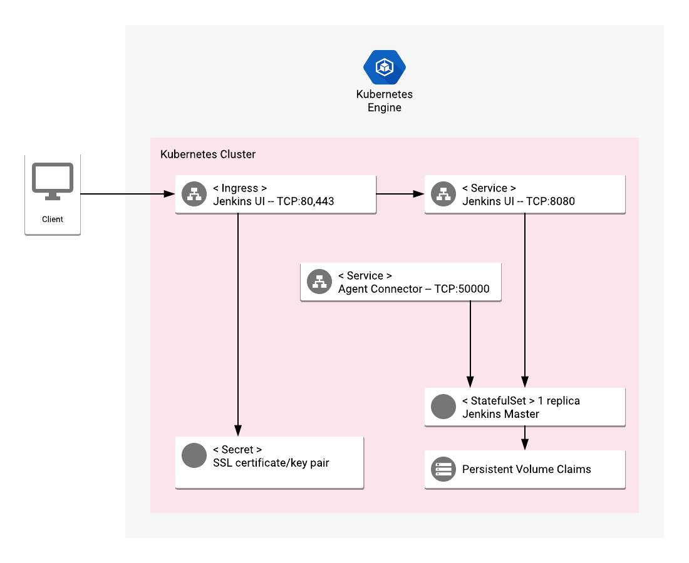

# Overview

The leading open source automation server, Jenkins provides hundreds of plugins to support building, deploying and automating any project.

For more information on Jenkins, see the [Jenkins website](https://jenkins.io/).

## About Google Click to Deploy

Popular open source software stacks on Kubernetes packaged by Google and made available in Google Cloud Marketplace.

## Design



### Solution Information

This solution will install a single instance of Jenkins server into your Kubernetes cluster.

The Jenkins pod is managed by a ReplicaSet with the number of replicas set to one (1). The Jenkins pod uses a PersistentVolume to store data, a LoadBalancer Service to expose the Agent Connector port to the cluster, and Ingress to expose the UI to external users. If you need to limit access to the Jenkins UI, you must configure GCP firewall rules.

To install the application you will need to generate or provide TLS key and certificate. All required steps are covered further in this README.

# Installation

## Quick install with Google Cloud Marketplace

Get up and running with a few clicks! Install this Jenkins app to a Google Kubernetes Engine cluster using Google Cloud Marketplace. Follow the
[on-screen instructions](https://console.cloud.google.com/marketplace/details/google/jenkins).

## Command line instructions

You can use [Google Cloud Shell](https://cloud.google.com/shell/) or a local workstation in the
further instructions.

[](https://console.cloud.google.com/cloudshell/editor?cloudshell_git_repo=https://github.com/GoogleCloudPlatform/click-to-deploy&cloudshell_working_dir=k8s/jenkins)

### Prerequisites

#### Set up command line tools

You'll need the following tools in your environment:

- [gcloud](https://cloud.google.com/sdk/gcloud/)
- [kubectl](https://kubernetes.io/docs/tasks/tools/install-kubectl/)
- [docker](https://docs.docker.com/install/)

Configure `gcloud` as a Docker credential helper:

```shell
gcloud auth configure-docker
```

#### Create a Google Kubernetes Engine cluster

Create a cluster from the command line. If you already have a cluster that
you want to use, this step is optional.

```shell
export CLUSTER=jenkins-cluster
export ZONE=us-west1-a
```

```shell
gcloud container clusters create "$CLUSTER" --zone "$ZONE"
```

#### Configure kubectl to connect to the cluster

```shell
gcloud container clusters get-credentials "$CLUSTER" --zone "$ZONE"
```

#### Clone this repo

Clone this repo and the associated tools repo:

```shell
git clone --recursive https://github.com/GoogleCloudPlatform/click-to-deploy.git
```

#### Install the Application resource definition

An Application resource is a collection of individual Kubernetes components,
such as Services, Deployments, and so on, that you can manage as a group.

To set up your cluster to understand Application resources, run the following command:

```shell
kubectl apply -f "https://raw.githubusercontent.com/GoogleCloudPlatform/marketplace-k8s-app-tools/master/crd/app-crd.yaml"
```

You need to run this command once for each cluster.

The Application resource is defined by the
[Kubernetes SIG-apps](https://github.com/kubernetes/community/tree/master/sig-apps) community. The source code can be found on
[github.com/kubernetes-sigs/application](https://github.com/kubernetes-sigs/application).

### Install the Application

Navigate to the `jenkins` directory:

```shell
cd click-to-deploy/k8s/jenkins
```

#### Configure the app with environment variables

Choose an instance name and
[namespace](https://kubernetes.io/docs/concepts/overview/working-with-objects/namespaces/)
for the app. In most cases, you can use the `default` namespace.

```shell
export APP_INSTANCE_NAME=jenkins-1
export NAMESPACE=default
```

Configure the container images:

```shell
TAG=2.150
export IMAGE_JENKINS="marketplace.gcr.io/google/jenkins:${TAG}"
export IMAGE_METRICS_EXPORTER="marketplace.gcr.io/google/jenkins/prometheus-to-sd:${TAG}"
```

The image above is referenced by
[tag](https://docs.docker.com/engine/reference/commandline/tag). We recommend
that you pin each image to an immutable
[content digest](https://docs.docker.com/registry/spec/api/#content-digests).
This ensures that the installed application always uses the same images,
until you are ready to upgrade. To get the digest for the image, use the
following script:

```shell
export IMAGE_JENKINS=$(docker pull $IMAGE_JENKINS | awk -F: "/^Digest:/ {print gensub(\":.*$\", \"\", 1, \"$IMAGE_JENKINS\")\"@sha256:\"\$3}")
```

Create a certificate for Jenkins. If you already have a certificate that you
want to use, copy your certificate and key pair in to the `/tmp/tls.crt` and
`/tmp/tls.key` files.

```shell
# create a certificate for jenkins
openssl req -x509 -nodes -days 365 -newkey rsa:2048 \
    -keyout /tmp/tls.key \
    -out /tmp/tls.crt \
    -subj "/CN=jenkins/O=jenkins"

# create a secret for K8s ingress SSL
kubectl --namespace $NAMESPACE create secret generic $APP_INSTANCE_NAME-tls \
        --from-file=/tmp/tls.crt --from-file=/tmp/tls.key
```

#### Expand the manifest template

Use `helm template` to expand the template. We recommend that you save the
expanded manifest file for future updates to the application.

```shell
helm template chart/jenkins \
  --name $APP_INSTANCE_NAME \
  --namespace $NAMESPACE \
  --set jenkins.image=$IMAGE_JENKINS \
  --set metrics.image=$IMAGE_METRICS_EXPORTER \
  --set metrics.enabled=$METRICS_EXPORTER_ENABLED > ${APP_INSTANCE_NAME}_manifest.yaml
```

#### Apply the manifest to your Kubernetes cluster

Use `kubectl` to apply the manifest to your Kubernetes cluster. This installation will create:

- An Application resource, which collects all the deployment resources into one logical entity
- A PersistentVolume and PersistentVolumeClaim. Note that the volume isn't be deleted with application. If you delete the installation and recreate it with the same name, the new installation uses the same PersistentVolume. As a result, there is no application initialization and the old configuration is used.
- A Deployment
- Two Services, which expose Jenkins Master UI (8080) and Agents Connector (50000) ports to the cluster
- An Ingress, which exposes Jenkins Master UI to the external world

```shell
kubectl apply -f "${APP_INSTANCE_NAME}_manifest.yaml" --namespace "${NAMESPACE}"
```

#### View the app in the Google Cloud Console

To get the Console URL for your app, run the following command:

```shell
echo "https://console.cloud.google.com/kubernetes/application/${ZONE}/${CLUSTER}/${NAMESPACE}/${APP_INSTANCE_NAME}"
```

To view the app, open the URL in your browser.

# Using the app

## Sign in to your new Jenkins instance

To sign in to Jenkins, get the Jenkins HTTP/HTTPS address and the Jenkins 
master pod name:

```shell
EXTERNAL_IP=$(kubectl -n$NAMESPACE get ingress -l "app.kubernetes.io/name=$APP_INSTANCE_NAME" \
  -ojsonpath="{.items[0].status.loadBalancer.ingress[0].ip}")
MASTER_POD=$(kubectl -n$NAMESPACE get pod -oname | sed -n /\\/$APP_INSTANCE_NAME-jenkins-deployment/s.pods\\?/..p)

echo https://$EXTERNAL_IP/
```

When you access your cluster using HTTPS, you might have to accept a
the temporary certificate.

To get your Jenkins password, run the following command:

```shell
kubectl -n $NAMESPACE exec $MASTER_POD cat /var/jenkins_home/secrets/initialAdminPassword
```

## Follow the on-screen steps

To set Jenkins, follow these on-screen steps to customize your installation:

* Install plugins
* Create the first admin user
* Optionally, configure the Jenkins URL. You can also change the URL later.

# Application metrics

## Prometheus metrics

The application is configured to expose its metrics through
[Jenkins Prometheus.io exporter plugin](https://github.com/jenkinsci/prometheus-plugin)
in the [Prometheus format](https://github.com/prometheus/docs/blob/master/content/docs/instrumenting/exposition_formats.md).
Metrics can be read on a single HTTP endpoint available at `[APP_BASE_URL]:8080/prometheus/`,
where `[APP_BASE_URL]` is the base URL address of the application.

## Configuring Prometheus to collect the metrics

Prometheus can be configured to automatically collect the application's metrics.
Follow the [Configuring Prometheus documentation](https://prometheus.io/docs/introduction/first_steps/#configuring-prometheus)
to enable metrics scrapping in your Prometheus server. The detailed specification
of `<scrape_config>` used to enable the metrics collection can be found
[here](https://prometheus.io/docs/prometheus/latest/configuration/configuration/#scrape_config).

## Exporting metrics to Stackdriver

If the option to export application metrics to Stackdriver is enabled,
the deployment includes a [`prometheus-to-sd`](https://github.com/GoogleCloudPlatform/k8s-stackdriver/tree/master/prometheus-to-sd)
(Prometheus to Stackdriver exporter) container.
Then the metrics will be automatically exported to Stackdriver and visible in
[Stackdriver Metrics Explorer](https://cloud.google.com/monitoring/charts/metrics-explorer).

Each metric of the application will have a name starting with the application's name
(matching the variable `APP_INSTANCE_NAME` described above).

The exporting option might not be available for GKE on-prem clusters.

> Note: Please be aware that Stackdriver has [quotas](https://cloud.google.com/monitoring/quotas)
for the number of custom metrics created in a single GCP project. If the quota is met,
additional metrics will not be accepted by Stackdriver, which might cause that some metrics
from your application might not show up in the Stackdriver's Metrics Explorer.

Existing metric descriptors can be removed through
[Stackdriver's REST API](https://cloud.google.com/monitoring/api/ref_v3/rest/v3/projects.metricDescriptors/delete).

# Scaling

This installation is single master instance of Jenkins. If you need more power,
or if you need to distribute your Jenkins workloads, you must create
additional instances of Jenkins agents. For information on setting up
distributed Jenkins installations, see the [Jenkins wiki](https://wiki.jenkins.io/display/JENKINS/Distributed+builds).

# Backup and restore

## Backing up Jenkins

You can manually back up your Jenkins persistent volume, or install the
Backup plugin.

To install the Backup plugin, open the Jenkins plugin manager. To get the URL
for the plugin manager, run the following command:

```shell
echo https://$EXTERNAL_IP/pluginManager/available
```

Select the Backup plugin. In the plugin, set **Backup directory** to "/var/jenkins_home". Configure the plugin to use the `.tar.gz` format. Set any other
backup settings at the following URL:

```shell
echo https://$EXTERNAL_IP/backup/backupsettings
```

Create your backup from the following URL:

```shell
echo https://$EXTERNAL_IP/backup/launchBackup
```

Save the backup file to your workstation:

```shell
kubectl -n$NAMESPACE cp $MASTER_POD:/var/jenkins_home/<YOUR-BACKUP-FILE-NAME.tar.gz> /tmp
```
## Restoring your data

If you backed up your Jenkins persistent volume, copy the data back to
the persistent volume.

If you used the Backup plugin, copy the backup file to your Jenkins master
container using the following command:

```shell
kubectl -n $NAMESPACE cp /tmp/[BACKUP_FILE_NAME].tar.gz $MASTER_POD:/var/jenkins_home/
```

Then, use the Jenkins Backup plugin to restore your data, from the following
URL:

```shell
echo https://$EXTERNAL_IP/backup/launchrestore
```

# Updating

To update your Jenkins installation, delete your Jenkins pod, and install
a new version from GCP marketplace. Back up your data, and run the following command:

```shell
# back up your data before running

kubectl -n $NAMESPACE delete pod $MASTER_POD
```

# Logging and Monitoring

This Jenkins installation logs to
[Stackdriver](https://cloud.google.com/monitoring/).

# Deleting your Jenkins installation

> Warning: The following command deletes Jenkins from your cluster. If you
need your data, back it up first.

```shell
kubectl delete -f ${APP_INSTANCE_NAME}_manifest.yaml --namespace $NAMESPACE
```
