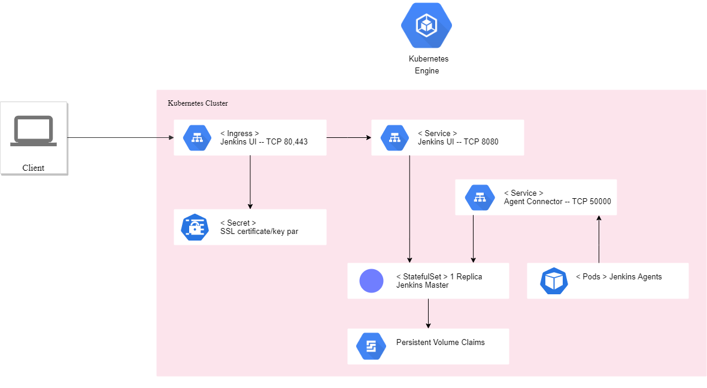
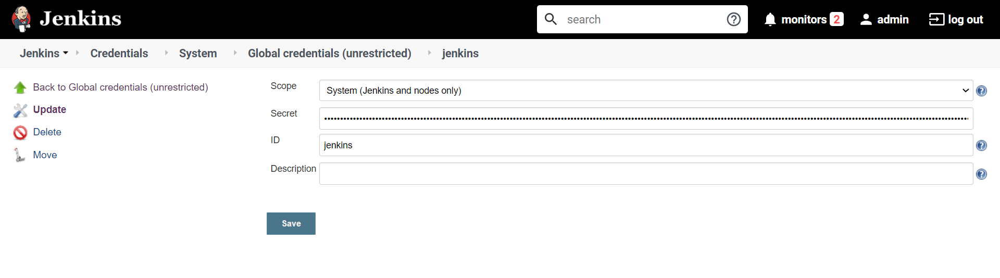
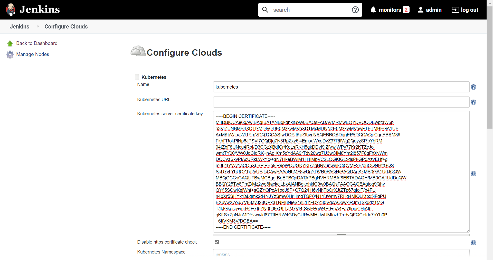
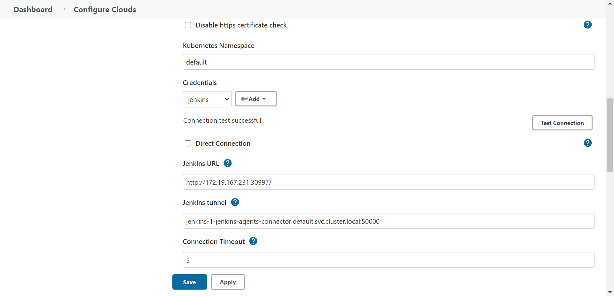
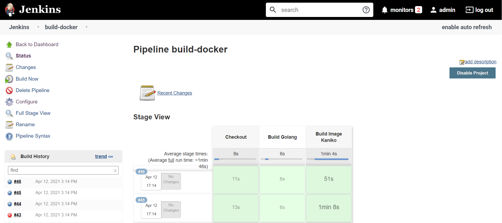

# Using Kubernetes to scale Jenkins agents

You can integrate Jenkins with Kubernetes to deploy multiple pods as Jenkins agents on demand. This enables your Jenkins deployment to dynamically scale its workload, and to deploy any container solution inside pipelines and build containers.

This page contains instructions for integrating Jenkins with Kubernetes.

## Architecture

Using the same architecture deployed, the Jenkins primary pod will be able to communicate with K8s API and deploy new pods inside the cluster on demand. These pods are ephemeral and will only be alive during the execution of the job or pipeline.




# Deploying Agents in K8s

## Jenkins service account

1. Create a Jenkins service account to integrate Jenkins to Kubernetes to deploy agents: 

```
cat > jenkins-service-account.yaml << EOF
---
apiVersion: v1
kind: ServiceAccount
metadata:
  name: $APP_INSTANCE_NAME-serviceaccount
EOF
kubectl apply -f jenkins-service-account.yaml -n $NAMESPACE
```

2. Create a service role with permissions to deploy agent pods:
```
cat > jenkins-service-role.yaml << EOF
---
kind: Role
apiVersion: rbac.authorization.k8s.io/v1
metadata:
  name: $APP_INSTANCE_NAME-role
rules:
- apiGroups: [""]
  resources: ["pods"]
  verbs: ["create","delete","get","list","patch","update","watch"]
- apiGroups: [""]
  resources: ["pods/exec"]
  verbs: ["create","delete","get","list","patch","update","watch"]
- apiGroups: [""]
  resources: ["pods/log"]
  verbs: ["get","list","watch"]
- apiGroups: [""]
  resources: ["events"]
  verbs: ["watch"]
- apiGroups: [""]
  resources: ["secrets"]
  verbs: ["get"]
EOF
kubectl apply -f jenkins-service-role.yaml -n $NAMESPACE
```

3. Create a role binding for Jenkins service account:
```
cat > jenkins-service-role-binding.yaml << EOF
---
apiVersion: rbac.authorization.k8s.io/v1
kind: RoleBinding
metadata:
  name: $APP_INSTANCE_NAME-rolebinding
roleRef:
  apiGroup: rbac.authorization.k8s.io
  kind: Role
  name: $APP_INSTANCE_NAME-role
subjects:
- kind: ServiceAccount
  name: $APP_INSTANCE_NAME-serviceaccount
EOF
kubectl apply -f jenkins-service-role-binding.yaml -n $NAMESPACE
```

## Configure Kubernetes plugin

1. Install [Jenkins Kubernetes Plugin](https://plugins.jenkins.io/kubernetes/).

2. Add the service account token to Jenkins, first get the token using the next command:
```
# Service Account Token
kubectl get secret $(kubectl get sa $APP_INSTANCE_NAME-serviceaccount \
-n $NAMESPACE -o jsonpath="{.secrets[0].name}") \
-n $NAMESPACE -o jsonpath="{.data.token}" | base64 --decode
```
3. Create a secret text in Jenkins with the token:



4. Get the CA certificate and add it to the plugin configuration:
```
# CA Certificate
kubectl get secret $(kubectl get sa $APP_INSTANCE_NAME-serviceaccount \
-n $NAMESPACE -o jsonpath="{.secrets[0].name}") \
-n $NAMESPACE -o jsonpath={.data.'ca\.crt'} | base64 --decode
```


5. Get the jenkins service pod ip address and add it to the plugin configuration as Jenkins Url.
```
echo http://$(kubectl get svc $APP_INSTANCE_NAME-jenkins-ui -n $NAMESPACE -o jsonpath="{.spec.clusterIP}"):8080
```

6. The agent connector is exposed service as a ClusterIP. You can get the internal service name with the next command:
```
echo $APP_INSTANCE_NAME-jenkins-agents-connector.$NAMESPACE.svc.cluster.local:50000
```



## Build a Docker image in Jenkins with Kaniko

After Jenkins is correctly configured and integrated with Kubernetes, you can create custom and flexible pipelines and deploy them inside the cluster.

To build a Golang project and Docker image using [Kaniko](https://github.com/GoogleContainerTools/kaniko), refer to the following sample pipeline:

```
pipeline {
agent {
        kubernetes {
            label 'jenkins-agent'
            yaml """
kind: Pod
metadata:
  name: jenkins-agent
spec:
  containers:
  - name: golang
    image: golang:1.12
    command:
    - cat
    tty: true
  - name: kaniko
    image: gcr.io/kaniko-project/executor:debug
    imagePullPolicy: Always
    command:
    - /busybox/cat
    tty: true
"""
        }
    }

    stages {
        stage('Checkout') {
            steps {
                // Clone repository
                git 'https://github.com/cgn170/sample-go-http-app'
            }
        }

        stage('Build Golang'){
            steps {
                container(name:'golang') {
                    // Get dependencies
                    sh "go get github.com/gorilla/mux"
                    // Build Golang project    
                    sh "go build -o sample ."
                }
            }
        }

        stage('Build Image Kaniko') {
            steps {
                container(name:'kaniko') {
                    // Build image without push to repository
                    sh '''executor \
                          --no-push \
                          --context $WORKSPACE \
                          --dockerfile $WORKSPACE/Dockerfile 
                    '''

                    /*
                    Build and push image to repository
                    
                    sh '''executor \
                          --context $WORKSPACE \
                          --dockerfile $WORKSPACE/Dockerfile \
                          --destination $REGISTRY/$REPOSITORY/$IMAGE
                    '''
                    Authentication is required to push an image to Google Container Registry,
                    find further documentation in Kaniko repository:
                    https://github.com/GoogleContainerTools/kaniko#pushing-to-google-gcr 
                    */
                }
            }
        }
    }
}
```
Correct execution of the example pipeline:

