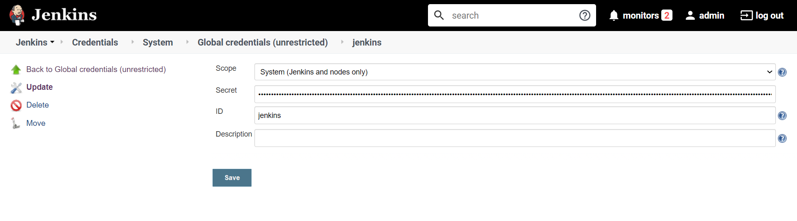

# Overview

Jenkins is an excellent tool for automation and provides hundreds of plugin that can be used to automate any project.  

K8s and jenkins can be integrated together and deploy multiple pods as jenkins slaves on demand, this can allow jenkins to be flexible and escalate workload in pods dynamically, also allow to deploy any container solution inside pipelines and build containers. 

In this document you will find instructions to integrate Jenkins and K8s.

## Architecture

Using the same architecture deployed, Jenkins pod master will be able to communicate with K8s API and deploy new pods inside the cluster on demand, those pods are ephemeral and they only be alive during the execution of the job or pipeline.


# Deploying slaves in k8s

## Jenkins service account

Create jenkins service account to integrate jenkins master to kubernetes to deploy slaves: 

```
cat > jenkins-service-account.yaml << EOF
---
apiVersion: v1
kind: ServiceAccount
metadata:
  name: $APP_INSTANCE_NAME-serviceaccount
EOF
kubectl apply -f jenkins-service-account.yaml -n $NAMESPACE
```

Create service role with permissions to deploy slave pods:
```
cat > jenkins-service-role.yaml << EOF
---
kind: Role
apiVersion: rbac.authorization.k8s.io/v1
metadata:
  name: $APP_INSTANCE_NAME-role
rules:
- apiGroups: [""]
  resources: ["pods"]
  verbs: ["create","delete","get","list","patch","update","watch"]
- apiGroups: [""]
  resources: ["pods/exec"]
  verbs: ["create","delete","get","list","patch","update","watch"]
- apiGroups: [""]
  resources: ["pods/log"]
  verbs: ["get","list","watch"]
- apiGroups: [""]
  resources: ["events"]
  verbs: ["watch"]
- apiGroups: [""]
  resources: ["secrets"]
  verbs: ["get"]
EOF
kubectl apply -f jenkins-service-role.yaml -n $NAMESPACE
```

Create role binding for jenkins service account:
```
cat > jenkins-service-role-binding.yaml << EOF
---
apiVersion: rbac.authorization.k8s.io/v1
kind: RoleBinding
metadata:
  name: $APP_INSTANCE_NAME-rolebinding
roleRef:
  apiGroup: rbac.authorization.k8s.io
  kind: Role
  name: $APP_INSTANCE_NAME-role
subjects:
- kind: ServiceAccount
  name: $APP_INSTANCE_NAME-serviceaccount
EOF
kubectl apply -f jenkins-service-role-binding.yaml -n $NAMESPACE
```

## Configure kubernetes plugin

Install kubernetes plugin in jenkins master server.

[Jenkins Kubernetes Plugin](https://plugins.jenkins.io/kubernetes/)

Add service account token to jenkins, first get the token using the next command:
```
# Service Account Token
kubectl get secret $(kubectl get sa $APP_INSTANCE_NAME-serviceaccount -n $NAMESPACE -o jsonpath="{.secrets[0].name}") -n $NAMESPACE -o jsonpath="{.data.token}" \
| base64 --decode
```
Create a secret text in jenkins with the token:



Get the CA certificate and add it to the k8s plugin configuration:
```
# CA Certificate
kubectl get secret $(kubectl get sa $APP_INSTANCE_NAME-serviceaccount -n $NAMESPACE -o jsonpath="{.secrets[0].name}") -n $NAMESPACE -o jsonpath={.data.'ca\.crt'} \ 
| base64 --decode
```


Get Jenkins URL and add it to k8s plugin configuration.

Since the agent connector service is exp  osed as ClusterIP is required to use the option Jenkins tunnel in the jenkins k8s plugin, you can get the internal service name with the next command:
```
echo $APP_INSTANCE_NAME-jenkins-agents-connector.$NAMESPACE.svc.cluster.local:50000
```


## Build a docker image in jenkins with kaniko

Once jenkins is correctly configured and integrated with k8s you can create custom and flexible pipelines and deploy them  inside the cluster.

Follow the next pipeline example to build a Golang project and docker image using [Kaniko](https://github.com/GoogleContainerTools/kaniko):
```
pipeline {
agent {
        kubernetes {
            label 'jenkins-slave'
            yaml """
kind: Pod
metadata:
  name: jenkins-slave
spec:
  containers:
  - name: jnlp
    image: golang:1.12  
  - name: golang
    image: golang:1.12
    command:
    - cat
    tty: true
  - name: kaniko
    image: gcr.io/kaniko-project/executor:debug
    imagePullPolicy: Always
    command:
    - /busybox/cat
    tty: true
"""
        }
    }

    stages {
        stage('Checkout') {
            steps {
                // Clone repository
                git 'https://github.com/cgn170/sample-go-http-app'
            }
        }

        stage('Build Golang'){
            steps {
                container(name:'golang') {
                    // Get dependencies
                    sh "go get github.com/gorilla/mux"
                    // Build Golang project    
                    sh "go build -o sample ."
                }
            }
        }

        stage('Build Image Kaniko') {
            steps {
                container(name:'kaniko') {
                    // Build image without push to repository
                    sh '''executor \
                          --no-push \
                          --context $WORKSPACE \
                          --dockerfile $WORKSPACE/Dockerfile 
                    '''

                    /*
                    Build and push image to repository
                    
                    sh '''executor \
                          --context $WORKSPACE \
                          --dockerfile $WORKSPACE/Dockerfile \
                          --destination $REGISTRY/$REPOSITORY/$IMAGE
                    '''

                    To push an image to any repository as Google GCR is required to configure authentication,
                    find further documentation in Kaniko repository:
                    https://github.com/GoogleContainerTools/kaniko#pushing-to-google-gcr 
                    */
                }
            }
        }
    }
}
```
Correct execution of the example pipeline:

