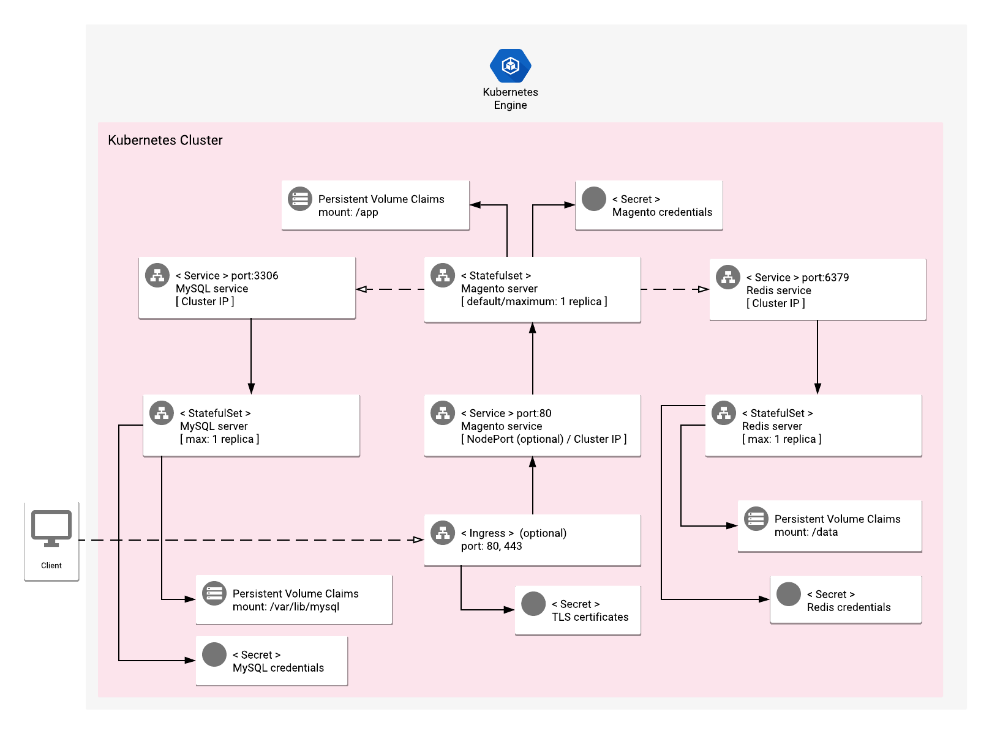

# Overview

Magento is an extensible and modular e-commerce platform. It enables catalog management, CMS, payment methods, layout control, a flexible pricing system, and more.

The platform is developed on top of open-source technologies, with PHP as the main back-end language.

Extensions, static assets, and file uploads are stored in local disks. Caching and session data are stored in a persistent Redis, and catalog data is stored in a persistent MySQL database.

Magento can optionally be [deployed with Elasticsearch](https://devdocs.magento.com/guides/v2.3/config-guide/elasticsearch/configure-magento.html). You can launch Elasticsearch deployments [through Google Cloud Marketplace](https://console.cloud.google.com/marketplace/details/google/elasticsearch).

Magento has an extensive Marketplace with several themes and plugins, which can be paid or free. For more details, visit [the official Marketplace site](https://marketplace.magento.com).

Magento also has a [secured REST API](https://devdocs.magento.com/guides/v2.3/rest/bk-rest.html) which enables you to upload and integrate your inventory with any custom solution.

For more information on Magento Commerce, visit its [product page](https://magento.com/products/magento-commerce) at the official Magento website.

## About Google Click to Deploy

Popular open stacks on Kubernetes, packaged by Google.

## Architecture

> **NOTE:** The following diagram shows the architecture with the app
> (optionally) exposed externally, using an Ingress and TLS configuration. The
> steps to enable the Ingress resource are in the sections below.



By default, Ingress is disabled and Magento is exposed using a ClusterIP Service on port `80`.
You can enable the option to expose the service externally. In that case, Magento's interface is exposed through the ports `80` and `443` using an Ingress resource. The TLS certificates are stored in the `[APP_INSTANCE_NAME]-tls` Secret resource.

Separate StatefulSet Kubernetes objects are used to manage the Magento, MySQL, and Redis instances.

### Magento Workloads

The Magento single-replica StatefulSet runs the [Magento website](https://www.magento.com) on a [magento-docker](https://github.com/GoogleCloudPlatform/magento-docker) container installation. The credentials for the administrator account are automatically generated, and configured in the app through a Kubernetes Secret.

A Persistent Volume Claim is used for storing persistent configuration data and static assets.

This workload also offers an embedded [NGINX Prometheus Metrics Exporter](https://github.com/GoogleCloudPlatform/nginx-docker/tree/master/exporter).


### Redis Workloads

The Redis single-replica StatefulSet runs a [Redis Server](https://redis.io) app on a [redis-docker](https://github.com/GoogleCloudPlatform/redis-docker) container installation. The credentials for the `root` account are automatically generated, and configured in the app through the Secret resource `[APP_INSTANCE_NAME]-redis-secret`.

By default, the Services exposing the Magento app are of type ClusterIP, which means it is accessible only in a private cluster network on port `6379`.

A Persistent Volume Claim is used for storing transient data, such as user-session and caching data.

The [save behaviour](https://redis.io/topics/persistence#snapshotting) may be configured by using the `[APP_INSTANCE_NAME]-redis-config` ConfigMap resource.

This workload also offers an embedded [Redis Prometheus Metrics Exporter](https://github.com/GoogleCloudPlatform/redis-docker/tree/master/exporter).


### MySQL Workloads

The MySQL single-replica StatefulSet runs a [MySQL Server](https://www.mysql.com) app on a [mysql-docker](https://github.com/GoogleCloudPlatform/mysql-docker) container installation. The credentials for the `root` account are automatically generated, and configured in the app through the Secret resource `[APP_INSTANCE_NAME]-mysql-secret`.

By default, the Services exposing MySQL are of type ClusterIP, which means it is accessible only in a private network on port `3306`.

A Persistent Volume Claim is used for storing all the e-commerce data.

This workfload also offers an embedded [MySQL Prometheus Metrics Exporter](https://github.com/GoogleCloudPlatform/mysql-docker/tree/master/exporter).

### Elasticsearch Workloads

The Elasticsearch StatefulSet runs an [Elasticsearch Server](https://www.elastic.co/elasticsearch/) on an [elasticsearch-docker](https://github.com/GoogleCloudPlatform/elasticsearch-docker) container installation.

By default, the Services exposing Elasticsearch are of type ClusterIP, which means it is accessible only in a private network on port `9200`.

A Persistent Volume Claim is used for storing all the e-commerce catalog.

This workfload also offers an embedded [Elasticsearch Prometheus Metrics Exporter](https://github.com/justwatchcom/elasticsearch_exporter).

# Installation

## Quick install with Google Cloud Marketplace

Get up and running with a few clicks! Install this Magento app to a Google Kubernetes Engine cluster in Google Cloud Marketplace by following these [on-screen instructions](https://console.cloud.google.com/marketplace/details/google/magento).

## Command line instructions

### Prerequisites

#### Set up command line tools

You'll need the following tools in your development environment. If you're using Cloud Shell, `gcloud`, `kubectl`, Docker, and Git are installed in your environment by default.

- [gcloud](https://cloud.google.com/sdk/gcloud/)
- [kubectl](https://kubernetes.io/docs/reference/kubectl/overview/)
- [docker](https://docs.docker.com/install/)
- [git](https://git-scm.com/book/en/v2/Getting-Started-Installing-Git)
- [helm](https://helm.sh/)

Configure `gcloud` as a Docker credential helper:

```shell
gcloud auth configure-docker
```

#### Create a Google Kubernetes Engine cluster

Create a new cluster from the command line:

```shell
export CLUSTER=magento-cluster
export ZONE=us-west1-a

gcloud container clusters create "${CLUSTER}" --zone "${ZONE}"
```

Configure `kubectl` to connect to the new cluster:

```shell
gcloud container clusters get-credentials "${CLUSTER}" --zone "${ZONE}"
```

#### Clone this repo

Clone this repo, as well as the associated tools repo:

```shell
git clone --recursive https://github.com/GoogleCloudPlatform/click-to-deploy.git
```

#### Install the Application resource definition

An Application resource is a collection of individual Kubernetes components,
such as Services, Deployments, and so on, that you can manage as a group.

To set up your cluster to understand Application resources, run the following command:

```shell
kubectl apply -f "https://raw.githubusercontent.com/GoogleCloudPlatform/marketplace-k8s-app-tools/master/crd/app-crd.yaml"
```

You need to run this command once.

The Application resource is defined by the [Kubernetes SIG-apps](https://github.com/kubernetes/community/tree/master/sig-apps) community. The source code can be found on [github.com/kubernetes-sigs/application](https://github.com/kubernetes-sigs/application).

### Install the app

Navigate to the `magento` directory:

```shell
cd click-to-deploy/k8s/magento
```

#### Configure the app with environment variables

Choose an instance name and [namespace](https://kubernetes.io/docs/concepts/overview/working-with-objects/namespaces/) for the app. In most cases, you can use the `default` namespace.

```shell
export APP_INSTANCE_NAME=magento-1
export NAMESPACE=default
```

For the persistent disk provisioning of the Magento StatefulSets, you will need to:

 * Set the StorageClass name. Check your available options using the command below:
   * ```kubectl get storageclass```
   * Or check how to create a new StorageClass in [Kubernetes Documentation](https://kubernetes.io/docs/concepts/storage/storage-classes/#the-storageclass-resource)

 * Set the persistent disk's size. The default disk size for Magento is "10Gi".

```shell
export DEFAULT_STORAGE_CLASS="standard" # provide your StorageClass name if not "standard"
export PERSISTENT_DISK_SIZE="10Gi"
```


(Optional) Expose the Service externally and configure Ingress:

By default, the Service is not exposed externally. To enable this option, change the value to true.

```shell
export PUBLIC_SERVICE_AND_INGRESS_ENABLED=false
```

(Optional) Enable Stackdriver Metrics Exporter:

> **NOTE:** Your GCP project must have Stackdriver enabled. If you are using a
> non-GCP cluster, you cannot export metrics to Stackdriver.

By default, the app does not export metrics to Stackdriver. To enable this option, change the value to `true`.

```shell
export METRICS_EXPORTER_ENABLED=false
```

Set up the image tag:

It is advised to use stable image reference which you can find on
[Marketplace Container Registry](https://marketplace.gcr.io/google/magento).
Example:

```shell
export TAG="<BUILD_ID>"
```

Alternatively you can use short tag which points to the latest image for selected version.
> Warning: this tag is not stable and referenced image might change over time.

```shell
export TAG="2.4"
```

Configure the container images:

```shell
export IMAGE_REGISTRY="marketplace.gcr.io/google"

export IMAGE_MAGENTO="${IMAGE_REGISTRY}/magento"
export IMAGE_MYSQL="${IMAGE_REGISTRY}/magento/mysql:${TAG}"
export IMAGE_REDIS="${IMAGE_REGISTRY}/magento/redis:${TAG}"
export IMAGE_ELASTICSEARCH="${IMAGE_REGISTRY}/magento/elasticsearch:${TAG}"

export IMAGE_NGINX_EXPORTER="${IMAGE_REGISTRY}/magento/nginx-exporter:${TAG}"
export IMAGE_MYSQL_EXPORTER="${IMAGE_REGISTRY}/magento/mysql-exporter:${TAG}"
export IMAGE_REDIS_EXPORTER="${IMAGE_REGISTRY}/magento/redis-exporter:${TAG}"
export IMAGE_METRICS_EXPORTER="${IMAGE_REGISTRY}/magento/prometheus-to-sd:${TAG}"
```

Set or generate the passwords:

```shell
# Set e-mail address for Magento admin user
export MAGENTO_ADMIN_EMAIL="admin@store.example"

# Set password. Use your own passwords
export MAGENTO_ADMIN_PASSWORD="admin_password"

# Set mysql root and magento user passwords
export MAGENTO_DB_PASSWORD="magento_password"
export DB_ROOT_PASSWORD="root_password"

# Set mysqld-exporter user password
export DB_EXPORTER_PASSWORD="exporter_password"

# Set redis-server password
export REDIS_PASSWORD="redis_password"
```

#### Create TLS certificate for Magento

> Note: You can skip this step if you have disabled external access.

1.  If you already have a certificate that you want to use, copy your certificate and key pair to the `/tmp/tls.crt` and `/tmp/tls.key` files, respectively, then skip to the next step.

    To create a new certificate, run the following command:

    ```shell
    openssl req -x509 -nodes -days 365 -newkey rsa:2048 \
        -keyout /tmp/tls.key \
        -out /tmp/tls.crt \
        -subj "/CN=magento/O=magento"
    ```

2.  Set `TLS_CERTIFICATE_KEY` and `TLS_CERTIFICATE_CRT` variables:

    ```shell
    export TLS_CERTIFICATE_KEY="$(cat /tmp/tls.key | base64)"
    export TLS_CERTIFICATE_CRT="$(cat /tmp/tls.crt | base64)"
    ```

#### Create namespace in your Kubernetes cluster

If you use a different namespace than the `default`, run the command below to create a new namespace:

```shell
kubectl create namespace "${NAMESPACE}"
```

#### Expand the manifest template

Use `helm template` to expand the template. We recommend that you save the
expanded manifest file for future updates to your app.

```shell
helm template chart/magento \
    --name "${APP_INSTANCE_NAME}" \
    --namespace "${NAMESPACE}" \
    --set persistence.storageClass="${DEFAULT_STORAGE_CLASS}" \
    --set magento.image.repo="${IMAGE_MAGENTO}" \
    --set magento.image.tag="${TAG}" \
    --set magento.admin.email="${MAGENTO_ADMIN_EMAIL}" \
    --set magento.admin.password="${MAGENTO_ADMIN_PASSWORD}" \
    --set magento.persistence.size="${PERSISTENT_DISK_SIZE}" \
    --set db.image="${IMAGE_MYSQL}" \
    --set db.rootPassword="${DB_ROOT_PASSWORD}" \
    --set db.magentoPassword="${MAGENTO_DB_PASSWORD}" \
    --set db.exporter.password="${DB_EXPORTER_PASSWORD}" \
    --set db.exporter.image="${IMAGE_MYSQL_EXPORTER}" \
    --set redis.image="${IMAGE_REDIS}" \
    --set redis.password="${REDIS_PASSWORD}" \
    --set redis.exporter.image="${IMAGE_REDIS_EXPORTER}" \
    --set elasticsearch.image="${IMAGE_ELASTICSEARCH}" \
    --set nginx.exporter.image="${IMAGE_NGINX_EXPORTER}" \
    --set tls.base64EncodedPrivateKey="${TLS_CERTIFICATE_KEY}" \
    --set tls.base64EncodedCertificate="${TLS_CERTIFICATE_CRT}" \
    --set metrics.image="${IMAGE_METRICS_EXPORTER}" \
    --set metrics.exporter.enabled="${METRICS_EXPORTER_ENABLED}" \
    > "${APP_INSTANCE_NAME}_manifest.yaml"
```

#### Apply the manifest to your Kubernetes cluster

Use `kubectl` to apply the manifest to your Kubernetes cluster:

```shell
kubectl apply -f "${APP_INSTANCE_NAME}_manifest.yaml" --namespace "${NAMESPACE}"
```

#### View the app in the Google Cloud Console

To get the Cloud Console URL for your app, run the following command:

```shell
echo "https://console.cloud.google.com/kubernetes/application/${ZONE}/${CLUSTER}/${NAMESPACE}/${APP_INSTANCE_NAME}"
```

To view the app, open the URL in your browser.

### Open your Magento website

To get the external IP of your Magento website, use the following command:

```shell
SERVICE_IP=$(kubectl get ingress "${APP_INSTANCE_NAME}-magento-ingress" \
  --namespace "${NAMESPACE}" \
  --output jsonpath='{.status.loadBalancer.ingress[0].ip}')

echo "https://${SERVICE_IP}/"
```

The command shows you the URL of your site.


# App metrics

## Prometheus metrics

The app can be configured to expose its metrics through the [MySQL Server Exporter](https://github.com/GoogleCloudPlatform/mysql-docker/tree/master/exporter), [NGINX Exporter](https://github.com/GoogleCloudPlatform/nginx-docker/tree/master/exporter), and [Redis Exporter](https://github.com/GoogleCloudPlatform/redis-docker/tree/master/exporter), in the [Prometheus format](https://github.com/prometheus/docs/blob/master/content/docs/instrumenting/exposition_formats.md).

1.  You can access the NGINX metrics at `[NGINX-SERVICE]:9113/metrics`, where `[NGINX-SERVICE]` is the [Kubernetes Service](https://kubernetes.io/docs/concepts/services-networking/service/) `${APP_INSTANCE_NAME}-magento-svc`.

2.  You can access the Redis metrics at `[REDIS-SERVICE]:9121/metrics`, where `[REDIS-SERVICE]` is the
    [Kubernetes Service](https://kubernetes.io/docs/concepts/services-networking/service/) `${APP_INSTANCE_NAME}-redis-svc`.

3.  You can access the MySQL metrics at `[MYSQL-SERVICE]:9104/metrics`, where `[MYSQL-SERVICE]` is the
    [Kubernetes Service](https://kubernetes.io/docs/concepts/services-networking/service/) `${APP_INSTANCE_NAME}-mysql-svc`.

### Configuring Prometheus to collect the metrics

Prometheus can be configured to automatically collect the app's metrics. Follow the steps in [Configuring Prometheus](https://prometheus.io/docs/introduction/first_steps/#configuring-prometheus).

You configure the metrics in the [`scrape_configs` section](https://prometheus.io/docs/prometheus/latest/configuration/configuration/#scrape_config).

## Exporting metrics to Stackdriver

The deployment includes a [Prometheus to Stackdriver (`prometheus-to-sd`)](https://github.com/GoogleCloudPlatform/k8s-stackdriver/tree/master/prometheus-to-sd) container. If you enabled the option to export metrics to Stackdriver, the metrics are exported to Stackdriver automatically, and visible in [Stackdriver Metrics Explorer](https://cloud.google.com/monitoring/charts/metrics-explorer).

The name of each metric starts with the component's name (`redis` for Redis Server, `mysql` for MariaDB, and `nginx-magento` for Magento).
Metrics are labeled with `app.kubernetes.io/name`, which includes the app's name as defined in the `APP_INSTANCE_NAME` environment variable.

The export option may not be available for GKE on-prem clusters.

> Note: Stackdriver has [quotas](https://cloud.google.com/monitoring/quotas) for
> the number of custom metrics created in a single GCP project. If the quota is
> met, additional metrics might not show up in the Stackdriver Metrics Explorer.

To remove existing metric descriptors, use [Stackdriver's REST API](https://cloud.google.com/monitoring/api/ref_v3/rest/v3/projects.metricDescriptors/delete).

# Scaling

This is a single-instance version of Magento. It is not intended to be scaled up in its current configuration.

# Backup and restore

The following steps are based on scripts embedded in the [magento-docker](https://www.github.com/GoogleCloudPlatform/magento-docker) container, which enables you to easily use the Magento CLI commands described in the [Magento documentation](https://devdocs.magento.com/guides/v2.3/install-gde/install/cli/install-cli-backup.html).

## Backup Magento data to your local workstation

The commands below will back up all of your data in a `backups/{{TIMESTAMP}}` folder on the working directory. It will create three different files, as follows:

| File type |              Filename              |
|:---------:|:----------------------------------:|
|   Media   | {{timestamp}}_filesystem_media.tgz |
|    Code   | {{timestamp}}_filesystem_code.tgz  |
|  Database | {{timestamp}}_db.sql               |


To back up your Magento data, run the following commands:

```shell
# Backup directory in Magento pod
BKP_DIR=/app/var/backups

# Pod name which will be responsible for backing up the data
POD_NAME="${APP_INSTANCE_NAME}-magento-0"

# Run backup command in Magento container
MAGENTO_BACKUP_ID=$(kubectl -n ${NAMESPACE} exec -it ${POD_NAME} -c magento -- backup.sh | tr -d '\r')

# Declare backup files
CODE_FILE="${MAGENTO_BACKUP_ID}_filesystem_code.tgz"
MEDIA_FILE="${MAGENTO_BACKUP_ID}_filesystem_media.tgz"
DB_FILE="${MAGENTO_BACKUP_ID}_db.sql"

# Declare local folder where backup will be stored.
LOCAL_BACKUP_DESTINATION="backups/${MAGENTO_BACKUP_ID}/"
mkdir -p "${LOCAL_BACKUP_DESTINATION}"

# Iterate over backup files and copy them
for file in "CODE_FILE" "MEDIA_FILE" "DB_FILE"; do
    filename=$(eval "echo \$${file}")

    REMOTE_FILE="${BKP_DIR}/${filename}"
    LOCAL_FILE="$(pwd)/${LOCAL_BACKUP_DESTINATION}/${filename}"

    kubectl cp "${NAMESPACE}/${POD_NAME}:${REMOTE_FILE}" "${LOCAL_FILE}"
    kubectl --namespace "${NAMESPACE}" exec -it "${POD_NAME}" --container magento -- sh -c "rm -f ${REMOTE_FILE}"
done

# Display downloaded files.
ls -la "$(pwd)/${LOCAL_BACKUP_DESTINATION}"
```

## Restore Magento data on a running Magento instance

In order to restore Magento data, you must specify the `MAGENTO_BACKUP_ID`.

`MAGENTO_BACKUP_ID` is a timestamp which prefixes all created files. The script above also creates a folder with the `BACKUP_ID` as its name.

In order to check which backups you have available, just run:

```shell
ls -la backups/
```

To get the latest backup available, run:

```shell
MAGENTO_BACKUP_ID=$(ls -ld backups/*/ | nl | awk '{if ($1 == "1") print $10}' | tr -d 'backups,/')
```


Next, run the following commands to restore data from a specified backup:
```shell


# Set backup files paths
CODE_FILE="${MAGENTO_BACKUP_ID}_filesystem_code.tgz"
MEDIA_FILE="${MAGENTO_BACKUP_ID}_filesystem_media.tgz"
DB_FILE="${MAGENTO_BACKUP_ID}_db.sql"

# Iterate over backup files and copy them
for file in "CODE_FILE" "MEDIA_FILE" "DB_FILE"; do
    filename=$(eval "echo \$${file}")

    local_file="$(pwd)/backups/${MAGENTO_BACKUP_ID}/${filename}"
    destination_file="/app/var/backups/${filename}"

    kubectl cp "${local_file}" "${NAMESPACE}/${POD_NAME}:${destination_file}"
done

# Restore the data inside container
kubectl --namespace "${NAMESPACE}" exec -it "${POD_NAME}" --container magento -- /bin/bash -c "restore.sh ${MAGENTO_BACKUP_ID}"
```

# Upgrading the app

Before upgrading, we recommend that you [back up all of your Magento data](#backup-magento-data-to-your-local-workstation). For additional information about upgrading, visit the [Magento documentation](https://devdocs.magento.com/guides/v2.3/comp-mgr/cli/cli-upgrade.html).

The [magento-docker](https://www.github.com/GoogleCloudPlatform/magento-docker) container running in the Magento StatefulSet is embedded with an upgrade script. To start the upgrade script, run the following command:

```shell
kubectl --namespace "${NAMESPACE}" exec -it "${POD_NAME}" --container magento -- upgrade_magento.sh
```

To check the version of Magento, run the command below:

```shell
kubectl --namespace "${NAMESPACE}" exec -it "${POD_NAME}" --container magento -- /app/bin/magento -V
```

# Uninstall the app

## Using the Google Cloud Console

1. In the Cloud Console, open [Kubernetes Applications](https://console.cloud.google.com/kubernetes/application).

1. From the list of apps, select **Magento**.

1. On the Application Details page, click **Delete**.

## Using the command line

### Prepare the environment

Set your installation name and Kubernetes namespace:

```shell
export APP_INSTANCE_NAME=magento-1
export NAMESPACE=default
```

### Delete the resources

> **NOTE:** We recommend to use a kubectl version that is the same as the version of your cluster. Using the same versions of kubectl and the cluster helps avoid unforeseen issues.

To delete the resources, use the expanded manifest file used for the
installation.

Run `kubectl` on the expanded manifest file:

```shell
kubectl delete -f "${APP_INSTANCE_NAME}_manifest.yaml" --namespace "${NAMESPACE}"
```

Alternately, you can delete the resources by using types and a label:

```shell
kubectl delete application \
  --namespace "${NAMESPACE}" \
  --selector "app.kubernetes.io/name=${APP_INSTANCE_NAME}"
```

### Delete the persistent volumes of your installation

By design, the removal of StatefulSets in Kubernetes does not remove the PersistentVolumeClaims that were attached to their Pods. This prevents your installations from accidentally deleting stateful data.

To remove the PersistentVolumeClaims along with their attached persistent disks, run the following `kubectl` commands:

```shell
# specify the variables values matching your installation:
export APP_INSTANCE_NAME=magento-1
export NAMESPACE=default

kubectl delete persistentvolumeclaims \
  --namespace "${NAMESPACE}" \
  --selector "app.kubernetes.io/name=${APP_INSTANCE_NAME}"
```

### Delete the GKE cluster

Optionally, if you no longer need the deployed app or the GKE cluster to which it is deployed, you can delete the cluster by running the following command:

```shell
gcloud container clusters delete "${CLUSTER}" --zone "${ZONE}"
```
