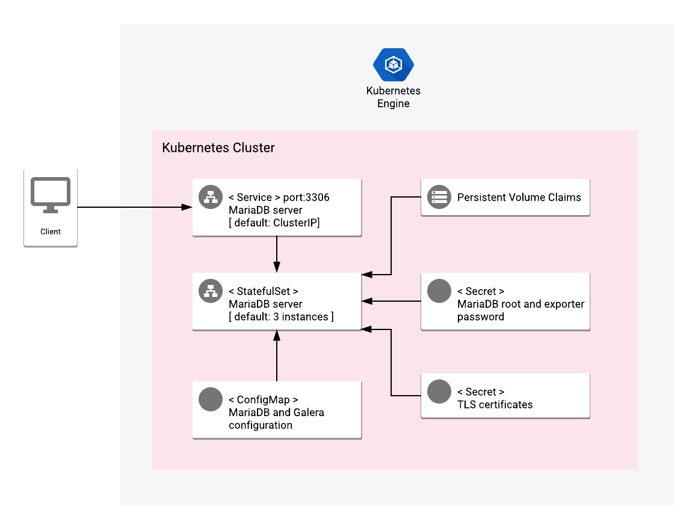

# Overview

MariaDB is an open source relational database. It is a fork of MySQL.

MariaDB Galera Cluster is a synchronous multi-master cluster for
MariaDB. It enables true parallel replication, multi-master topology,
the ability to read and write to any cluster node, or to drop failed
nodes from the cluster, automatic membership control and node joining,
and more.

For more information on MariaDB, visit the
[MariaDB official website](https://mariadb.org/).

## About Google Click to Deploy

Popular open stacks on Kubernetes, packaged by Google.

## Architecture



This app offers a stateful, multi-instance installation of MariaDB
with Galera on a Kubernetes cluster.

By default, the MariaDB server runs in a StatefulSet with 3 replicas.
The credentials for the administrator account are automatically generated
and configured in the app, through a Kubernetes Secret. The
configuration files for the app (`/etc/mysql/mariadb.conf.d/`) are
defined in a ConfigMap, and mounted to the MariaDB StatefulSet.

By default, the Services exposing the MariaDB server are of type
ClusterIP, which makes the server accessible only in a private network
on port 3306.

This app is pre-configured with an SSL certificate for internal
communication between replicas. Before you make the app available to
users, you must replace the pre-configured certificate with a valid
certificate of your own.

# Installation

## Before you begin

If you are new to selling software on Google Cloud Marketplace,
[sign up to become a partner](https://cloud.google.com/marketplace/sell/).

## Quick install with Google Cloud Marketplace

Get up and running in a few clicks! Install this MariaDB with Galera
app to a Google Kubernetes Engine cluster by using Google Cloud
Marketplace. Follow the
[on-screen instructions](https://console.cloud.google.com/marketplace/details/google/mariadb-galera).

## Command-line instructions

### Set up your environment

#### Set up your command-line tools

You'll need the following tools in your development environment. If
you are using Cloud Shell, then `gcloud`, `kubectl`, Docker, and Git
are installed in your environment by default.

- [gcloud](https://cloud.google.com/sdk/gcloud/)
- [kubectl](https://kubernetes.io/docs/reference/kubectl/overview/)
- [docker](https://docs.docker.com/install/)
- [git](https://git-scm.com/book/en/v2/Getting-Started-Installing-Git)
- [helm](https://helm.sh/)

Configure `gcloud` as a Docker credential helper:

```shell
gcloud auth configure-docker
```

#### Create a Google Kubernetes Engine (GKE) cluster

Create a new cluster from the command-line:

```shell
export CLUSTER=mariadb-cluster
export ZONE=us-west1-a

gcloud container clusters create "$CLUSTER" --zone "$ZONE"
```

Configure `kubectl` to connect to the new cluster:

```shell
gcloud container clusters get-credentials "$CLUSTER" --zone "$ZONE"
```

#### Clone this repo

Clone this repo, and its associated tools repo:

```shell
git clone --recursive https://github.com/GoogleCloudPlatform/click-to-deploy.git
```

#### Install the Application resource definition

An Application resource is a collection of individual Kubernetes
components, such as Services, Deployments, and so on, that you can
manage as a group.

To set up your cluster to understand Application resources, run the
following command:

```shell
kubectl apply -f "https://raw.githubusercontent.com/GoogleCloudPlatform/marketplace-k8s-app-tools/master/crd/app-crd.yaml"
```

The Application resource is defined by the
[Kubernetes SIG-apps](https://github.com/kubernetes/community/tree/master/sig-apps)
community. You can find the source code at
[github.com/kubernetes-sigs/application](https://github.com/kubernetes-sigs/application).

### Install the app

Navigate to the `mariadb-galera` directory:

```shell
cd click-to-deploy/k8s/mariadb-galera
```

#### Configure the app with environment variables

Choose an instance name and
[namespace](https://kubernetes.io/docs/concepts/overview/working-with-objects/namespaces/)
for the app. In most cases, you can use the `default` namespace.

```shell
export APP_INSTANCE_NAME=mariadb-galera-1
export NAMESPACE=default
```

By default, the app does not export metrics to Cloud Monitoring. To
enable this option, change the value to `true`.

```shell
export METRICS_EXPORTER_ENABLED=false
```

> **NOTE:** If you would like to export your project's metrics to
Cloud Monitoring, then you must enable Monitoring for your project.
If the cluster you are using is not deployed via Google Cloud, you
can not export its metrics to Monitoring.

Set up the image tag:

It is advised to use stable image reference which you can find on
[Marketplace Container Registry](https://marketplace.gcr.io/google/mariadb-galera).
Example:

```shell
export TAG="11.0.3-<BUILD_ID>"
```

Alternatively you can use short tag which points to the latest image for selected version.
> Warning: this tag is not stable and referenced image might change over time.

```shell
export TAG="11.0"
```

Configure the container images:

```shell
IMAGE_REGISTRY="marketplace.gcr.io/google"

export IMAGE_MARIADB="${IMAGE_REGISTRY}/mariadb-galera"
export IMAGE_MYSQL_EXPORTER="${IMAGE_REGISTRY}/mariadb-galera/mysqld-exporter:${TAG}"
export IMAGE_METRICS_EXPORTER="${IMAGE_REGISTRY}/mariadb-galera/prometheus-to-sd:${TAG}"
```

Specify the number of replicas for your MariaDB Galera cluster:

```shell
export REPLICAS=3
```

For the persistent disk provisioning of the MariaDB Galera StatefulSets, you will need to:

 * Set the StorageClass name. Check your available options using the command below:
   * ```kubectl get storageclass```
   * Or check how to create a new StorageClass in [Kubernetes Documentation](https://kubernetes.io/docs/concepts/storage/storage-classes/#the-storageclass-resource)

 * Set the persistent disk's size. The default disk size is "32Gi".

```shell
export STORAGE_CLASS="standard" # provide your StorageClass name if not "standard"
export PERSISTENT_DISK_SIZE="32Gi"
```

Configure the MariaDB user's credentials (passwords must be encoded
in base64):

```shell
export MARIADB_ROOT_PASSWORD="$(cat /dev/urandom | tr -dc 'a-zA-Z0-9' | fold -w 12 | head -n 1 | tr -d '\n' | base64)"
export EXPORTER_DB_PASSWORD="$(cat /dev/urandom | tr -dc 'a-zA-Z0-9' | fold -w 12 | head -n 1 | tr -d '\n' | base64)"
```

#### Create namespace in your Kubernetes cluster

If you use a different namespace than the `default`, run the command
below to create a new namespace:

```shell
kubectl create namespace "$NAMESPACE"
```

#### Create TLS certificates

To secure the connections between the primary and secondary instances,
you must provide a certificate and private key, and apply them by
using Kubernetes Secrets.

1.  If you already have a certificate that you want to use, copy your
    certificate and key pair to the `/tmp/tls.crt` and
    `/tmp/tls.key` files, respectively, and then skip to the next
    step.

    To create a new certificate, run the following command:

    ```shell
    openssl req -x509 -nodes -days 365 -newkey rsa:2048 \
        -keyout /tmp/tls.key \
        -out /tmp/tls.crt \
        -subj "/CN=mariadb/O=mariadb"
    ```

1.  Set the `TLS_CERTIFICATE_KEY` and `TLS_CERTIFICATE_CRT`
    variables:

    ```shell
    export TLS_CERTIFICATE_KEY="$(cat /tmp/tls.key | base64)"
    export TLS_CERTIFICATE_CRT="$(cat /tmp/tls.crt | base64)"
    ```

#### Expand the manifest template

Use `helm template` to expand the template. We recommend that you save
the expanded manifest file for future updates to your app.

```shell
helm template chart/mariadb-galera \
  --name "$APP_INSTANCE_NAME" \
  --namespace "$NAMESPACE" \
  --set mariadb.image.repo="$IMAGE_MARIADB" \
  --set mariadb.image.tag="$TAG" \
  --set mariadb.persistence.size="$PERSISTENT_DISK_SIZE" \
  --set mariadb.persistence.storageClass="$STORAGE_CLASS" \
  --set db.rootPassword="$MARIADB_ROOT_PASSWORD" \
  --set db.exporter.image="$IMAGE_MYSQL_EXPORTER" \
  --set db.exporter.password="$EXPORTER_DB_PASSWORD" \
  --set metrics.image="$IMAGE_METRICS_EXPORTER" \
  --set metrics.exporter.enabled="$METRICS_EXPORTER_ENABLED" \
  --set tls.base64EncodedPrivateKey="$TLS_CERTIFICATE_KEY" \
  --set tls.base64EncodedCertificate="$TLS_CERTIFICATE_CRT" \
  --set db.replicas="$REPLICAS" \
  > "${APP_INSTANCE_NAME}_manifest.yaml"
```

#### Apply the manifest to your Kubernetes cluster

Use `kubectl` to apply the manifest to your Kubernetes cluster:

```shell
kubectl apply -f "${APP_INSTANCE_NAME}_manifest.yaml" --namespace "${NAMESPACE}"
```

#### View the app in the Google Cloud Console

To get the Cloud Console URL for your app, run the following command:

```shell
echo "https://console.cloud.google.com/kubernetes/application/${ZONE}/${CLUSTER}/${NAMESPACE}/${APP_INSTANCE_NAME}"
```

To view the app, open the URL in your browser.

### Access your MariaDB Galera cluster from within the network

You can connect to MariaDB without exposing it to public access, by
using the `mysql` command-line interface. You can connect directly to
the MariaDB Pod, or use a client Pod.

#### Connect directly to the MariaDB Pod

To identify the MariaDB Pod, use the following command:

```shell
kubectl get pods -o wide -l app.kubernetes.io/name=$APP_INSTANCE_NAME --namespace "$NAMESPACE"
```

To access MariaDB, use the following command:

```shell
kubectl exec -it "$APP_INSTANCE_NAME-galera-0" --namespace "$NAMESPACE" -- mysql -h $APP_INSTANCE_NAME-galera-svc -p$(echo ${MARIADB_ROOT_PASSWORD} | base64 -d)
```

#### Connect to MariaDB by using a client Pod

To connect to the MariaDB server by using a client Pod that is based
on the same MariaDB Docker image, use the following command:

```shell
kubectl run -it --rm --image=$IMAGE_MARIADB --restart=Never mariadb-client -- mysql -h $APP_INSTANCE_NAME-galera-svc.$NAMESPACE.svc.cluster.local -p$(echo ${MARIADB_ROOT_PASSWORD} | base64 -d)
```

### Access the MariaDB Service

To access the MariaDB Service, use port forwarding:

```shell
kubectl port-forward svc/$APP_INSTANCE_NAME-galera-svc --namespace $NAMESPACE 3306
```

# App metrics

## Prometheus metrics

The app can be configured to expose its metrics through the
[MySQL Server Exporter](https://github.com/GoogleCloudPlatform/mysql-docker/tree/master/exporter)
in the
[Prometheus format](https://github.com/prometheus/docs/blob/master/content/docs/instrumenting/exposition_formats.md).
For more detailed information about setting up the plugin, see the
[Mysqld Exporter documentation](https://github.com/prometheus/mysqld_exporter/blob/master/README.md).

You can access the MySQL metrics at `[MYSQL-SERVICE]:9104/metrics`,
where `[MYSQL-SERVICE]` is the
[Kubernetes Headless Service](https://kubernetes.io/docs/concepts/services-networking/service/#headless-services).

For example, to access the metrics locally, run the following command:

```shell
kubectl port-forward "svc/${APP_INSTANCE_NAME}-mysqld-exporter-svc" 9104 --namespace "${NAMESPACE}"
```

Then, navigate to [http://localhost:9104/metrics](http://localhost:9104/metrics).

### Configuring Prometheus to collect the metrics

Prometheus can be configured to automatically collect the app's
metrics.

To set this up, follow the steps at
[Configuring Prometheus](https://prometheus.io/docs/introduction/first_steps/#configuring-prometheus).

You configure the metrics in the
[`scrape_configs` section](https://prometheus.io/docs/prometheus/latest/configuration/configuration/#scrape_config).

## Exporting metrics to Cloud Monitoring

The deployment includes a
[Prometheus to Stackdriver (`prometheus-to-sd`)](https://github.com/GoogleCloudPlatform/k8s-stackdriver/tree/master/prometheus-to-sd)
container. If you enabled the option to export your app's metrics
to Cloud Monitoring, the metrics are automatically exported to
Monitoring, and visible in
[Metrics Explorer](https://cloud.google.com/monitoring/charts/metrics-explorer).

Metrics are labeled with `app.kubernetes.io/name`, which uses the
app's name as defined in the `APP_INSTANCE_NAME` environment
variable.

The export option may not be available for Anthos GKE on-prem
clusters.

> Note: Cloud Monitoring has
[quotas](https://cloud.google.com/monitoring/quotas) for the number
of custom metrics created in a single Google Cloud project. If the
quota is met, additional metrics might not show up in Metrics
Explorer.

You can remove existing metric descriptors by using the
[Cloud Monitoring REST API](https://cloud.google.com/monitoring/api/ref_v3/rest/v3/projects.metricDescriptors/delete).

# Scaling

## Scaling the cluster up or down

By default, the MariaDB Galera app is deployed using 3 replicas. To
change the number of replicas, use the following command:

```shell
REPLICAS=5
kubectl scale statefulsets "$APP_INSTANCE_NAME-galera" --namespace "$NAMESPACE" --replicas=$REPLICAS
```

where `REPLICAS` is the number of replicas that you want.

To reduce the number of replicas without disconnecting nodes from the
cluster, use the same command. The `PersistentVolumeClaims` in your
StatefulSet are not modified when you reduce the number of replicas.

# Back up and restore

The following steps are based on the official
[MariaDB documentation](https://mariadb.com/kb/en/library/mysqldump/).

## Back up your MariaDB data to your local workstation

To back up your MariaDB data, run the following command:

```shell
BKP_NAME="all-databases-$(date +%Y-%m-%d).sql.gz"
BKP_DIR=/var/mariadb/backup
POD_NAME=${APP_INSTANCE_NAME}-galera-0

# Backup database
kubectl -n ${NAMESPACE} exec -it ${POD_NAME} -c mariadb -- sh -c "mkdir -p ${BKP_DIR} && \
  mysqldump --all-databases --triggers --routines --events \
    --add-drop-table --single-transaction --ignore-table=mysql.user \
    -uroot -p\${MYSQL_ROOT_PASSWORD} \
    | gzip > ${BKP_DIR}/${BKP_NAME}"

# Copy backup file to local workstation and cleanup Pod
kubectl cp ${NAMESPACE}/${POD_NAME}:${BKP_DIR}/${BKP_NAME} ${BKP_NAME}
kubectl -n ${NAMESPACE} exec -it ${POD_NAME} -c mariadb -- sh -c "rm -f ${BKP_DIR}/${BKP_NAME}"
```

The backup will be stored in an `all-databases-<timestamp>.sql`
file, in the current directory of your local workstation.

> **WARNING**: Due to Galera cluster limitations, the `mysql.user`
> table is excluded from the backup. If you wish to create a full
> backup of all databases, you must run `mysqldump` without the
> `--ignore-table` option. This will make it so that you will not be
> able to restore the `mysql.user` table upon installation of Click
> to Deploy MariaDB Galera Cluster.
>
> For more information, visit the official
[Galera documentation](https://galeracluster.com/library/kb/trouble/user-changes.html).

## Restore MariaDB data on a running MariaDB instance

To restore MariaDB data, you must first specify the location of the
backup file:

```shell
BKP_FILE="[/path/to/backup_file].sql.gz"
```

To restore data from the specified backup, run the following commands:

```shell
POD_NAME=${APP_INSTANCE_NAME}-galera-0
BKP_DIR=/var/mariadb/backup
BKP_PATH=${BKP_DIR}/${BKP_FILE}

# restore all databases from provided backup
kubectl -n ${NAMESPACE} exec -it ${POD_NAME} -c mariadb -- sh -c "mkdir -p ${BKP_DIR}"
kubectl cp ${BKP_FILE} ${NAMESPACE}/${POD_NAME}:${BKP_PATH}
kubectl -n ${NAMESPACE} exec -it ${POD_NAME} -c mariadb -- bash -c "gunzip < ${BKP_PATH} |
    mysql -uroot -p\${MYSQL_ROOT_PASSWORD}"

# cleanup
kubectl -n ${NAMESPACE} exec -it ${POD_NAME} -c mariadb -- sh -c "rm -f ${BKP_PATH}"
```

# Upgrade the app

Before you upgrade, we recommend that you back up your MariaDB
database, by following the
[backup step](#backup-mariadb-data-to-your-local-workstation). For
additional information about upgrades, visit the official
[MariaDB documentation](https://mariadb.com/kb/en/library/upgrading/).

The MariaDB StatefulSet is configured to automatically roll out
updates as it receives them. To start this update process, patch the
StatefulSet with a new image reference:

```shell
IMAGE_MARIADB=[NEW_IMAGE_REFERENCE]
kubectl set image statefulset ${APP_INSTANCE_NAME}-galera --namespace ${NAMESPACE} "mariadb=${IMAGE_MARIADB}"
```

where `[NEW_IMAGE_REFERENCE]` is the Docker image reference of the
new image that you want to use.

To check the status of the Pods in the StatefulSet, and verify that
they are updating, run the following command:

```shell
kubectl get pods --selector app.kubernetes.io/name=${APP_INSTANCE_NAME} --namespace ${NAMESPACE}
```

# Uninstall the app

## Using the Google Cloud Console

1. In the Google Cloud Console, open
   [Kubernetes Applications](https://console.cloud.google.com/kubernetes/application).

1. From the list of apps, choose your app installation.

1. On the Application Details page, click **Delete**.

## Using the command-line

### Prepare the environment

Set your installation name and Kubernetes namespace:

```shell
export APP_INSTANCE_NAME=mariadb-galera-1
export NAMESPACE=default
```

### Delete the resources

> **NOTE:** We recommend using a `kubectl` version that is the same
> as the version of your cluster. Using the same version for `kubectl`
> and the cluster helps to prevent unforeseen issues.

#### Delete the deployment by using the generated manifest file

Run `kubectl` on the expanded manifest file:

```shell
kubectl delete -f ${APP_INSTANCE_NAME}_manifest.yaml --namespace $NAMESPACE
```

#### Delete the deployment by deleting the application resource

If you don't have the expanded manifest file, delete the resources by using types
and a label:

```shell
kubectl delete application \
  --namespace $NAMESPACE \
  --selector app.kubernetes.io/name=$APP_INSTANCE_NAME
```

### Delete the persistent volumes of your installation

By design, removing StatefulSets in Kubernetes does not remove any
PersistentVolumeClaims that were attached to their Pods. This
prevents your installations from accidentally deleting stateful data.

To remove the PersistentVolumeClaims with their attached persistent disks, run
the following `kubectl` commands:

```shell
# specify the variables values matching your installation:
export APP_INSTANCE_NAME=mariadb-galera-1
export NAMESPACE=default

kubectl delete persistentvolumeclaims \
  --namespace $NAMESPACE \
  --selector app.kubernetes.io/name=$APP_INSTANCE_NAME
```

### Delete the Google Kubernetes Engine (GKE) cluster

Optionally, if you don't need the deployed app or the Google
Kubernetes Engine cluster, you can delete the cluster by using
this command:

```shell
gcloud container clusters delete "$CLUSTER" --zone "$ZONE"
```
