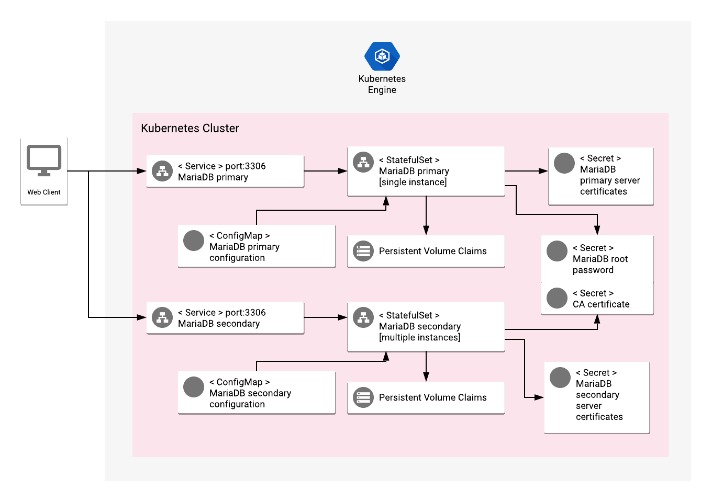

# Overview

MariaDB is one of the most popular database servers in the world. MariaDB is developed as open source software and as a relational database it provides an SQL interface for accessing data.

For more information on MariaDB, see the [MariaDB official website](https://mariadb.org/).

## About Google Click to Deploy

Popular open stacks on Kubernetes packaged by Google.

## Design



The application offers stateful multi instance MariaDB installation on a Kubernetes cluster with one primary instance.

Application consists of two StatefulSets, primary with read/write access, secondary is read only.
While primary instance can be only one, user can specify number of secondary instances. Default value is 2.

Administrative user credentials are automatically generated and configured in the application
through a Kubernetes Secret. Configuration files (`/etc/mysql/mariadb.conf.d/`) are
defined in a ConfigMap and mounted to MariaDB StatefulSet.

By default, the Services exposing MariaDB server are of type ClusterIP, which makes
it accessible only in a private network on port 3306.

This application is pre-configured with an SSL certificate. Please replace it with your valid SSL certificate.

# Installation

## Quick install with Google Cloud Marketplace

Get up and running with a few clicks! Install this MariaDB app to a
Google Kubernetes Engine cluster using Google Cloud Marketplace. Follow the
[on-screen instructions](https://console.cloud.google.com/marketplace/details/google/mariadb).

## Command line instructions

### Prerequisites

#### Set up command-line tools

You'll need the following tools in your development environment:

- [gcloud](https://cloud.google.com/sdk/gcloud/)
- [kubectl](https://kubernetes.io/docs/reference/kubectl/overview/)
- [docker](https://docs.docker.com/install/)
- [git](https://git-scm.com/book/en/v2/Getting-Started-Installing-Git)
- [helm](https://helm.sh/)

Configure `gcloud` as a Docker credential helper:

```shell
gcloud auth configure-docker
```

#### Create a Google Kubernetes Engine cluster

Create a new cluster from the command line:

```shell
export CLUSTER=mariadb-cluster
export ZONE=us-west1-a

gcloud container clusters create "$CLUSTER" --zone "$ZONE"
```

Configure `kubectl` to connect to the new cluster.

```shell
gcloud container clusters get-credentials "$CLUSTER" --zone "$ZONE"
```

#### Clone this repo

Clone this repo and the associated tools repo:

```shell
git clone --recursive https://github.com/GoogleCloudPlatform/click-to-deploy.git
```

#### Install the Application resource definition

An Application resource is a collection of individual Kubernetes components,
such as Services, Deployments, and so on, that you can manage as a group.

To set up your cluster to understand Application resources, run the following command:

```shell
kubectl apply -f "https://raw.githubusercontent.com/GoogleCloudPlatform/marketplace-k8s-app-tools/master/crd/app-crd.yaml"
```

You need to run this command once.

The Application resource is defined by the
[Kubernetes SIG-apps](https://github.com/kubernetes/community/tree/master/sig-apps) community. The source code can be found on
[github.com/kubernetes-sigs/application](https://github.com/kubernetes-sigs/application).

### Install the Application

Navigate to the `mariadb` directory:

```shell
cd click-to-deploy/k8s/mariadb
```

#### Configure the app with environment variables

Choose an instance name and
[namespace](https://kubernetes.io/docs/concepts/overview/working-with-objects/namespaces/)
for the app. In most cases, you can use the `default` namespace.

```shell
export APP_INSTANCE_NAME=mariadb-1
export NAMESPACE=default
```

Enable Stackdriver Metrics Exporter:

> **NOTE:** Your GCP project must have Stackdriver enabled. If you are using a
> non-GCP cluster, you cannot export metrics to Stackdriver.

By default, the application does not export metrics to Stackdriver. To enable
this option, change the value to `true`.

```shell
export METRICS_EXPORTER_ENABLED=false
```

Configure the container image:

```shell
TAG=10.3
export IMAGE_MARIADB="marketplace.gcr.io/google/mariadb:${TAG}"
export IMAGE_MYSQL_EXPORTER="marketplace.gcr.io/google/mariadb/mysqld-exporter:${TAG}"
export IMAGE_METRICS_EXPORTER="marketplace.gcr.io/google/mariadb/prometheus-to-sd:${TAG}"
```

The images above are referenced by
[tag](https://docs.docker.com/engine/reference/commandline/tag). We recommend
that you pin each image to an immutable
[content digest](https://docs.docker.com/registry/spec/api/#content-digests).
This ensures that the installed application always uses the same images,
until you are ready to upgrade. To get the digest for the image, use the
following script:

```shell
for i in "IMAGE_MARIADB" "IMAGE_MYSQL_EXPORTER" "IMAGE_METRICS_EXPORTER"; do
  repo=$(echo ${!i} | cut -d: -f1);
  digest=$(docker pull ${!i} | sed -n -e 's/Digest: //p');
  export $i="$repo@$digest";
  echo ${!i};
done
```

Set the number of replicas for MariaDB:

```shell
export REPLICAS=2
```

Configure the MariaDB users credentials (passwords must be encoded in base64):

```shell
export MARIADB_ROOT_PASSWORD=$(cat /dev/urandom | tr -dc 'a-zA-Z0-9' | fold -w 12 | head -n 1 | tr -d '\n' | base64)
export MARIADB_REPLICA_PASSWORD=$(cat /dev/urandom | tr -dc 'a-zA-Z0-9' | fold -w 12 | head -n 1 | tr -d '\n' | base64)

# Set mysqld-exporter user password.
export EXPORTER_DB_PASSWORD="$(cat /dev/urandom | tr -dc 'a-zA-Z0-9' | fold -w 12 | head -n 1 | tr -d '\n' | base64)"
```

#### Create namespace in your Kubernetes cluster

If you use a different namespace than the `default`, run the command below to create a new namespace:

```shell
kubectl create namespace "$NAMESPACE"
```

#### Create TLS certificates

In order to secure connections between the primary and secondary instances for replication you need to provide a certificates, private keys and CA certificate to verify the certificate for the server. Certificates should be delivered via Kubernetes Secrets.

##### Create certificates

If you already have certificates, copy them to the following location and go to the [Create secrets](#create-secrets) step:

```
/tmp/certs/
    ca.crt
    primary/tls.crt
    primary/tls.key
    secondary/tls.crt
    secondary/tls.key
```

Instructions on how to create certificates for primary and secondary instances:

```shell
mkdir -p /tmp/certs/primary /tmp/certs/secondary
cd /tmp/certs

# creating Certificate Authority Files
openssl genrsa 2048 > ca.key
openssl req -new -x509 -nodes -days 365 -key ca.key -out ca.crt -subj "/CN=ca-mariadb/O=mariadb"

# creating certificate for primary server
openssl req -newkey rsa:2048 -days 365 -nodes -keyout primary/tls.key -out primary/tls.csr -subj "/CN=mariadb/O=mariadb"
openssl rsa -in primary/tls.key -out primary/tls.key
openssl x509 -req -in primary/tls.csr -days 365 \
      -CA ca.crt -CAkey ca.key -set_serial 01 \
      -out primary/tls.crt

# creating certificate for secondary servers
openssl req -newkey rsa:2048 -days 365 -nodes -keyout secondary/tls.key -out secondary/tls.csr -subj "/CN=mariadb/O=mariadb"
openssl rsa -in secondary/tls.key -out secondary/tls.key
openssl x509 -req -in secondary/tls.csr -days 365 \
      -CA ca.crt -CAkey ca.key -set_serial 02 \
      -out secondary/tls.crt

# verify certificates
openssl verify -CAfile ca.crt primary/tls.crt secondary/tls.crt
cd -
```

##### Create secrets

```shell
# create secrets
kubectl --namespace $NAMESPACE create secret tls $APP_INSTANCE_NAME-tls --cert=/tmp/certs/primary/tls.crt --key=/tmp/certs/primary/tls.key
kubectl --namespace $NAMESPACE create secret tls $APP_INSTANCE_NAME-secondary-tls --cert=/tmp/certs/secondary/tls.crt --key=/tmp/certs/secondary/tls.key
kubectl --namespace $NAMESPACE create secret generic $APP_INSTANCE_NAME-ca-tls --from-file=/tmp/certs/ca.crt

# label secrets
for SECRET_NAME in $APP_INSTANCE_NAME-tls $APP_INSTANCE_NAME-secondary-tls $APP_INSTANCE_NAME-ca-tls
do
    kubectl --namespace $NAMESPACE label secret $SECRET_NAME \
        app.kubernetes.io/name=$APP_INSTANCE_NAME app.kubernetes.io/component=mariadb-tls
done
```

#### Expand the manifest template

Use `helm template` to expand the template. We recommend that you save the
expanded manifest file for future updates to the application.

```shell
helm template chart/mariadb \
  --name $APP_INSTANCE_NAME \
  --namespace $NAMESPACE \
  --set mariadb.image=$IMAGE_MARIADB \
  --set db.volumeSize=8 \
  --set db.password=$MARIADB_ROOT_PASSWORD \
  --set replication.password=$MARIADB_REPLICA_PASSWORD \
  --set db.exporter.image=$IMAGE_MYSQL_EXPORTER \
  --set db.exporter.password=$EXPORTER_DB_PASSWORD \
  --set metrics.image=$IMAGE_METRICS_EXPORTER \
  --set metrics.enabled=$METRICS_EXPORTER_ENABLED \
  --set db.replicas=$REPLICAS > "${APP_INSTANCE_NAME}_manifest.yaml"
```

#### Apply the manifest to your Kubernetes cluster

Use `kubectl` to apply the manifest to your Kubernetes cluster:

```shell
kubectl apply -f "${APP_INSTANCE_NAME}_manifest.yaml" --namespace "${NAMESPACE}"
```

#### View the app in the Google Cloud Console

To get the Console URL for your app, run the following command:

```shell
echo "https://console.cloud.google.com/kubernetes/application/${ZONE}/${CLUSTER}/${NAMESPACE}/${APP_INSTANCE_NAME}"
```

To view the app, open the URL in your browser.

### Access MariaDB (internally)

You can connect to MariaDB without exposing it to public access, using the
`mysql` command line interface.

#### Connect to MariaDB via Pod

To do this, please identify MariaDB's Pod using the following command:

```shell
kubectl get pods -o wide -l app.kubernetes.io/name=$APP_INSTANCE_NAME --namespace "$NAMESPACE"
```

Now, you can access MariaDB

```shell
# kubectl exec -it <pod name> --namespace "$NAMESPACE" -- mysql -h  $APP_INSTANCE_NAME-mariadb -p<admin password>)

kubectl exec -it "$APP_INSTANCE_NAME-mariadb-0" --namespace "$NAMESPACE" -- mysql -h $APP_INSTANCE_NAME-mariadb -p$(echo ${MARIADB_ROOT_PASSWORD} | base64 -d)
```

#### Connect to MariaDB using client pod

You could also connect to MariaDB server using client pod based on same MariaDB docker image:

```shell
kubectl run -it --rm --image=$IMAGE_MARIADB --restart=Never mariadb-client -- mysql -h $APP_INSTANCE_NAME-mariadb.$NAMESPACE.svc.cluster.local -p$(echo ${MARIADB_ROOT_PASSWORD} | base64 -d)
```

### Access MariaDB (externally)

By default, the application does not have an external IP. To create an external IP address, run the following command:

```
kubectl patch svc "$APP_INSTANCE_NAME-mariadb" "$APP_INSTANCE_NAME-mariadb-secondary" \
  --namespace "$NAMESPACE" \
  --patch '{"spec": {"type": "LoadBalancer"}}'
```

> **NOTE:** It might take some time for the external IP to be provisioned.

### Access MariaDB service

**Option 1:** If you run your MariaDB cluster behind a LoadBalancer, you can get the external IP of MariaDB primary instance using the following command:

```shell
PRIMARY_IP=$(kubectl get svc $APP_INSTANCE_NAME-mariadb \
  --namespace $NAMESPACE \
  --output jsonpath='{.status.loadBalancer.ingress[0].ip}')

echo "$PRIMARY_IP"

SECONDARY_IP=$(kubectl get svc $APP_INSTANCE_NAME-mariadb-secondary \
  --namespace $NAMESPACE \
  --output jsonpath='{.status.loadBalancer.ingress[0].ip}')

echo "$SECONDARY_IP"

# connect to mariadb server
mysql --ssl -u<username> -p<password> -h ${PRIMARY_IP}
# or
mysql --ssl -u<username> -p<password> -h ${SECONDARY_IP}

# eg.
mysql --ssl -u root -p$(echo ${MARIADB_ROOT_PASSWORD} | base64 -d) -h ${PRIMARY_IP}
```

**Option 2:** Use port forwarding:

```shell
kubectl port-forward svc/$APP_INSTANCE_NAME-mariadb --namespace $NAMESPACE 3306
# or
kubectl port-forward svc/$APP_INSTANCE_NAME-mariadb-secondary --namespace $NAMESPACE 3306
```

# Application metrics

## Prometheus metrics

The application can be configured to expose its metrics through the
[MySQL Server Exporter](https://github.com/GoogleCloudPlatform/mysql-docker/tree/master/exporter)
in the
[Prometheus format](https://github.com/prometheus/docs/blob/master/content/docs/instrumenting/exposition_formats.md).
For more detailed information about setting up the plugin, see the
[Mysqld Exporter documentation](https://github.com/prometheus/mysqld_exporter/blob/master/README.md).

You can access the MySQL metrics at `[MYSQL-SERVICE]:9104/metrics`, where `[MYSQL-SERVICE]` is the
[Kubernetes Headless Service](https://kubernetes.io/docs/concepts/services-networking/service/#headless-services).

For example, to access the metrics locally, run the following command:

```shell
kubectl port-forward "svc/${APP_INSTANCE_NAME}-mysqld-exporter-svc" 9104 --namespace "${NAMESPACE}"
```

Then, navigate to the
[http://localhost:9104/metrics](http://localhost:9104/metrics) endpoint.


### Configuring Prometheus to collect the metrics

Prometheus can be configured to automatically collect the application's metrics.
Follow the steps in
[Configuring Prometheus](https://prometheus.io/docs/introduction/first_steps/#configuring-prometheus).

You configure the metrics in the
[`scrape_configs` section](https://prometheus.io/docs/prometheus/latest/configuration/configuration/#scrape_config).

## Exporting metrics to Stackdriver

Primary instance pod includes a
[Prometheus to Stackdriver (`prometheus-to-sd`)](https://github.com/GoogleCloudPlatform/k8s-stackdriver/tree/master/prometheus-to-sd)
container. If you enabled the option to export metrics to Stackdriver, the
metrics are automatically exported to Stackdriver and visible in
[Stackdriver Metrics Explorer](https://cloud.google.com/monitoring/charts/metrics-explorer).

Metrics are labeled with `app.kubernetes.io/name` consisting of application's name,
which you define in the `APP_INSTANCE_NAME` environment variable.

The exporting option might not be available for GKE on-prem clusters.

> Note: Stackdriver has [quotas](https://cloud.google.com/monitoring/quotas) for
> the number of custom metrics created in a single GCP project. If the quota is
> met, additional metrics might not show up in the Stackdriver Metrics Explorer.

You can remove existing metric descriptors using
[Stackdriver's REST API](https://cloud.google.com/monitoring/api/ref_v3/rest/v3/projects.metricDescriptors/delete).

# Scaling

## Scaling the cluster up

By default, the MariaDB application is deployed using 2 replicas.
To change the number of replicas, use the following command:

```
kubectl scale statefulsets "$APP_INSTANCE_NAME-mariadb-secondary" \
  --namespace "$NAMESPACE" --replicas=$REPLICAS
```

Where `REPLICAS` is desired number of replicas.

In case of scaling down this option reduces the number of replicas without disconnecting nodes from the cluster. Scaling down will also leave `persistentvolumeclaims` of your StatefulSet untouched.

# Backup and Restore

The following steps are based on the [MariaDB documentation](https://mariadb.com/kb/en/library/backing-up-and-restoring-databases/).

## Backup MariaDB data to your local computer

```shell
# navigate to the mariadb/scripts directory
cd click-to-deploy/k8s/mariadb/scripts

# run the backup.sh script, passing the name of your MariaDB instance as an argument
./backup.sh --app_instance_name $APP_INSTANCE_NAME --namespace $NAMESPACE
```

The backup is stored in `all-databases-<timestamp>.sql` file in current directory on your local computer
unless output path specified with `--output (-o)` option.

> **NOTE:** Primary pod should have enough empty space to temporary store backup file which will be downloaded to your local machine afterwards.

## Restore MariaDB data on running MariaDB instance

In order to restore database you need to shut down all secondary instances:

```shell
# navigate to the mariadb/scripts directory
cd click-to-deploy/k8s/mariadb/scripts

# delete all secondary pods with
kubectl scale statefulsets "$APP_INSTANCE_NAME-mariadb-secondary" --namespace "$NAMESPACE" --replicas=0
```

Wait for secondary StatefulSet to scale down to 0 and then run [restore.sh](scripts/restore.sh) script, passing backup file location, the name of your MariaDB instance and namespace as an argument:

```shell
# run the restore.sh script, passing backup file location and the name of your MariaDB instance as an argument
# ./restore.sh --file [backup_file] --app_instance_name [app_name] --namespace [namespace]
./restore.sh --file all-databases-2019-01-01.sql --app_instance_name $APP_INSTANCE_NAME --namespace $NAMESPACE

# scale up secondary StatefulSet
kubectl scale statefulsets "$APP_INSTANCE_NAME-mariadb-secondary" --namespace "$NAMESPACE" --replicas=<target number>
```

> **NOTE:** Keep in mind that users `root` and `replicator` are reserved to ensure communication and replication between MariaDB instances. Passwords for this user accounts are set to values generated during installation and provided via Secret. In case you want to restore from backup created on other installation passwords for these users won't be restored.

# Upgrading the app

Before upgrading, we recommend that you prepare a backup of your MariaDB database, using the [backup step](#backup-mariadb-data-to-your-local-computer). For additional information about upgrades, see the [MariaDB documentation](https://mariadb.com/kb/en/library/upgrading/).

The MariaDB StatefulSet is configured to roll out updates automatically. Start the update by patching the StatefulSet with a new image reference:

```shell
kubectl set image statefulset ${APP_INSTANCE_NAME}-mariadb --namespace ${NAMESPACE} \
  "mariadb=[NEW_IMAGE_REFERENCE]"
```

Where `[NEW_IMAGE_REFERENCE]` is the Docker image reference of the new image that you want to use.

To check the status of Pods in the StatefulSet, and the progress of
the new image, run the following command:

```shell
kubectl get pods --selector app.kubernetes.io/name=$APP_INSTANCE_NAME \
  --namespace ${NAMESPACE}
```

# Uninstall the Application

## Using the Google Cloud Platform Console

1. In the GCP Console, open [Kubernetes Applications](https://console.cloud.google.com/kubernetes/application).

1. From the list of applications, click **MariaDB**.

1. On the Application Details page, click **Delete**.

## Using the command line

### Prepare the environment

Set your installation name and Kubernetes namespace:

```shell
export APP_INSTANCE_NAME=mariadb-1
export NAMESPACE=default
```

### Delete the resources

> **NOTE:** We recommend to use a kubectl version that is the same as the version of your cluster. Using the same versions of kubectl and the cluster helps avoid unforeseen issues.

To delete the resources, use the expanded manifest file used for the
installation.

Run `kubectl` on the expanded manifest file:

```shell
kubectl delete -f ${APP_INSTANCE_NAME}_manifest.yaml --namespace $NAMESPACE
```

Otherwise, delete the resources using types and a label:

```shell
kubectl delete application \
  --namespace $NAMESPACE \
  --selector app.kubernetes.io/name=$APP_INSTANCE_NAME
```

### Delete the persistent volumes of your installation

By design, the removal of StatefulSets in Kubernetes does not remove
PersistentVolumeClaims that were attached to their Pods. This prevents your
installations from accidentally deleting stateful data.

To remove the PersistentVolumeClaims with their attached persistent disks, run
the following `kubectl` commands:

```shell
# specify the variables values matching your installation:
export APP_INSTANCE_NAME=mariadb-1
export NAMESPACE=default

kubectl delete persistentvolumeclaims \
  --namespace $NAMESPACE \
  --selector app.kubernetes.io/name=$APP_INSTANCE_NAME
```

### Delete the GKE cluster

Optionally, if you don't need the deployed application or the GKE cluster,
delete the cluster using this command:

```shell
gcloud container clusters delete "$CLUSTER" --zone "$ZONE"
```
