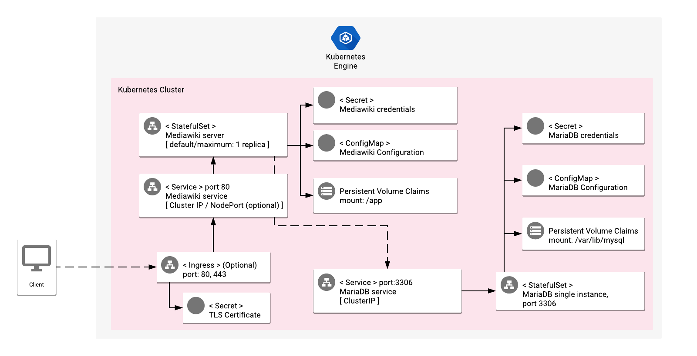

# Overview

MediaWiki is a collaboration and documentation tool that is highly extensible, with
approximately 2000 available extensions, and that excels at localization, with
support for over 300 languages. The MediaWiki platform also serves as the foundation
of all Wikipedia websites.

The platform is built on top of open-source technologies. Developed using PHP, it can
accept SQLite, MySQL, or PostgreSQL source data, and it also offers a built-in cache
system, using a relational database management system (RDBMS) or Memcached.

MediaWiki has also a complete HTTP API, which enables the user to create or search for
content dynamically, and a vast array of configuration parameters.

For more information, visit the [official MediaWiki website](https://mediawiki.org/).

## About Google Click to Deploy

Popular open stacks on Kubernetes, packaged by Google.

## Architecture

> **NOTE:** The following diagram shows the architecture with the app (optionally)
> exposed externally, using an Ingress and TLS configuration. The steps to enable
> the Ingress resource are in the sections below.



By default, MediaWiki is exposed using a ClusterIP Service on port 80. Optionally,
if you enable the option to expose the service externally, the MediaWiki interface is
exposed to ports `80` and `443` using an Ingress resource. The TLS certificates are
stored in the `[APP_INSTANCE_NAME]-tls` Secret resource.

Separate StatefulSet Kubernetes objects are used to manage the MediaWiki and MariaDB
instances. A single instance of MediaWiki is deployed as a single Pod, using a Kubernetes
StatefulSet.

The MediaWiki instance connects to MariaDB over port `3306`. MediaWiki stores information
in the `mediawiki` database.

MariaDB credentials are stored in the `[APP_INSTANCE_NAME]-mysql-secret` Secret resource.

*   The password for the MariaDB `root` user is stored in the `root-password` secret.
*   The username and password to access the `mediawiki` database are stored in the
    `mediawiki-username` and `mediawiki-password` secrets, respectively.

The credentials for MediaWiki are stored in the `[APP_INSTANCE_NAME]-mediawiki-secret`
Secret resource.

*   The username and password to access the administrator panel are stored in the
    `mediawiki-username` and `mediawiki-password` secrets, respectively.

# Installation

## Quick install with Google Cloud Marketplace

Get up and running with a few clicks! Install this MediaWiki app to a Google Kubernetes
Engine cluster by using Google Cloud Marketplace. Follow the
[on-screen instructions](https://console.cloud.google.com/marketplace/details/google/mediawiki).

## Command-line instructions

You can use [Cloud Shell](https://cloud.google.com/shell/) or a local workstation to
follow the steps below.

[](https://console.cloud.google.com/cloudshell/editor?cloudshell_git_repo=https://github.com/GoogleCloudPlatform/click-to-deploy&cloudshell_open_in_editor=README.md&cloudshell_working_dir=k8s/mediawiki)

### Prerequisites

#### Set up command-line tools

You'll need the following tools in your development environment. If you are using
Cloud Shell, then `gcloud`, `kubectl`, Docker, and Git are installed in your
environment by default.

* [gcloud](https://cloud.google.com/sdk/gcloud/)
* [kubectl](https://kubernetes.io/docs/reference/kubectl/overview/)
* [docker](https://docs.docker.com/install/)
* [git](https://git-scm.com/book/en/v2/Getting-Started-Installing-Git)
* [openssl](https://www.openssl.org/)
* [helm](https://helm.sh/)

Configure `gcloud` as a Docker credential helper:

```shell
gcloud auth configure-docker
```

#### Create a Google Kubernetes Engine (GKE) cluster

Create a new cluster from the command line:

```shell
export CLUSTER=mediawiki-cluster
export ZONE=us-west1-a
export PROJECT_ID=<GCP_Project_ID>

gcloud container clusters create "$CLUSTER" --zone "$ZONE"
```

Configure `kubectl` to connect to the new cluster:

```shell
gcloud container clusters get-credentials "$CLUSTER" --zone "$ZONE"
```

#### Clone this repo

Clone this repo and the associated tools repo:

```shell
git clone --recursive https://github.com/GoogleCloudPlatform/click-to-deploy.git
```

#### Install the Application resource definition

An Application resource is a collection of individual Kubernetes components, such
as Services, StatefulSets, and so on, that you can manage as a group.

To set up your cluster to understand Application resources, run the following
command:

```shell
kubectl apply -f "https://raw.githubusercontent.com/GoogleCloudPlatform/marketplace-k8s-app-tools/master/crd/app-crd.yaml"
```

You need to run this command once.

The Application resource is defined by the
[Kubernetes SIG-apps](https://github.com/kubernetes/community/tree/master/sig-apps)
community. The source code can be found on
[github.com/kubernetes-sigs/application](https://github.com/kubernetes-sigs/application).

### Install the app

Navigate to the `mediawiki` directory:

```shell
cd click-to-deploy/k8s/mediawiki
```

#### Configure the app with environment variables

Choose the instance name and namespace for the app. In most cases, you can use
the `default` namespace.

```shell
export APP_INSTANCE_NAME=mediawiki-1
export NAMESPACE=default
```

For the persistent disk provisioning of the Mediawiki StatefulSets, you will need to:

 * Set the StorageClass name. Check your available options using the command below:
   * ```kubectl get storageclass```
   * Or check how to create a new StorageClass in [Kubernetes Documentation](https://kubernetes.io/docs/concepts/storage/storage-classes/#the-storageclass-resource)

 * Set the persistent disk's size. The default disk size for db is "7Gi" and for Mediawiki is "5Gi"

```shell
export STORAGE_CLASS="standard" # provide your StorageClass name if not "standard"
export MEDIAWIKI_PERSISTENT_DISK_SIZE="5Gi"
export DB_PERSISTENT_DISK_SIZE="7Gi"
```


Expose the Service externally, and configure Ingress. By default, the Service
is not exposed externally. To enable this option, change the value to `true`.

```shell
export PUBLIC_SERVICE_AND_INGRESS_ENABLED=false
```

Enable Stackdriver Monitoring:

> **NOTE:** Your Google Cloud project must have Stackdriver Monitoring
> enabled. If you are using a non-GCP cluster, you cannot export metrics to
> Stackdriver Monitoring.

By default, the app does not export metrics to Stackdriver Monitoring. To
enable this option, change the value to `true`.

```shell
export METRICS_ENABLED=false
```

Set up the image tag:

It is advised to use stable image reference which you can find on
[Marketplace Container Registry](https://marketplace.gcr.io/google/mediawiki).
Example:

```shell
export TAG="1.39.4-<BUILD_ID>"
```

Alternatively you can use short tag which points to the latest image for selected version.
> Warning: this tag is not stable and referenced image might change over time.

```shell
export TAG="1.39"
```

Configure the container images:

```shell
export IMAGE_REGISTRY="marketplace.gcr.io/google"

export IMAGE_MEDIAWIKI="${IMAGE_REGISTRY}/mediawiki"
export IMAGE_APACHE_EXPORTER="${IMAGE_REGISTRY}/mediawiki/apache-exporter:${TAG}"
export IMAGE_MARIADB="${IMAGE_REGISTRY}/mediawiki/mariadb:${TAG}"
export IMAGE_MYSQL_EXPORTER="${IMAGE_REGISTRY}/mediawiki/mysql-exporter:${TAG}"
export IMAGE_METRICS_EXPORTER="${IMAGE_REGISTRY}/mediawiki/prometheus-to-sd:${TAG}"
```

Set or generate passwords:

```shell
# Set the root and MediaWiki database passwords
export ROOT_DB_PASSWORD="$(cat /dev/urandom | tr -dc 'a-zA-Z0-9' | fold -w 10 | head -n 1 | tr -d '\n')${RANDOM}"
export MEDIAWIKI_DB_PASSWORD="$(cat /dev/urandom | tr -dc 'a-zA-Z0-9' | fold -w 10 | head -n 1 | tr -d '\n')${RANDOM}"

# Set mysqld-exporter user password.
export EXPORTER_DB_PASSWORD="exporter"

# Set password for MediaWiki admin panel
export MEDIAWIKI_ADMIN_USERNAME="admin"
export MEDIAWIKI_ADMIN_PASSWORD="$(cat /dev/urandom | tr -dc 'a-zA-Z0-9' | fold -w 10 | head -n 1 | tr -d '\n')${RANDOM}"
```

#### Create TLS certificate for MediaWiki

> Note: If you have not set up external access, then you can skip this step.

1.  If you already have a certificate that you want to use, copy your
    certificate and key pair to the `/tmp/tls.crt` and `/tmp/tls.key` files,
    then skip to the next step.

    To create a new certificate, run the following command:

    ```shell
    openssl req -x509 -nodes -days 365 -newkey rsa:2048 \
        -keyout /tmp/tls.key \
        -out /tmp/tls.crt \
        -subj "/CN=mediawiki/O=mediawiki"
    ```

2.  Set `TLS_CERTIFICATE_KEY` and `TLS_CERTIFICATE_CRT` variables:

    ```shell
    export TLS_CERTIFICATE_KEY="$(cat /tmp/tls.key | base64)"
    export TLS_CERTIFICATE_CRT="$(cat /tmp/tls.crt | base64)"
    ```

#### Create namespace in your Kubernetes cluster

If you use a different namespace than `default`, or the namespace does not
exist yet, run the command below to create a new namespace:

```shell
kubectl create namespace "$NAMESPACE"
```

#### Expand the manifest template

Use `helm template` to expand the template. We recommend that you save the
expanded manifest file for future updates to your app.

```shell
helm template chart/mediawiki \
    --name "${APP_INSTANCE_NAME}" \
    --namespace "${NAMESPACE}" \
    --set mediawiki.image.repo="${IMAGE_MEDIAWIKI}" \
    --set mediawiki.image.tag="${TAG}" \
    --set mediawiki.admin.username="${MEDIAWIKI_ADMIN_USERNAME}" \
    --set mediawiki.admin.password="${MEDIAWIKI_ADMIN_PASSWORD}" \
    --set mediawiki.persistence.storageClass="${STORAGE_CLASS}" \
    --set mediawiki.persistence.size="${MEDIAWIKI_PERSISTENT_DISK_SIZE}" \
    --set db.image="${IMAGE_MARIADB}" \
    --set db.rootPassword="${ROOT_DB_PASSWORD}" \
    --set db.mediawikiPassword="${MEDIAWIKI_DB_PASSWORD}" \
    --set db.persistence.size="${DB_PERSISTENT_DISK_SIZE}" \
    --set db.exporter.image="${IMAGE_MYSQL_EXPORTER}" \
    --set db.exporter.password="${EXPORTER_DB_PASSWORD}" \
    --set apache.exporter.image="${IMAGE_APACHE_EXPORTER}" \
    --set enablePublicServiceAndIngress="${PUBLIC_SERVICE_AND_INGRESS_ENABLED}" \
    --set tls.base64EncodedPrivateKey="${TLS_CERTIFICATE_KEY}" \
    --set tls.base64EncodedCertificate="${TLS_CERTIFICATE_CRT}" \
    --set metrics.exporter.enabled="${METRICS_EXPORTER_ENABLED}" \
    --set metrics.image="${IMAGE_METRICS_EXPORTER}" \
    > "${APP_INSTANCE_NAME}_manifest.yaml"
```

#### Apply the manifest to your Kubernetes cluster

To apply the manifest to your Kubernetes cluster, use `kubectl`:

```shell
kubectl apply -f "${APP_INSTANCE_NAME}_manifest.yaml" --namespace "${NAMESPACE}"
```

#### View the app in the Cloud Console

To get the Cloud Console URL for your app, run the following command:

```shell
echo "https://console.cloud.google.com/kubernetes/application/${ZONE}/${CLUSTER}/${NAMESPACE}/${APP_INSTANCE_NAME}?project=${PROJECT_ID}"
```

To view the app, open the URL in your browser.

### Open your MediaWiki site

To get the external IP of your MediaWiki site, use the following command:

```shell
SERVICE_IP=$(kubectl get ingress $APP_INSTANCE_NAME-mediawiki-ingress \
  --namespace $NAMESPACE \
  --output jsonpath='{.status.loadBalancer.ingress[0].ip}')

echo "https://${SERVICE_IP}/"
```

The output shows you the URL of your site.

# App metrics

## Prometheus metrics

The app can be configured to expose its metrics through the
[MySQL Server Exporter](https://github.com/GoogleCloudPlatform/mysql-docker/tree/master/exporter)
and the
[Apache Exporter](https://github.com/GoogleCloudPlatform/mediawiki-docker/tree/master/exporter)
in the
[Prometheus format](https://github.com/prometheus/docs/blob/master/content/docs/instrumenting/exposition_formats.md).

1.  You can access the MariaDB metrics at `[MARIADB-SERVICE]:9104/metrics`,
    where `[MARIADB-SERVICE]` is the
    [Kubernetes Service](https://kubernetes.io/docs/concepts/services-networking/service/).

    For example, to access the metrics locally, run the following
    command:

    ```shell
    kubectl port-forward "svc/${APP_INSTANCE_NAME}-mysqld-exporter-svc" 9104 --namespace "${NAMESPACE}"
    ```

    Then, navigate to the
    [http://localhost:9104/metrics](http://localhost:9104/metrics)
    endpoint.

2.  You can acccess the metrics for the Apache HTTP server at
    `[APACHE-SERVICE]:9117/metrics`, where `[APACHE-SERVICE]` is the
    [Kubernetes Service](https://kubernetes.io/docs/concepts/services-networking/service/).

    For example, to access the metrics locally, run the following
    command:

    ```shell
    kubectl port-forward "svc/${APP_INSTANCE_NAME}-apache-exporter-svc" 9117 --namespace "${NAMESPACE}"
    ```

    Then, navigate to the
    [http://localhost:9117/metrics](http://localhost:9117/metrics)
    endpoint.

### Configuring Prometheus to collect the metrics

Prometheus can be configured to automatically collect the app's metrics.
To set this up, follow the steps in
[Configuring Prometheus](https://prometheus.io/docs/introduction/first_steps/#configuring-prometheus).

You configure the metrics in the
[`scrape_configs` section](https://prometheus.io/docs/prometheus/latest/configuration/configuration/#scrape_config).

## Exporting metrics to Stackdriver Monitoring

The deployment includes a
[Prometheus to Stackdriver (`prometheus-to-sd`)](https://github.com/GoogleCloudPlatform/k8s-stackdriver/tree/master/prometheus-to-sd)
container. If you enabled the option to export metrics to Stackdriver
Monitoring, the metrics are automatically exported to Stackdriver
Monitoring, and are visible in
[Stackdriver Metrics Explorer](https://cloud.google.com/monitoring/charts/metrics-explorer).

The name of each metric starts with the component's name (`mariadb` for
MariaDB, and `apache-mediawiki` for MediaWiki). Metrics are labeled with
`app.kubernetes.io/name`, with `name` representing the app's name as it
is defined in the `APP_INSTANCE_NAME` environment variable.

The exporting option might not be available for GKE On-Prem clusters.

> Note: Stackdriver Monitoring has
> [quotas](https://cloud.google.com/monitoring/quotas) for the number of
> custom metrics created in a single Google Cloud project. If the quota
> is met, then additional metrics might not show up in the Metrics
> Explorer.

You can remove existing metric descriptors by using
[Stackdriver's REST API](https://cloud.google.com/monitoring/api/ref_v3/rest/v3/projects.metricDescriptors/delete).

# Scaling

This is a single-instance version of MediaWiki. It is not intended to be
scaled up with its current configuration.

# Back up and restore

## Using the MediaWiki extension

The
[official documentation](https://docs.mediawiki.org/Backup_Basics_for_a_MediaWiki_Web_Site)
recommends that you use Akeeba Backup as a common back up and restore method.

## Back up from the server

Backing up data directly from the server gives you full control over the
schedule and scope of the backup, but is recommended for advanced users.

The steps below are for backing up the MediaWiki database and all
installation files, including media content, themes and plugins. We
recommend that you store the data outside your cluster, such as in
cloud-based storage.

### Set up your local environment

Set up environment variables to match your MediaWiki installation:

```shell
export APP_INSTANCE_NAME=mediawiki-1
export NAMESPACE=default
```

### Establish the MariaDB connection

To backup and restore the MediaWiki database, you must connect to the
MariaDB host and port. Using a separate terminal, create a local proxy by
using the following `kubectl` command:

```shell
kubectl port-forward "svc/${APP_INSTANCE_NAME}-mysql-svc" 3306 --namespace "${NAMESPACE}"
```

### Create the backup

To create the backup, you need the `mariadb-client` package. To install the
package, on Debian-based distributions, run:

```shell
sudo apt-get install mariadb-client
```

To create the backup, run the following command:

```shell
backup_time="$(date +%Y%m%d-%H%M%S)"

# `--app` and `--namespace` are required; all other parameters are optional
scripts/backup.sh --app $APP_INSTANCE_NAME --namespace $NAMESPACE \
  --mysql-host 127.0.0.1 --mysql-port 3306 \
  --backup-file "mediawiki-backup-${backup_time}.tar.gz"
```

### Secure your backup files

We recommend that you store your backup files outside of your Kubernetes
cluster, such as in a Cloud Storage bucket. Read the
[Cloud Storage documentation](https://cloud.google.com/storage/docs/creating-buckets)
to learn more about creating buckets, setting permissions, and uploading
files.

## Restoring your data

Before restoring, configure your local environment with the
`APP_INSTANCE_NAME` and `NAMESPACE` environment variables for your MediaWiki
cluster, and create a MySQL connection.

### Restore the MediaWiki database and files from your backup

Run the script:

```shell
# Required: --app, --namespace and --backup-file.
scripts/restore.sh --app $APP_INSTANCE_NAME --namespace $NAMESPACE \
  --backup-file "mediawiki-backup-${backup_time}.tar.gz" \
  --mysql-host 127.0.0.1 --mysql-port 3306
```

The script first creates a backup of the current database and file
system, and then restores the database and file system from the backup
file that you selected.

# Update the app

## Prepare the environment

To update MediaWiki, please follow the steps in the
[official documentation](https://www.mediawiki.org/wiki/Manual:Upgrading)

The steps below explain how to update the `docker` images only
(`apache`, `debian`, `mariadb`). Following these steps alone will not
update your MediaWiki version.

Before updating, we recommend that you back up your MediaWiki app by
performing the [back up step](#create-the-backup).

> Note: Your MediaWiki site will be unavailable for the duration of the
> update.

Set your environment variables to match the installation properties:

```shell
export APP_INSTANCE_NAME=mediawiki-1
export NAMESPACE=default
```

## Update MediaWiki

Start by assigning a new image to your StatefulSet definition:

```shell
kubectl set image statefulset "$APP_INSTANCE_NAME-mediawiki" \
  --namespace "$NAMESPACE" mediawiki=[NEW_IMAGE_REFERENCE]
```

where `[NEW_IMAGE_REFERENCE]` is the new image.

To check that the Pods in the StatefulSet running the `mediawiki` container
are updating, run the following command:

```shell
kubectl get pods -l app.kubernetes.io/name=$APP_INSTANCE_NAME --namespace "$NAMESPACE" -w
```

The StatefulSet controller terminates each Pod, and waits for it to transition
to `Running` and `Ready` before updating the next Pod.

The final state of the Pods should be `Running`, and marked as `1/1` in the
**READY** column.

To verify the current image that is being used for a `mediawiki` container,
run the following command:

```shell
kubectl get statefulsets "$APP_INSTANCE_NAME-mediawiki" \
  --namespace "$NAMESPACE" \
  --output jsonpath='{.spec.template.spec.containers[0].image}'
```

## Update MariaDB

The process for updating MariaDB is the same as the process for updating
MediaWiki, but with `mediawiki` replacing `mysql` wherever it appears.

## Update the TLS certificate for MediaWiki

If you want to update the certificate that the app uses, copy the new
certificate and key pair to the `/tmp/tls.crt`, and `/tmp/tls.key` files,
and then execute the following command:

```shell
kubectl --namespace $NAMESPACE create secret tls $APP_INSTANCE_NAME-tls \
  --cert=/tmp/tls.crt --key=/tmp/tls.key --dry-run -o yaml | kubectl apply -f -
```

# Uninstall the app

## Using the Cloud Console

1.  In the Cloud Console, open
    [Kubernetes Applications](https://console.cloud.google.com/kubernetes/application).

2.  From the list of apps, click **MediaWiki**.

3.  On the Application Details page, click **Delete**.

## Using the command-line

### Prepare the environment

Set your installation name and Kubernetes namespace:

```shell
export APP_INSTANCE_NAME=mediawiki-1
export NAMESPACE=default
```

### Delete the resources

> **NOTE:** We recommend using a `kubectl` version that is the same as the
> version of your cluster. Using the same versions of `kubectl` and the cluster
> helps to avoid unforeseen issues.

To delete the resources, use the expanded manifest file used for the installation.

Run `kubectl` on the expanded manifest file:

```shell
kubectl delete -f ${APP_INSTANCE_NAME}_manifest.yaml --namespace $NAMESPACE
```

If you don't have the expanded manifest, delete the resources by using types and
a label:

```shell
kubectl delete application,statefulset,secret,service \
  --namespace $NAMESPACE \
  --selector app.kubernetes.io/name=$APP_INSTANCE_NAME
```

### Delete the PersistentVolumeClaims

By design, the removal of StatefulSets in Kubernetes does not remove
PersistentVolumeClaims that were attached to their Pods. This prevents your
installations from accidentally deleting stateful data.

To remove the PersistentVolumeClaims with their attached persistent disks, run
the following `kubectl` commands:

```shell
# specify the variables values matching your installation:
export APP_INSTANCE_NAME=mediawiki-1
export NAMESPACE=default

kubectl delete persistentvolumeclaims \
  --namespace $NAMESPACE
  --selector app.kubernetes.io/name=$APP_INSTANCE_NAME
```
