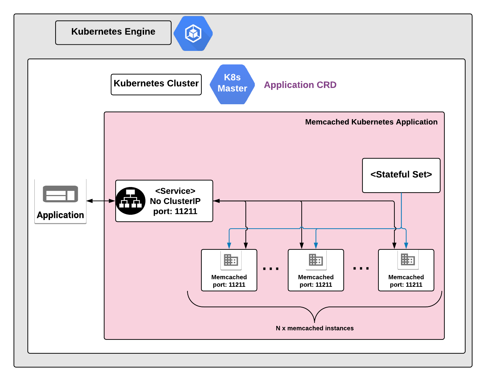

# Overview

Memcached is an open source in-memory key-value store. The key features of this
application include high performance and ease of distribution. While Memcached
is intended to be used with dynamic web applications, it can be used as a
caching system for a number of databases.

To learn more about Memcached, visit the
[Memcached website](https://memcached.org/).

## About Google Click to Deploy

Popular open stacks on Kubernetes packaged by Google.

## Architecture



A Kubernetes StatefulSet manages all the Memcached Pods in ths application. Each
Pod runs a single instance of Memcached, which listens on the TCP port 11211.

This application is set up as an internal cache, and so is not exposed to
external traffic. The Memcached Service also doesn't have a service IP address,
to prevent the discovery of the Pod IP addresses. Typically, Memcached clients
discover the IP addresses of Memcached on their own, and implement a mechanism
to query and distribute their requests to the pool of Memcached instances.

## Quick install with Google Cloud Marketplace

Get up and running with a few clicks! Install this Memcached app to a Google
Kubernetes Engine cluster using Google Cloud Marketplace. Follow the
[on-screen instructions](https://console.cloud.google.com/marketplace/details/google/memcached).

## Command line instructions

You can use [Google Cloud Shell](https://cloud.google.com/shell/) or a local
workstation to complete the following steps.

[](https://console.cloud.google.com/cloudshell/editor?cloudshell_git_repo=https://github.com/GoogleCloudPlatform/click-to-deploy&cloudshell_open_in_editor=README.md&cloudshell_working_dir=k8s/memcached)

### Prerequisites

#### Set up command-line tools

You'll need the following tools in your development environment. If you are
using Cloud Shell, `gcloud`, `kubectl`, Docker, and Git are installed in your
environment by default.

-   [gcloud](https://cloud.google.com/sdk/gcloud/)
-   [kubectl](https://kubernetes.io/docs/reference/kubectl/overview/)
-   [docker](https://docs.docker.com/install/)
-   [pip](https://pip.pypa.io/en/stable/installing/)
-   [git](https://git-scm.com/book/en/v2/Getting-Started-Installing-Git)
-   [helm](https://helm.sh/)

Configure `gcloud` as a Docker credential helper:

```shell
gcloud auth configure-docker
```

#### Create a Google Kubernetes Engine cluster

Create a new cluster from the command line.

```shell
export CLUSTER=memcached-cluster
export ZONE=us-west1-a

gcloud container clusters create "$CLUSTER" --zone "$ZONE"
```

Configure `kubectl` to connect to the new cluster.

```shell
gcloud container clusters get-credentials "$CLUSTER" --zone "$ZONE"
```

#### Clone this repo

Clone this repo and the associated tools repo.

```shell
git clone --recursive https://github.com/GoogleCloudPlatform/click-to-deploy.git
```

#### Install the Application resource definition

An Application resource is a collection of individual Kubernetes components,
such as Services, Deployments, and so on, that you can manage as a group.

To set up your cluster to understand Application resources, run the following
command:

```shell
kubectl apply -f "https://raw.githubusercontent.com/GoogleCloudPlatform/marketplace-k8s-app-tools/master/crd/app-crd.yaml"
```

You need to run this command once.

The Application resource is defined by the
[Kubernetes SIG-apps](https://github.com/kubernetes/community/tree/master/sig-apps)
community. The source code can be found on
[github.com/kubernetes-sigs/application](https://github.com/kubernetes-sigs/application).

### Install the Application

Navigate to the `memcached` directory:

```shell
cd click-to-deploy/k8s/memcached
```

#### Configure the app with environment variables

Choose an instance name and namespace for the app. You typically use
[namespaces](https://kubernetes.io/docs/concepts/overview/working-with-objects/namespaces/)
if you have many users spread across multiple teams or projects.

```shell
export APP_INSTANCE_NAME=memcached-1
export NAMESPACE=default
```

Set the number of replicas:

```shell
export REPLICAS=3
```

Enable Stackdriver Metrics Exporter:

> **NOTE:** Your GCP project must have Stackdriver enabled. If you are using a
> non-GCP cluster, you cannot export metrics to Stackdriver.

By default, application does not export metrics to Stackdriver. To enable this
option, change the value to `true`.

```shell
export METRICS_EXPORTER_ENABLED=false
```

Set up the image tag:

It is advised to use stable image reference which you can find on
[Marketplace Container Registry](https://marketplace.gcr.io/google/memcached).
Example:

```shell
export TAG="1.6.21-<BUILD_ID>"
```

Alternatively you can use short tag which points to the latest image for selected version.
> Warning: this tag is not stable and referenced image might change over time.

```shell
export TAG="1.6"
```

Configure the container image:

```shell
export IMAGE_MEMCACHED="marketplace.gcr.io/google/memcached"
export IMAGE_METRICS_EXPORTER="marketplace.gcr.io/google/memcached/prometheus-to-sd:${TAG}"
```

#### Create a namespace in your Kubernetes cluster

If you use a different namespace than `default`, run the command below to create
a new namespace:

```shell
kubectl create namespace "$NAMESPACE"
```

#### Expand the manifest template

Use `helm template` to expand the template. We recommend that you save the
expanded manifest file for future updates to the application.

```shell
helm template "$APP_INSTANCE_NAME" chart/memcached \
  --namespace "$NAMESPACE" \
  --set memcached.replicas="$REPLICAS" \
  --set memcached.image.repo="$IMAGE_MEMCACHED" \
  --set memcached.image.tag="$TAG" \
  --set metrics.image="$IMAGE_METRICS_EXPORTER" \
  --set metrics.exporter.enabled="$METRICS_EXPORTER_ENABLED" \
  > "${APP_INSTANCE_NAME}_manifest.yaml"
```

#### Apply the manifest to your Kubernetes cluster

Use `kubectl` to apply the manifest to your Kubernetes cluster:

```shell
kubectl apply -f "${APP_INSTANCE_NAME}_manifest.yaml" --namespace "${NAMESPACE}"
```

#### View the app in the Google Cloud Platform Console

To get the GCP Console URL for your app, run the following command:

```shell
echo "https://console.cloud.google.com/kubernetes/application/${ZONE}/${CLUSTER}/${NAMESPACE}/${APP_INSTANCE_NAME}"
```

To view your app, open the URL in your browser.

# Using the Memcached app

To use the app, you follow these high-level steps:

1.  Get the external IP address for the Memcached cluster.

1.  Configure your application to use the Memcached cluster as a cache.
    Typically, applications use specialized Memcached clients, such as
    [pymemcache](http://pymemcache.readthedocs.io/en/latest/getting_started.html).
    The clients run a hashing algorithm to select a Memcached server for storing
    or retrieving cached data.

## Get the IP addresses of your Memcached instances

Your application can get information about Memcached instances using the
`kubectl` command, or programmatically.

To get the IP addresses of your Memcached instances using `kubectl`, run the
following command:

```shell
kubectl get pods -o wide -l app.kubernetes.io/name=$APP_INSTANCE_NAME --namespace "$NAMESPACE"
```

To get the IP addresses of your Memcached instances from within the Kubernetes
cluster (such as from a Memcached Pod) run the following command

```shell
nslookup $APP_INSTANCE_NAME-memcached-svc.$NAMESPACE.svc.cluster.local
```

To get the IP addresses of your Memcached instances using Python, you can use
the `kubernetes` module.

To install the `kubernetes` module, run the following command:

```shell
pip install kubernetes
```

Use the following sample Python code to get the IP addresses:

```python
import os

# kubernetes module; install with `pip install kubernetes`
from kubernetes import client, config

# Load Kubernetes config
config.load_kube_config()

# Create a Kubernetes client
k8s_client = client.CoreV1Api()

# Get the list of all pods
pod_list = k8s_client.list_namespaced_pod("default")

# list all pods from the default namespace
for pod in pod_list.items:
    print("%s\t%s\t%s" % (pod.metadata.name, pod.status.phase, pod.status.pod_ip))
```

For more information on using the `kubernetes` module, see
https://github.com/kubernetes-client/python

## Using Memcached instances as a cache in your application

You can use one of many Memcached clients to access your Memcached cluster, such
as `pymemcache`. For information on `pymemcache`, see
http://pymemcache.readthedocs.io/en/latest/getting_started.html.

## Note: exposing the Memcached service externally

Avoid exposing your Memcached service externally. Applications in the same
Kubernetes cluster as the app can access your Memcached instances.

In this specific example, there is no encryption between applications and the
Memcached instances, and no authentication/authorization schema is applied.

# Application metrics

## Prometheus metrics

The application is configured to expose its metrics through
[Memcached Exporter](https://github.com/prometheus/memcached_exporter) in the
[Prometheus format](https://github.com/prometheus/docs/blob/master/content/docs/instrumenting/exposition_formats.md).
For more detailed information on setting up the plugin, see the
[Memcached Exporter documentation](https://github.com/prometheus/memcached_exporter/blob/master/README.md).

You can access the metrics at `[POD_IP]:9150/metrics`, where `[POD_IP]` is the
IP address read from the Kubernetes headless Service
`$APP_INSTANCE_NAME-memcached-prometheus-svc`.

### Configuring Prometheus to collect metrics

Prometheus can be configured to automatically collect the application's metrics.
Follow the steps in
[Configuring Prometheus](https://prometheus.io/docs/introduction/first_steps/#configuring-prometheus).

You configure the metrics in the
[`scrape_configs` section](https://prometheus.io/docs/prometheus/latest/configuration/configuration/#scrape_config).

## Exporting metrics to Stackdriver

The deployment includes a
[Prometheus to Stackdriver (`prometheus-to-sd`)](https://github.com/GoogleCloudPlatform/k8s-stackdriver/tree/master/prometheus-to-sd)
container. If you enabled the option to export metrics to Stackdriver, the
metrics are automatically exported to Stackdriver and visible in
[Stackdriver Metrics Explorer](https://cloud.google.com/monitoring/charts/metrics-explorer).
The name of each metric starts with the application's name, which you define in
the `APP_INSTANCE_NAME` environment variable.

The exporting option might not be available for GKE on-prem clusters.

> Note: Stackdriver has [quotas](https://cloud.google.com/monitoring/quotas) for
> the number of custom metrics created in a single GCP project. If the quota is
> met, additional metrics might not show up in the Stackdriver Metrics Explorer.

You can remove existing metric descriptors using
[Stackdriver's REST API](https://cloud.google.com/monitoring/api/ref_v3/rest/v3/projects.metricDescriptors/delete).

# Scaling

You can scale your Memcached service up or down by changing the number of
replicas, using the following command:

```shell
kubectl scale statefulsets "$APP_INSTANCE_NAME-memcached" \
  --namespace "$NAMESPACE" \
  --replicas=[NEW_REPLICAS]
```

Where `[NEW_REPLICAS]` is the new number.

# Updating the application

If you want to use an updated image for the Memcached container, use the
following steps:

1.  In the Memcached StatefulSet, change the image that is used for the Pod
    template:

    ```shell
    kubectl set image statefulset "$APP_INSTANCE_NAME-memcached" \
      --namespace "$NAMESPACE" memcached=[NEW_IMAGE_REFERENCE]
    ```

    where `[NEW_IMAGE_REFERENCE]` is the updated image.

1.  To check the status of Pods in the StatefulSet, and the progress of the new
    image, run the following command:

    ```shell
    kubectl get pods -l app.kubernetes.io/name=$APP_INSTANCE_NAME --namespace "$NAMESPACE"
    ```

1.  To verify the image used by the Pods, run the following command:

    ```shell
    kubectl get pods -l app.kubernetes.io/name=$APP_INSTANCE_NAME --namespace "$NAMESPACE" -o=jsonpath='{range .items[*]}{"\n"}{.metadata.name}{":\t"}{range .spec.containers[*]}{.image}{", "}{end}{end}' | sort
    ```

# Uninstalling the application

You can delete the Memcached application using the Google Cloud Platform
Console, or using the command line.

## Using the Google Cloud Platform Console

1.  In the GCP Console, open
    [Kubernetes Applications](https://console.cloud.google.com/kubernetes/application).

1.  From the list of applications, click **Memcached**.

1.  On the Application Details page, click **Delete**.

## Using the command line

1.  Navigate to the `memcached` directory.

    ```shell
    cd click-to-deploy/k8s/memcached
    ```

1.  Expand the manifest template

    Use `helm template` to expand the template.

    ```shell
    helm template chart/memcached \
      --name "$APP_INSTANCE_NAME" \
      --namespace "$NAMESPACE" \
      --set memcached.replicas="$REPLICAS" \
      --set memcached.image.repo="$IMAGE_MEMCACHED" \
      --set memcached.image.tag="$TAG" \
      --set metrics.image="$IMAGE_METRICS_EXPORTER" \
      --set metrics.exporter.enabled="$METRICS_EXPORTER_ENABLED" \
      > "${APP_INSTANCE_NAME}_manifest.yaml"
    ```

1.  Run the `delete` command

    ```shell
    kubectl delete -f ${APP_INSTANCE_NAME}_manifest.yaml --namespace $NAMESPACE
    ```

Optionally, if you don't need the deployed application or the GKE cluster,
delete the cluster using this command:

```shell
gcloud container clusters delete "$CLUSTER" --zone "$ZONE"
```
