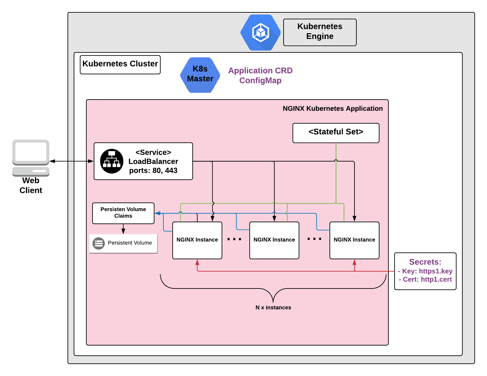

# Overview

NGINX is open source software that you can use as a web server, reverse proxy,
cache, load balancer, and for streaming media. You can also use NGINX as a proxy
server for email (IMAP, POP3, and SMTP), and a reverse proxy and load balancer
for HTTP, TCP, and UDP servers.

To learn more about NGINX, see the [NGINX website](https://www.nginx.com/).

This application uses NGINX as a web server and is configured to serve only
static content. Each NGINX Pod is associated with its own PersistentVolume,
which is created as a standard persistent disk defined by Google Kubernetes
Engine.

This application is pre-configured with an SSL certificate. While you are
installing the application using the steps below, you must replace the
certificate with your own valid SSL certificate.

## About Google Click to Deploy

Popular open stacks on Kubernetes packaged by Google.

## Architecture



This application uses NGINX to serve static web content. The default
configuration includes example content.

This application exposes two endpoints: HTTP on port 80 and HTTPS on port 443.

This application uses pre-generated certificates to configure the HTTPS
endpoint. The certificate is valid for 365 days. The certificate is stored as
`https1.cert` secret and private key is stored as `https1.key` secret.

If you want to use this application in a production environment, you must:

*   Configure your own valid SSL certificate, and associate it with your domain
    name.
*   Upload your web content to the application

The steps to update the certificate for the application are in
[Update your SSL certificate](#update-your-ssl-certificate).

The steps to add content to your server are in
[Add web content](#add-web-content).

# Installation

## Quick install with Google Cloud Marketplace

Get up and running with a few clicks! Install this NGINX app to a Google
Kubernetes Engine cluster using Google Cloud Marketplace. Follow the
[on-screen instructions](https://console.cloud.google.com/marketplace/details/google/nginx).

## Command line instructions

You can use [Google Cloud Shell](https://cloud.google.com/shell/) or a local
workstation to complete the following steps.

[](https://console.cloud.google.com/cloudshell/editor?cloudshell_git_repo=https://github.com/GoogleCloudPlatform/click-to-deploy&cloudshell_open_in_editor=README.md&cloudshell_working_dir=k8s/nginx)

### Prerequisites

#### Set up command-line tools

You'll need the following tools in your development environment. If you are
using Cloud Shell, `gcloud`, `kubectl`, Docker, and Git are installed in your
environment by default.

-   [gcloud](https://cloud.google.com/sdk/gcloud/)
-   [kubectl](https://kubernetes.io/docs/reference/kubectl/overview/)
-   [docker](https://docs.docker.com/install/)
-   [git](https://git-scm.com/book/en/v2/Getting-Started-Installing-Git)
-   [helm](https://helm.sh/)

Configure `gcloud` as a Docker credential helper:

```shell
gcloud auth configure-docker
```

#### Create a Google Kubernetes Engine cluster

Create a new cluster from the command line:

```shell
export CLUSTER=nginx-cluster
export ZONE=us-west1-a

gcloud container clusters create "$CLUSTER" --zone "$ZONE"
```

Configure `kubectl` to connect to the new cluster.

```shell
gcloud container clusters get-credentials "$CLUSTER" --zone "$ZONE"
```

#### Clone this repo

Clone this repo and the associated tools repo.

```shell
git clone --recursive https://github.com/GoogleCloudPlatform/click-to-deploy.git
```

#### Install the Application resource definition

An Application resource is a collection of individual Kubernetes components,
such as Services, Deployments, and so on, that you can manage as a group.

To set up your cluster to understand Application resources, run the following
command:

```shell
kubectl apply -f "https://raw.githubusercontent.com/GoogleCloudPlatform/marketplace-k8s-app-tools/master/crd/app-crd.yaml"
```

You need to run this command once.

The Application resource is defined by the
[Kubernetes SIG-apps](https://github.com/kubernetes/community/tree/master/sig-apps)
community. The source code can be found on
[github.com/kubernetes-sigs/application](https://github.com/kubernetes-sigs/application).

### Install the Application

Navigate to the `nginx` directory:

```shell
cd click-to-deploy/k8s/nginx
```

#### Configure the app with environment variables

Choose the instance name and namespace for the app:

```shell
export APP_INSTANCE_NAME=nginx-1
export NAMESPACE=default
export REPLICAS=3
```

For the persistent disk provisioning of the NGINX StatefulSets, you will need to:

 * Set the StorageClass name. Check your available options using the command below:
   * ```kubectl get storageclass```
   * Or check how to create a new StorageClass in [Kubernetes Documentation](https://kubernetes.io/docs/concepts/storage/storage-classes/#the-storageclass-resource)

 * Set the persistent disk's size. The default disk size is "1Gi".

```shell
export DEFAULT_STORAGE_CLASS="standard" # provide your StorageClass name if not "standard"
export PERSISTENT_DISK_SIZE="1Gi"
```

Enable Stackdriver Metrics Exporter:

> **NOTE:** Your GCP project must have Stackdriver enabled. If you are using a
> non-GCP cluster, you cannot export metrics to Stackdriver.

By default, application export metrics to Stackdriver as free curated metrics.
The metrics prefix would be `kubernetes.io/nginx/`. To disable this option,
change the value of `CURATED_METRICS_EXPORTER_ENABLED` to `false`.

To keep backward compatibility, users can still export metrics as custom metrics.
To enable this option, change the value of `METRICS_EXPORTER_ENABLED` to `true`.

We encourage users migrate to the free metrics as it saves cost for the users.

```shell
export CURATED_METRICS_EXPORTER_ENABLED=true
export METRICS_EXPORTER_ENABLED=false
```

Set up the image tag:

It is advised to use stable image reference which you can find on
[Marketplace Container Registry](https://marketplace.gcr.io/google/nginx).
Example:

```shell
export TAG="<BUILD_ID>"
```

Alternatively you can use short tag which points to the latest image for selected version.
> Warning: this tag is not stable and referenced image might change over time.

```shell
export TAG="1.25"
```

Configure the container images:

```shell
export IMAGE_NGINX="marketplace.gcr.io/google/nginx"
export IMAGE_NGINX_INIT="marketplace.gcr.io/google/nginx/debian9:${TAG}"
export IMAGE_NGINX_EXPORTER="marketplace.gcr.io/google/nginx/nginx-exporter:${TAG}"
export IMAGE_METRICS_EXPORTER="marketplace.gcr.io/google/nginx/prometheus-to-sd:${TAG}"
```

#### Create TLS certificate for Nginx

1.  If you already have a certificate that you want to use, copy your
    certificate and key pair to the `/tmp/tls.crt`, and `/tmp/tls.key` files,
    then skip to the next step.

    To create a new certificate, run the following command:

    ```shell
    openssl req -x509 -nodes -days 365 -newkey rsa:2048 \
        -keyout /tmp/tls.key \
        -out /tmp/tls.crt \
        -subj "/CN=nginx/O=nginx"
    ```

1.  Set `TLS_CERTIFICATE_KEY` and `TLS_CERTIFICATE_CRT` variables:

    ```shell
    export TLS_CERTIFICATE_KEY="$(cat /tmp/tls.key | base64)"
    export TLS_CERTIFICATE_CRT="$(cat /tmp/tls.crt | base64)"
    ```

#### Create a namespace in your Kubernetes cluster

If you use a different namespace than `default`, run the command below to create
a new namespace:

```shell
kubectl create namespace "$NAMESPACE"
```

#### Expand the manifest template

Use `helm template` to expand the template. We recommend that you save the
expanded manifest file for future updates to the application.

```shell
helm template "$APP_INSTANCE_NAME" chart/nginx \
  --namespace "$NAMESPACE" \
  --set nginx.replicas="$REPLICAS" \
  --set nginx.initImage="$IMAGE_NGINX_INIT" \
  --set nginx.image.repo="$IMAGE_NGINX" \
  --set nginx.image.tag="$TAG" \
  --set nginx.persistence.storageClass="${DEFAULT_STORAGE_CLASS}" \
  --set nginx.persistence.size="${PERSISTENT_DISK_SIZE}" \
  --set exporter.image="$IMAGE_NGINX_EXPORTER" \
  --set metrics.image="$IMAGE_METRICS_EXPORTER" \
  --set metrics.curatedExporter.enabled="$CURATED_METRICS_EXPORTER_ENABLED" \
  --set metrics.exporter.enabled="$METRICS_EXPORTER_ENABLED" \
  --set tls.base64EncodedPrivateKey="$TLS_CERTIFICATE_KEY" \
  --set tls.base64EncodedCertificate="$TLS_CERTIFICATE_CRT" \
  > "${APP_INSTANCE_NAME}_manifest.yaml"
```

#### Apply the manifest to your Kubernetes cluster

Use `kubectl` to apply the manifest to your Kubernetes cluster:

```shell
kubectl apply -f "${APP_INSTANCE_NAME}_manifest.yaml" --namespace "${NAMESPACE}"
```

#### View the app in the Google Cloud Console

To get the GCP Console URL for your app, run the following command:

```shell
echo "https://console.cloud.google.com/kubernetes/application/${ZONE}/${CLUSTER}/${NAMESPACE}/${APP_INSTANCE_NAME}"
```

To view your app, open the URL in your browser.

# Using the app

You can get the IP addresses for your NGINX solution either from the command
line, or from the Google Cloud Platform Console.

In the GCP Console, do the following:

1.  Open the
    [Kubernetes Engine Services](https://console.cloud.google.com/kubernetes/discovery)
    page.
1.  Identify the NGINX solution using its name (typically `nginx-1-nginx-svc`)
1.  From the Endpoints column, note the IP addresses for ports 80 and 443.

If you are using the command line, run the following command:

```shell
kubectl get svc -l app.kubernetes.io/name=$APP_INSTANCE_NAME --namespace "$NAMESPACE"
```

This command shows the internal and external IP address of your NGINX service.

# Application metrics

## Prometheus metrics

The application is configured to expose its metrics through
[Nginx Exporter](https://github.com/nginxinc/nginx-prometheus-exporter) in the
[Prometheus format](https://github.com/prometheus/docs/blob/master/content/docs/instrumenting/exposition_formats.md).
For more detailed information about setting up the plugin, see the
[Nginx Exporter documentation](https://github.com/nginxinc/nginx-prometheus-exporter/blob/master/README.md).

You can access the metrics at `[POD_IP]:9113/metrics`, where `[POD_IP]` is the
IP address from the Kubernetes headless service
`$APP_INSTANCE_NAME-nginx-prometheus-svc`.

### Configuring Prometheus to collect metrics

Prometheus can be configured to automatically collect the application's metrics.
Follow the steps in
[Configuring Prometheus](https://prometheus.io/docs/introduction/first_steps/#configuring-prometheus).

You configure the metrics in the
[`scrape_configs` section](https://prometheus.io/docs/prometheus/latest/configuration/configuration/#scrape_config).

## Exporting metrics to Stackdriver

The deployment includes a
[Prometheus to Stackdriver (`prometheus-to-sd`)](https://github.com/GoogleCloudPlatform/k8s-stackdriver/tree/master/prometheus-to-sd)
container. If you enabled the option to export metrics to Stackdriver, the
metrics are automatically exported to Stackdriver and visible in
[Stackdriver Metrics Explorer](https://cloud.google.com/monitoring/charts/metrics-explorer).
The name of each metric starts with the application's name, which you define in
the `APP_INSTANCE_NAME` environment variable.

The exporting option might not be available for GKE on-prem clusters.

> Note: Stackdriver has [quotas](https://cloud.google.com/monitoring/quotas) for
> the number of custom metrics created in a single GCP project. If the quota is
> met, additional metrics might not show up in the Stackdriver Metrics Explorer.

You can remove existing metric descriptors using
[Stackdriver's REST API](https://cloud.google.com/monitoring/api/ref_v3/rest/v3/projects.metricDescriptors/delete).

# Scaling

By default, the NGINX application is deployed using 3 replicas. You can manually
scale it up or down using the following command:

```shell
kubectl scale statefulsets "$APP_INSTANCE_NAME-nginx" \
  --namespace "$NAMESPACE" \
  --replicas=[NEW_REPLICAS]
```

where `[NEW_REPLICAS]` is the new number of replicas.

# Add web content

To update the content in your NGINX web server you can use the scripts in the
`click-to-deploy/k8s/nginx/scripts` folder.

Navigate to `click-to-deploy/k8s/nginx/scripts` and add your web content to the
`html` folder. Then run the commands below.

```shell
export APP_INSTANCE_NAME=application_name  # for example, nginx-1
export NAMESPACE=default
./upload-webdata.sh
```

# Backup and Restore

To backup and restore the content of your NGINX web server, use the scripts in
the `click-to-deploy/k8s/nginx/scripts` folder.

## Backup

To back up the content of your NGINX web server, run the following command:

```shell
export APP_INSTANCE_NAME=application_name  # for example, nginx-1
export NAMESPACE=default
cd click-to-deploy/k8s/nginx/scripts
./backup-webdata.sh
```

The web server content is stored in the `backup` folder.

## Restore

To restore the content of your NGINX web server, run the following commands:

```shell
export APP_INSTANCE_NAME=application_name  # for example, nginx-1
export NAMESPACE=default
cd click-to-deploy/k8s/nginx/scripts
./upload-webdata.sh
```

# Update your SSL certificate

We strongly recommend that you use a valid certificate issued by an approved
Certificate Authority (CA) for your NGINX server.

To update the certificate, you need:

*   The certificate file, such as an X509 certificate
*   The private key file, in the PEM format. If you are using a signed
    certificate, use a bundled file that contains your domain certificate and
    the intermediate certificate

To update the certificate for a running server:

**Caution**: To avoid accidentally committing your certificate to your Git
repository, perform these steps outside the cloned `click-to-deploy` repo.

1.  Save the certificate as `https1.cert` in a folder on your workstation.
1.  Save the private key of your certificate as `https1.key` in the same folder.
1.  Copy
    [`click-to-deploy/k8s/nginx/scripts/nginx-update-cert.sh`](scripts/nginx-update-cert.sh)
    to the folder where `https1.cert` and `https1.key` are stored.
1.  Define the `APP_INSTANCE_NAME` environment variable:

    ```shell
    export APP_INSTANCE_NAME=application_name  # for example, nginx-1
    ```

1.  Define the `NAMESPACE` environment variable:

    ```shell
    export NAMESPACE=default
    ```

1.  Run the update script:
    [`./nginx-update-cert.sh`](scripts/nginx-update-cert.sh).

If you want to create a self-signed certificate, typically used for testing, use
the
[`click-to-deploy/k8s/nginx/scripts/nginx-create-key.sh`](scripts/nginx-create-key.sh)
script.

# Updating the application

These steps assume that you have a new image for the NGINX container available
to your Kubernetes cluster. The new image is used in the following commands as
`[NEW_IMAGE_REFERENCE]`.

In the NGINX StatefulSet, modify the image used for the Pod template:

```shell
kubectl set image statefulset "$APP_INSTANCE_NAME-nginx" \
  --namespace "$NAMESPACE" nginx=[NEW_IMAGE_REFERENCE]
```

where `[NEW_IMAGE_REFERENCE]` is the new image.

To check the status of Pods in the StatefulSet, and the progress of deploying
the new image, run the following command:

```shell
kubectl get pods -l app.kubernetes.io/name=$APP_INSTANCE_NAME --namespace "$NAMESPACE"
```

To check the current image used by Pods in the `NGINX` Kubernetes application,
run the following command:

```shell
kubectl get pods -l app.kubernetes.io/name=$APP_INSTANCE_NAME --namespace "$NAMESPACE" -o=jsonpath='{range .items[*]}{"\n"}{.metadata.name}{":\t"}{range .spec.containers[*]}{.image}{", "}{end}{end}' | sort
```

# Uninstalling the app

You can delete the NGINX application using the Google Cloud Platform Console, or
using the command line.

## Using the Google Cloud Platform Console

1.  In the GCP Console, open
    [Kubernetes Applications](https://console.cloud.google.com/kubernetes/application).

1.  From the list of applications, click **NGINX**.

1.  On the Application Details page, click **Delete**.

## Using the command line

1.  Navigate to the `nginx` directory.

    ```shell
    cd click-to-deploy/k8s/nginx
    ```

1.  Run the `kubectl delete` command:

    ```shell
    kubectl delete -f ${APP_INSTANCE_NAME}_manifest.yaml --namespace $NAMESPACE
    ```

Optionally, if you don't need the deployed application or the Kubernetes Engine
cluster, delete the cluster using this command:

```shell
gcloud container clusters delete "$CLUSTER" --zone "$ZONE"
```
