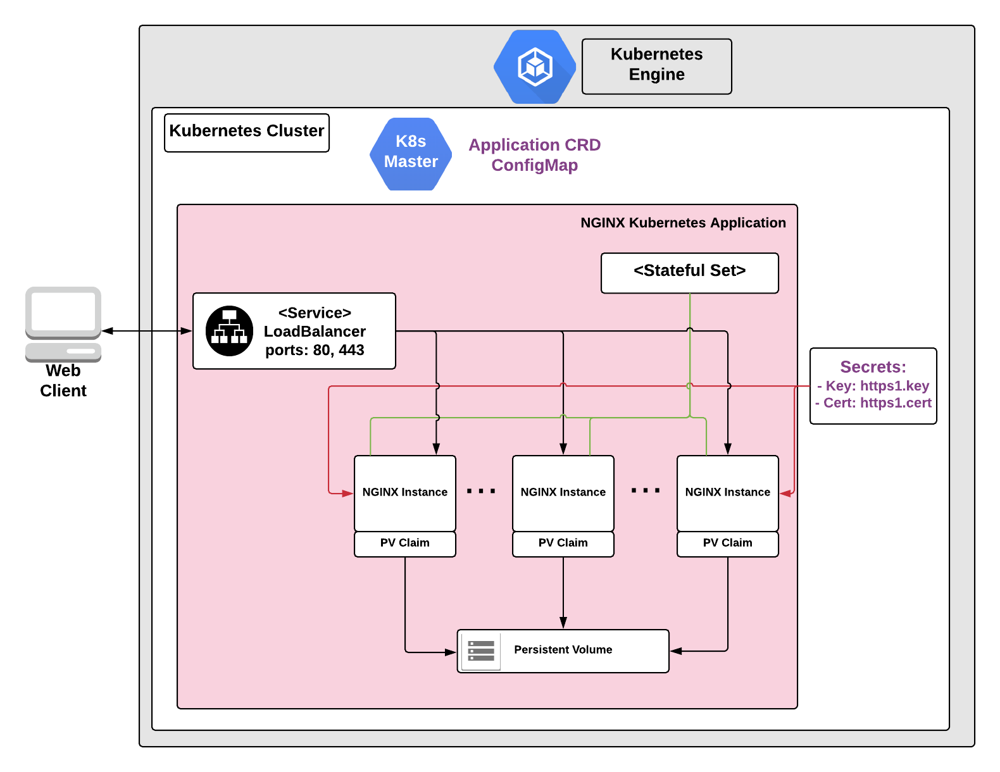

# Overview

NGINX is open source software for web serving, reverse proxying, caching, load
balancing, and media streaming. You can also use NGINX as a proxy server for
email (IMAP, POP3, and SMTP), and a reverse proxy and load balancer for HTTP,
TCP, and UDP servers.

To learn more about NGINX, see the [NGINX website](https://www.nginx.com/).

This particular web server application uses NGINX for web serving and is configured to serve only static content.
Each NGINX pod is associated with its own persistent volume created as a standard persistent disk type defined by Google Kubernetes Engine.

This web server application is pre-configured with an SSL certificate. Please replace it (per instructions delivered) with your valid SSL certificate.

## About Google Click to Deploy

Popular open stacks on Kubernetes packaged by Google.

## Design



### Solution Information

NGINX is a multi-purpose software that delivers not only the functionality of web server but also reverse proxy, load balancer, HTTP cache and mail proxy.

This specific application is designed to use NGINX for serving web content.

Initial configuration of application serves some default, exemplary content. This application exposes
two endpoints: HTTP on port 80 and HTTPS on port 443. 

This application uses pre-generated certificates to configure HTTPS endpoint. The validity of the certificate used for this application is 365 days. The certificate is stored as `https1.cert` secret and private key ise stored as `https1.key` secret.

### Solution Configuration

If users consider using this application for production purposes then they need:
* configure their own valid SSL certificate that will be associated with appropriate DNS domain name
* upload their web content to K8s application

The instructions how to update the certificate in case NGINX application is up and running are documented in the section [Re-configure certificate of your NGINX server](#re-configure-certificate-of-your-nginx-server)

The instructions how to upload web content to this application are presented in [Web Content Update section](#web-content-update).

# Installation

## Quick install with Google Cloud Marketplace

Get up and running with a few clicks! Install this NGINX app to a
Google Kubernetes Engine cluster using Google Cloud Marketplace. Follow the
[on-screen instructions](https://console.cloud.google.com/marketplace/details/google/nginx).

## Command line instructions

You can use [Google Cloud Shell](https://cloud.google.com/shell/) or a local workstation in the
further instructions.

[](https://console.cloud.google.com/cloudshell/editor?cloudshell_git_repo=https://github.com/GoogleCloudPlatform/click-to-deploy&cloudshell_working_dir=k8s/nginx)

### Prerequisites

#### Set up command-line tools

You'll need the following tools in your development environment:

- [gcloud](https://cloud.google.com/sdk/gcloud/)
- [kubectl](https://kubernetes.io/docs/reference/kubectl/overview/)
- [docker](https://docs.docker.com/install/)
- [git](https://git-scm.com/book/en/v2/Getting-Started-Installing-Git)

Configure `gcloud` as a Docker credential helper:

```shell
gcloud auth configure-docker
```

#### Create a Google Kubernetes Engine cluster

Create a new cluster from the command line:

```shell
export CLUSTER=nginx-cluster
export ZONE=us-west1-a

gcloud container clusters create "$CLUSTER" --zone "$ZONE"
```

Configure `kubectl` to connect to the new cluster.

```shell
gcloud container clusters get-credentials "$CLUSTER" --zone "$ZONE"
```

#### Clone this repo

Clone this repo and the associated tools repo.

```shell
git clone --recursive https://github.com/GoogleCloudPlatform/click-to-deploy.git
```

#### Install the Application resource definition

An Application resource is a collection of individual Kubernetes components,
such as Services, Deployments, and so on, that you can manage as a group.

To set up your cluster to understand Application resources, run the following command:

```shell
kubectl apply -f "https://raw.githubusercontent.com/GoogleCloudPlatform/marketplace-k8s-app-tools/master/crd/app-crd.yaml"
```

You need to run this command once.

The Application resource is defined by the
[Kubernetes SIG-apps](https://github.com/kubernetes/community/tree/master/sig-apps)
community. The source code can be found on
[github.com/kubernetes-sigs/application](https://github.com/kubernetes-sigs/application).

### Install the Application

Navigate to the `nginx` directory:

```shell
cd click-to-deploy/k8s/nginx
```

#### Configure the app with environment variables

Choose the instance name and namespace for the app:

```shell
export APP_INSTANCE_NAME=nginx-1
export NAMESPACE=default
export REPLICAS=3
```

Enable Stackdriver Metrics Exporter:

 > **NOTE:** Your GCP project should have Stackdriver enabled. For non-GCP clusters, export of metrics to Stackdriver is not supported yet.

By default the integration is disabled. To enable, change the
METRICS_EXPORTER_ENABLED variable value to `true`.

 ```shell
export METRICS_EXPORTER_ENABLED=false
```

Configure the container images:

```shell
TAG=1.15
export IMAGE_NGINX="marketplace.gcr.io/google/nginx:${TAG}"
export IMAGE_NGINX_INIT="marketplace.gcr.io/google/nginx/debian9:${TAG}"
export IMAGE_METRICS_EXPORTER="marketplace.gcr.io/google/nginx/prometheus-to-sd:${TAG}"
```

The images above are referenced by
[tag](https://docs.docker.com/engine/reference/commandline/tag). We recommend
that you pin each image to an immutable
[content digest](https://docs.docker.com/registry/spec/api/#content-digests).
This ensures that the installed application always uses the same images,
until you are ready to upgrade. To get the digest for the image, use the
following script:

```shell
for i in "IMAGE_NGINX" "IMAGE_NGINX_INIT" "IMAGE_METRICS_EXPORTER"; do
  repo=$(echo ${!i} | cut -d: -f1);
  digest=$(docker pull ${!i} | sed -n -e 's/Digest: //p');
  export $i="$repo@$digest";
  env | grep $i;
done
```

#### Create namespace in your Kubernetes cluster

If you use a different namespace than the `default`, run the command below to create a new namespace:

```shell
kubectl create namespace "$NAMESPACE"
```

#### Expand the manifest template

Use `helm template` to expand the template. We recommend that you save the
expanded manifest file for future updates to the application.

```shell
helm template chart/nginx \
  --name $APP_INSTANCE_NAME \
  --namespace $NAMESPACE \
  --set nginx.replicas=$REPLICAS \
  --set nginx.initImage=$IMAGE_NGINX_INIT \
  --set nginx.image=$IMAGE_NGINX \
  --set metrics.image=$IMAGE_METRICS_EXPORTER \
  --set metrics.enabled=$METRICS_EXPORTER_ENABLED > "${APP_INSTANCE_NAME}_manifest.yaml"
```

#### Apply the manifest to your Kubernetes cluster

Use `kubectl` to apply the manifest to your Kubernetes cluster:

```shell
kubectl apply -f "${APP_INSTANCE_NAME}_manifest.yaml" --namespace "${NAMESPACE}"
```

#### View the app in the Google Cloud Console

To get the Console URL for your app, run the following command:

```shell
echo "https://console.cloud.google.com/kubernetes/application/${ZONE}/${CLUSTER}/${NAMESPACE}/${APP_INSTANCE_NAME}"
```

To view your app, open the URL in your browser.

# Using the app

You can get the IP addresses for your NGINX solution either from the command
line, or from the Google Cloud Platform Console.

In the GCP Console, do the following:

1. Open the [Kubernetes Engine Services](https://console.cloud.google.com/kubernetes/discovery) page.
1. Identify the NGINX solution using its name (for example, `nginx-1-nginx-svc`)
1. From the Endpoints column, note the IP addresses for ports 80 and 443.

If you are using the command line, run the following command:

```shell
kubectl get svc -l app.kubernetes.io/name=$APP_INSTANCE_NAME --namespace "$NAMESPACE"
```

This command shows the internal and external IP address of your NGINX service.

# Application metrics

## Prometheus metrics

The application is configured to expose its metrics through
[Nginx Exporter](https://github.com/nginxinc/nginx-prometheus-exporter)
in the [Prometheus format](https://github.com/prometheus/docs/blob/master/content/docs/instrumenting/exposition_formats.md).
For more detailed information about the plugin setup, see the [Nginx Exporter documentation](https://github.com/nginxinc/nginx-prometheus-exporter/blob/master/README.md).
Metrics can be read on a single HTTP endpoint available at `[POD_IP]:9113/metrics`,
where `[POD_IP]` is the IP read from Kubernetes headless service `$APP_INSTANCE_NAME-nginx-prometheus-svc`.

## Configuring Prometheus to collect the metrics

Prometheus can be configured to automatically collect the application's metrics.
Follow the [Configuring Prometheus documentation](https://prometheus.io/docs/introduction/first_steps/#configuring-prometheus)
to enable metrics scrapping in your Prometheus server. The detailed specification
of `<scrape_config>` used to enable the metrics collection can be found
[here](https://prometheus.io/docs/prometheus/latest/configuration/configuration/#scrape_config).

## Exporting metrics to Stackdriver

If the option to export application metrics to Stackdriver is enabled,
the deployment includes a [`prometheus-to-sd`](https://github.com/GoogleCloudPlatform/k8s-stackdriver/tree/master/prometheus-to-sd)
(Prometheus to Stackdriver exporter) container.
Then the metrics will be automatically exported to Stackdriver and visible in
[Stackdriver Metrics Explorer](https://cloud.google.com/monitoring/charts/metrics-explorer).

Each metric of the application will have a name starting with the application's name
(matching the variable `APP_INSTANCE_NAME` described above).

The exporting option might not be available for GKE on-prem clusters.

> Note: Please be aware that Stackdriver has [quotas](https://cloud.google.com/monitoring/quotas)
for the number of custom metrics created in a single GCP project. If the quota is met,
additional metrics will not be accepted by Stackdriver, which might cause that some metrics
from your application might not show up in the Stackdriver's Metrics Explorer.
 Existing metric descriptors can be removed through
[Stackdriver's REST API](https://cloud.google.com/monitoring/api/ref_v3/rest/v3/projects.metricDescriptors/delete).


# Scaling

By default, the NGINX application is deployed using 3 replicas. You can
manually scale it up or down using the following command:

```shell
kubectl scale statefulsets "$APP_INSTANCE_NAME-nginx" \
  --namespace "$NAMESPACE" \
  --replicas=[NEW_REPLICAS]
```

where `[NEW_REPLICAS]` is the new number of replicas.

# Web Content Update

To perform update of the content of your NGINX web server you can use scripts provided for you in `click-to-deploy/k8s/nginx/scripts` folder.

Navigate to `click-to-deploy/k8s/nginx/scripts` folder, save your web content in `html` folder and follow the instructions below.

```shell
export APP_INSTANCE_NAME=<the name of your application, e.g. nginx-1>
export NAMESPACE=default
./upload-webdata.sh
```

# Backup and Restore

To perform backup & restore of the content of your NGINX web server you can use scripts provided for you in `click-to-deploy/k8s/nginx/scripts` folder.

## Backup

To perform backup of the content of your NGINX web server run the following command:

```shell
export APP_INSTANCE_NAME=<the name of your application, e.g. nginx-1>
export NAMESPACE=default
cd click-to-deploy/k8s/nginx/scripts
./backup-webdata.sh
```
The web server content will be stored in `backup` folder.

## Restore
To perform restore of the content of your NGINX web server run the following commands

```shell
export APP_INSTANCE_NAME=<the name of your application, e.g. nginx-1>
export NAMESPACE=default
cd click-to-deploy/k8s/nginx/scripts
./upload-webdata.sh
```

# Re-configure certificate of your NGINX server

It's higly recommened that you use a valid certificate issued by an approved Certificate Authority for your NGINX server.

To update the certificate for NGINX server you need to have:
- certificate file (for example in X509 format)
- private key file (in the PEM format; if using a signed certificate - use bundled file with your domain certificate and the intermediate one)

To update the certificate for a running NGINX server do the following:
1. Save the certificate under `https1.cert` file in `click-to-deploy/k8s/nginx/scripts` folder.
1. Save the private key of your certificate under `https1.key` file in `click-to-deploy/k8s/nginx/scripts` folder.
1. Copy [`click-to-deploy/k8s/nginx/scripts/nginx-update-cert.sh`](scripts/nginx-update-cert.sh) to the folder where `https1.cert` and `https1.key` are stored.
1. Define `APP_INSTANCE_NAME` environment variable:

    ```shell
    export APP_INSTANCE_NAME=<the name of your application, e.g. nginx-1>
    ```

1. Define `NAMESPACE` environment variable:

    ```shell
    export NAMESPACE=default
    ```

1. Run the update script: [`./nginx-update-cert.sh`](scripts/nginx-update-cert.sh).

NOTE: Please, make sure to perform above-mentioned operations outside of directory
where you cloned `click-to-deploy` repository to avoid accidental commit on `https1.cert` and `https1.key` files.

NOTE: [`click-to-deploy/k8s/nginx/scripts/nginx-create-key.sh`](scripts/nginx-create-key.sh) script can be helpful
if you would like to generate self-signed certificate.

# Update

This procedure assumes that you have a new image for the NGINX container
available to your Kubernetes cluster. The new image is used in the following
commands as `[NEW_IMAGE_REFERENCE]`.

In the NGINX StatefulSet, modify the image used for the Pod template:

```shell
kubectl set image statefulset "$APP_INSTANCE_NAME-nginx" \
  --namespace "$NAMESPACE" nginx=[NEW_IMAGE_REFERENCE]
```

where `[NEW_IMAGE_REFERENCE]` is the new image.

To check the status of Pods in the StatefulSet, and the progress of deploying
the new image, run the following command:

```shell
kubectl get pods -l app.kubernetes.io/name=$APP_INSTANCE_NAME --namespace "$NAMESPACE"
```

To check the current image used by Pods in the `NGINX` Kubernetes application,
run the following command:

```shell
kubectl get pods -l app.kubernetes.io/name=$APP_INSTANCE_NAME --namespace "$NAMESPACE" -o=jsonpath='{range .items[*]}{"\n"}{.metadata.name}{":\t"}{range .spec.containers[*]}{.image}{", "}{end}{end}' | sort
```

# Uninstalling the app

You can delete the NGINX application using the Google Cloud Platform Console, or using Kubernetes tools.

If you are using the command line:

1. Navigate to the `nginx` directory.

    ```shell
    cd click-to-deploy/k8s/nginx
    ```

1. Run the `kubectl delete` command:

    ```shell
    kubectl delete -f ${APP_INSTANCE_NAME}_manifest.yaml --namespace $NAMESPACE
    ```

Optionally, if you don't need the deployed application or the Kubernetes
Engine cluster, delete the whole cluster using this command:

```shell
gcloud container clusters delete "$CLUSTER" --zone "$ZONE"
```
