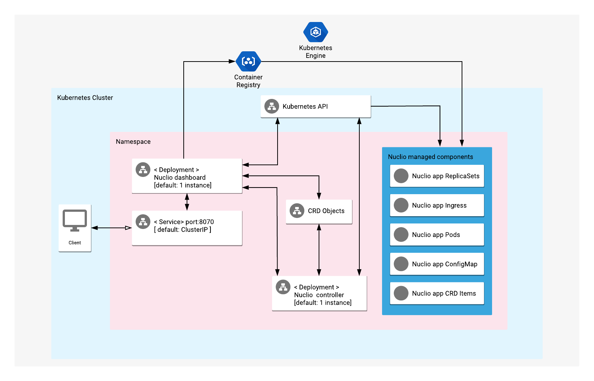

# Overview

Nuclio is a new serverless project, derived from Iguazio's elastic data
life cycle management service for high-performance events and data processing.

Nuclio lets you write source code defining functions in platform-specific
conventions (including the triggers configuration and stateful data definition).
Nuclio converts the source code into container images, stores them in a
configurable Docker registry (for this app, Container Registry), and then
deploys their workloads to a Kubernetes cluster.

For more information on Nuclio, see the [Nuclio official website](https://www.nuclio.io/).

## About Google Click to Deploy

Popular open stacks on Kubernetes, packaged by Google.

## Architecture



The app offers Nuclio custom resource definitions (CRDs) and deployments of
the Nuclio controller and dashboard on a Kubernetes cluster.

To install Nuclio, you must have access to a Docker registry for building and
deploying Nuclio apps.

# Installation

## Quick install with Google Cloud Marketplace

Get up and running with a few clicks! Install this Nuclio app to a
Google Kubernetes Engine cluster by using Google Cloud Marketplace. Follow the
[on-screen instructions](https://console.cloud.google.com/marketplace/details/google/nuclio).

## Command line instructions

### Prerequisites

#### Set up command line tools

You'll need the following tools in your development environment. If you are
using Cloud Shell, then `gcloud`, `kubectl`, Docker, and Git are installed in
your environment by default.

- [gcloud](https://cloud.google.com/sdk/gcloud/)
- [kubectl](https://kubernetes.io/docs/reference/kubectl/overview/)
- [docker](https://docs.docker.com/install/)
- [git](https://git-scm.com/book/en/v2/Getting-Started-Installing-Git)
- [helm](https://helm.sh/)
- [envsubst](https://command-not-found.com/envsubst)

Configure `gcloud` as a Docker credential helper:

```shell
gcloud auth configure-docker
```

#### Create a service account to access Container Registry

To provide access to Container Registry, you must create a service account for
the Nuclio app.

1. Open [Cloud Console](https://console.cloud.google.com/) in your browser.
1. Select **IAM & admin** from the navigation menu sidebar and then click on
   **Service accounts**.
1. Click on **+ CREATE SERVICE ACCOUNT**.
    1. Provide the name for a new service account.
       Before saving a new account, please take a note of the generated
       "Service account ID", which will look something like
       `[SA_NAME]@[PROJECT_ID].iam.gserviceaccount.com`. It will be needed
       throughout the following steps.
    1. Click **Done** to proceed.
1. Click **Continue** to skip the "Grant this service account access to
   project" step without making any changes.
1. To complete the "Grant users access to this service account" step, you must
   create and download a secret key.
1. Click **CREATE KEY** and choose to use JSON as the key type.
    1. Click **CREATE**.
    1. Your JSON key will download automatically. Store the key file in a
       secure place.
       It will be required for further configuration steps.

Set up permissions for the created service account:

1. From the navigation menu, select **Storage**.
1. Find a bucket which is used as the Docker registry, and which has a name
   similar to `artifacts.[PROJECT_ID].appspot.com`. Click on it to open it.
1. Switch to the **Permissions** tab.
1. Click **Add members**.
    1. Add new members by their service account IDs, as created and saved in the
       previous steps.
    1. Choose **Storage** -> **Storage Admin** to add a new role for a service account.
    1. Click **SAVE** to save the new role.

To create a Kubernetes Secret resource, follow [these instructions](#create-secret-resource-for-gcp-docker-registry).

#### Create a Google Kubernetes Engine (GKE) cluster

Create a new cluster from the command line:

```shell
export CLUSTER=nuclio-cluster
export ZONE=us-west1-a

gcloud container clusters create "${CLUSTER}" --zone "${ZONE}"
```

Configure `kubectl` to connect to the new cluster.

```shell
gcloud container clusters get-credentials "${CLUSTER}" --zone "${ZONE}"
```

#### Clone this repo

Clone this repo and its associated tools repo:

```shell
git clone --recursive https://github.com/GoogleCloudPlatform/click-to-deploy.git
```

#### Install the Application resource definition

An Application resource is a collection of individual Kubernetes components,
such as Services, Deployments, and so on, that you can manage as a group.

To set up your cluster to understand Application resources, run the following command:

```shell
kubectl apply -f "https://raw.githubusercontent.com/GoogleCloudPlatform/marketplace-k8s-app-tools/master/crd/app-crd.yaml"
```

You must run this command at least once.

The Application resource is defined by the
[Kubernetes SIG-apps](https://github.com/kubernetes/community/tree/master/sig-apps) community.
The source code can be found at [github.com/kubernetes-sigs/application](https://github.com/kubernetes-sigs/application).

### Install the app

Navigate to the `nuclio` directory:

```shell
cd click-to-deploy/k8s/nuclio
```

#### Configure the app with environment variables

Choose an instance name and
[namespace](https://kubernetes.io/docs/concepts/overview/working-with-objects/namespaces/)
for the app. In most cases, you can use the `default` namespace.

```shell
export APP_INSTANCE_NAME=nuclio-1
export NAMESPACE=default
```

Set up the image tag:

It is advised to use stable image reference which you can find on
[Marketplace Container Registry](https://marketplace.gcr.io/google/nuclio).
Example:

```shell
export TAG="1.11.20-<BUILD_ID>"
```

Alternatively you can use short tag which points to the latest image for selected version.
> Warning: this tag is not stable and referenced image might change over time.

```shell
export TAG="1.11"
```

Configure the container images:

```shell
export IMAGE_CONTROLLER="marketplace.gcr.io/google/nuclio"
export IMAGE_DASHBOARD="marketplace.gcr.io/google/nuclio/dashboard"
```

If you are using the Container Registry Docker registry, you should define the push/pull
URL, which is different from the login URL.

To use the Docker registry from your current project, enter the following command:

```shell
export PUSH_PULL_URL="gcr.io/$(gcloud config get-value project)/${APP_INSTANCE_NAME}-images"
```

You also have the option of defining another registry Secret name.
By default, it is `${APP_INSTANCE_NAME}-registry-credentials`.

```shell
export REGISTRY_SECRET="docker-credentials"
```

You can also specify the number of replicas for the Nuclio dashboard.
The default - and recommended - value for this is 1.

```shell
export DASHBOARD_REPLICAS=1
```

#### Create namespace in your Kubernetes cluster

If you use a different namespace than the `default`, run the command
below to create a new namespace:

```shell
kubectl create namespace "${NAMESPACE}"
```

#### Create a Secret resource for the Container Registry Docker registry

This step will require a key, which you can create following
[these instructions](#create-service-account-to-access-gcp-registry).

If you are using a different namespace from the `default`, please create
it by following
[these instructions](#create-namespace-in-your-kubernetes-cluster).

To create a Secret resource which contains credentials for the Container
Registry Docker registry, modify and run the following command:

```shell
export KEY_JSON=[PATH_TO_KEY]
kubectl --namespace "${NAMESPACE}" create secret docker-registry ${APP_INSTANCE_NAME}-registry-credentials \
        --docker-server=gcr.io \
        --docker-username=_json_key \
        --docker-password="$(cat ${KEY_JSON})" \
        --docker-email=email@example.com
```

where `PATH_TO_KEY` is the path to the key created in
[the previous step](#create-secret-resource-for-the-container-registry-docker-registry).

If you're using a private Docker registry, you can create this Secret by
following
[these steps](https://kubernetes.io/docs/tasks/configure-pod-container/pull-image-private-registry/)
from the official Kubernetes documentation.

##### Create dedicated Service accounts

Define the environment variables:

```shell
export NUCLIO_SERVICE_ACCOUNT="${APP_INSTANCE_NAME}-nuclio-sa"
```

Expand the manifest to create Service accounts:

```shell
cat resources/service-accounts.yaml \
  | envsubst '${APP_INSTANCE_NAME} \
              ${NAMESPACE} \
              ${NUCLIO_SERVICE_ACCOUNT} \
    > "${APP_INSTANCE_NAME}_sa_manifest.yaml"
```

Create the accounts on the cluster with `kubectl`:

```shell
kubectl apply -f "${APP_INSTANCE_NAME}_sa_manifest.yaml" \
    --namespace "${NAMESPACE}"
```

#### Expand the manifest template

Use `helm template` to expand the template. We recommend that you save the
expanded manifest file for future updates to the app.

```shell
helm template chart/nuclio \
  --name ${APP_INSTANCE_NAME} \
  --namespace ${NAMESPACE} \
  --set controller.image.repo=${IMAGE_CONTROLLER} \
  --set controller.image.tag=${TAG} \
  --set dashboard.image.repo=${IMAGE_DASHBOARD} \
  --set dashboard.image.tag=${TAG} \
  --set deployerHelm.image="gcr.io/cloud-marketplace-tools/k8s/deployer_helm:0.8.0" \
  $( [[ -n "${PUSH_PULL_URL}" ]] && echo "--set registry.pushPullUrl=${PUSH_PULL_URL}" ) \
  $( [[ -n "${REGISTRY_SECRET}" ]] && echo "--set registry.registry.secretName=${REGISTRY_SECRET}" ) \
  $( [[ -n "${DASHBOARD_REPLICAS}" ]] && echo "--set dashboard.replicas=${DASHBOARD_REPLICAS}" ) \
  --set nuclio.serviceAccountName=${NUCLIO_SERVICE_ACCOUNT} \
  > ${APP_INSTANCE_NAME}_manifest.yaml
```

#### Apply the manifest to your Kubernetes cluster

Use `kubectl` to apply the manifest to your Kubernetes cluster:

```shell
kubectl apply -f "${APP_INSTANCE_NAME}_manifest.yaml" --namespace "${NAMESPACE}"
```

#### View the app in the Google Cloud Console

To get the Cloud Console URL for your app, run the following command:

```shell
echo "https://console.cloud.google.com/kubernetes/application/${ZONE}/${CLUSTER}/${NAMESPACE}/${APP_INSTANCE_NAME}"
```

To view the app, open the URL in your browser.

### Access the Nuclio dashboard service (locally)

The Nuclio dashboard will be available at
[http://localhost:8070/](http://localhost:8070/).

```shell
kubectl --namespace "${NAMESPACE}" port-forward service/${APP_INSTANCE_NAME}-dashboard 8070:8070
```

# Scaling up or down

### Nuclio controller

Scaling is not supported for the Nuclio controller.

### Nuclio dashboard

To change the number of dashboard replicas, use the following command:

```shell
kubectl scale deployment "${APP_INSTANCE_NAME}-dashboard" \
  --namespace "${NAMESPACE}" --replicas=<new-replicas>
```

# Backup and restore

## Back up Nuclio configuration data to your local environment

To back up Nuclio resources, use the following command:

```shell
export NAMESPACE=default
kubectl --namespace "${NAMESPACE}" get crd \
   nucliofunctionevents.nuclio.io \
   nucliofunctions.nuclio.io \
   nuclioprojects.nuclio.io \
   --output=yaml > backup_file.yaml
```

## Restore Nuclio configuration data

```shell
kubectl --namespace "${NAMESPACE}" apply -f backup_file.yaml
```

# Upgrading the app

The Nuclio deployment is configured to roll out updates
automatically. To start an update, patch the deployment with
a new image reference:

```shell
kubectl set image deployment ${APP_INSTANCE_NAME}-dashboard --namespace ${NAMESPACE} \
  "nuclio=[NEW_DASHBOARD_IMAGE_REFERENCE]"
kubectl set image deployment ${APP_INSTANCE_NAME}-controller --namespace ${NAMESPACE} \
  "nuclio=[NEW_CONTROLLER_IMAGE_REFERENCE]"
```

where `[NEW_DASHBOARD_IMAGE_REFERENCE]` and
`[NEW_CONTROLLER_IMAGE_REFERENCE]` are the Docker image
references of the new images that you want to use.

To check the status of Pods in the StatefulSet, and the progress
of the new image, run the following command:

```shell
kubectl get pods --selector app.kubernetes.io/name=${APP_INSTANCE_NAME} \
  --namespace ${NAMESPACE}
```

# Uninstall the app

## Using the Google Cloud Console

1. In the Cloud Console, open
   [Kubernetes Applications](https://console.cloud.google.com/kubernetes/application).

1. From the list of apps, select **Nuclio**.

1. On the Application Details page, click **Delete**.

## Using the command line

### Prepare the environment

Set your installation name and Kubernetes namespace:

```shell
export APP_INSTANCE_NAME=nuclio-1
export NAMESPACE=default
```

### Delete the resources

> **NOTE:** We recommend that you use a kubectl version that
is the same as the version of your cluster. Using the same
versions for kubectl and the cluster helps to avoid unforeseen
issues.

To delete the resources, use the expanded manifest file used
for the installation.

Run `kubectl` on the expanded manifest file:

```shell
kubectl delete -f ${APP_INSTANCE_NAME}_manifest.yaml --namespace ${NAMESPACE}
```

Otherwise, delete the resources by using types and a label:

```shell
kubectl delete application \
  --namespace ${NAMESPACE} \
  --selector app.kubernetes.io/name=${APP_INSTANCE_NAME}
```

> **NOTE:** This will delete only the Nuclio app itself. All Nuclio-managed resources will remain available.

### Delete the GKE cluster

Optionally, if you don't need the deployed app or the GKE
cluster, delete the cluster by using this command:

```shell
gcloud container clusters delete "${CLUSTER}" --zone "${ZONE}"
```
