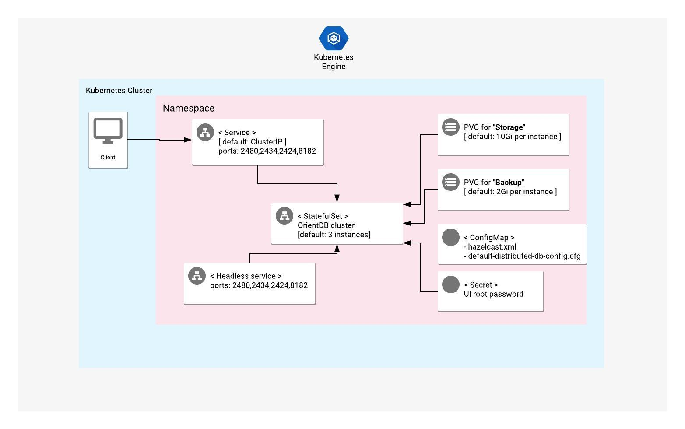

# Overview

OrientDB is an open source NoSQL database management system, written in Java.

This solution supports both [2.2.x](http://orientdb.com/docs/2.2.x/)
and [3.0.x](http://orientdb.com/docs/3.0.x/) versions of OrientDB.

For more information, visit the OrientDB [official website](https://orientdb.com//).

## About Google Click to Deploy

Popular open stacks on Kubernetes, packaged by Google.

## Architecture



For replication and high availability (HA), this solution follows the patterns
described in the
[Orientdb distributed architecture](https://orientdb.com/docs/3.0.x/distributed/Distributed-Architecture.html#distributed-architecture)
page.

A Kubernetes StatefulSet manages all of the OrientDB pods in this app. By default,
the app runs 3 OrientDB servers in separate pods, and they discover each other
by following the Hazelcast Transmission Control Protocol/Internet Protocol (TCP/IP)
discovery protocol. For replication, OrientDB uses an internal binary protocol.
Each pod gets 1 PersistentVolumeClaim (PVC) for Storage, and 1 PVC for Backup.

Access to the OrientDB Studio service is authenticated by default.

# Installation

## Installing with Google Cloud Marketplace

Get up and running with a few clicks! To install this OrientDB app to a Google
Kubernetes Engine (GKE) cluster by using Google Cloud Marketplace, follow the
[on-screen instructions](https://console.cloud.google.com/marketplace/details/google/orientdb).

## Command-line instructions

You can use [Google Cloud Shell](https://cloud.google.com/shell/) or a local
workstation to follow the steps below.

[](https://console.cloud.google.com/cloudshell/editor?cloudshell_git_repo=https://github.com/GoogleCloudPlatform/click-to-deploy&cloudshell_open_in_editor=README.md&cloudshell_working_dir=k8s/orientdb)

### Prerequisites

#### Setting up command-line tools

You'll need the following tools in your development environment. If you are
using Cloud Shell, then `gcloud`, `kubectl`, Docker, and Git are installed in your
environment by default.

* [gcloud](https://cloud.google.com/sdk/gcloud/)
* [kubectl](https://kubernetes.io/docs/reference/kubectl/overview/)
* [docker](https://docs.docker.com/install/)
* [git](https://git-scm.com/book/en/v2/Getting-Started-Installing-Git)
* [openssl](https://www.openssl.org/)
* [helm](https://helm.sh/)

Configure `gcloud` as a Docker credential helper:

```shell
gcloud auth configure-docker
```

#### Creating a Google Kubernetes Engine (GKE) cluster

Create a new cluster from the command line:

```shell
export CLUSTER=orientdb-cluster
export ZONE=us-west1-a
export PROJECT_ID=<GCP_Project_ID>

gcloud container clusters create "$CLUSTER" --zone "$ZONE"
```

Configure `kubectl` to connect to the new cluster:

```shell
gcloud container clusters get-credentials "$CLUSTER" --zone "$ZONE"
```

#### Cloning this repo

Clone this repo, and the associated tools repo:

```shell
git clone --recursive https://github.com/GoogleCloudPlatform/click-to-deploy.git
```

#### Installing the Application resource definition

An Application resource is a collection of individual Kubernetes components,
such as Services, StatefulSets, and so on, that you can manage as a group.

To set up your cluster to understand Application resources, run the following
command:

```shell
kubectl apply -f "https://raw.githubusercontent.com/GoogleCloudPlatform/marketplace-k8s-app-tools/master/crd/app-crd.yaml"
```

You need to run this command once.

The
[Kubernetes SIG-apps](https://github.com/kubernetes/community/tree/master/sig-apps)
community defines the Application resource. You can find the source code at
[github.com/kubernetes-sigs/application](https://github.com/kubernetes-sigs/application).

### Installing the app

Navigate to the `orientdb` directory:

```shell
cd click-to-deploy/k8s/orientdb
```

#### Configuring the app with environment variables

Choose the instance name and namespace for the app. For most cases, you can
use the `default` namespace.

```shell
export APP_INSTANCE_NAME=orientdb-1
export NAMESPACE=default
```

Configure the image tag:

```shell
# For OrientDB version 2.2.x
export TAG=2.2

# For OrientDB version 3.0.x
export TAG=3.0
```

Configure the container images:

```shell
export IMAGE_ORIENTDB="marketplace.gcr.io/google/orientdb"
export IMAGE_DEPLOYER="gcr.io/cloud-marketplace-tools/k8s/deployer_helm:0.8.0"
```

Set the number of replicas for OrientDB:

```shell
export REPLICAS=3
```

Set or generate the root password for OrientDB Studio UI:

```shell
export ORIENTDB_ROOT_PASSWORD=$(cat /dev/urandom | tr -dc 'a-zA-Z0-9' | fold -w 10 | head -n 1 | tr -d '\n')
```

Set the storage class for the persistent volume of OrientDB's main storage and
backup storage:

 * Set the StorageClass name. You can select your existing StorageClass name for
   the persistent disk of OrientDB's storage.
 * Set the persistent disk's size for main storage. The default disk size is
   `5Gi`.
 * Set the persistent disk's size for backup storage. The default disk size
   is `2Gi`.

> Note: We recomend that you use `ssd` type storage for OrientDB, as it uses
> local disk to store and retrieve keys and values. To create a StorageClass
> for dynamic provisioning of SSD persistent volumes, refer to
> [Using SSD persistent disks](https://cloud.google.com/kubernetes-engine/docs/how-to/persistent-volumes/ssd-pd)
> for more detailed instructions.

```shell
export STORAGE_CLASS="standard" # provide your StorageClass name if not "standard"
export PERSISTENT_STORAGE_SIZE="5Gi"
export PERSISTENT_BACKUP_SIZE="2Gi"
```

#### Creating a namespace in your Kubernetes cluster

If you use a different namespace than `default`, or if the namespace does
not exist yet, create a new namespace:

```shell
kubectl create namespace "${NAMESPACE}"
```

#### Expanding the manifest template

To expand the template, use `helm template`. We recommend that you save the
expanded manifest file for future updates to your app.

```shell
helm template chart/orientdb \
  --name "${APP_INSTANCE_NAME}" \
  --namespace "${NAMESPACE}" \
  --set orientdb.image.repo="${IMAGE_ORIENTDB}" \
  --set orientdb.image.tag="${TAG}" \
  --set deployer.image="${IMAGE_DEPLOYER}" \
  --set orientdb.replicas="${REPLICAS}" \
  --set orientdb.persistence.storageClass="${STORAGE_CLASS}" \
  --set orientdb.persistence.storage.size="${PERSISTENT_STORAGE_SIZE}" \
  --set orientdb.persistence.backup.size="${PERSISTENT_BACKUP_SIZE}" \
  --set orientdb.rootPassword="${ORIENTDB_ROOT_PASSWORD}" \
  > ${APP_INSTANCE_NAME}_manifest.yaml
```

#### Applying the manifest to your Kubernetes cluster

To apply the manifest to your Kubernetes cluster, use `kubectl`:

```shell
kubectl apply -f "${APP_INSTANCE_NAME}_manifest.yaml" --namespace "${NAMESPACE}"
```

#### Viewing the app in the Google Cloud Console

To get the Cloud Console URL for your app, run the following command:

```shell
echo "https://console.cloud.google.com/kubernetes/application/${ZONE}/${CLUSTER}/${NAMESPACE}/${APP_INSTANCE_NAME}?project=${PROJECT_ID}"
```

To view the app, open the URL in your browser.

### Accessing the OrientDB Studio web console

The deployed service of OrientDB is of type ClusterIP, so you can reach the
OrientDB Studio UI within a Kubernetes cluster by port-forwarding. To accomplish
this, run the following commands:

```shell
# Get root user credentials of OrientDB Studio UI
ORIENTDB_ROOT_PASSWORD=$(kubectl get secret --namespace \
  ${NAMESPACE} ${APP_INSTANCE_NAME}-orientdb-secret \
  -o jsonpath="{.data.root-password}" | base64 --decode)

echo "username: root"
echo "password: ${ORIENTDB_ROOT_PASSWORD}"

# Forward OrientDB Studio port to local workspace
kubectl port-forward svc/${APP_INSTANCE_NAME}-orientdb-svc --namespace ${NAMESPACE} 2480
```

After running the commands, visit [http://localhost:2480](http://localhost:2480)
from a web browser. During your first login, you will have to create a
database with `root` credentials.

# Scaling

## Scaling the cluster up or down

By default, the OrientDB distributed cluster starts with 3 replicas.

To change the number of replicas, use the following command, where `REPLICAS`
is your desired number of replicas:

```
export REPLICAS=4
kubectl scale statefulsets "${APP_INSTANCE_NAME}-orientdb" \
  --namespace "${NAMESPACE}" --replicas="${REPLICAS}"
```

When this option is used to scale down a cluster, it reduces the number of
replicas without disconnecting nodes from the cluster. Scaling down also does
not affect the `persistentvolumeclaims` of your StatefulSet.

# Backing up and restoring

## Backing up an OrientDB 3.0.x database

The following steps are based on the
[OrientDB 3.0.x back up and restore procedure](http://orientdb.com/docs/3.0.x/admin/Backup-and-Restore.html)

### Creating a backup job

This backup job creates a backup for all available databases, or for a
single database that you define.

> Note: The backup file is stored inside the `/orientdb/backup` directory of
> the first node `${APP_INSTANCE_NAME}-orientdb-0` of the OrientDB cluster.

```shell
# navigate to the orientdb/scripts directory
cd click-to-deploy/k8s/orientdb/scripts

# Set mandatory variables like below:
export APP_INSTANCE_NAME=orientdb-1

# Optional:
export NAMESPACE=default

# Provide single name of database you want to backup
#  or set to 'all' to backup all available databases
export DATABASE=all
```

To create the manifest file for the backup job, use the
`./create_backup_manifest.sh` script:

```shell
./create_backup_manifest.sh
```

> Note: The following steps are included in scripts, so you can choose to run
> them and follow the instructions in the output as you go.

To continue backing up your database:

```shell
## 1. Scale down StatefulSet to 0
## WARNING: This will stop all running database nodes.

kubectl -n ${NAMESPACE} scale statefulset \
	${APP_INSTANCE_NAME}-orientdb --replicas=0

# Check if pods are stopped. There should be no output.
kubectl -n ${NAMESPACE} get pods -l app.kubernetes.io/name=${APP_INSTANCE_NAME}

## 2. Create backup job:

kubectl apply -f ${APP_INSTANCE_NAME}-backup-${DATABASE}-job.yaml

## Check if job status is Completed:

kubectl -n ${NAMESPACE} get pods \
	-l job-name=${APP_INSTANCE_NAME}-backup-job

## 4. After completion, scale OrientDB StatefulSet back to the same replica size:

kubectl -n ${NAMESPACE} scale statefulset \
	${APP_INSTANCE_NAME}-orientdb --replicas=3

## 5. To see all available backup files on the first node, run:

kubectl -n ${NAMESPACE} exec -it \
	${APP_INSTANCE_NAME}-orientdb-0 -- bash -c 'ls /orientdb/backup/'
```
## Restoring an OrientDB 3.0.x database

OrientDB does not support merging during restores. If you want to merge the old
data with new writes, use the
[`EXPORT DATABASE`](http://orientdb.com/docs/3.0.x/console/Console-Command-Export.html)
and
[`IMPORT DATABASE`](http://orientdb.com/docs/3.0.x/console/Console-Command-Export.html)
commands.

For more information about backing up and restoring OrientDB 3.0.x databases,
refer to the
[OrientDB 3.0.x backup and restore procedure](http://orientdb.com/docs/3.0.x/admin/Backup-and-Restore.html)
documentation.

### Creating the restore job:

This restore job restores only a single database that you define.

The restore file must exist inside the `/orientdb/backup` directory of the first
node `${APP_INSTANCE_NAME}-orientdb-0` of the OrientDB cluster, and the database
you want to restore must exist as a new, empty database.

> Note: The following steps are included in scripts, so you can choose to run
> them and follow the instructions in the output as you go.

```shell
# Navigate to the orientdb/scripts directory
cd click-to-deploy/k8s/orientdb/scripts

# Set mandatory variables like below:
export APP_INSTANCE_NAME=orientdb-1
export DATABASE=yourDB

# Export the RESTORE_FILE variable, which should exist inside the '/orientdb/backup' directory of the first node of the cluster and should contain the full name of your backup file.
# To list available backup files, run:
kubectl -n ${NAMESPACE} exec -it ${APP_INSTANCE_NAME}-orientdb-0 -- bash -c 'ls /orientdb/backup/'

export RESTORE_FILE=${DATABASE}-XYZ.zip

# Optional:
export NAMESPACE=default
```

To create the manifest file for your restore job, use the
`./create_restore_manifest.sh` script:

```shell
./create_restore_manifest.sh
```

If you have a local backup file on your workstation, then before starting the
procedure to restore, you must copy your backup file to the `/orientdb/backup`
directory of the `${APP_INSTANCE_NAME}-orientdb-0` node:

```shell
kubectl -n ${NAMESPACE} cp ${RESTORE_FILE} ${APP_INSTANCE_NAME}-orientdb-0:/orientdb/backup
```

To list available backup files in first node, run the following command:

```shell
kubectl -n ${NAMESPACE} exec -it \
	${APP_INSTANCE_NAME}-orientdb-0 -- bash -c 'ls /orientdb/backup/'
```

To continue restoring your database, follow these steps:

> Note: The following steps are included in scripts, so you can choose to run
> them and follow the instructions in the output as you go.

```shell
## 1. Scale down StatefulSet to 0:
## WARNING: This will stop all running database nodes.

kubectl -n ${NAMESPACE} scale statefulset \
	${APP_INSTANCE_NAME}-orientdb --replicas=0

# Check if pods are stopped. There should be no output.
kubectl -n ${NAMESPACE} get pods -l app.kubernetes.io/name=${APP_INSTANCE_NAME}

## 2. Create the restore job:

kubectl apply -f ${APP_INSTANCE_NAME}-restore-${DATABASE}-job.yaml

## 3. Check if the job status is Completed:

kubectl -n ${NAMESPACE} get pods \
	-l job-name=${APP_INSTANCE_NAME}-restore-job

## 4. After completion, scale the OrientDB StatefulSet back to thr same replica size:

kubectl -n ${NAMESPACE} scale statefulset \
	${APP_INSTANCE_NAME}-orientdb --replicas=3
```

# Upgrading the app

Before you upgrade the app, we recommend that you back up all of your
OrientDB databases by following the steps in
[Backing up and restoring](#backup-and-restore). For more information about
upgrading, visit the
[OrientDB Upgrading documentation](https://orientdb.com/docs/last/Upgrade.html).

The OrientDB StatefulSet is configured to roll out updates automatically. To
start the update, patch the StatefulSet with a new image reference, where
`[NEW_IMAGE_REFERENCE]` is the Docker image reference of the new image that you
want to use:

```shell
kubectl set image statefulset ${APP_INSTANCE_NAME}-orientdb --namespace ${NAMESPACE} \
  "orientdb=[NEW_IMAGE_REFERENCE]"
```

To check the status of Pods in the StatefulSet, and the progress of the
new image, run the following command:

```shell
kubectl get pods --selector app.kubernetes.io/name=${APP_INSTANCE_NAME} \
  --namespace ${NAMESPACE}
```

# Uninstalling the app

## Using the Google Cloud Console

1.  In the Cloud Console, open
    [Kubernetes Applications](https://console.cloud.google.com/kubernetes/application).

2.  From the list of apps, click **OrientDB**.

3.  From the **Application Details** page, click **Delete**.

## Using the command line

### Preparing your environment

Set your installation name and Kubernetes namespace:

```shell
export APP_INSTANCE_NAME=orientdb-1
export NAMESPACE=default
```

### Deleting the resources

> Note: We recommend using the version of `kubectl` that is the same as the
> version for your cluster. Using the same version for `kubectl` and the cluster
> helps to avoid unforeseen issues.

#### Deleting the deployment with the generated manifest file

Run `kubectl` on the expanded manifest file:

```shell
kubectl delete -f ${APP_INSTANCE_NAME}_manifest.yaml --namespace ${NAMESPACE}
```

#### Deleting the deployment by deleting the Application resource

If you don't have the expanded manifest file, you can delete the
resources by using types and a label:

```shell
kubectl delete application,statefulset,secret,service \
  --namespace ${NAMESPACE} \
  --selector app.kubernetes.io/name=${APP_INSTANCE_NAME}
```

Deleting the `Application` resource deletes all of your deployment's resources,
except for `PersistentVolumeClaim`. To remove the `PersistentVolumeClaim`s
with their attached persistent disks, run the following `kubectl` command:

```shell
kubectl delete persistentvolumeclaims \
  --namespace ${NAMESPACE} \
  --selector app.kubernetes.io/name=${APP_INSTANCE_NAME}
```
