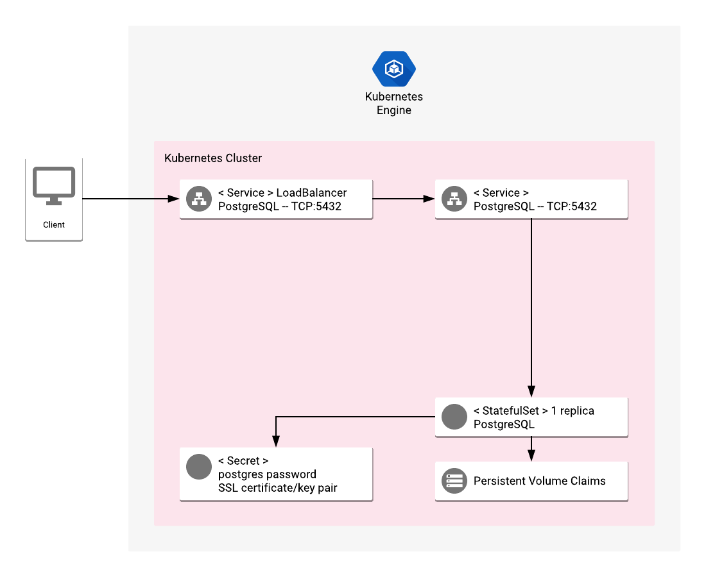

# Overview

PostgreSQL is a powerful open source object-relational database system.

For more information on PostgreSQL, see the
[PosgreSQL website](https://www.postgresql.org/).

## About Google Click to Deploy

Popular open source software stacks on Kubernetes packaged by Google and made
available in Google Cloud Marketplace.

## Architecture



This solution installs a single instance of PostgreSQL server on your
Kubernetes cluster.

The PostgreSQL Pod is managed by a StatefulSet, with the number of replicas set
to one. The PostgreSQL Pod uses a Persistent Volume to store data, and a ClusterIP
Service to expose the database port (which can be optionally exposed publicly
with a LoadBalancer type of Service). Communication between the client and server is
encrypted.

To install the application, you must set up the following:

* An initial password for the `postgres` user
* The PostgreSQL volume size
* Provide a TLS key and certificate, or generate a new certificate

The steps to set up these options are in the sections below.

# Installation

## Quick install with Google Cloud Marketplace

Get up and running with a few clicks! Install this PostgreSQL app to a Google
Kubernetes Engine cluster using Google Cloud Marketplace. Follow the
[on-screen instructions](https://console.cloud.google.com/marketplace/details/google/postgresql).

## Command line instructions

You can use [Google Cloud Shell](https://cloud.google.com/shell/) or a local
workstation to follow the steps below.

[](https://console.cloud.google.com/cloudshell/editor?cloudshell_git_repo=https://github.com/GoogleCloudPlatform/click-to-deploy&cloudshell_open_in_editor=README.md&cloudshell_working_dir=k8s/postgresql)

### Prerequisites

#### Set up command line tools

You'll need the following tools in your development environment. If you are
using Cloud Shell, `gcloud`, `kubectl`, Docker, and Git are installed in your
environment by default.

-   [docker](https://docs.docker.com/install/)
-   [gcloud](https://cloud.google.com/sdk/gcloud/)
-   [kubectl](https://kubernetes.io/docs/tasks/tools/install-kubectl/)
-   [openssl](https://www.openssl.org/)
-   [helm](https://helm.sh/)

Configure `gcloud` as a Docker credential helper:

```shell
gcloud auth configure-docker
```

#### Create a Google Kubernetes Engine (GKE) cluster

Use the following commands to create a cluster from the command line. If you
already have a cluster that you want to use, skip this step.

```shell
export CLUSTER=postgresql-cluster
export ZONE=us-west1-a
```

```shell
gcloud container clusters create "$CLUSTER" --zone "$ZONE"
```

#### Configure kubectl to connect to the cluster

```shell
gcloud container clusters get-credentials "$CLUSTER" --zone "$ZONE"
```

#### Clone this repo

Clone this repo and the associated tools repo:

```shell
git clone --recursive https://github.com/GoogleCloudPlatform/click-to-deploy.git
```

#### Install the Application resource definition

An Application resource is a collection of individual Kubernetes components,
such as Services, Deployments, and so on, that you can manage as a group.

To set up your cluster to understand Application resources, run the following
command:

```shell
kubectl apply -f "https://raw.githubusercontent.com/GoogleCloudPlatform/marketplace-k8s-app-tools/master/crd/app-crd.yaml"
```

You need to run this command once for each cluster.

The Application resource is defined by the
[Kubernetes SIG-apps](https://github.com/kubernetes/community/tree/master/sig-apps)
community. The source code can be found on
[github.com/kubernetes-sigs/application](https://github.com/kubernetes-sigs/application).

### Install the Application

Navigate to the `postgresql` directory:

```shell
cd click-to-deploy/k8s/postgresql
```

#### Configure the app with environment variables

Choose an instance name and
[namespace](https://kubernetes.io/docs/concepts/overview/working-with-objects/namespaces/)
for the app. In most cases, you can use the `default` namespace.

```shell
export APP_INSTANCE_NAME=postgresql-1
export NAMESPACE=default
```

For the persistent disk provisioning of the PostgreSQL StatefulSets, you will need to:

 * Set the StorageClass name. Check your available options using the command below:
   * ```kubectl get storageclass```
   * Or check how to create a new StorageClass in [Kubernetes Documentation](https://kubernetes.io/docs/concepts/storage/storage-classes/#the-storageclass-resource)

 * Set the persistent disk's size. The default disk size is "10Gi".

```shell
export DEFAULT_STORAGE_CLASS="standard" # provide your StorageClass name if not "standard"
export PERSISTENT_DISK_SIZE="10Gi"
```

Set up the image tag:

It is advised to use stable image reference which you can find on
[Marketplace Container Registry](https://marketplace.gcr.io/google/postgresql).
Example:

```shell
export TAG="<BUILD_ID>"
```

Alternatively you can use short tag which points to the latest image for selected version.
> Warning: this tag is not stable and referenced image might change over time.

```shell
export TAG="15.1"
```

Configure the container images:

```shell
export IMAGE_POSTGRESQL="marketplace.gcr.io/google/postgresql"
export IMAGE_POSTGRESQL_EXPORTER="marketplace.gcr.io/google/postgresql/exporter:${TAG}"
export IMAGE_METRICS_EXPORTER="marketplace.gcr.io/google/postgresql/prometheus-to-sd:${TAG}"
```

Generate a random password:

```shell
export POSTGRESQL_DB_PASSWORD="$(cat /dev/urandom | tr -dc 'a-zA-Z0-9' | fold -w 20 | head -n 1 | tr -d '\n' | base64)"
```

Expose the Service externally:

By default, the Service isn't exposed externally. To enable this option, change
the value to `true`.

```shell
export EXPOSE_PUBLIC_SERVICE=false
```

### TLS Secure Configuration

By default, TLS configuration is disabled for Postgresql service. To enable this option, change the value to `true`:

```shell
export TLS_ENABLED=true
```
##### Create TLS certificate for PostgreSQL

> Note: You can skip this step if you have not set up external access or TLS is disabled.

1.  If you already have a certificate that you want to use, copy your
    certificate and key pair to the `/tmp/tls.crt`, and `/tmp/tls.key` files,
    then skip to the next step.

    To create a new certificate, run the following command:

    ```shell
    openssl req -x509 -nodes -days 365 -newkey rsa:2048 \
        -keyout /tmp/tls.key \
        -out /tmp/tls.crt \
        -subj "/CN=postgresql/O=postgresql"
    ```

1.  Set `TLS_CERTIFICATE_KEY` and `TLS_CERTIFICATE_CRT` variables:

    ```shell
    export TLS_CERTIFICATE_KEY="$(cat /tmp/tls.key | base64)"
    export TLS_CERTIFICATE_CRT="$(cat /tmp/tls.crt | base64)"
    ```

##### Create dedicated service accounts

Define the service accounts variable:

```shell
export POSTGRESQL_SERVICE_ACCOUNT="${APP_INSTANCE_NAME}-postgresql-sa"
```

Create the service account:

```shell
kubectl create serviceaccount ${POSTGRESQL_SERVICE_ACCOUNT} --namespace ${NAMESPACE}
```

##### Enable Stackdriver Metrics Exporter:

> **NOTE:** Your GCP project must have Stackdriver enabled. If you are using a
> non-GCP cluster, you cannot export metrics to Stackdriver.

By default, the application does not export metrics to Stackdriver. To enable
this option, change the value to `true`.

```shell
export METRICS_EXPORTER_ENABLED=false
```

#### Expand the manifest template

Use `helm template` to expand the template. We recommend that you save the
expanded manifest file for future updates to the application.

```shell
helm template "$APP_INSTANCE_NAME" chart/postgresql \
  --namespace "$NAMESPACE" \
  --set postgresql.serviceAccount="$POSTGRESQL_SERVICE_ACCOUNT" \
  --set postgresql.image.repo="$IMAGE_POSTGRESQL" \
  --set postgresql.image.tag="$TAG" \
  --set postgresql.exposePublicService="$EXPOSE_PUBLIC_SERVICE" \
  --set postgresql.persistence.storageClass="${DEFAULT_STORAGE_CLASS}" \
  --set postgresql.persistence.size="${PERSISTENT_DISK_SIZE}" \
  --set db.password="$POSTGRESQL_DB_PASSWORD" \
  --set metrics.image="$IMAGE_METRICS_EXPORTER" \
  --set metrics.exporter.enabled="$METRICS_EXPORTER_ENABLED" \
  --set exporter.image="$IMAGE_POSTGRESQL_EXPORTER" \
  --set tls.enabled=$TLS_ENABLED \
  --set tls.base64EncodedPrivateKey="$TLS_CERTIFICATE_KEY" \
  --set tls.base64EncodedCertificate="$TLS_CERTIFICATE_CRT" \
  > "${APP_INSTANCE_NAME}_manifest.yaml"
```

#### Apply the manifest to your Kubernetes cluster

Use `kubectl` to apply the manifest to your Kubernetes cluster. This
installation creates:

-   An Application resource, which collects all the deployment resources into
    one logical entity
-   A ServiceAccount for the PostgreSQL Pod
-   A PersistentVolume and PersistentVolumeClaim. Note that the volume isn't be
    deleted with application. If you delete the installation and recreate it
    with the same name, the new installation uses the same PersistentVolume. As
    a result, there is no new database initialization, and no new password is
    set.
-   A Secret with the PostgreSQL initial random password
-   A StatefulSet
-   A Service, which exposes PostgreSQL server to the external world

```shell
kubectl apply -f "${APP_INSTANCE_NAME}_manifest.yaml" --namespace "${NAMESPACE}"
```

#### View the app in the Google Cloud Console

To get the GCP Console URL for your app, run the following command:

```shell
echo "https://console.cloud.google.com/kubernetes/application/${ZONE}/${CLUSTER}/${NAMESPACE}/${APP_INSTANCE_NAME}"
```

To view the app, open the URL in your browser.

# Using the app

## Sign in to your new PostgreSQL database

Forward the port locally:

```shell
kubectl port-forward \
  --namespace "${NAMESPACE}" \
  "${APP_INSTANCE_NAME}-postgresql-0" 5432
```

Sign in to PostgreSQL:

```shell
PGPASSWORD=$(kubectl get secret "${APP_INSTANCE_NAME}-secret" --output=jsonpath='{.data.password}' | openssl base64 -d -A)

echo PGPASSWORD=$PGPASSWORD sslmode=require psql -U postgres -h 127.0.0.1
```

# Application metrics

## Prometheus metrics

The application is configured to expose its metrics through
[PostgreSQL Server Exporter](https://github.com/wrouesnel/postgres_exporter) in
the
[Prometheus format](https://github.com/prometheus/docs/blob/master/content/docs/instrumenting/exposition_formats.md).

You can access the metrics at `[POSTGRESQL_CLUSTER_IP]:9187/metrics`, where
`[POSTGRESQL_CLUSTER_IP]` is the IP address of the application on Kubernetes
cluster.

### Configuring Prometheus to collect metrics

Prometheus can be configured to automatically collect the application's metrics.
Follow the steps in
[Configuring Prometheus](https://prometheus.io/docs/introduction/first_steps/#configuring-prometheus).

You configure the metrics in the
[`scrape_configs` section](https://prometheus.io/docs/prometheus/latest/configuration/configuration/#scrape_config).

## Exporting metrics to Stackdriver

The deployment includes a
[Prometheus to Stackdriver (`prometheus-to-sd`)](https://github.com/GoogleCloudPlatform/k8s-stackdriver/tree/master/prometheus-to-sd)
container. If you enabled the option to export metrics to Stackdriver, the
metrics are automatically exported to Stackdriver and visible in
[Stackdriver Metrics Explorer](https://cloud.google.com/monitoring/charts/metrics-explorer).
The name of each metric starts with the application's name, which you define in
the `APP_INSTANCE_NAME` environment variable.

The exporting option might not be available for GKE on-prem clusters.

> Note: Stackdriver has [quotas](https://cloud.google.com/monitoring/quotas) for
> the number of custom metrics created in a single GCP project. If the quota is
> met, additional metrics might not show up in the Stackdriver Metrics Explorer.

You can remove existing metric descriptors using
[Stackdriver's REST API](https://cloud.google.com/monitoring/api/ref_v3/rest/v3/projects.metricDescriptors/delete).

# Scaling

This installation is single instance of PostgreSQL.

# Backup and restore

## Backing up PostgreSQL

Run this command to back up your database:

```shell
kubectl --namespace $NAMESPACE exec -t \
    $(kubectl -n$NAMESPACE get pod -oname | \
        sed -n /\\/$APP_INSTANCE_NAME-postgresql/s.pods\\?/..p) \
    -- pg_dumpall -c -U postgres > postgresql-backup.sql
```

## Restoring your data

Run this command to restore your database from a backup:

```shell
cat postgresql-backup.sql | kubectl --namespace $NAMESPACE exec -i \
    $(kubectl -n$NAMESPACE get pod -oname | \
        sed -n /\\/$APP_INSTANCE_NAME-postgresql/s.pods\\?/..p) \
    -- psql -U postgres
```

# Updating

To update your PostgreSQL installation, follow the steps below:

1.  Delete your PostgreSQL Pod.
1.  Install a new version from GCP Marketplace.
1.  Back up your data.
1.  Run the following command:

    ```shell
    # back up your data before running

    kubectl -n $NAMESPACE delete pod $(kubectl -n$NAMESPACE get pod -oname | \
        sed -n /\\/$APP_INSTANCE_NAME-postgresql/s.pods\\?/..p)
    ```

# Deleting your PostgreSQL installation

> Warning: The following command deletes PostgreSQL from your cluster. If you
> need your data, back it up first.

```shell
kubectl delete -f ${APP_INSTANCE_NAME}_manifest.yaml --namespace $NAMESPACE
```
