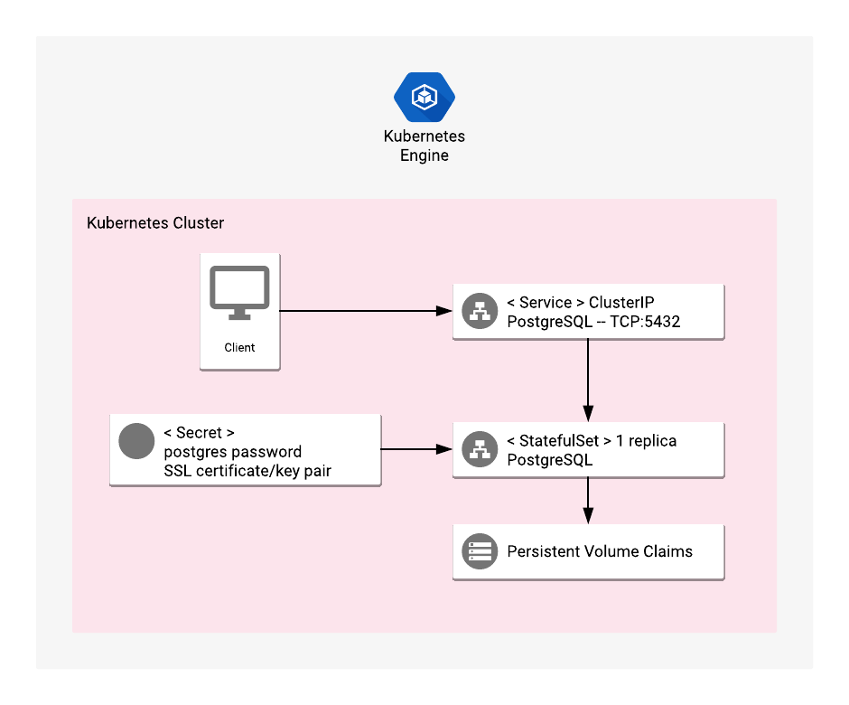

# Overview

PostgreSQL is a powerful, open source object-relational database system.

For more information on PostgreSQL, see the [PosgreSQL website](https://www.postgresql.org/).

## About Google Click to Deploy

Popular open source software stacks on Kubernetes packaged by Google and made available in Google Cloud Marketplace.

## Design



### Solution Information

This solution will install single instance of PostgreSQL server into your Kubernetes cluster.

The PostgreSQL Pod is managed by a ReplicaSet with the number of replicas set to one. The PostgreSQL Pod uses a Persistent Volume to store data, and a LoadBalancer Service to expose the database port externally. Communication between client and server is encrypted. If you need to limit access to the PostgreSQL instance, you must configure GCP firewall rules.

To install the application you will need to set up initial password for postgres user, PostgreSQL volume size and generate or provide TLS key and certificate. All required steps are covered further in this README.

# Installation

## Quick install with Google Cloud Marketplace

Get up and running with a few clicks! Install this PostgreSQL app to a Google Kubernetes Engine cluster using Google Cloud Marketplace. Follow the
[on-screen instructions](https://console.cloud.google.com/marketplace/details/google/postgresql).

## Command line instructions

You can use [Google Cloud Shell](https://cloud.google.com/shell/) or a local workstation in the
further instructions.

[](https://console.cloud.google.com/cloudshell/editor?cloudshell_git_repo=https://github.com/GoogleCloudPlatform/click-to-deploy&cloudshell_working_dir=k8s/postgresql)

### Prerequisites

#### Set up command line tools

You'll need the following tools in your environment:

- [docker](https://docs.docker.com/install/)
- [gcloud](https://cloud.google.com/sdk/gcloud/)
- [kubectl](https://kubernetes.io/docs/tasks/tools/install-kubectl/)
- [openssl](https://www.openssl.org/)

Configure `gcloud` as a Docker credential helper:

```shell
gcloud auth configure-docker
```

#### Create a Google Kubernetes Engine cluster

Create a cluster from the command line. If you already have a cluster that
you want to use, this step is optional.

```shell
export CLUSTER=postgresql-cluster
export ZONE=us-west1-a
```

```shell
gcloud container clusters create "$CLUSTER" --zone "$ZONE"
```

#### Configure kubectl to connect to the cluster

```shell
gcloud container clusters get-credentials "$CLUSTER" --zone "$ZONE"
```

#### Clone this repo

Clone this repo and the associated tools repo:

```shell
git clone --recursive https://github.com/GoogleCloudPlatform/click-to-deploy.git
```

#### Install the Application resource definition

An Application resource is a collection of individual Kubernetes components,
such as Services, Deployments, and so on, that you can manage as a group.

To set up your cluster to understand Application resources, run the following command:

```shell
kubectl apply -f "https://raw.githubusercontent.com/GoogleCloudPlatform/marketplace-k8s-app-tools/master/crd/app-crd.yaml"
```

You need to run this command once for each cluster.

The Application resource is defined by the
[Kubernetes SIG-apps](https://github.com/kubernetes/community/tree/master/sig-apps) community. The source code can be found on
[github.com/kubernetes-sigs/application](https://github.com/kubernetes-sigs/application).

### Install the Application

Navigate to the `postgresql` directory:

```shell
cd click-to-deploy/k8s/postgresql
```

#### Configure the app with environment variables

Choose an instance name and
[namespace](https://kubernetes.io/docs/concepts/overview/working-with-objects/namespaces/)
for the app. Namespace has to exist prior to installation, in most cases, you can use the `default` namespace.

```shell
export APP_INSTANCE_NAME=postgresql-1
export NAMESPACE=default
```

Configure the container image:

```shell
export IMAGE_POSTGRESQL=launcher.gcr.io/google/postgresql9:9.6-kubernetes
```

The image above is referenced by
[tag](https://docs.docker.com/engine/reference/commandline/tag). We recommend
that you pin each image to an immutable
[content digest](https://docs.docker.com/registry/spec/api/#content-digests).
This ensures that the installed application always uses the same images,
until you are ready to upgrade. To get the digest for the image, use the
following script:

```shell
IMAGE_POSTGRESQL=$(docker pull $IMAGE_POSTGRESQL | awk -F: "/^Digest:/ {print gensub(\":.*$\", \"\", 1, \"$IMAGE_POSTGRESQL\")\"@sha256:\"\$3}")
```

Create a certificate for PostgreSQL. If you already have a certificate that you
want to use, copy your certificate and key pair in to the `server.crt` and
`server.key` files.

```shell
# create a certificate for postgresql
openssl req -x509 -nodes -days 365 -newkey rsa:2048 \
    -keyout server.key \
    -out server.crt \
    -subj "/CN=postgresql/O=postgresql"

kubectl --namespace $NAMESPACE create secret generic $APP_INSTANCE_NAME-tls \
        --from-file=./server.crt --from-file=./server.key
```

Generate random password and set PosgreSQL volume size in Gigabytes:

```shell
export POSTGRESQL_DB_PASSWORD=$(openssl rand 9 | openssl base64 -A | openssl base64)
export POSTGRESQL_VOLUME_SIZE=10
```

#### Expand the manifest template

Use `helm template` to expand the template. We recommend that you save the
expanded manifest file for future updates to the application.

```shell
helm template chart/postgresql \
  --name $APP_INSTANCE_NAME \
  --namespace $NAMESPACE \
  --set postgresql.image=$IMAGE_POSTGRESQL \
  --set postgresql.volumeSize=$POSTGRESQL_VOLUME_SIZE \
  --set db.password=$POSTGRESQL_DB_PASSWORD > ${APP_INSTANCE_NAME}_manifest.yaml
```

#### Apply the manifest to your Kubernetes cluster

Use `kubectl` to apply the manifest to your Kubernetes cluster. This installation will create:

- An Application resource, which collects all the deployment resources into one logical entity
- A ServiceAccount for the PostgreSQL Pod
- A PersistentVolume and PersistentVolumeClaim. Note that the volume isn't be deleted with application. If you delete the installation and recreate it with the same name, the new installation uses the same PersistentVolume. As a result, there is no new database initialization, and no new password is set.
- A Secret with the PostgreSQL initial random password
- A Deployment
- A Service, which exposes PostgreSQL server to the external world


```shell
kubectl apply -f "${APP_INSTANCE_NAME}_manifest.yaml" --namespace "${NAMESPACE}"
```

#### View the app in the Google Cloud Console

To get the Console URL for your app, run the following command:

```shell
echo "https://console.cloud.google.com/kubernetes/application/${ZONE}/${CLUSTER}/${NAMESPACE}/${APP_INSTANCE_NAME}"
```

To view the app, open the URL in your browser.

# Using the app

### Sign in to your new PostgreSQL database

To sign in to PosgreSQL, get the ip address:

```shell
EXTERNAL_IP=$(kubectl --namespace $NAMESPACE get service $APP_INSTANCE_NAME-postgresql-svc -o jsonpath='{.status.loadBalancer.ingress[0].ip}')
PGPASSWORD=$(kubectl get secret "${APP_INSTANCE_NAME}-secret" --output=jsonpath='{.data.password}' | openssl base64 -d -A)

echo PGPASSWORD=$PGPASSWORD sslmode=require psql -U postgres -h $EXTERNAL_IP
```

# Scaling

This installation is single instance of PostgreSQL.

# Backup and restore

## Backing up PostgreSQL

```shell
kubectl --namespace $NAMESPACE exec -t \
	$(kubectl -n$NAMESPACE get pod -oname | \
		sed -n /\\/$APP_INSTANCE_NAME-postgresql-deployment/s.pods\\?/..p) \
	-- pg_dumpall -c -U postgres > postgresql-backup.sql
```

## Restoring your data

```shell
cat postgresql-backup.sql | kubectl --namespace $NAMESPACE exec -i \
	$(kubectl -n$NAMESPACE get pod -oname | \
		sed -n /\\/$APP_INSTANCE_NAME-postgresql-deployment/s.pods\\?/..p) \
	-- psql -U postgres
```

# Updating 

To update your PostgreSQL installation, delete your PostgreSQL Pod, and install
a new version from GCP marketplace. Back up your data, and run the following command:

```shell
# back up your data before running

kubectl -n $NAMESPACE delete pod $(kubectl -n$NAMESPACE get pod -oname | \
	sed -n /\\/$APP_INSTANCE_NAME-postgresql-deployment/s.pods\\?/..p)
```

# Deleting your PostgreSQL installation

> Warning: The following command deletes PostgreSQL from your cluster. If you
need your data, back it up first.

```shell
kubectl delete -f ${APP_INSTANCE_NAME}_manifest.yaml --namespace $NAMESPACE
```
