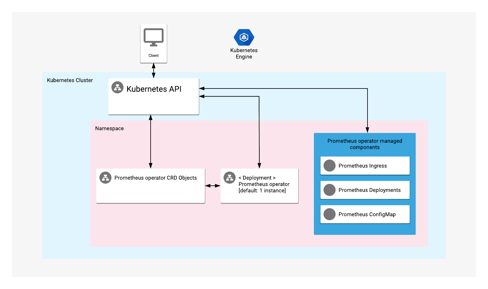

# Overview

Prometheus Operator is a management tool for installing and operating instances of Prometheus, a monitoring and alerting toolkit.

For more information, visit the [Prometheus official website](https://prometheus.io/docs/introduction/overview/).

## About Google Click to Deploy

Popular open stacks on Kubernetes, packaged by Google.

## Architecture



The app offers a Prometheus Operator deployment on a Kubernetes cluster.

# Installation

## Quick install with Google Cloud Marketplace

Get up and running with a few clicks! Install this Prometheus operator app to a
Google Kubernetes Engine cluster using Google Cloud Marketplace. Follow the
[on-screen instructions](https://console.cloud.google.com/marketplace/details/google/prometheus-operator).

### If you have an on-prem cluster rather than GKE cluster
You will also need to login 
[login instructions](https://cloud.google.com/anthos/multicluster-management/console/logging-in)

## Command-line instructions

### Prerequisites

#### Set up command-line tools

You'll need the following tools in your development environment. If you are
using Cloud Shell, then `gcloud`, `kubectl`, Docker, and Git are installed in your
environment by default.

- [gcloud](https://cloud.google.com/sdk/gcloud/)
- [kubectl](https://kubernetes.io/docs/reference/kubectl/overview/)
- [docker](https://docs.docker.com/install/)
- [git](https://git-scm.com/book/en/v2/Getting-Started-Installing-Git)
- [helm](https://helm.sh/)
- [envsubst](https://command-not-found.com/envsubst)

Configure `gcloud` as a Docker credential helper:

```shell
gcloud auth configure-docker
```

#### Create a Google Kubernetes Engine (GKE) cluster
(Or you can use your existing GKE on-prem cluster instead)

Create a new cluster from the command-line:

```shell
export CLUSTER=prometheus-operator-cluster
export ZONE=us-west1-a

gcloud container clusters create "${CLUSTER}" --zone "${ZONE}"
```

Configure `kubectl` to connect to the new cluster.

```shell
gcloud container clusters get-credentials "${CLUSTER}" --zone "${ZONE}"
```

#### Clone this repo

Clone this repo and its associated tools repo:

```shell
git clone --recursive https://github.com/GoogleCloudPlatform/click-to-deploy.git
```

#### Install the Application resource definition

An Application resource is a collection of individual Kubernetes components,
such as Services, Deployments, and so on, that you can manage as a group.

To set up your cluster to understand Application resources, run the following command:

```shell
kubectl apply -f "https://raw.githubusercontent.com/GoogleCloudPlatform/marketplace-k8s-app-tools/master/crd/app-crd.yaml"
```

You need to run this command once.

The Application resource is defined by the
[Kubernetes SIG-apps](https://github.com/kubernetes/community/tree/master/sig-apps) community.
The source code can be found on [github.com/kubernetes-sigs/application](https://github.com/kubernetes-sigs/application).

### Install the app

Navigate to the `prometheus-operator` directory:

```shell
cd click-to-deploy/k8s/prometheus-operator
```

#### Configure the app with environment variables

Choose an instance name and
[namespace](https://kubernetes.io/docs/concepts/overview/working-with-objects/namespaces/)
for the app. In most cases, you can use the `default` namespace.

```shell
export APP_INSTANCE_NAME=prometheus-operator-1
export NAMESPACE=default
```

Set up the image tag:

It is advised to use stable image reference which you can find on
[Marketplace Container Registry](https://marketplace.gcr.io/google/prometheus-operator).
Example:

```shell
export TAG="0.65.2-<BUILD_ID>"
```

Alternatively you can use short tag which points to the latest image for selected version.
> Warning: this tag is not stable and referenced image might change over time.

```shell
export TAG="0.65"
```

Configure the container image:

```shell
export IMAGE_OPERATOR="marketplace.gcr.io/google/prometheus-operator"
```

#### If using GKE on-prem
This solution can also be used in [GKE On-Prem](https://cloud.google.com/anthos/gke/docs/on-prem/1.5) clusters.
Test Google Container Registry (GCR) accessibility,
```
kubectl -n "${NAMESPACE}" run test-image --image="marketplace.gcr.io/google/ubuntu:latest" -- sleep infinity 1>/dev/null && kubectl -n "${NAMESPACE}" get pod test-image -o=go-template='{{$output := "Failed to pull image from GCR"}}{{range .status.containerStatuses}}{{if eq .ready true}}{{$output = (print "Successfully pulled image from GCR. ")}}{{end}}{{end}}{{printf $output}}{{"\n"}}' && kubectl -n "${NAMESPACE}" delete pod test-image 1>/dev/null
```
If you do not see commmand outputs the message
> Successfully pulled image from GCR.


, then create a secret with the key used for [gcp.whitelistedServiceAccountKeyPath](
https://cloud.google.com/anthos/gke/docs/on-prem/how-to/admin-workstation#gcpwhitelistedserviceaccountkeypath) when you set up on-prem Admin Workstation, and patch it to the default service account. 

(Before running the following command, you may want to backup `~/.docker/config.json` first, if you are using other private container registry.)
```shell
cat $PATH_TO_YOUR_JSON_KEY | docker login -u _json_key --password-stdin https://marketplace.gcr.io
kubectl create secret generic gcr-cred -n "${NAMESPACE}" --from-file=.dockerconfigjson="${HOME}/.docker/config.json" --type=kubernetes.io/dockerconfigjson
kubectl -n "${NAMESPACE}" patch serviceaccount default  -p '{"imagePullSecrets": [{"name":"gcr-cred"}]}'
```

#### Create a namespace in your Kubernetes cluster

If you plan to use a different namespace than the `default`, run the command below to create a new namespace:

```shell
kubectl create namespace "${NAMESPACE}"
```

##### Create dedicated Service Accounts

Define the environment variables:

```shell
export OPERATOR_SERVICE_ACCOUNT="${APP_INSTANCE_NAME}-prometheus-operator"
```

Expand the manifest to create Service Accounts:

```shell
cat resources/service-accounts.yaml \
  | envsubst '${APP_INSTANCE_NAME} \
              ${NAMESPACE} \
              ${OPERATOR_SERVICE_ACCOUNT}' \
    > "${APP_INSTANCE_NAME}_sa_manifest.yaml"
```

Create the accounts on the cluster with `kubectl`:

```shell
kubectl apply -f "${APP_INSTANCE_NAME}_sa_manifest.yaml" \
    --namespace "${NAMESPACE}"
```

#### Expand the manifest template

Use `helm template` to expand the template. We recommend that you save the
expanded manifest file for future updates to the app.

```shell
helm template "${APP_INSTANCE_NAME}" chart/prometheus-operator \
  --namespace "${NAMESPACE}" \
  --set operator.image.repo="${IMAGE_OPERATOR}" \
  --set operator.image.tag="${TAG}" \
  --set deployerHelm.image="gcr.io/cloud-marketplace-tools/k8s/deployer_helm:0.8.0" \
  --set operator.serviceAccountName="${OPERATOR_SERVICE_ACCOUNT}" \
  > "${APP_INSTANCE_NAME}_manifest.yaml"
```

#### Apply the manifest to your Kubernetes cluster

Use `kubectl` to apply the manifest to your Kubernetes cluster:

```shell
kubectl apply -f "${APP_INSTANCE_NAME}_manifest.yaml" --namespace "${NAMESPACE}"
```

#### View the app in the Google Cloud Console

To get the Cloud Console URL for your app, run the following command:

```shell
echo "https://console.cloud.google.com/kubernetes/application/${ZONE}/${CLUSTER}/${NAMESPACE}/${APP_INSTANCE_NAME}"
```

To view the app, open the URL in your browser.


# Deploy an instance of Prometheus

Clone this repo:

```shell
git clone --recursive https://github.com/GoogleCloudPlatform/click-to-deploy.git
```

Navigate to the `prometheus-operator` directory:

```shell
cd click-to-deploy/k8s/prometheus-operator/resources/sample
```

Run the following command to deploy a Prometheus instance:

```shell
kubectl apply --namespace "${NAMESPACE}" -f \
01-prometheus-cluster-role.yaml,\
02-prometheus-service-account.yaml,\
03-prometheus-cluster-role-binding.yaml,\
04-kubelet-service-monitor.yaml,\
05-prometheus.yaml
```

You can find additional configuration options in the
[official Prometheus documentation](https://github.com/coreos/prometheus-operator/blob/master/Documentation/user-guides/getting-started.md).

### Get access to the sample Prometheus Dashboard

The Prometheus query interface will be available at [http://localhost:9090/](http://localhost:9090/).

Run the following command to start port forwarding:

```shell
kubectl --namespace "${NAMESPACE}" port-forward \
    service/prometheus-operated  9090:9090
```

# Scaling

Scaling is not supported for Prometheus Operator.

# Back up and restore

## Back up Prometheus configuration data to your local environment

To back up Prometheus resources, use the following command:

```shell
export NAMESPACE=default
kubectl --namespace "${NAMESPACE}" get crd \
  prometheuses.monitoring.coreos.com \
  servicemonitors.monitoring.coreos.com \
  podmonitors.monitoring.coreos.com \
  alertmanagers.monitoring.coreos.com \
  prometheusrules.monitoring.coreos.com \
   --output=yaml > backup_file.yaml
```

## Restore Prometheus configuration data from your local environment

```shell
kubectl --namespace "${NAMESPACE}" apply -f backup_file.yaml
```

# Upgrading the app

The Prometheus Operator deployment is configured to roll out updates
automatically. To start an update, patch the deployment with a new
image reference:

```shell
kubectl set image deployment ${APP_INSTANCE_NAME}-prometheus-operator --namespace ${NAMESPACE} \
  "prometheus-operator=[NEW_OPERATOR_IMAGE_REFERENCE]"
```

where `[NEW_OPERATOR_IMAGE_REFERENCE]` is the Docker image reference
of the new image that you want to use.

To check the status of Pods in the StatefulSet, and the progress of
the new image, run the following command:

```shell
kubectl get pods --selector app.kubernetes.io/name=${APP_INSTANCE_NAME} \
  --namespace ${NAMESPACE}
```

# Uninstall the app

## Using the Google Cloud Console

1. In the Cloud Console, open [Kubernetes Applications](https://console.cloud.google.com/kubernetes/application).

1. From the list of apps, click **Prometheus**.

1. On the Application Details page, click **Delete**.

## Using the command-line

### Prepare the environment

Set your installation name and Kubernetes namespace:

```shell
export APP_INSTANCE_NAME=prometheus-operator-1
export NAMESPACE=default
```

### Delete the resources

> **NOTE:** We recommend that you use a kubectl version that is the same as the
version of your cluster. Using the same versions of kubectl and the cluster helps
to avoid unforeseen issues.

To delete the resources, use the expanded manifest file used for the
installation.

Run `kubectl` on the expanded manifest file:

```shell
kubectl delete -f ${APP_INSTANCE_NAME}_manifest.yaml --namespace ${NAMESPACE}
```

Otherwise, delete the resources by using types and a label:

```shell
kubectl delete application \
  --namespace ${NAMESPACE} \
  --selector app.kubernetes.io/name=${APP_INSTANCE_NAME}
```

> **NOTE:** This will only delete the `prometheus-operator` app. All
`prometheus-operator`-managed resources will remain available.

### Delete the GKE cluster

Optionally, if you don't need the deployed app or the GKE cluster, use this
command to delete the cluster:

```shell
gcloud container clusters delete "${CLUSTER}" --zone "${ZONE}"
```
