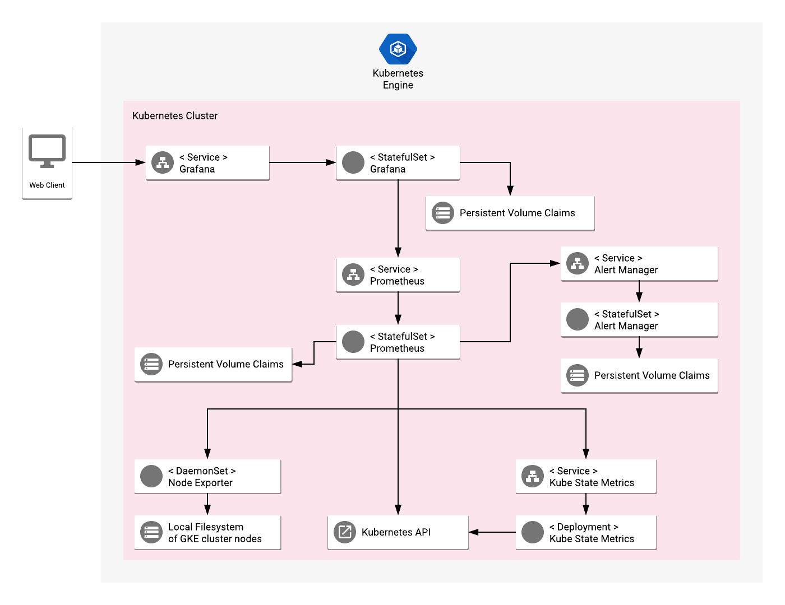

# Overview

Prometheus is a monitoring toolkit. In this configuration, Prometheus collects
the metrics from the Kubernetes cluster to which the application is deployed,
and presents them in pre-configured Grafana dashboard. Additionally, you can
configure the alerts using Prometheus Alert Manager.

[Learn more](https://prometheus.io/).

## About Google Click to Deploy

Popular open stacks on Kubernetes packaged by Google.

## Architecture



The application is designed to automatically collect metrics from Kubernetes
cluster, collect them in the Prometheus server and present in Grafana. The
application consists of the following components:

*   **Prometheus StatefulSet** - collects all the configured metrics by querying
    all the configured sources periodically. Each Prometheus Pod stores its data
    in a PersistentVolumeClaim.

*   **Prometheus Node Exporter DaemonSet** - runs a Pod on each Kubernetes
    cluster node and collects metrics for the node's hardware and operating
    system by monitoring the host filesystem at `/proc` and `/sys`. The metrics
    are exposed on port 9100 of the Node Exporter's Pods.

*   **Kube State Metrics Deployment** - listens to the Kubernetes API server and
    produces metrics related to resources (Deployments, Nodes, Pods, etc.). It
    exposes the metrics at `/metrics` on port 8080. Prometheus server consumes
    the metrics.

*   **Prometheus Alert Manager** - receives the alerts raised by the Prometheus
    server and handles them accordingly to its configuration, specified in a
    ConfigMap.

### Configuration

*   Prometheus server is deployed to a StatefulSet, and you can configure the
    number of replicas before installing. The configuration for Prometheus jobs,
    rules and alerts is stored in a ConfigMap.

*   Kube State Metrics comes with a default-deployment of one replica, and
    includes a resizer add-on that monitors the resources necessary to maintain
    operations, and dynamically re-scales the deployment.

*   Prometheus Alert Manager comes with a basic configuration, including only
    the default receiver and basic grouping rules. To customize the
    configuration, edit the ConfigMap and recreate the Pods. The Alert Manager
    StatefulSet is configured to spin up 2 replicas - if you need to change the
    number of replicas, edit the `--mesh.peer` arguments of Alert Manager
    containers.

*   Each StatefulSet, Deployment and DaemonSet uses its own dedicated Service
    Account with permissions appropriate for its functionality.

# Installation

## Quick install with Google Cloud Marketplace

Get up and running with a few clicks! Install this Prometheus app to a Google
Kubernetes Engine cluster using Google Cloud Marketplace. Follow the
[on-screen instructions](https://console.cloud.google.com/marketplace/details/google/prometheus).

## Command line instructions

You can use [Google Cloud Shell](https://cloud.google.com/shell/) or a local
workstation to complete these steps.

[](https://console.cloud.google.com/cloudshell/editor?cloudshell_git_repo=https://github.com/GoogleCloudPlatform/click-to-deploy&cloudshell_open_in_editor=README.md&cloudshell_working_dir=k8s/prometheus)

### Prerequisites

#### Set up command-line tools

You'll need the following tools in your development environment. If you are
using Cloud Shell, these tools are installed in your environment by default.

-   [gcloud](https://cloud.google.com/sdk/gcloud/)
-   [kubectl](https://kubernetes.io/docs/reference/kubectl/overview/)
-   [docker](https://docs.docker.com/install/)
-   [git](https://git-scm.com/book/en/v2/Getting-Started-Installing-Git)
-   [envsubst](https://command-not-found.com/envsubst)

Configure `gcloud` as a Docker credential helper:

```shell
gcloud auth configure-docker
```

#### Create a Google Kubernetes Engine cluster

Create a new cluster from the command line:

```shell
export CLUSTER=prometheus-cluster
export ZONE=us-west1-a

gcloud container clusters create "$CLUSTER" --zone "$ZONE"
```

Configure `kubectl` to connect to the new cluster.

```shell
gcloud container clusters get-credentials "$CLUSTER" --zone "$ZONE"
```

#### Clone this repo

Clone this repo and the associated tools repo:

```shell
git clone --recursive https://github.com/GoogleCloudPlatform/click-to-deploy.git
```

#### Install the Application resource definition

An Application resource is a collection of individual Kubernetes components,
such as Services, Deployments, and so on, that you can manage as a group.

To set up your cluster to understand Application resources, run the following
command:

```shell
kubectl apply -f "https://raw.githubusercontent.com/GoogleCloudPlatform/marketplace-k8s-app-tools/master/crd/app-crd.yaml"
```

You need to run this command once.

The Application resource is defined by the
[Kubernetes SIG-apps](https://github.com/kubernetes/community/tree/master/sig-apps)
community. The source code can be found on
[github.com/kubernetes-sigs/application](https://github.com/kubernetes-sigs/application).

### Install the Application

Navigate to the `prometheus` directory:

```shell
cd click-to-deploy/k8s/prometheus
```

#### Configure the app with environment variables

Choose the instance name and namespace for the app:

```shell
export APP_INSTANCE_NAME=prometheus-1
export NAMESPACE=default
```

Configure the container images:

```shell
TAG=2.11
export IMAGE_PROMETHEUS="marketplace.gcr.io/google/prometheus:${TAG}"
export IMAGE_ALERTMANAGER="marketplace.gcr.io/google/prometheus/alertmanager:${TAG}"
export IMAGE_KUBE_STATE_METRICS="marketplace.gcr.io/google/prometheus/kubestatemetrics:${TAG}"
export IMAGE_NODE_EXPORTER="marketplace.gcr.io/google/prometheus/nodeexporter:${TAG}"
```

The images above are referenced by
[tag](https://docs.docker.com/engine/reference/commandline/tag). We recommend
that you pin each image to an immutable
[content digest](https://docs.docker.com/registry/spec/api/#content-digests).
This ensures that the installed application always uses the same images, until
you are ready to upgrade. To get the digest for the image, use the following
script:

```shell
for i in "IMAGE_PROMETHEUS" \
         "IMAGE_ALERTMANAGER" \
         "IMAGE_KUBE_STATE_METRICS" \
         "IMAGE_NODE_EXPORTER"; do
  repo=$(echo ${!i} | cut -d: -f1);
  digest=$(docker pull ${!i} | sed -n -e 's/Digest: //p');
  export $i="$repo@$digest";
  env | grep $i;
done
```

Define the size of the Prometheus StatefulSet:

```shell
export PROMETHEUS_REPLICAS=2
```

Set the StorageClass name. Check your available options using the command below:
   * ```kubectl get storageclass```
   * Or check how to create a new StorageClass in [Kubernetes Documentation](https://kubernetes.io/docs/concepts/storage/storage-classes/#the-storageclass-resource)


```shell
export STORAGE_CLASS="standard"
```

#### Create a namespace in your Kubernetes cluster

If you use a different namespace than `default`, run the command below to create
a new namespace:

```shell
kubectl create namespace "$NAMESPACE"
```

#### Create the Service Accounts

##### Make sure you are a Cluster Admin

Creating custom cluster roles requires being a Cluster Admin. To assign the
Cluster Admin role to your user account, run the following command:

```shell
kubectl create clusterrolebinding cluster-admin-binding \
  --clusterrole cluster-admin \
  --user $(gcloud config get-value account)
```

##### Create dedicated Service Accounts

Define the environment variables:

```shell
export PROMETHEUS_SERVICE_ACCOUNT="${APP_INSTANCE_NAME}-prometheus"
export KUBE_STATE_METRICS_SERVICE_ACCOUNT="${APP_INSTANCE_NAME}-kube-state-metrics"
export ALERTMANAGER_SERVICE_ACCOUNT="${APP_INSTANCE_NAME}-alertmanager"
export NODE_EXPORTER_SERVICE_ACCOUNT="${APP_INSTANCE_NAME}-node-exporter"
```

Expand the manifest to create Service Accounts:

```shell
cat resources/service-accounts.yaml \
  | envsubst '$NAMESPACE $PROMETHEUS_SERVICE_ACCOUNT $KUBE_STATE_METRICS_SERVICE_ACCOUNT $ALERTMANAGER_SERVICE_ACCOUNT $NODE_EXPORTER_SERVICE_ACCOUNT' \
  > "${APP_INSTANCE_NAME}_sa_manifest.yaml"
```

Create the accounts on the cluster with `kubectl`:

```shell
kubectl apply -f "${APP_INSTANCE_NAME}_sa_manifest.yaml" \
  --namespace "${NAMESPACE}"
```

#### Expand the application manifest template

Use `envsubst` to expand the template. We recommend that you save the expanded
manifest file for future updates to the application.

```shell
awk 'FNR==1 {print "---"}{print}' manifest/* \
  | envsubst '$APP_INSTANCE_NAME $NAMESPACE $STORAGE_CLASS $IMAGE_PROMETHEUS $IMAGE_ALERTMANAGER $IMAGE_KUBE_STATE_METRICS $IMAGE_NODE_EXPORTER $NAMESPACE $PROMETHEUS_REPLICAS $PROMETHEUS_REPLICAS $PROMETHEUS_SERVICE_ACCOUNT $KUBE_STATE_METRICS_SERVICE_ACCOUNT $ALERTMANAGER_SERVICE_ACCOUNT $NODE_EXPORTER_SERVICE_ACCOUNT' \
  > "${APP_INSTANCE_NAME}_manifest.yaml"
```

#### Apply the manifest to your Kubernetes cluster

Use `kubectl` to apply the manifest to your Kubernetes cluster:

```shell
kubectl apply -f "${APP_INSTANCE_NAME}_manifest.yaml" --namespace "${NAMESPACE}"
```

#### View the app in the Google Cloud Platform Console

To get the GCP Console URL for your app, run the following command:

```shell
echo "https://console.cloud.google.com/kubernetes/application/${ZONE}/${CLUSTER}/${NAMESPACE}/${APP_INSTANCE_NAME}"
```

To view your app, open the URL in your browser.

# Access the Prometheus UI

Prometheus is exposed as a ClusterIP-only Service, `$APP_INSTANCE_NAME-prometheus`. To
connect to the Prometheus UI, you can either expose a public Service endpoint, or
keep it private and connect from your local environment using `kubectl
port-forward`.

## Expose the Prometheus service externally

To create an external IP address for Prometheus, run the following command:

```shell
kubectl patch svc "$APP_INSTANCE_NAME-prometheus" \
  --namespace "$NAMESPACE" \
  -p '{"spec": {"type": "LoadBalancer"}}'
```

It might take a while for the external IP address to be created.

Get the public IP address with the following command:

```shell
SERVICE_IP=$(kubectl get svc $APP_INSTANCE_NAME-prometheus \
  --namespace $NAMESPACE \
  --output jsonpath='{.status.loadBalancer.ingress[0].ip}')
echo "http://${SERVICE_IP}/"
```

## Using local port forwarding for Prometheus

As an alternative to exposing Prometheus publicly, use local port forwarding. In a
terminal, run the following command:

```shell
kubectl port-forward --namespace ${NAMESPACE} ${APP_INSTANCE_NAME}-prometheus-0 9090
```

You can access the Prometheus UI at `http://localhost:9090/`.

