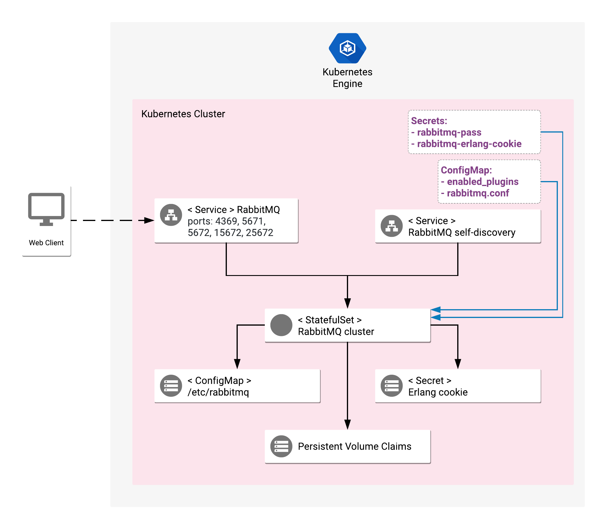

# Overview

RabbitMQ is an open source message broker that implements the Advanced
Message Queuing Protocol (AMQP) to serve a variety of messaging applications.

[Learn more](https://www.rabbitmq.com/).

## About Google Click to Deploy

Popular open stacks on Kubernetes packaged by Google.

## Design



### Solution Information

RabbitMQ cluster is deployed within a Kubernetes `StatefulSet`. The configuration
is attached with a `ConfigMap` (which contents is copied to writable location at
`/etc/rabbitmq` by an init container). An Erlang cookie required by
the application is generated dynamically and passed to the deployment with
a Secret object.

The deployment creates two services:

- client-facing one, designed to be used for client connections to the RabbitMQ
  cluster with port forwarding or using a LoadBalancer,
- and service discovery - a headless service for connections between
  the RabbitMQ nodes.

RabbitMQ K8s application has the following ports configured:

- ports `5671` and `5672` are enabled for communication from AMQP clients,
- port `4369` is enabled to allow for peer discovery,
- port `15672` is enabled for RabbitMQ administration over HTTP API,
- port `25672` is enabled as distribution port for communication with CLI tools.

This deployment applies configuration of HA policy, which configures mirroring for all RabbitMQ nodes in the cluster and automatically synchronizes with new mirrors joining the cluster. It is enabled as part of the installation, on each node's `postStart` event.

# Installation

## Quick install with Google Cloud Marketplace

Get up and running with a few clicks! Install this RabbitMQ app to a
Google Kubernetes Engine cluster using Google Cloud Marketplace. Follow the
[on-screen instructions](https://console.cloud.google.com/marketplace/details/google/rabbitmq).

## Command line instructions

You can use [Google Cloud Shell](https://cloud.google.com/shell/) or a local workstation in the
further instructions.

[](https://console.cloud.google.com/cloudshell/editor?cloudshell_git_repo=https://github.com/GoogleCloudPlatform/click-to-deploy&cloudshell_working_dir=k8s/rabbitmq)

### Prerequisites

#### Set up command-line tools

You'll need the following tools in your development environment:

- [gcloud](https://cloud.google.com/sdk/gcloud/)
- [kubectl](https://kubernetes.io/docs/reference/kubectl/overview/)
- [docker](https://docs.docker.com/install/)
- [git](https://git-scm.com/book/en/v2/Getting-Started-Installing-Git)

Configure `gcloud` as a Docker credential helper:

```shell
gcloud auth configure-docker
```

#### Create a Google Kubernetes Engine cluster

Create a new cluster from the command line.

```shell
export CLUSTER=rabbitmq-cluster
export ZONE=us-west1-a

gcloud container clusters create "$CLUSTER" --zone "$ZONE"
```

Configure `kubectl` to connect to the new cluster.

```shell
gcloud container clusters get-credentials "$CLUSTER" --zone "$ZONE"
```

#### Clone this repo

Clone this repo and the associated tools repo.

```shell
git clone --recursive https://github.com/GoogleCloudPlatform/click-to-deploy.git
```

#### Install the Application resource definition

An Application resource is a collection of individual Kubernetes components,
such as Services, Deployments, and so on, that you can manage as a group.

To set up your cluster to understand Application resources, run the following command:

```shell
kubectl apply -f "https://raw.githubusercontent.com/GoogleCloudPlatform/marketplace-k8s-app-tools/master/crd/app-crd.yaml"
```

You need to run this command once.

The Application resource is defined by the
[Kubernetes SIG-apps](https://github.com/kubernetes/community/tree/master/sig-apps)
community. The source code can be found on
[github.com/kubernetes-sigs/application](https://github.com/kubernetes-sigs/application).

### Install the Application

Navigate to the `rabbitmq` directory:

```shell
cd click-to-deploy/k8s/rabbitmq
```

#### Configure the app with environment variables

Choose an instance name and
[namespace](https://kubernetes.io/docs/concepts/overview/working-with-objects/namespaces/)
for the app. In most cases, you can use the `default` namespace.

```shell
export APP_INSTANCE_NAME=rabbitmq-1
export NAMESPACE=default
```

Set the number of replicas:

```shell
export REPLICAS=3
```

Set or generate the [Erlang cookie](https://www.rabbitmq.com/clustering.html#erlang-cookie). The cookie must be encoded in base64.

```shell
export RABBITMQ_ERLANG_COOKIE=$(cat /dev/urandom | tr -dc 'a-zA-Z0-9' | fold -w 32 | head -n 1 | tr -d '\n' | base64)
```

Set the username for the app:

```shell
export RABBITMQ_DEFAULT_USER=rabbit
```

Set or generate a password. The value must be encoded in base64.

```shell
export RABBITMQ_DEFAULT_PASS=$(cat /dev/urandom | tr -dc 'a-zA-Z0-9' | fold -w 12 | head -n 1 | tr -d '\n' | base64)
```

Configure the container images:

```shell
TAG=3.7
export IMAGE_RABBITMQ=marketplace.gcr.io/google/rabbitmq:${TAG}
export IMAGE_RABBITMQ_INIT=marketplace.gcr.io/google/rabbitmq/debian9:${TAG}
```

The images above are referenced by
[tag](https://docs.docker.com/engine/reference/commandline/tag). We recommend
that you pin each image to an immutable
[content digest](https://docs.docker.com/registry/spec/api/#content-digests).
This ensures that the installed application always uses the same images,
until you are ready to upgrade. To get the digest for the image, use the
following script:

```shell
for i in "IMAGE_RABBITMQ" "IMAGE_RABBITMQ_INIT"; do
  repo=$(echo ${!i} | cut -d: -f1);
  digest=$(docker pull ${!i} | sed -n -e 's/Digest: //p');
  export $i="$repo@$digest";
  env | grep $i;
done
```

#### Create namespace in your Kubernetes cluster

If you use a different namespace than the `default`, run the command below to create a new namespace:

```shell
kubectl create namespace "$NAMESPACE"
```

#### Prerequisites for using Role-Based Access Control

If you want to use [role-based access control](https://kubernetes.io/docs/reference/access-authn-authz/rbac/)
for the app, you must grant your user the ability to create roles in
Kubernetes by running the following command:

```shell
kubectl create clusterrolebinding cluster-admin-binding \
  --clusterrole cluster-admin \
  --user $(gcloud config get-value account)
```

You need to run this command **once** for the cluster.
For steps to enable role-based access control in Google Kubernetes Engine, see
the [Kubernetes Engine documentation](https://cloud.google.com/kubernetes-engine/docs/how-to/role-based-access-control).

#### Expand the manifest template

Use `envsubst` and `helm template` to expand the template. We recommend that you save the
expanded manifest file for future updates to the application.

1. Expand `RBAC` YAML file. You must configure RBAC related stuff to support access nodes information successfully by `rabbitmq_peer_discovery_k8s` plugin.

    ```shell
    # Define name of service account
    export RABBITMQ_SERVICE_ACCOUNT=$APP_INSTANCE_NAME-rabbitmq-sa

    # Expand rbac.yaml.template
    envsubst '$APP_INSTANCE_NAME' < scripts/rbac.yaml.template > "${APP_INSTANCE_NAME}_rbac.yaml"
    ```

1. Expand `Application`/`Secret`/`StatefulSet`/`ConfigMap` YAML files.

    ```shell
    helm template chart/rabbitmq \
      --name $APP_INSTANCE_NAME \
      --namespace $NAMESPACE \
      --set rabbitmq.image=$IMAGE_RABBITMQ \
      --set rabbitmq.initImage=$IMAGE_RABBITMQ_INIT \
      --set rabbitmq.replicas=$REPLICAS \
      --set rabbitmq.erlangCookie=$RABBITMQ_ERLANG_COOKIE \
      --set rabbitmq.user=$RABBITMQ_DEFAULT_USER \
      --set rabbitmq.password=$RABBITMQ_DEFAULT_PASS \
      --set rabbitmq.serviceAccount=$RABBITMQ_SERVICE_ACCOUNT > ${APP_INSTANCE_NAME}_manifest.yaml
    ```

#### Apply the manifest to your Kubernetes cluster

Use `kubectl` to apply the manifest to your Kubernetes cluster:

```shell
# rbac.yaml
kubectl apply -f "${APP_INSTANCE_NAME}_rbac.yaml" --namespace "${NAMESPACE}"
# manifest.yaml
kubectl apply -f "${APP_INSTANCE_NAME}_manifest.yaml" --namespace "${NAMESPACE}"
```

#### View the app in the Google Cloud Platform Console

To get the Console URL for your app, run the following command:

```shell
echo "https://console.cloud.google.com/kubernetes/application/${ZONE}/${CLUSTER}/${NAMESPACE}/${APP_INSTANCE_NAME}"
```

To view your app, open the URL in your browser.

#### Get the status of the cluster

By default, the application does not have an external IP address. To get the
status of the cluster, use `kubectl` to execute `rabbitmqctl` on the master
node:

```
kubectl exec -it $APP_INSTANCE_NAME-rabbitmq-0 --namespace $NAMESPACE -- rabbitmqctl cluster_status
```

#### Authorization

The default username is `rabbit`. Use `kubectl` to get the generated password:

```shell
kubectl get secret $APP_INSTANCE_NAME-rabbitmq-secret \
  --namespace $NAMESPACE \
  --output=jsonpath='{.data.rabbitmq-pass}' | base64 --decode
```

#### (Optional) Expose the RabbitMQ service externally

By default, the application does not have an external IP. To create an
external IP address for the service, run the following command:

```
kubectl patch svc $APP_INSTANCE_NAME-rabbitmq-svc \
  --namespace $NAMESPACE \
  --patch '{"spec": {"type": "LoadBalancer"}}'
```

> **NOTE:** It might take some time for the external IP to be provisioned.

#### Access RabbitMQ service

**Option 1:** If you run your RabbitMQ cluster behind a LoadBalancer, run the
following command to get the external IP of the RabbitMQ service:

```
SERVICE_IP=$(kubectl get svc $APP_INSTANCE_NAME-rabbitmq-svc \
  --namespace $NAMESPACE \
  --output jsonpath='{.status.loadBalancer.ingress[0].ip}')

echo "http://${SERVICE_IP}:15672"
```

To access the RabbitMQ management UI, open `http://[EXTERNAL-IP]:15672`, where
`[EXTERNAL-IP]` is the output of the command above.

**Option 2:** Use port forwarding:

```
kubectl port-forward svc/$APP_INSTANCE_NAME-rabbitmq-svc --namespace $NAMESPACE 15672
```

To access the RabbitMQ management UI, open [http://127.0.0.1:15672](http://127.0.0.1:15672).

**Option 3:** If you want to get the cluster IP and external IP addresses
of the RabbitMQ service using Python, use the following sample code:

```python
import os

# kubernetes module; install using `pip install kubernetes`
from kubernetes import client, config

# Load Kube config
config.load_kube_config()

# Create a Kubernetes client
k8s_client = client.CoreV1Api()

# Get the list of all pods
service = k8s_client.read_namespaced_service(namespace="default", name="rabbitmq-1-rabbitmq-svc")

print("Cluster IP: {}\n".format(service.spec.cluster_ip))

for item in service.status.load_balancer.ingress:
  print("External IP: {}\n".format(item.ip))
```

To send and receive messages to RabbitMQ using Python, see the
[RabbitMQ Tutorial](https://www.rabbitmq.com/tutorials/tutorial-one-python.html).

# Scaling

## Scaling the cluster up

By default, the RabbitMQ application is deployed using 3 replicas.
To change the number of replicas, use the following command:

```
kubectl scale statefulsets "$APP_INSTANCE_NAME-rabbitmq" \
  --namespace "$NAMESPACE" --replicas=[NEW_REPLICAS]
```

where `[NEW_REPLICAS]` is the new number.

## Scale the cluster down

**Option 1:** Use `kubectl` to scale down, using the following command:

```
kubectl scale statefulsets "$APP_INSTANCE_NAME-rabbitmq" \
  --namespace "$NAMESPACE" --replicas=[NEW_REPLICAS]
```

where `[NEW_REPLICAS]` is the new number.

This option reduces the number of replicas without disconnecting nodes from the cluster. Scaling down will also leave `persistentvolumeclaims` of your StatefulSet untouched.

**Option 2:** Remove a RabbitMQ node from your cluster:

> **WARNING:** This option deletes `persistentvolumeclaims` permanently, which results in permanent data loss from the deleted Pods.
> Consider enabling HA mode to replicate data between all nodes before you start the procedure.

To remove a RabbitMQ node permanently and scale down the number of replicas,
run [scripts/scale-down.sh](scripts/scale-down.sh) with the `--help` argument,
or manually scale down the cluster using the following steps:

To manually remove a nodes from the cluster, and then Pod from Kubernetes,
start from highest numbered Pod.

For each node:

1. Run `rabbitmqctl stop_app` and `rabbitmqctl reset` commands on RabbitMQ container
1. Scale down StatefulSet by one with `kubectl scale sts` command
1. Wait until Pod is removed from StatefulSet
1. Remove Persistent Volumes and Persistent Volume Claim belonging to that replica

Repeat these steps until the cluster has the number of Pods you want.

For more information about scaling StatefulSets, see the
[Kubernetes documentation](https://kubernetes.io/docs/tasks/run-application/scale-stateful-set/#kubectl-scale).

For more information about removing a node from RabbitMQ cluster,
see the [RabbitMQ documentation](https://www.rabbitmq.com/clustering.html#breakup).

# Backup and restore RabbitMQ

For information on backing up your RabbitMQ data, see the
[RabbitMQ documentation](https://www.rabbitmq.com/backup.html).

# Updating the app

For background information on rolling updates for RabbitMQ, see
[Upgrading RabbitMQ](https://www.rabbitmq.com/upgrade.html).

Start with assigning a new image to your StatefulSet definition:

```shell
kubectl set image statefulset "$APP_INSTANCE_NAME-rabbitmq" \
  --namespace "$NAMESPACE" rabbitmq=[NEW_IMAGE_REFERENCE]
```

where `[NEW_IMAGE_REFERENCE]` is the new image.

To check that the Pods in the StatefulSet running the `rabbitmq` container are updating, run the following command:

```shell
kubectl get pods -l app.kubernetes.io/name=$APP_INSTANCE_NAME --namespace "$NAMESPACE" -w
```

The StatefulSet controller terminates each Pod, and waits for it to transition to `Running` and `Ready` prior to updating the next Pod.

The final state of the Pods should be `Running` and marked as `1/1` in **READY** column.

To verify the current image used for a `rabbitmq` container, run the following command:

```shell
kubectl get statefulsets "$APP_INSTANCE_NAME-rabbitmq" \
  --namespace "$NAMESPACE" \
  --output jsonpath='{.spec.template.spec.containers[0].image}'
```

# Uninstall the Application

## Using the Google Cloud Platform Console

1. In the GCP Console, open [Kubernetes Applications](https://console.cloud.google.com/kubernetes/application).

1. From the list of applications, click **RabbitMQ**.

1. On the Application Details page, click **Delete**.

## Using the command line

### Prepare the environment

Set your installation name and Kubernetes namespace:

```shell
export APP_INSTANCE_NAME=rabbitmq-1
export NAMESPACE=default
```

### Delete the resources

> **NOTE:** We recommend to use a kubectl version that is the same as the version of your cluster. Using the same versions of kubectl and the cluster helps avoid unforeseen issues.

To delete the resources, use the expanded manifest file used for the
installation.

Run `kubectl` on the expanded manifest file:

```shell
# manifest.yaml
kubectl delete -f "${APP_INSTANCE_NAME}_manifest.yaml" --namespace "${NAMESPACE}"
# rbac.yaml
kubectl delete -f "${APP_INSTANCE_NAME}_rbac.yaml" --namespace "${NAMESPACE}"
```

Otherwise, delete the resources using types and a label:

```shell
kubectl delete statefulset,secret,service,configmap,serviceaccount,role,rolebinding,application \
  --namespace $NAMESPACE \
  --selector app.kubernetes.io/name=$APP_INSTANCE_NAME
```

### Delete the persistent volumes of your installation

By design, removal of StatefulSets in Kubernetes does not remove
PersistentVolumeClaims that were attached to their Pods. This prevents your
installations from accidentally deleting stateful data.

To remove the PersistentVolumeClaims with their attached persistent disks, run
the following `kubectl` commands:

```shell
for pv in $(kubectl get pvc --namespace $NAMESPACE \
  --selector app.kubernetes.io/name=$APP_INSTANCE_NAME \
  --output jsonpath='{.items[*].spec.volumeName}');
do
  kubectl delete pv/$pv --namespace $NAMESPACE
done

kubectl delete persistentvolumeclaims \
  --namespace $NAMESPACE \
  --selector app.kubernetes.io/name=$APP_INSTANCE_NAME
```

### Delete the GKE cluster

Optionally, if you don't need the deployed application or the GKE cluster,
delete the cluster using this command:

```shell
export CLUSTER=rabbitmq-cluster
# replace with the zone that you used
export ZONE=us-west1-a

gcloud container clusters delete "$CLUSTER" --zone "$ZONE"
```
