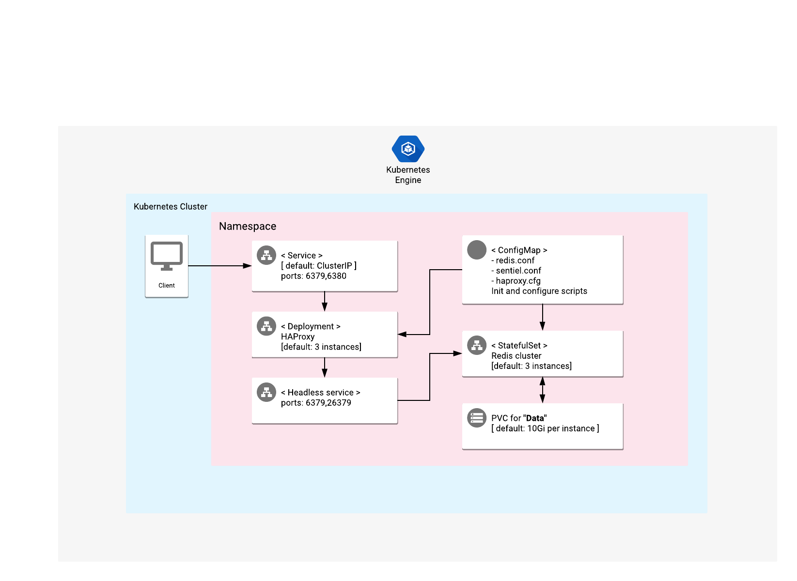

# Overview

Redis is a database which provides in-memory data store, caching, and message
broker.

Solution provides high availability of the Redis Cluster which runs with Sentinel
and HAProxy in front of Redis cluster for best user experience.

For more information, visit the
[Redis official website](https://redis.io/documentation).
If you need more information about Sentinel configuration, check also the
Sentinel [ documentation ](https://redis.io/topics/sentinel).

## About Google Click to Deploy

Popular open stacks on Kubernetes, packaged by Google.

## Architecture



This app offers a Redis master/slave StatefulSet along with Sentinel, and a HA Proxy
Deployment with provide single entry point with healths checks.

# Installation

## Quick install with Google Cloud Marketplace

Get up and running with a few clicks! To install this Redis HA app to a
Google Kubernetes Engine cluster via Google Cloud Marketplace, follow the
[on-screen instructions](https://console.cloud.google.com/marketplace/details/google/redis-ha).

## Command-line instructions

### Prerequisites

#### Set up command-line tools

You'll need the following tools in your development environment. If you are
using Cloud Shell, then `gcloud`, `kubectl`, Docker, and Git are installed in
your environment by default.

- [gcloud](https://cloud.google.com/sdk/gcloud/)
- [kubectl](https://kubernetes.io/docs/reference/kubectl/overview/)
- [docker](https://docs.docker.com/install/)
- [git](https://git-scm.com/book/en/v2/Getting-Started-Installing-Git)
- [helm](https://helm.sh/)

Configure `gcloud` as a Docker credential helper:

```shell
gcloud auth configure-docker
```

#### Create a Google Kubernetes Engine (GKE) cluster

Create a new cluster from the command-line:

```shell
export CLUSTER=redis-ha-cluster
export ZONE=us-west1-a

gcloud container clusters create "${CLUSTER}" --zone "${ZONE}"
```

Configure `kubectl` to connect to the new cluster:

```shell
gcloud container clusters get-credentials "${CLUSTER}" --zone "${ZONE}"
```

#### Clone this repo

Clone this repo, and its associated tools repo:

```shell
git clone --recursive https://github.com/GoogleCloudPlatform/click-to-deploy.git
```

#### Install the Application resource definition

An Application resource is a collection of individual Kubernetes components,
such as Services, Deployments, and so on, that you can manage as a group.

To set up your cluster to understand Application resources, run the following
command:

```shell
kubectl apply -f "https://raw.githubusercontent.com/GoogleCloudPlatform/marketplace-k8s-app-tools/master/crd/app-crd.yaml"
```

You need to run this command once.

The Application resource is defined by the
[Kubernetes SIG-apps](https://github.com/kubernetes/community/tree/master/sig-apps)
community. You can find the source code at
[github.com/kubernetes-sigs/application](https://github.com/kubernetes-sigs/application).

### Install the app

Navigate to the `redis-ha` directory:

```shell
cd click-to-deploy/k8s/redis-ha
```

#### Configure the app with environment variables

Choose an instance name and
[namespace](https://kubernetes.io/docs/concepts/overview/working-with-objects/namespaces/)
for the app. In most cases, you can use the `default` namespace.

```shell
export APP_INSTANCE_NAME=redis-ha-1
export NAMESPACE=default
```

Enable Cloud Monitoring:

> **NOTE:** Your Google Cloud Marketplace project must have Cloud Monitoring
> enabled. If you are using a non-Google Cloud cluster, you cannot export
your app's metrics to Cloud Monitoring.

By default, the app does not export metrics to Cloud Monitoring. To enable
this option, change the value to `true`.

```shell
export METRICS_EXPORTER_ENABLED=true
```

Set up the image tag:

It is advised to use a stable image reference, which you can find on
[Marketplace Container Registry](https://marketplace.gcr.io/google/redis-ha).
For example:

```shell
export TAG="7.2.1-<BUILD_ID>"
```

Alternatively, you can use a short tag which points to the latest image for
the selected version.

> Warning: This tag is not stable, and the image it references might change
> over time.

```shell
export TAG="7.2"
```

Configure the container image:

```shell
export IMAGE_REGISTRY="marketplace.gcr.io/google"

export IMAGE_REDIS="${IMAGE_REGISTRY}/redis-ha"
export IMAGE_REDIS_EXPORTER="${IMAGE_REGISTRY}/redis-ha/redis-exporter:${TAG}"
export IMAGE_HAPROXY="${IMAGE_REGISTRY}/redis-ha/haproxy:${TAG}"
export IMAGE_METRICS_EXPORTER="${IMAGE_REGISTRY}/redis-ha/prometheus-to-sd:${TAG}"
```

By default, each deployment has 3 replica, but you can choose to set the
number of replicas for Redis and HA-Proxy.

```shell
export REDIS_REPLICAS=3
export HAPROXY_REPLICAS=3
```

For the persistent disk provisioning of the Redis will need to set persistent disk's
size. The default disk size is "10Gi":

```shell
export DEFAULT_STORAGE_CLASS="standard" # provide your StorageClass name if not "standard"
export PERSISTENT_DISK_SIZE="10Gi"
```

Configure the Redis auth password:

```shell
export REDIS_AUTH_PASSWORD=$(cat /dev/urandom | tr -dc 'a-zA-Z0-9' | fold -w 128 |
head -n 1 | tr -d '\n')
```

#### Create namespace in your Kubernetes cluster

If you use a different namespace than the `default`, run the following
command to create a new namespace:

```shell
kubectl create namespace "${NAMESPACE}"
```

#### Expand the manifest template

Use `helm template` to expand the template. We recommend that you save the
expanded manifest file for future updates to your app.

```
helm template chart/redis-ha \
  --name-template="${APP_INSTANCE_NAME}" \
  --namespace "${NAMESPACE}" \
  --set redis.image.repo="${IMAGE_REDIS}" \
  --set redis.image.tag="${TAG}" \
  --set redis.replicas="${REDIS_REPLICAS}" \
  --set redis.password="${REDIS_AUTH_PASSWORD}" \
  --set redis.persistence.size="${PERSISTENT_DISK_SIZE}" \
  --set redis.persistence.storageClass="${DEFAULT_STORAGE_CLASS}" \
  --set redis.exporter.image="${IMAGE_REDIS_EXPORTER}" \
  --set metrics.image="${IMAGE_METRICS_EXPORTER}" \
  --set metrics.exporter.enabled="${METRICS_EXPORTER_ENABLED:-false}" \
  --set haproxy.image="${IMAGE_HAPROXY}" \
  --set haproxy.replicas="${HAPROXY_REPLICAS}" \
  > "${APP_INSTANCE_NAME}_manifest.yaml"
```

#### Apply the manifest to your Kubernetes cluster

Use `kubectl` to apply the manifest to your Kubernetes cluster:

```shell
kubectl apply -f "${APP_INSTANCE_NAME}_manifest.yaml" --namespace "${NAMESPACE}"
```

#### View the app in the Google Cloud Console

To get the Cloud Console URL for your app, run the following command:

```shell
echo "https://console.cloud.google.com/kubernetes/application/${ZONE}/${CLUSTER}/${NAMESPACE}/${APP_INSTANCE_NAME}"
```

To view the app, open the URL in your browser.

### Access Redis master Pod (internally)

You can connect to Redis master without exposing it to public access by using the
`redis-cli` command line interface.

```shell
export REDIS_MASTER_POD=$(kubectl -n "${NAMESPACE}" get pod \
    -l app.kubernetes.io/name="${APP_INSTANCE_NAME}",app=redis-ha \
    -o jsonpath='{range .items[*]}{.metadata.name}{"\n"}{end}' \
    | xargs -I {} kubectl exec {} --container=redis -- sh -c \
    "redis-cli -a \"\${AUTH}\" INFO \
    | grep -q ^role:master && echo {}" 2>/dev/null)

kubectl exec -n "${NAMESPACE}" "${REDIS_MASTER_POD}" --container=redis -t -i -- \
    sh -c "redis-cli -a \"\${AUTH}\""
```

## Access Redis master using port-forward

Get auth password for Redis:

```shell
export AUTH=$(kubectl get secret ${APP_INSTANCE_NAME} -o jsonpath={.data.auth} | base64 -d)
```

Access Redis master over port-forwarding to local environment:

```shell
kubectl port-forward svc/${APP_INSTANCE_NAME}-haproxy --namespace ${NAMESPACE} 6379
```

Redis will be available at localhost:6379

For access Redis with readonly mode:

```shell
kubectl port-forward svc/${APP_INSTANCE_NAME}-haproxy --namespace ${NAMESPACE} 6380
```

# Scaling up or down

To change the number of replicas of the Haproxy, use the following
command, where `HAPROXY_REPLICAS` is your desired number of replicas:

```shell
export HAPROXY_REPLICAS=3
kubectl scale deployment \
  -l app.kubernetes.io/name="${APP_INSTANCE_NAME}",app=redis-ha-haproxy \
  --namespace "${NAMESPACE}" --replicas=${HAPROXY_REPLICAS}
```

Scaling for Redis Statefulset is not supported. As workaround it can we backuped
up and restored to new Redis HA installation which contains required number of
Redis instances.

# Back up and restore

Before backing up and restoring, configure your local environment with the `APP_INSTANCE_NAME`
and `NAMESPACE` environment variables for your Redis HA app.

## Back up Redis data to your local environment

To back up Redis data, use the backup script:

```shell
scripts/backup.sh
```

## Restore Redis data from your local environment

To restore Redis data, use the restore script:

```shell
scripts/restore.sh redis-backup-file.rdb
```

> **NOTE:** Redis will be unavalible during this prodcedure.

# Upgrading the app

Currently upgrading is not supported.
For migrate to new version of Redis make a backup and restore it to the new
installation of Redis HA app which run with required version.

# Uninstall the app

## Using the Google Cloud Console

1. In the Cloud Console, open
   [Kubernetes Applications](https://console.cloud.google.com/kubernetes/application).

1. From the list of apps, click **Redis HA**.

1. On the Application Details page, click **Delete**.

## Using the command-line

### Prepare your environment

Set your installation name and Kubernetes namespace:

```shell
export APP_INSTANCE_NAME=redis-ha-1
export NAMESPACE=default
```

### Delete the resources

> **NOTE:** We recommend that you use a `kubectl` version that is the same
> version as that of your cluster. Using the same versions for `kubectl` and
> the cluster helps to avoid unforeseen issues.

To delete the resources, use the expanded manifest file used for the
installation.

Run `kubectl` on the expanded manifest file:

```shell
kubectl delete -f ${APP_INSTANCE_NAME}_manifest.yaml --namespace ${NAMESPACE}
```

You can also delete the resources by using types and a label:

```shell
kubectl delete application \
  --namespace ${NAMESPACE} \
  --selector app.kubernetes.io/name=${APP_INSTANCE_NAME}
```

### Delete the GKE cluster

If you don't need the deployed app or the GKE cluster, delete the cluster
by using this command:

```shell
gcloud container clusters delete "${CLUSTER}" --zone "${ZONE}"
```
