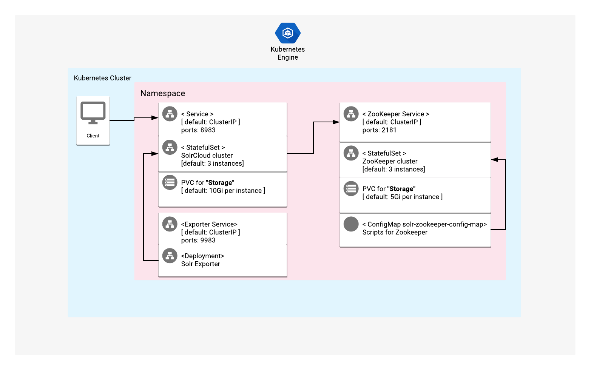

# Overview

Apache Solr is an open-source enterprise-search platform, written in Java.

For more information on Apache Solr, see the Apache Solr [official website](https://solr.apache.org/).

## About Google Click to Deploy

Popular open stacks on Kubernetes, packaged by Google.

## Architecture



This solution is focused on SolrCloud mode which uses ZooKeeper as a external repository. By default 3 replicas of SolrCloud nodes and 3 replicas of ZooKeeper nodes are deployed. For more information about SolrCloud visit [official documentation](https://lucene.apache.org/solr/guide/8_6/solrcloud.html).

[Basic authentication plugin](https://solr.apache.org/guide/solr/latest/deployment-guide/basic-authentication-plugin.html) is enabled for SolrCloud by Job resource during post deployment.

[ZooKeeper Access Control](https://solr.apache.org/guide/solr/latest/deployment-guide/zookeeper-access-control.html) also applied to protect SolrCloud contents in ZooKeeper.

# Installation

## Installing with Google Cloud Marketplace

Get up and running with a few clicks! To install this SolrCloud app to a Google
Kubernetes Engine (GKE) cluster by using Google Cloud Marketplace, follow the
[on-screen instructions](https://console.cloud.google.com/marketplace/details/google/solr).

## Command-line instructions

You can use [Google Cloud Shell](https://cloud.google.com/shell/) or a local
workstation to follow the steps below.

[](https://console.cloud.google.com/cloudshell/editor?cloudshell_git_repo=https://github.com/GoogleCloudPlatform/click-to-deploy&cloudshell_open_in_editor=README.md&cloudshell_working_dir=k8s/solr)

### Prerequisites

#### Setting up command-line tools

You'll need the following tools in your development environment. If you are
using Cloud Shell, then `gcloud`, `kubectl`, Docker, and Git are installed in your
environment by default.

* [gcloud](https://cloud.google.com/sdk/gcloud/)
* [kubectl](https://kubernetes.io/docs/reference/kubectl/overview/)
* [docker](https://docs.docker.com/install/)
* [git](https://git-scm.com/book/en/v2/Getting-Started-Installing-Git)
* [openssl](https://www.openssl.org/)
* [helm](https://helm.sh/)

Configure `gcloud` as a Docker credential helper:

```shell
gcloud auth configure-docker
```

#### Creating a Google Kubernetes Engine (GKE) cluster

Create a new cluster from the command line:

```shell
export CLUSTER=solr-cluster
export ZONE=us-west1-a
export PROJECT_ID=<GCP_Project_ID>

gcloud container clusters create "$CLUSTER" --zone "$ZONE"
```

Configure `kubectl` to connect to the new cluster:

```shell
gcloud container clusters get-credentials "$CLUSTER" --zone "$ZONE"
```

#### Cloning this repo

Clone this repo, and the associated tools repo:

```shell
git clone --recursive https://github.com/GoogleCloudPlatform/click-to-deploy.git
```

#### Installing the Application resource definition

An Application resource is a collection of individual Kubernetes components,
such as Services, StatefulSets, and so on, that you can manage as a group.

To set up your cluster to understand Application resources, run the following
command:

```shell
kubectl apply -f "https://raw.githubusercontent.com/GoogleCloudPlatform/marketplace-k8s-app-tools/master/crd/app-crd.yaml"
```

You need to run this command once.

The
[Kubernetes SIG-apps](https://github.com/kubernetes/community/tree/master/sig-apps)
community defines the Application resource. You can find the source code at
[github.com/kubernetes-sigs/application](https://github.com/kubernetes-sigs/application).

### Installing the app

Navigate to the `solr` directory:

```shell
cd click-to-deploy/k8s/solr
```

#### Configuring the app with environment variables

Choose the instance name and namespace for the app. For most cases, you can
use the `default` namespace.

```shell
export APP_INSTANCE_NAME=solr-1
export NAMESPACE=default
```
(Optional) Enable Stackdriver Metrics Exporter:

> **NOTE:** Your GCP project must have Stackdriver enabled. If you are using a
> non-GCP cluster, you cannot export metrics to Stackdriver.

By default, the application does not export metrics to Stackdriver. To enable
this option, change the value to `true`.

```shell
export METRICS_EXPORTER_ENABLED=false
```

Configure the image tag:

```shell
export TAG=9.1
export ZK_TAG=3.6
```
Configure the container images:

```shell
export IMAGE_SOLR="marketplace.gcr.io/google/solr9"
export IMAGE_ZOOKEEPER="marketplace.gcr.io/google/solr/zookeeper:${TAG}"
export IMAGE_DEPLOYER="marketplace.gcr.io/google/solr/deployer:${TAG}"
```

Set or generate the passwords:

```shell
# Set alias for password generation
alias generate_pwd="cat /dev/urandom | tr -dc 'a-zA-Z0-9' | fold -w 20 | head -n 1 | tr -d '\n'"

# SolrCloud UI console
export SOLR_USER="solr"
export SOLR_PASSWORD="$(generate_pwd)"

# ZooKeeper ACL credentials
export ZK_READONLY_USER="readonly-user"
export ZK_READONLY_PASSWORD="$(generate_pwd)"

export ZK_ADMIN_USER="admin-user"
export ZK_ADMIN_PASSWORD="$(generate_pwd)"
```

Set the storage class for the persistent volume of SolrCloud nodes and ZooKeeper nodes:

 * Set the StorageClass name. You can select your existing StorageClass name for
   the persistent disk of SolrCloud application storage.
 * Set the persistent disk's size for SolrCloud storage. The default disk size is
   `10Gi`.
 * Set the persistent disk's size for ZooKeeper storage. The default disk size
   is `5Gi`.

```shell
export STORAGE_CLASS="standard" # provide your StorageClass name if not "standard"
export PERSISTENT_SOLR_SIZE="10Gi"
export PERSISTENT_ZK_SIZE="5Gi"
```
#### Creating a namespace in your Kubernetes cluster

If you use a different namespace than `default`, or if the namespace does
not exist yet, create a new namespace:

```shell
kubectl create namespace "${NAMESPACE}"
```

#### Expanding the manifest template

To expand the template, use `helm template`. We recommend that you save the
expanded manifest file for future updates to your app.

```shell
helm template "${APP_INSTANCE_NAME}" \
  --namespace "${NAMESPACE}" \
  --set solr.image.repo="${IMAGE_SOLR}" \
  --set solr.image.tag="${TAG}" \
  --set zookeeper.image="${IMAGE_ZOOKEEPER}" \
  --set deployer.image="${IMAGE_DEPLOYER}" \
  --set persistence.storageClass="${STORAGE_CLASS}" \
  --set persistence.solr.storageSize="${PERSISTENT_SOLR_SIZE}" \
  --set persistence.zookeeper.storageSize="${PERSISTENT_ZK_SIZE}" \
  --set solr.solrPassword="${SOLR_PASSWORD}" \
  --set solr.zkReadOnlyPassword="${ZK_READONLY_PASSWORD}" \
  --set solr.zkAdminPassword="${ZK_ADMIN_PASSWORD}" \
  --set metrics.exporter.enabled="${METRICS_EXPORTER_ENABLED}" \
  chart/solr > ${APP_INSTANCE_NAME}_manifest.yaml
```

#### Applying the manifest to your Kubernetes cluster

To apply the manifest to your Kubernetes cluster, use `kubectl`:

```shell
kubectl apply -f "${APP_INSTANCE_NAME}_manifest.yaml" --namespace "${NAMESPACE}"
```

### Accessing the SolrCloud UI web console

The deployed service of SolrCloud is of type ClusterIP, so you can reach the SolrCloud Studio UI within a Kubernetes cluster by port-forwarding.

To accomplish this, run the following commands:

```shell
# Get "solr" user credentials of SolrCloud UI
SOLR_USER="solr"
SOLR_PASSWORD=$(kubectl get secret --namespace \
  ${NAMESPACE} ${APP_INSTANCE_NAME}-solr-secret \
  -o jsonpath="{.data.solr-password}" | base64 --decode)

echo "username: ${SOLR_USER}"
echo "password: ${SOLR_PASSWORD}"

# Forward SolrCloud service port to local workspace
kubectl port-forward svc/${APP_INSTANCE_NAME}-solr-svc --namespace ${NAMESPACE} 8983
```

After running the commands, visit [http://localhost:8983](http://localhost:8983)
from a web browser. Login with `solr` credentials.

### Interacting with SolrCloud via `curl`
> Note: Port-forwarding should be kept running

```shell
# Check Cluster status
curl --user ${SOLR_USER}:${SOLR_PASSWORD} "http://localhost:8983/solr/admin/collections?action=CLUSTERSTATUS"

# Create a collection with 3 shards (1 shard per replica)
COLLECTION="my_collection"

curl --user ${SOLR_USER}:${SOLR_PASSWORD} "http://localhost:8983/solr/admin/collections?action=CREATE&name=${COLLECTION}&numShards=3"
```

### Interacting with SolrCloud via `solr` control script

For example if you have collection created you can check healtcheck by help of Solr control script.
> Visit [Solr Control Script Reference](https://solr.apache.org/guide/solr/latest/deployment-guide/solr-control-script-reference.html) for more command options

```shell
# Use your collection name instead of "my_collection"
COLLECTION="my_collection"

kubectl -n ${NAMESPACE} exec -it ${APP_INSTANCE_NAME}-solr-0 -- bash -c "solr healthcheck -c ${COLLECTION}"
```

## Authentication and Security
During post deployment of this SolrCloud solution, Solr basic authentication is enabled by Job resource. This action creates `security.json` and uploads it to ZooKeeper.

To protect this configuration files in ZooKeeper, ZooKeeper ACL with "admin-user" and "readonly-user" is configured and used by Solr instances.

Those Java parameters should be passed to external clients which want to connect to secure SolrCloud. You can check this parameters by running below commands:
```shell
# Java option for basic auth
kubectl -n ${NAMESPACE} exec -it ${APP_INSTANCE_NAME}-solr-0 -- bash -c "echo SOLR_AUTH_TYPE=\$SOLR_AUTH_TYPE SOLR_AUTHENTICATION_OPTS=\$SOLR_AUTHENTICATION_OPTS"

# Java options for ZooKeeper ACL
kubectl -n ${NAMESPACE} exec -it ${APP_INSTANCE_NAME}-solr-0 -- bash -c "echo SOLR_OPTS=\$SOLR_OPTS"
```

# Monitoring
Solr image includes a Prometheus exporter to collect metrics and other data. In this solution seperate deployment and service used to access metrics. Exporter Deployment uses same Solr image, connects to main SolrCloud and ZooKeeper service, authenticates and exports metrics at 9983 port for `/metrics` endpoint.

> Visit [Monitoring Solr with Prometheus and Grafana documentation](https://solr.apache.org/guide/solr/latest/deployment-guide/monitoring-with-prometheus-and-grafana.html) for more information.

To check metrics from Solr exporter service forward exporter service port to local machine
```shell
# Forward Solr exporter service port to local workspace
kubectl port-forward svc/${APP_INSTANCE_NAME}-solr-exporter --namespace ${NAMESPACE} 9983
```
Visit http://localhost:9983/metrics to see metrics from Solr.

# Scaling

## Scaling the cluster up or down

By default, the SolrCloud distributed cluster starts with 3 replicas.

To change the number of replicas, use the following command, where `REPLICAS`
is your desired number of replicas:

```
export REPLICAS=4
kubectl scale statefulsets "${APP_INSTANCE_NAME}-solr" \
  --namespace "${NAMESPACE}" --replicas="${REPLICAS}"
```

When this option is used to scale down a cluster, it reduces the number of
replicas without disconnecting nodes from the cluster. Scaling down also does
not affect the `persistentvolumeclaims` of your StatefulSet.

# Upgrading the app

Before you upgrade the app, we recommend that you back up all of your
SolrCloud collections.
> Visit [Solr Upgrade Notes](https://solr.apache.org/guide/solr/latest/upgrade-notes/solr-upgrade-notes.html) to check limitations for upgrading between versions

The Solr StatefulSet is configured to roll out updates automatically. To
start the update, patch the StatefulSet with a new image reference, where
`[NEW_IMAGE_REFERENCE]` is the Docker image reference of the new image that you
want to use:

```shell
kubectl set image statefulset ${APP_INSTANCE_NAME}-solr --namespace ${NAMESPACE} \
  "solr=[NEW_IMAGE_REFERENCE]"
```

To check the status of Pods in the StatefulSet, and the progress of the
new image, run the following command:

```shell
kubectl get pods --selector app.kubernetes.io/name=${APP_INSTANCE_NAME} \
  --namespace ${NAMESPACE}
```
# Solr Standalone mode
It is also possible to deploy this Solr application as a standalone mode for testing purposes.
> Warning: This should not be used for production!

With Standalone mode enabled, instead of external ZooKeeper ensemble embedded ZooKeeper is used and Solr is deployed with single replica only.
Also no any authentication will be applied to the solution to make it easier for testing.

To deploy Solr as a standalone mode, run following commands:
```shell
# Export necessary variables
APP_INSTANCE_NAME=solr-standalone
NAMESPACE=default
STANDALONE_MODE_ENABLED=true
TAG="9.1"
IMAGE_SOLR="marketplace.gcr.io/google/solr9"
IMAGE_DEPLOYER="marketplace.gcr.io/google/solr/deployer:${TAG}"
STORAGE_CLASS="standard" # provide your StorageClass name if not "standard"
PERSISTENT_SOLR_SIZE="2Gi"
METRICS_EXPORTER_ENABLED=false

# Generate manifest file
helm template "${APP_INSTANCE_NAME}" \
  --namespace "${NAMESPACE}" \
  --set solr.standalone="${STANDALONE_MODE_ENABLED}" \
  --set solr.image.repo="${IMAGE_SOLR}" \
  --set solr.image.tag="${TAG}" \
  --set deployer.image="${IMAGE_DEPLOYER}" \
  --set persistence.storageClass="${STORAGE_CLASS}" \
  --set persistence.solr.storageSize="${PERSISTENT_SOLR_SIZE}" \
  --set metrics.exporter.enabled="${METRICS_EXPORTER_ENABLED}" \
  chart/solr > ${APP_INSTANCE_NAME}_standalone_manifest.yaml

# Apply the manifest file
kubectl apply -f "${APP_INSTANCE_NAME}_standalone_manifest.yaml" --namespace "${NAMESPACE}"
```

# Uninstalling the app

## Using the Google Cloud Console

1.  In the Cloud Console, open
    [Kubernetes Applications](https://console.cloud.google.com/kubernetes/application).

2.  From the list of apps, click **Solr**.

3.  From the **Application Details** page, click **Delete**.

## Using the command line

### Preparing your environment

Set your installation name and Kubernetes namespace:

```shell
export APP_INSTANCE_NAME=solr-1
export NAMESPACE=default
```

### Deleting the resources

> Note: We recommend using the version of `kubectl` that is the same as the
> version for your cluster. Using the same version for `kubectl` and the cluster
> helps to avoid unforeseen issues.

#### Deleting the deployment with the generated manifest file

Run `kubectl` on the expanded manifest file:

```shell
kubectl delete -f ${APP_INSTANCE_NAME}_manifest.yaml --namespace ${NAMESPACE}
```

#### Deleting the deployment by deleting the Application resource

If you don't have the expanded manifest file, you can delete the
resources by using types and a label:

```shell
kubectl delete application,statefulset,secret,service,deployment,pdb,cm,jobs \
  --namespace ${NAMESPACE} \
  --selector app.kubernetes.io/name=${APP_INSTANCE_NAME}
```

Deleting the `Application` resource deletes all of your deployment's resources,
except for `PersistentVolumeClaim`. To remove the `PersistentVolumeClaim`s
with their attached persistent disks, run the following `kubectl` command:

```shell
kubectl delete persistentvolumeclaims \
  --namespace ${NAMESPACE} \
  --selector app.kubernetes.io/name=${APP_INSTANCE_NAME}
```
