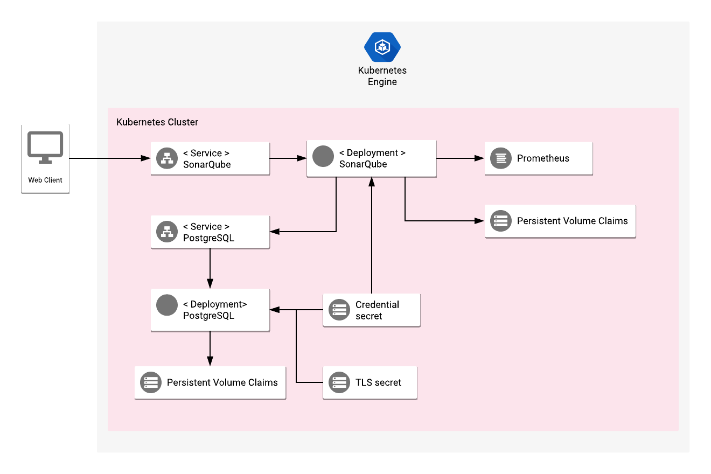

# Overview

SonarQube is an open source platform that automates code reviews to detect bugs,
code smells and security vulnerabilities on 25+ programming languages including Java, C#, JavaScript, TypeScript, C/C++, COBOL and more.

For more information on SonarQube, see the [SonarQube website](https://www.sonarqube.org/).

## About Google Click to Deploy

Popular open source software stacks on Kubernetes packaged by Google and made available in Google Cloud Marketplace.

## Design



The SonarQube application contains:

- An Application resource, which collects all the deployment resources into one logical entity
- A ServiceAccount for the SonarQube and PostgreSQL Pod.
- A Secret with the PostgreSQL initial random password
- A StatefulSet with SonarQube and PostgreSQL.
- A PersistentVolume and PersistentVolumeClaim for SonarQube and PostgreSQL. Note that these resources won't be deleted when you delete the application. If you delete the installation and recreate it with the same name, the new installation uses the same PersistentVolumes. As a result, there is no new database initialization, and no new password is set.
- A Service, which exposes PostgreSQL and SonarQube to usage in cluster

PostgreSQL exposes a clusterIP that makes it available for SonarQube within the cluster network.
SonarQube exposes a clusterIP that makes it available within the network. The steps to connect to your SonarQube application are described later in this readme.
All the data and extensions of SonarQube and PostgreSQL are stored on the PersistentVolumeClaim.

# Installation

## Quick install with Google Cloud Marketplace

Get up and running with a few clicks! Install this SonarQube application to a Google Kubernetes Engine cluster using Google Cloud Marketplace. Follow the
[on-screen instructions](https://console.cloud.google.com/marketplace/details/google/sonarqube).

## Command line instructions

You can use [Google Cloud Shell](https://cloud.google.com/shell/) or a local workstation to complete these steps.

[](https://console.cloud.google.com/cloudshell/editor?cloudshell_git_repo=https://github.com/GoogleCloudPlatform/click-to-deploy&cloudshell_working_dir=k8s/sonarqube)

### Prerequisites

#### Set up command line tools

You'll need the following tools in your environment. If you are using Cloud Shell, these tools are installed in your environment by default.

- [gcloud](https://cloud.google.com/sdk/gcloud/)
- [kubectl](https://kubernetes.io/docs/tasks/tools/install-kubectl/)
- [docker](https://docs.docker.com/install/)
- [openssl](https://www.openssl.org/)
- [helm](https://helm.sh/docs/using_helm/#installing-helm)
- [git](https://git-scm.com/book/en/v2/Getting-Started-Installing-Git)

Configure `gcloud` as a Docker credential helper:
```shell
gcloud auth configure-docker
```

#### Create a Google Kubernetes Engine cluster

Create a cluster from the command line. If you already have a cluster that
you want to use, this step is optional.

```shell
export CLUSTER=sonarqube-cluster
export ZONE=us-west1-a

gcloud container clusters create "$CLUSTER" --zone "$ZONE"
```

#### Configure kubectl to connect to the cluster

```shell
gcloud container clusters get-credentials "$CLUSTER" --zone "$ZONE"
```

#### Clone this repo

Clone this repo and the associated tools repo:

```shell
git clone --recursive https://github.com/GoogleCloudPlatform/click-to-deploy.git
```

#### Install the Application resource definition

An Application resource is a collection of individual Kubernetes components,
such as Services, Deployments, and so on, that you can manage as a group.

To set up your cluster to understand Application resources, run the following command:

```shell
kubectl apply -f "https://raw.githubusercontent.com/GoogleCloudPlatform/marketplace-k8s-app-tools/master/crd/app-crd.yaml"
```

You need to run this command once for each cluster.

The Application resource is defined by the
[Kubernetes SIG-apps](https://github.com/kubernetes/community/tree/master/sig-apps) community. The source code can be found on
[github.com/kubernetes-sigs/application](https://github.com/kubernetes-sigs/application).

### Install the application

Navigate to the `sonarqube` directory:

```shell
cd click-to-deploy/k8s/sonarqube
```

#### Configure the application with environment variables

Choose an instance name and
[namespace](https://kubernetes.io/docs/concepts/overview/working-with-objects/namespaces/)
for the application. In most cases, you can use the `default` namespace.

```shell
export APP_INSTANCE_NAME=sonarqube-1
export NAMESPACE=default
```

For the persistent disk provisioning of the Sonarqube application StatefulSets, you will need to:

 * Set the StorageClass name. Check your available options using the command below:
   * ```kubectl get storageclass```
   * Or check how to create a new StorageClass in [Kubernetes Documentation](https://kubernetes.io/docs/concepts/storage/storage-classes/#the-storageclass-resource)

 * Set the persistent disk's size. The default disk size is "10Gi".

```shell
export DEFAULT_STORAGE_CLASS="standard" # provide your StorageClass name if not "standard"
export SONARQUBE_PERSISTENT_DISK_SIZE="10Gi"
export DB_PERSISTENT_DISK_SIZE="10Gi"
```


Set up the image tag:

It is advised to use stable image reference which you can find on
[Marketplace Container Registry](https://marketplace.gcr.io/google/sonarqube).
Example:

```shell
export TAG="8.9.3-<BUILD_ID>"
```

Alternatively you can use short tag which points to the latest image for selected version.
> Warning: this tag is not stable and referenced image might change over time.

```shell
export TAG="8.9"
```

Configure the container images:

```shell
export IMAGE_SONARQUBE="marketplace.gcr.io/google/sonarqube"
export IMAGE_POSTGRESQL="marketplace.gcr.io/google/sonarqube/postgresql:$TAG"
export IMAGE_POSTGRESQL_EXPORTER="marketplace.gcr.io/google/sonarqube/postgresql-exporter:$TAG"
export IMAGE_METRICS_EXPORTER="marketplace.gcr.io/google/sonarqube/prometheus-to-sd:$TAG"
```

Generate random password for PostgreSQL:

```shell
export POSTGRESQL_DB_PASSWORD=$(openssl rand 9 | openssl base64 -A | openssl base64)
```

Enable Stackdriver Metrics Exporter:

> **NOTE:** Your GCP project should have Stackdriver enabled. For non-GCP clusters, export of metrics to Stackdriver is not supported yet.

By default the integration is disabled. To enable, change the value to `true`.

```shell
export METRICS_EXPORTER_ENABLED=false
```

#### Create TLS certificate for PostgreSQL

> Note: You can skip this step if you have not set up external access.

1.  If you already have a certificate that you want to use, copy your
    certificate and key pair to the `/tmp/tls.crt`, and `/tmp/tls.key` files,
    then skip to the next step.

    To create a new certificate, run the following command:

    ```shell
    openssl req -x509 -nodes -days 365 -newkey rsa:2048 \
        -keyout /tmp/tls.key \
        -out /tmp/tls.crt \
        -subj "/CN=postgresql/O=postgresql"
    ```

2.  Set `TLS_CERTIFICATE_KEY` and `TLS_CERTIFICATE_CRT` variables:

    ```shell
    export TLS_CERTIFICATE_KEY="$(cat /tmp/tls.key | base64)"
    export TLS_CERTIFICATE_CRT="$(cat /tmp/tls.crt | base64)"
    ```

#### Expand the manifest template

Use `helm template` to expand the template. We recommend that you save the
expanded manifest file for future updates to the application.

export DEFAULT_STORAGE_CLASS="standard" # provide your StorageClass name if not "standard"
export SONARQUBE_PERSISTENT_DISK_SIZE="10Gi"
export DB_PERSISTENT_DISK_SIZE="10Gi"

```shell
helm template "$APP_INSTANCE_NAME" chart/sonarqube \
  --namespace "$NAMESPACE" \
  --set sonarqube.image.repo="$IMAGE_SONARQUBE" \
  --set sonarqube.image.tag="$TAG" \
  --set sonarqube.persistence.size="$SONARQUBE_PERSISTENT_DISK_SIZE" \
  --set sonarqube.persistence.storageClass="$DEFAULT_STORAGE_CLASS" \
  --set postgresql.image="$IMAGE_POSTGRESQL" \
  --set postgresql.exporter.image="$IMAGE_POSTGRESQL_EXPORTER" \
  --set postgresql.db.password="$POSTGRESQL_DB_PASSWORD" \
  --set postgresql.persistence.size="$DB_PERSISTENT_DISK_SIZE" \
  --set metrics.image="$IMAGE_METRICS_EXPORTER" \
  --set metrics.exporter.enabled="$METRICS_EXPORTER_ENABLED" \
  --set tls.base64EncodedPrivateKey="$TLS_CERTIFICATE_KEY" \
  --set tls.base64EncodedCertificate="$TLS_CERTIFICATE_CRT" \
  > "${APP_INSTANCE_NAME}_manifest.yaml"
```

#### Apply the manifest to your Kubernetes cluster

Use `kubectl` to apply the manifest to your Kubernetes cluster:

```shell
kubectl apply -f "${APP_INSTANCE_NAME}_manifest.yaml" --namespace "${NAMESPACE}"
```

#### View the app in the Google Cloud Console

To get the GCP Console URL for your app, run the following command:

```shell
echo "https://console.cloud.google.com/kubernetes/application/${ZONE}/${CLUSTER}/${NAMESPACE}/${APP_INSTANCE_NAME}"
```

To view the app, open the URL in your browser.

# Using SonarQube Community Edition

By default, the application is not exposed externally. To get access to SonarQube, run the following command:

```bash
kubectl port-forward --namespace $NAMESPACE svc/$APP_INSTANCE_NAME-sonarqube-svc 9000:9000
```

Then, open [http://localhost:9000/](http://localhost:9000/). Use the username `admin` and password `admin` to sign in to SonarQube.

# Application metrics

## PostgreSQL metrics

The application is configured to expose its metrics through
[PostgreSQL Server Exporter](https://github.com/wrouesnel/postgres_exporter) in
the
[Prometheus format](https://github.com/prometheus/docs/blob/master/content/docs/instrumenting/exposition_formats.md).

You can access the metrics at `[POSTGRESQL_CLUSTER_IP]:9187/metrics`, where
`[POSTGRESQL_CLUSTER_IP]` is the IP address of the application on Kubernetes
cluster.

## SonarQube metrics

The application is configured to expose its metrics through the
[Sonarqube Prometheus Exporter](https://github.com/dmeiners88/sonarqube-prometheus-exporter) in
the
[Prometheus format](https://github.com/prometheus/docs/blob/master/content/docs/instrumenting/exposition_formats.md).

You can access the metrics at `[SONARQUBE_CLUSTER_IP]:9000/api/prometheus/metrics`, where
`[SONARQUBE_CLUSTER_IP]` is the IP address of the application on Kubernetes
cluster.

### Configuring Prometheus to collect metrics

Prometheus can be configured to automatically collect the application's metrics.
Follow the steps in
[Configuring Prometheus](https://prometheus.io/docs/introduction/first_steps/#configuring-prometheus).

You configure the metrics in the
[`scrape_configs` section](https://prometheus.io/docs/prometheus/latest/configuration/configuration/#scrape_config).

## Exporting metrics to Stackdriver

The deployment includes a
[Prometheus to Stackdriver (`prometheus-to-sd`)](https://github.com/GoogleCloudPlatform/k8s-stackdriver/tree/master/prometheus-to-sd)
container. If you enabled the option to export metrics to Stackdriver, the
metrics are automatically exported to Stackdriver and visible in
[Stackdriver Metrics Explorer](https://cloud.google.com/monitoring/charts/metrics-explorer).
The name of each metric starts with the application's name, which you define in
the `APP_INSTANCE_NAME` environment variable.

The export option might not be available for GKE On-prem clusters.

> Note: Stackdriver has [quotas](https://cloud.google.com/monitoring/quotas) for
> the number of custom metrics created in a single GCP project. If the quota is
> met, additional metrics might not show up in the Stackdriver Metrics Explorer.

You can remove existing metric descriptors using
[Stackdriver's REST API](https://cloud.google.com/monitoring/api/ref_v3/rest/v3/projects.metricDescriptors/delete).

# Scaling

SonarQube Community Edition doest not support scaling.

# Backup and restore

There are 4 core components in the SonarQube platform:
- SonarQube Server, which starts these processes:
  - A web server to configure SonarQube instance
  - A search server based on Elasticsearch
  - A compute server for analysis and processing
- The SonarQube database
- A set of plugins
- SonarQube Scanners, which are responsible for project analysis. These usually run on build servers

To back up the application, you must back up the database. The `plugins` folder is stored on the PersistentVolumeClaim.

## Backing up plugin and data

To back up the plugins, copy the files from `$SONARQUBE_HOME/extension`.
Use the following script to copy the plugins folder to a local `extensions` folder:

```shell
mkdir extensions
kubectl --namespace $NAMESPACE cp $(kubectl -n$NAMESPACE get pod -oname | \
              sed -n /\\/$APP_INSTANCE_NAME-sonarqube/s.pods\\?/..p):/opt/sonarqube/extensions extensions
```

Use this script to copy `$SONARQUBE_HOME/data` into a local folder called `data`:

```shell
mkdir data
kubectl --namespace $NAMESPACE cp $(kubectl -n$NAMESPACE get pod -oname | \
              sed -n /\\/$APP_INSTANCE_NAME-sonarqube/s.pods\\?/..p):/opt/sonarqube/data data
```

It is not necessary to backup data folder, it will be downloaded by application
from database.

## Backing up PostgreSQL

Your SonarQube configuration and project data is stored in the PostgreSQL database.
The following script creates a `postgresql/backup.sql` file with the contents of the database.

```shell
mkdir postgresql
kubectl --namespace $NAMESPACE exec -t \
	$(kubectl -n$NAMESPACE get pod -oname | \
		sed -n /\\/$APP_INSTANCE_NAME-postgresql/s.pods\\?/..p) \
	-c postgresql-server \
	-- pg_dumpall -c -U postgres > postgresql/backup.sql
```

## Backup your database password

Use this command to see a base64-encoded version of your PostgreSQL password:

```shell
kubectl get secret $APP_INSTANCE_NAME-secret --namespace $NAMESPACE -o yaml | grep password:
```

## Restoring the database

### Enter maintenance mode

Before you restore the PostgreSQL database, we recommend closing all incoming connections to the database.

1. The following command blocks incoming database connections:

    ```shell
    kubectl --namespace $NAMESPACE exec -t \
      $(kubectl -n$NAMESPACE get pod -oname | \
         sed -n /\\/$APP_INSTANCE_NAME-postgresql/s.pods\\?/..p) \
      -c postgresql-server \
      -- psql -U postgres -c "update pg_database set datallowconn = false where datname = 'sonar';"
    ```

1. To ensure data consistency, use this command to drop all active connections:

    ```shell
    kubectl --namespace $NAMESPACE exec -t \
      $(kubectl -n$NAMESPACE get pod -oname | \
         sed -n /\\/$APP_INSTANCE_NAME-postgresql/s.pods\\?/..p) \
      -c postgresql-server \
      -- psql -U postgres -c "select pg_terminate_backend(pid) from pg_stat_activity where datname='sonar';"
    ```
### Restore the database

1. Use this command to restore your data from `postgresql/backup.sql`:

    ```shell
    cat postgresql/backup.sql | kubectl --namespace $NAMESPACE exec -i \
      $(kubectl -n$NAMESPACE get pod -oname | \
        sed -n /\\/$APP_INSTANCE_NAME-postgresql/s.pods\\?/..p) \
      -c postgresql-server \
      -- psql -U postgres
    ```

1. Use the following command to copy data files from your local folder to `$SONARQUBE_HOME/data` in the SonarQube Pod:

    ```shell
    kubectl --namespace $NAMESPACE cp data $(kubectl -n$NAMESPACE get pod -oname | \
      sed -n /\\/$APP_INSTANCE_NAME-sonarqube/s.pods\\?/..p):/opt/sonarqube/data
    ```

1. Use the following command to copy the contents of your local `extensions` folder to `$SONARQUBE_HOME/extensions` folder in the SonarQube Pod:

    ```shell
    kubectl --namespace $NAMESPACE cp extensions $(kubectl -n$NAMESPACE get pod -oname | \
      sed -n /\\/$APP_INSTANCE_NAME-sonarqube/s.pods\\?/..p):/opt/sonarqube/extensions
    ```

1. Delete the unneeded SonarQube application data:

    ```shell
    kubectl --namespace $NAMESPACE exec -i \
      $(kubectl -n$NAMESPACE get pod -oname | \
        sed -n /\\/$APP_INSTANCE_NAME-sonarqube/s.pods\\?/..p) \
      -- bash -c "rm -rf /opt/sonarqube/data/es5/* "
    ```

1. Enable incoming connections for the `sonar` database schema:

    ```shell
    kubectl --namespace $NAMESPACE exec -t \
      $(kubectl -n$NAMESPACE get pod -oname | \
        sed -n /\\/$APP_INSTANCE_NAME-postgresql/s.pods\\?/..p) \
      -c postgresql-server \
      -- psql -U postgres -c "update pg_database set datallowconn = true where datname = 'sonar';"
    ```

1. Patch a Secret to restore your database password:

   ```shell
   kubectl --namespace $NAMESPACE patch secret sonarqube-1-secret -p '{"data": {"password": "'"$ENCODED_PASS"'"}}'
   ```

   where `$ENCODED_PASS` is variable with the base64-encoded password that you backed up.

1. Finally, restart the SonarQube Pod:

    ```shell
    kubectl --namespace $NAMESPACE  exec -i $(kubectl -n$NAMESPACE get pod -oname | \
      sed -n /\\/$APP_INSTANCE_NAME-sonarqube/s.pods\\?/..p) \
      -- bash -c "kill -1 1"
    ```

# Uninstalling the Application

## Using the Google Cloud Platform Console

1. In the GCP Console, open [Kubernetes Applications](https://console.cloud.google.com/kubernetes/application).

1. From the list of applications, click **Sonarqube-1**.

1. On the Application Details page, click **Delete**.

## Using the command line

### Prepare the environment

Set your installation name and Kubernetes namespace:

```shell
export APP_INSTANCE_NAME=sonarqube-1
export NAMESPACE=default
```

### Delete the resources

> **NOTE:** We recommend to use a `kubectl` version that is the same as the version of your cluster. Using the same versions of `kubectl` and the cluster helps avoid unforeseen issues.

To delete the resources, use the expanded manifest file used for the
installation.

Run `kubectl` on the expanded manifest file:

```shell
kubectl delete -f ${APP_INSTANCE_NAME}_manifest.yaml --namespace $NAMESPACE
```

Otherwise, delete the resources using types and a label:

```shell
kubectl delete application,statefulset,service,pvc,secret \
  --namespace $NAMESPACE \
  --selector app.kubernetes.io/name=$APP_INSTANCE_NAME
```

### Delete the persistent volumes of your installation

By design, the removal of StatefulSets in Kubernetes does not remove
PersistentVolumeClaims that were attached to their Pods. This prevents your
installations from accidentally deleting stateful data.

To remove the PersistentVolumeClaims with their attached persistent disks, run
the following `kubectl` commands:

```shell
for pv in $(kubectl get pvc --namespace $NAMESPACE \
  --selector app.kubernetes.io/name=$APP_INSTANCE_NAME \
  --output jsonpath='{.items[*].spec.volumeName}');
do
  kubectl delete pv/$pv --namespace $NAMESPACE
done

kubectl delete persistentvolumeclaims \
  --namespace $NAMESPACE \
  --selector app.kubernetes.io/name=$APP_INSTANCE_NAME
```

### Delete the GKE cluster

Optionally, if you don't need the deployed application or the GKE cluster,
delete the cluster using this command:

```
gcloud container clusters delete "$CLUSTER" --zone "$ZONE"
```

