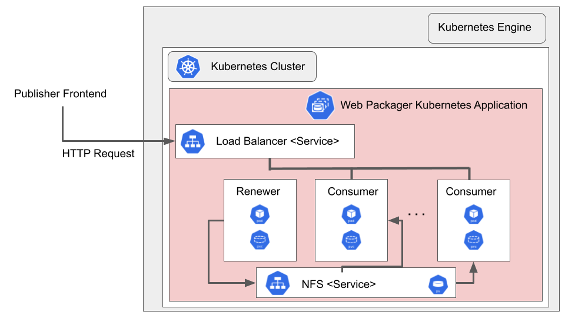

# Overview

Web Packager HTTP Server is an HTTP server that generates signed exchanges. By
default, it is configured to enable privacy-preserving prefetch on referrers 
such as Google, by meeting the [requirements][] set by the Google SXG Cache. It
functions like a reverse-proxy, fetching documents from a backend server, then
optimizing and signing them before returning them to requestors.

Currently, if you need to package [AMP][] documents into a signed exchange,
it is recommended that you use [AMP Packager][] for that purpose and use
[Web Packager][] for everything else. This may change in the future where only
one packager does both jobs, but for now it means that you have to set up both
packagers if you need to process both AMP and non-AMP content.

[AMP]: https://amp.dev/
[AMP Packager]: https://github.com/ampproject/amppackager
[requirements]: https://github.com/google/webpackager/blob/master/docs/cache_requirements.md
[Web Packager]: https://github.com/google/webpackager

To learn more about Web Packager, see the [Web Packager GitHub Site](https://github.com/google/webpackager).

## About Google Click to Deploy

Popular open stacks on Kubernetes packaged by Google.

## Architecture



This application uses 2 replicas of the Web Packager with a load balancer
service in front that routes requests to the instances. The number of replicas
is configurable.  All Web Packager Pods are associated with an NFS Server as 
their PersistentVolume which is created as a standard persistent disk defined by
Google Kubernetes Engine.

This application exposes one endpoint: HTTPS on (configurable) port 6000.

This application requires a Signed Exchange Certificate in order to function.
The application, through its ACME Configuration, automatically requests and
retrieves this certificate from the Certificate Authority. The application also
periodically (approximately every 90 days) requests automatic renewal of the
certificate.

If you want to use this application in a production environment, you must:

*   Configure it to use your [ACME account][] to obtain your
certificate.

[ACME Account]:https://github.com/google/webpackager/wiki/Certificate-Authorities/

# Installation

## Quick install with Google Cloud Marketplace

Get up and running with a few clicks! Install this Web Packager app to a Google
Kubernetes Engine cluster using Google Cloud Marketplace. Follow the
[on-screen instructions](https://console.cloud.google.com/marketplace/details/google/webpackager).

## Command line instructions

Alternatively, you can use [Google Cloud Shell](https://cloud.google.com/shell/) or a local
workstation to complete the following steps.

[](https://console.cloud.google.com/cloudshell/editor?cloudshell_git_repo=https://github.com/GoogleCloudPlatform/click-to-deploy&cloudshell_open_in_editor=README.md&cloudshell_working_dir=k8s/webpackager)

### Prerequisites

#### Set up command-line tools

You'll need the following tools in your development environment. If you are
using Cloud Shell, `gcloud`, `kubectl`, Docker, and Git are installed in your
environment by default.

-   [gcloud](https://cloud.google.com/sdk/gcloud/)
-   [kubectl](https://kubernetes.io/docs/reference/kubectl/overview/)
-   [docker](https://docs.docker.com/install/)
-   [git](https://git-scm.com/book/en/v2/Getting-Started-Installing-Git)
-   [helm](https://helm.sh/)

Configure `gcloud` as a Docker credential helper:

```shell
gcloud auth configure-docker
```

#### Create a Google Kubernetes Engine cluster

Create a new cluster from the command line:

```shell
export CLUSTER=webpackager-cluster
export ZONE=us-west1-a
export NUM_NODES=10 # The min value of NUM_NODES should be number of REPLICAS + 1. A larger number is acceptable.
gcloud container clusters create "$CLUSTER" --zone "$ZONE" --num-nodes="$NUM_NODES" --enable-ip-alias --metadata disable-legacy-endpoints=true
```

Configure `kubectl` to connect to the new cluster.

```shell
gcloud container clusters get-credentials "$CLUSTER" --zone "$ZONE"
```

#### Clone this repo

Clone this repo and the associated tools repo.

```shell
git clone --recursive https://github.com/GoogleCloudPlatform/click-to-deploy.git
```

#### Install the Application resource definition

An Application resource is a collection of individual Kubernetes components,
such as Services, Deployments, and so on, that you can manage as a group.

To set up your cluster to understand Application resources, run the following
command:

```shell
kubectl apply -f "https://raw.githubusercontent.com/GoogleCloudPlatform/marketplace-k8s-app-tools/master/crd/app-crd.yaml"
```

You need to run this command once.

The Application resource is defined by the
[Kubernetes SIG-apps](https://github.com/kubernetes/community/tree/master/sig-apps)
community. The source code can be found on
[github.com/kubernetes-sigs/application](https://github.com/kubernetes-sigs/application).

### Install the Application

Navigate to the `webpackager` directory:

```shell
cd click-to-deploy/k8s/webpackager
```

#### Configure the app with environment variables

Choose the instance name and namespace for the app:

```shell
export APP_INSTANCE_NAME=webpackager-1
export NAMESPACE=default
export REPLICAS=2
```

Set up the image tag:

It is advised to use stable image reference which you can find on
[Marketplace Container Registry](https://marketplace.gcr.io/google/webpackager).
Example:

```shell
export TAG="1.0.2-20201016-235926"
```

Alternatively you can use short tag which points to the latest image for selected version.
> Warning: this tag is not stable and referenced image might change over time.

```shell
export TAG="1.0"
```

Configure the container images:

```shell
export IMAGE_WEBPACKAGER="marketplace.gcr.io/google/webpackager"
export IMAGE_WEBPACKAGER_INIT="marketplace.gcr.io/google/webpackager/init"
```

Set the storage class for the persistent volume of Web Packager. 
Set the StorageClass name. You can select your existing StorageClass name for the persistent disk of the Web Packager.
Set the persistent disk's size. The default disk size is "10Gi".

```shell
export STORAGE_CLASS="standard" # provide your StorageClass name if not "standard"
export PERSISTENT_DISK_SIZE="10Gi"
```

#### Create a namespace in your Kubernetes cluster

If you use a different namespace than `default`, run the command below to create
a new namespace:

```shell
kubectl create namespace "$NAMESPACE"
```

#### Expand the manifest template

Use `helm template` to expand the template. We recommend that you save the
expanded manifest file for future updates to the application.

```shell
helm template chart/webpackager \
  --name "$APP_INSTANCE_NAME" \
  --namespace "$NAMESPACE" \
  --set replicaCount="$REPLICAS" \
  --set image.repo="$IMAGE_WEBPACKAGER" \
  --set image.tag="$TAG" \
  --set init.repo="$IMAGE_WEBPACKAGER_INIT" \
  --set init.tag"$TAG" \
  --set packager.persistence.storageClass="$STORAGE_CLASS" \
  --set packager.persistence.size="$PERSISTENT_DISK_SIZE" \
  --set packager.domain="$WEBPACKAGER_DOMAIN" \
  --set packager.country="$WEBPACKAGER_COUNTRY" \
  --set packager.locality="$WEBPACKAGER_LOCALITY" \
  --set packager.organization="$WEBPACKAGER_ORGANIZATION" \
  --set acme.emailAddress="$ACME_EMAIL_ADDRESS" \
  --set acme.directoryUrl="$ACME_DIRECTORY_URL" \
  --set service.loadBalancerSourceRanges="$WEBPACKAGER_LOAD_BALANCER_RANGE" \
  > "${APP_INSTANCE_NAME}_manifest.yaml"
```

#### Apply the manifest to your Kubernetes cluster

Use `kubectl` to apply the manifest to your Kubernetes cluster:

```shell
kubectl apply -f "${APP_INSTANCE_NAME}_manifest.yaml" --namespace "${NAMESPACE}"
```

#### View the app in the Google Cloud Console

To get the GCP Console URL for your app, run the following command:

```shell
echo "https://console.cloud.google.com/kubernetes/application/${ZONE}/${CLUSTER}/${NAMESPACE}/${APP_INSTANCE_NAME}"
```

To view your app, open the URL in your browser.

# Using the app

You can get the IP addresses for your Web Packager solution either from the
command line, or from the Google Cloud Platform Console.

In the GCP Console, do the following:

1.  Open the
    [Kubernetes Engine Services](https://console.cloud.google.com/kubernetes/discovery)
    page.
1.  Identify the Web Packager solution using its name (typically `webpackager-service`,
    unless you decide to name your instance some other name).
1.  From the Endpoints column, note the IP addresses for ports 6000.

If you are using the command line, run the following command:

```shell
kubectl get svc -l app.kubernetes.io/name=$APP_INSTANCE_NAME --namespace "$NAMESPACE"
```

This command shows the internal and external IP address of your Web Packager
service.

You can follow [Web Packager Productionizing][Production] for further steps.

[Production]:https://github.com/google/webpackager/tree/master/cmd/webpkgserver

# Scaling

By default, the Web Packager application is deployed using 2 replicas. You can
manually scale it up or down using the following command:

```shell
kubectl scale statefulsets "$APP_INSTANCE_NAME-webpackager" \
  --namespace "$NAMESPACE" \
  --replicas=[NEW_REPLICAS]
```

where `[NEW_REPLICAS]` is the new number of replicas.

# Uninstalling the app

You can delete the Web Packager application using the Google Cloud Platform
Console, or using the command line.

## Using the Google Cloud Platform Console

1.  In the GCP Console, open
    [Kubernetes Applications](https://console.cloud.google.com/kubernetes/application).

1.  From the list of applications, click **Web Packager**.

1.  On the Application Details page, click **Delete**.

## Using the command line

1.  Navigate to the `webpackager` directory.

    ```shell
    cd click-to-deploy/k8s/webpackager
    ```

1.  Run the `kubectl delete` command:

    ```shell
    kubectl delete -f ${APP_INSTANCE_NAME}_manifest.yaml --namespace $NAMESPACE
    ```

Optionally, if you don't need the deployed application or the Kubernetes Engine
cluster, delete the cluster using this command:

```shell
gcloud container clusters delete "$CLUSTER" --zone "$ZONE"
```

Also optionally, if you want to retain the data in your persistent volume while
uninstalling, DO NOT explicitly delete the persistent volume.  Persistent volumes
are deleted using this command:

```shell
kubectl delete pv $PERSISTENT_VOLUME_NAME
```
