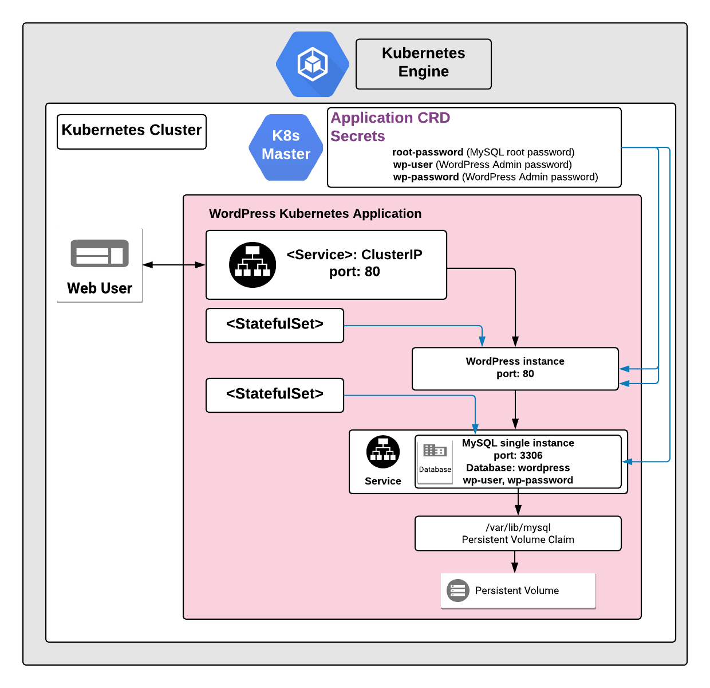

# Overview

WordPress is web publishing software used to create websites and blogs.

[Learn more](https://wordpress.org/).

## About Google Click to Deploy

Popular open stacks on Kubernetes packaged by Google.

## Architecture

> **NOTE:** The following diagram shows the architecture with the application
> (optionally) exposed externally, using an Ingress and TLS configuration. The
> steps to enable the Ingress resource are in the sections below.



By default, WordPress is exposed using a ClusterIP Service on port 80.
Optionally, if you enable the option to expose the service externally, the
WordPress interface is exposed on ports `80` and `443` using an Ingress
resource. The TLS certificates are stored in the `[APP-INSTANCE-NAME]-tls`
Secret resource.

Separate StatefulSet Kubernetes objects are used to manage the WordPress and
MySQL instances. A single instance of WordPress is deployed as a single Pod,
using a Kubernetes StatefulSet.

The WordPress instance connects to MySQL over port `3306`. WordPress stores
information in the `wordpress` database. A single instance of MySQL is deployed
as a Pod, using a Kubernetes StatefulSet.

WordPress stores credentials for MySQL database in the
`[APP-INSTANCE-NAME]-mariadb-secret` Secret resource.

*   The password for the MySQL `root` user is stored in the `root-password`
    secret.
*   The username and password to access the `wordpress` database are stored in
    `wp-user` and `wp-password` secrets respectively.

The credentials for WordPress are stored in the
`[APP-INSTANCE-NAME]-wordpress-secret` Secret resource.

*   The username, email address, and password to access the administrator panel
    are stored in `wp-user`, `wp-email` and `wp-password` secrets respectively.

# Installation

## Quick install with Google Cloud Marketplace

Get up and running with a few clicks! Install this WordPress app to a Google
Kubernetes Engine cluster using Google Cloud Marketplace. Follow the
[on-screen instructions](https://console.cloud.google.com/marketplace/details/google/wordpress).

## Command line instructions

You can use [Google Cloud Shell](https://cloud.google.com/shell/) or a local
workstation to follow the steps below.

[](https://console.cloud.google.com/cloudshell/editor?cloudshell_git_repo=https://github.com/GoogleCloudPlatform/click-to-deploy&cloudshell_open_in_editor=README.md&cloudshell_working_dir=k8s/wordpress)

### Prerequisites

#### Set up command-line tools

You'll need the following tools in your development environment. If you are
using Cloud Shell, `gcloud`, `kubectl`, Docker, and Git are installed in your
environment by default.

-   [gcloud](https://cloud.google.com/sdk/gcloud/)
-   [kubectl](https://kubernetes.io/docs/reference/kubectl/overview/)
-   [docker](https://docs.docker.com/install/)
-   [git](https://git-scm.com/book/en/v2/Getting-Started-Installing-Git)
-   [openssl](https://www.openssl.org/)
-   [helm](https://helm.sh/)

Configure `gcloud` as a Docker credential helper:

```shell
gcloud auth configure-docker
```

#### Create a Google Kubernetes Engine (GKE) cluster

Create a new cluster from the command line:

```shell
export CLUSTER=wordpress-cluster
export ZONE=us-west1-a

gcloud container clusters create "$CLUSTER" --zone "$ZONE"
```

Configure `kubectl` to connect to the new cluster:

```shell
gcloud container clusters get-credentials "$CLUSTER" --zone "$ZONE"
```

#### Clone this repo

Clone this repo and the associated tools repo:

```shell
git clone --recursive https://github.com/GoogleCloudPlatform/click-to-deploy.git
```

#### Install the Application resource definition

An Application resource is a collection of individual Kubernetes components,
such as Services, Deployments, and so on, that you can manage as a group.

To set up your cluster to understand Application resources, run the following
command:

```shell
kubectl apply -f "https://raw.githubusercontent.com/GoogleCloudPlatform/marketplace-k8s-app-tools/master/crd/app-crd.yaml"
```

You need to run this command once.

The Application resource is defined by the
[Kubernetes SIG-apps](https://github.com/kubernetes/community/tree/master/sig-apps)
community. The source code can be found on
[github.com/kubernetes-sigs/application](https://github.com/kubernetes-sigs/application).

### Install the Application

Navigate to the `wordpress` directory:

```shell
cd click-to-deploy/k8s/wordpress
```

#### Configure the app with environment variables

Choose the instance name and namespace for the app. For most cases, you can use
the `default` namespace.

```shell
export APP_INSTANCE_NAME=wordpress-1
export NAMESPACE=default
```

Expose the Service externally and configure Ingress:

By default, the Service isn't exposed externally. To enable this option, change
the value to `true`.

```shell
export PUBLIC_SERVICE_AND_INGRESS_ENABLED=false
```

Enable Stackdriver Metrics Exporter:

> **NOTE:** Your GCP project must have Stackdriver enabled. If you are using a
> non-GCP cluster, you cannot export metrics to Stackdriver.

By default, the application does not export metrics to Stackdriver. To enable
this option, change the value to `true`.

```shell
export METRICS_EXPORTER_ENABLED=false
```

Set up the image tag:

It is advised to use stable image reference which you can find on
[Marketplace Container Registry](https://marketplace.gcr.io/google/wordpress).
Example:

```shell
export TAG="6.1"
```

Configure the container images:

```shell
export IMAGE_WORDPRESS="marketplace.gcr.io/google/wordpress"
export IMAGE_APACHE_EXPORTER="marketplace.gcr.io/google/wordpress/apache-exporter:${TAG}"
export IMAGE_MYSQL="marketplace.gcr.io/google/wordpress/mysql:${TAG}"
export IMAGE_MYSQL_EXPORTER="marketplace.gcr.io/google/wordpress/mysqld-exporter:${TAG}"
export IMAGE_METRICS_EXPORTER="marketplace.gcr.io/google/wordpress/prometheus-to-sd:${TAG}"
```

For the persistent disk provisioning of the Wordpress StatefulSets, you will need to:

 * Set the StorageClass name. Check your available options using the command below:
   * ```kubectl get storageclass```
   * Or check how to create a new StorageClass in [Kubernetes Documentation](https://kubernetes.io/docs/concepts/storage/storage-classes/#the-storageclass-resource)

 * Set the persistent disk's size. The default disk size is "5Gi".

```shell
export DEFAULT_STORAGE_CLASS="standard" # provide your StorageClass name if not "standard"
export PERSISTENT_DISK_SIZE="5Gi"
```


Set or generate passwords:

```shell
# Set alias for password generation
alias generate_pwd="cat /dev/urandom | tr -dc 'a-zA-Z0-9' | fold -w 20 | head -n 1 | tr -d '\n'"

# Set the root and WordPress database passwords
export ROOT_DB_PASSWORD="$(generate_pwd)"
export WORDPRESS_DB_PASSWORD="$(generate_pwd)"

# Set mysqld-exporter user password.
export EXPORTER_DB_PASSWORD="$(generate_pwd)"

# Set e-mail address and password for WordPress admin panel
export WORDPRESS_ADMIN_EMAIL=noreply@example.com
export WORDPRESS_ADMIN_PASSWORD="$(generate_pwd)"
```

#### Create TLS certificate for WordPress

> Note: You can skip this step if you have not set up external access.

1.  If you already have a certificate that you want to use, copy your
    certificate and key pair to the `/tmp/tls.crt`, and `/tmp/tls.key` files,
    then skip to the next step.

    To create a new certificate, run the following command:

    ```shell
    openssl req -x509 -nodes -days 365 -newkey rsa:2048 \
        -keyout /tmp/tls.key \
        -out /tmp/tls.crt \
        -subj "/CN=wordpress/O=wordpress"
    ```

2.  Set `TLS_CERTIFICATE_KEY` and `TLS_CERTIFICATE_CRT` variables:

    ```shell
    export TLS_CERTIFICATE_KEY="$(cat /tmp/tls.key | base64)"
    export TLS_CERTIFICATE_CRT="$(cat /tmp/tls.crt | base64)"
    ```

#### Create namespace in your Kubernetes cluster

If you use a different namespace than `default`, or the namespace does not exist
yet, run the command below to create a new namespace:

```shell
kubectl create namespace "$NAMESPACE"
```

#### Expand the manifest template

Use `helm template` to expand the template. We recommend that you save the
expanded manifest file for future updates to the application.

```shell
helm template "$APP_INSTANCE_NAME" chart/wordpress \
  --namespace "$NAMESPACE" \
  --set wordpress.image.repo="$IMAGE_WORDPRESS" \
  --set wordpress.image.tag="$TAG" \
  --set wordpress.persistence.storageClass="$DEFAULT_STORAGE_CLASS" \
  --set wordpress.persistence.size="$PERSISTENT_DISK_SIZE" \
  --set db.image="$IMAGE_MYSQL" \
  --set db.rootPassword="$ROOT_DB_PASSWORD" \
  --set db.persistence.storageClass="$DEFAULT_STORAGE_CLASS" \
  --set db.persistence.size="$PERSISTENT_DISK_SIZE" \
  --set db.wordpressPassword="$WORDPRESS_DB_PASSWORD" \
  --set db.exporter.image="$IMAGE_MYSQL_EXPORTER" \
  --set db.exporter.password="$EXPORTER_DB_PASSWORD" \
  --set apache.exporter.image="$IMAGE_APACHE_EXPORTER" \
  --set admin.email="$WORDPRESS_ADMIN_EMAIL" \
  --set admin.password="$WORDPRESS_ADMIN_PASSWORD" \
  --set metrics.image="$IMAGE_METRICS_EXPORTER" \
  --set enablePublicServiceAndIngress="$PUBLIC_SERVICE_AND_INGRESS_ENABLED" \
  --set metrics.exporter.enabled="$METRICS_EXPORTER_ENABLED" \
  --set tls.base64EncodedPrivateKey="$TLS_CERTIFICATE_KEY" \
  --set tls.base64EncodedCertificate="$TLS_CERTIFICATE_CRT" \
  > "${APP_INSTANCE_NAME}_manifest.yaml"
```

#### Apply the manifest to your Kubernetes cluster

Use `kubectl` to apply the manifest to your Kubernetes cluster:

```shell
kubectl apply -f "${APP_INSTANCE_NAME}_manifest.yaml" --namespace "${NAMESPACE}"
```

#### View the app in the Google Cloud Console

To get the GCP Console URL for your app, run the following command:

```shell
echo "https://console.cloud.google.com/kubernetes/application/${ZONE}/${CLUSTER}/${NAMESPACE}/${APP_INSTANCE_NAME}"
```

To view the app, open the URL in your browser.

### Open your WordPress site

Get the external IP of your WordPress site using the following command:

```
SERVICE_IP=$(kubectl get ingress $APP_INSTANCE_NAME-wordpress-ingress \
  --namespace $NAMESPACE \
  --output jsonpath='{.status.loadBalancer.ingress[0].ip}')

echo "https://${SERVICE_IP}/"
```

The command shows you the URL of your site.

# Application metrics

## Prometheus metrics

The application can be configured to expose its metrics through the
[MySQL Server Exporter](https://github.com/GoogleCloudPlatform/mysql-docker/tree/master/exporter)
and the
[Apache Exporter](https://github.com/GoogleCloudPlatform/wordpress-docker/tree/master/exporter)
in the
[Prometheus format](https://github.com/prometheus/docs/blob/master/content/docs/instrumenting/exposition_formats.md).

1.  You can access the MySQL metrics at `[MYSQL-SERVICE]:9104/metrics`, where
    `[MYSQL-SERVICE]` is the
    [Kubernetes Service](https://kubernetes.io/docs/concepts/services-networking/service/).

    For example, to access the metrics locally, run the following command:

    ```shell
    kubectl port-forward "svc/${APP_INSTANCE_NAME}-mysqld-exporter-svc" 9104 --namespace "${NAMESPACE}"
    ```

    Then, navigate to the
    [http://localhost:9104/metrics](http://localhost:9104/metrics) endpoint.

2.  You can acccess the metrics for the Apache HTTP server at
    `[APACHE-SERVICE]:9117/metrics`, where `[APACHE-SERVICE]` is the
    [Kubernetes Service](https://kubernetes.io/docs/concepts/services-networking/service/).

    For example, to access the metrics locally, run the following command:

    ```shell
    kubectl port-forward "svc/${APP_INSTANCE_NAME}-apache-exporter-svc" 9117 --namespace "${NAMESPACE}"
    ```

    Then, navigate to the
    [http://localhost:9117/metrics](http://localhost:9117/metrics) endpoint.

### Configuring Prometheus to collect the metrics

Prometheus can be configured to automatically collect the application's metrics.
Follow the steps in
[Configuring Prometheus](https://prometheus.io/docs/introduction/first_steps/#configuring-prometheus).

You configure the metrics in the
[`scrape_configs` section](https://prometheus.io/docs/prometheus/latest/configuration/configuration/#scrape_config).

## Exporting metrics to Stackdriver

The deployment includes a
[Prometheus to Stackdriver (`prometheus-to-sd`)](https://github.com/GoogleCloudPlatform/k8s-stackdriver/tree/master/prometheus-to-sd)
container. If you enabled the option to export metrics to Stackdriver, the
metrics are automatically exported to Stackdriver and visible in
[Stackdriver Metrics Explorer](https://cloud.google.com/monitoring/charts/metrics-explorer).

The name of each metric starts with the component's name (`mysql` for MySQL and `apache` for WordPress).
Metrics are labeled with `app.kubernetes.io/name` consisting of application's name,
which you define in the `APP_INSTANCE_NAME` environment variable.

The exporting option might not be available for GKE on-prem clusters.

> Note: Stackdriver has [quotas](https://cloud.google.com/monitoring/quotas) for
> the number of custom metrics created in a single GCP project. If the quota is
> met, additional metrics might not show up in the Stackdriver Metrics Explorer.

You can remove existing metric descriptors using
[Stackdriver's REST API](https://cloud.google.com/monitoring/api/ref_v3/rest/v3/projects.metricDescriptors/delete).

# Scaling

This is a single-instance version of WordPress. It is not intended to be scaled
up with the current configuration.

# Backup and restore

## Using WordPress plugins

There are a number of plugins, both free and paid, that can create and manage
backups for your WordPress site.

When you are selecting a backup plugin, consider the following:

*   *Scope of the backup* - your installation contains not only media files and
    database data, but also themes, plugins and configurations; check if the
    plugin can back up all your data.
*   *Schedules and manual triggering* - does the plugin perform regular backups
    on a schedule that you can define, and does it let you trigger backups
    manually (for instance, before updating the installation or just after
    finishing a large update to your configuration)?
*   *Location to store data* - your backup data should not be stored on the same
    server as your installation. One of the options to secure your backup data
    from accidental loss might be using a cloud provider such as Google Cloud
    Storage or Google Drive.

## Backup from the server

Backing up data directly from the server gives you full control over the
schedule and scope of backup, but is recommended for advanced users.

The steps below are for backing up the WordPress database and all installation
files, including media content, themes and plugins. We recommend that you store
the data outside your cluster, for example, in cloud-based storage.

### Set up your local environment

Set up environment variables to match your WordPress installation:

```shell
export APP_INSTANCE_NAME=wordpress-1
export NAMESPACE=default
```

### Establish the MySQL connection

To back up the WordPress database, you must connect to the MySQL host and port.
Using a separate terminal, create a local proxy using the following `kubectl`
command:

```shell
kubectl port-forward "svc/${APP_INSTANCE_NAME}-mariadb-svc" 3306 --namespace "${NAMESPACE}"
```

### Create the backup

To create the backup, you need the `mysql-client` package. To install the
package, on Debian-based distributions, run:

```shell
sudo apt-get install mysql-client
```

To create the backup, run the following command:

```shell
backup_time="$(date +%Y%m%d-%H%M%S)"

# `--app` and `--namespace` are required; all other parameters are optional
scripts/backup.sh --app $APP_INSTANCE_NAME --namespace $NAMESPACE \
  --mysql-host 127.0.0.1 --mysql-port 3306 \
  --backup-file "wp-backup-${backup_time}.tar.gz"
```

### Secure your backup files

We recommend that you store your backup files outside your Kubernetes cluster,
such as in a Google Cloud Storage bucket. Read the
[Cloud Storage documentation](https://cloud.google.com/storage/docs/creating-buckets)
to learn more about creating buckets, setting permissions, and uploading files.

## Restoring your data

Before restoring, configure your local environment with the `APP_INSTANCE_NAME`
and `NAMESPACE` environment variables for your WordPress cluster, and create a
MySQL connection.

### Restore WordPress database and files from backup

Run the script:

```shell
# Required: --app, --namespace and --backup-file.
scripts/restore.sh --app $APP_INSTANCE_NAME --namespace $NAMESPACE \
  --backup-file "wp-backup-${backup_time}.tar.gz" \
  --mysql-host 127.0.0.1 --mysql-port 3306
```

The script first creates a backup of the current database and file system, and
then restores the database and file system from the backup file that you
selected.

# Upgrade the Application

## Prepare the environment

We recommend to backing up your data before starting the upgrade.

Note that during the upgrade, your WordPress site will be unavailable.

Set your environment variables to match the installation properties:

```shell
export APP_INSTANCE_NAME=wordpress-1
export NAMESPACE=default
```

## Upgrade WordPress

Set the new image version in an environment variable:

```shell
export IMAGE_WORDPRESS=marketplace.gcr.io/google/wordpress5-php7-apache:latest
```

Update the StatefulSet definition with the reference to the new image:

```shell
kubectl patch statefulset $APP_INSTANCE_NAME-wordpress \
  --namespace $NAMESPACE \
  --type='json' \
  --patch="[{ \
      \"op\": \"replace\", \
      \"path\": \"/spec/template/spec/containers/0/image\", \
      \"value\":\"${IMAGE_WORDPRESS}\" \
    }]"
```

Monitor the process with the following command:

```shell
kubectl get pods "$APP_INSTANCE_NAME-wordpress-0" \
  --output go-template='Status={{.status.phase}} Image={{(index .spec.containers 0).image}}' \
  --watch
```

The Pod is terminated, and recreated with a new image for the `wordpress`
container. After the update is complete, the final state of the Pod is
`Running`, and marked as 1/1 in the `READY` column.

## Upgrade MySQL

Set the new image version in an environment variable:

```shell
export IMAGE_MYSQL=marketplace.gcr.io/google/mysql5:5.7
```

Update the StatefulSet definition with new image reference:

```shell
kubectl patch statefulset $APP_INSTANCE_NAME-mysql \
  --namespace $NAMESPACE \
  --type='json' \
  --patch="[{ \
      \"op\": \"replace\", \
      \"path\": \"/spec/template/spec/containers/0/image\", \
      \"value\":\"${IMAGE_MYSQL}\" \
    }]"
```

Monitor the process with the following command:

```shell
kubectl get pods $APP_INSTANCE_NAME-mysql-0 --namespace $NAMESPACE --watch
```

The Pod is terminated, and recreated with a new image for the `mysql` container.
After the update is complete, the final state of the Pod is `Running`, and
marked as 1/1 in the `READY` column.

To check the current image used for `mysql` container, run the following
command:

```shell
kubectl get pod $APP_INSTANCE_NAME-mysql-0 \
  --namespace $NAMESPACE \
  --output jsonpath='{.spec.containers[0].image}'
```

## Update TLS certificate for WordPress

If you want to update the certificate that the application uses, copy the new
certificate and key pair in to the `/tmp/tls.crt`, and `/tmp/tls.key` files, and
execute the following command:

```shell
kubectl --namespace $NAMESPACE create secret tls $APP_INSTANCE_NAME-tls \
  --cert=/tmp/tls.crt --key=/tmp/tls.key --dry-run -o yaml | kubectl apply -f -
```

# Uninstall the Application

## Using the Google Cloud Platform Console

1.  In the GCP Console, open
    [Kubernetes Applications](https://console.cloud.google.com/kubernetes/application).

1.  From the list of applications, click **WordPress**.

1.  On the Application Details page, click **Delete**.

## Using the command line

### Prepare the environment

Set your installation name and Kubernetes namespace:

```shell
export APP_INSTANCE_NAME=wordpress-1
export NAMESPACE=default
```

### Delete the resources

> **NOTE:** We recommend using a `kubectl` version that is the same as the
> version of your cluster. Using the same versions of `kubectl` and the cluster
> helps avoid unforeseen issues.

To delete the resources, use the expanded manifest file used for the
installation.

Run `kubectl` on the expanded manifest file:

```shell
kubectl delete -f ${APP_INSTANCE_NAME}_manifest.yaml --namespace $NAMESPACE
```

If you don't have the expanded manifest, delete the resources using types and a
label:

```shell
kubectl delete application,statefulset,secret,service \
  --namespace $NAMESPACE \
  --selector app.kubernetes.io/name=$APP_INSTANCE_NAME
```

### Delete the PersistentVolumeClaims

By design, the removal of StatefulSets in Kubernetes does not remove
PersistentVolumeClaims that were attached to their Pods. This prevents your
installations from accidentally deleting stateful data.

To remove the PersistentVolumeClaims with their attached persistent disks, run
the following `kubectl` commands:

```shell
# specify the variables values matching your installation:
export APP_INSTANCE_NAME=wordpress-1
export NAMESPACE=default

kubectl delete persistentvolumeclaims \
  --namespace $NAMESPACE
  --selector app.kubernetes.io/name=$APP_INSTANCE_NAME
```
