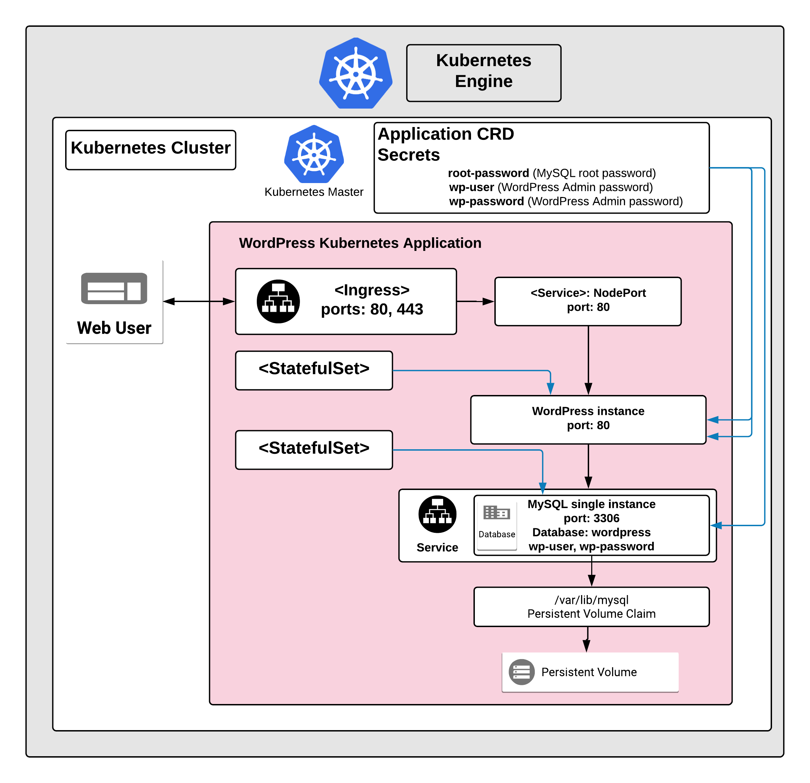

# Overview

WordPress is web publishing software used to create websites and blogs.

[Learn more](https://wordpress.org/).

## About Google Click to Deploy

Popular open stacks on Kubernetes packaged by Google.

## Design



### Solution Information

WordPress solution exposes its interface on port `80`.

Separate StatefulSet Kubernetes objects are used to manage instance of WordPress and instance of MySQL database.
Single instance of WordPress is deployed as a single Pod via Kubernetes StatefulSet.

WordPress instance connects to MySQL database over `3306` port. WordPress stores information in MySQL in `wordpress` database.
Single instance of MySQL is deployed as a Pod via Kubernetes StatefulSet.

WordPress application stores password for MySQL root in the `root_password` secret. Login and password information to access `wordpress` database are stored in `wp_user` and `wp_password` secrets (respectively).

# Installation

## Quick install with Google Cloud Marketplace

Get up and running with a few clicks! Install this WordPress app to a
Google Kubernetes Engine cluster using Google Cloud Marketplace. Follow the
[on-screen instructions](https://console.cloud.google.com/marketplace/details/google/wordpress).

## Command line instructions

### Prerequisites

#### Set up command-line tools

You'll need the following tools in your development environment:

- [gcloud](https://cloud.google.com/sdk/gcloud/)
- [kubectl](https://kubernetes.io/docs/reference/kubectl/overview/)
- [docker](https://docs.docker.com/install/)
- [git](https://git-scm.com/book/en/v2/Getting-Started-Installing-Git)
- [openssl](https://www.openssl.org/)

Configure `gcloud` as a Docker credential helper:

```shell
gcloud auth configure-docker
```

#### Create a Google Kubernetes Engine cluster

Create a new cluster from the command line:

```shell
export CLUSTER=wordpress-cluster
export ZONE=us-west1-a

gcloud container clusters create "$CLUSTER" --zone "$ZONE"
```

Configure `kubectl` to connect to the new cluster:

```shell
gcloud container clusters get-credentials "$CLUSTER" --zone "$ZONE"
```

#### Clone this repo

Clone this repo and the associated tools repo:

```shell
git clone --recursive https://github.com/GoogleCloudPlatform/click-to-deploy.git
```

#### Install the Application resource definition

An Application resource is a collection of individual Kubernetes components,
such as Services, Deployments, and so on, that you can manage as a group.

To set up your cluster to understand Application resources, run the following command:

```shell
kubectl apply -f "https://raw.githubusercontent.com/GoogleCloudPlatform/marketplace-k8s-app-tools/master/crd/app-crd.yaml"
```

You need to run this command once.

The Application resource is defined by the
[Kubernetes SIG-apps](https://github.com/kubernetes/community/tree/master/sig-apps)
community. The source code can be found on
[github.com/kubernetes-sigs/application](https://github.com/kubernetes-sigs/application).

### Install the Application

Navigate to the `wordpress` directory:

```shell
cd click-to-deploy/k8s/wordpress
```

#### Configure the app with environment variables

Choose the instance name and namespace for the app.

```shell
export APP_INSTANCE_NAME=wordpress-1
export NAMESPACE=default
```

Configure the container images:

```shell
export IMAGE_WORDPRESS="marketplace.gcr.io/google/wordpress:latest"
export IMAGE_MYSQL="marketplace.gcr.io/google/wordpress/mysql:latest"
```

The images above are referenced by
[tag](https://docs.docker.com/engine/reference/commandline/tag). We recommend
that you pin each image to an immutable
[content digest](https://docs.docker.com/registry/spec/api/#content-digests).
This ensures that the installed application always uses the same images,
until you are ready to upgrade. To get the digest for the image, use the
following script:

```shell
for i in "IMAGE_WORDPRESS" "IMAGE_MYSQL"; do
  repo=$(echo ${!i} | cut -d: -f1);
  digest=$(docker pull ${!i} | sed -n -e 's/Digest: //p');
  export $i="$repo@$digest";
  env | grep $i;
done
```

Set or generate passwords:

```shell
# Install pwgen and base64
sudo apt-get install -y pwgen base64

# Set the root and Wordpress database passwords
export ROOT_DB_PASSWORD="$(pwgen 16 1 | tr -d '\n' | base64)"
export WORDPRESS_DB_PASSWORD="$(pwgen 16 1 | tr -d '\n' | base64)"
```

#### Create namespace in your Kubernetes cluster

If you use a different namespace than the `default`, run the command below to create a new namespace:

```shell
kubectl create namespace "$NAMESPACE"
```

#### Expand the manifest template

Use `envsubst` to expand the template. We recommend that you save the
expanded manifest file for future updates to the application.

```shell
awk 'FNR==1 {print "---"}{print}' manifest/* \
  | envsubst '$APP_INSTANCE_NAME $NAMESPACE $IMAGE_WORDPRESS $IMAGE_MYSQL $ROOT_DB_PASSWORD $WORDPRESS_DB_PASSWORD' \
  > "${APP_INSTANCE_NAME}_manifest.yaml"
```

#### Apply the manifest to your Kubernetes cluster

Use `kubectl` to apply the manifest to your Kubernetes cluster:

```shell
kubectl apply -f "${APP_INSTANCE_NAME}_manifest.yaml" --namespace "${NAMESPACE}"
```

#### View the app in the Google Cloud Console

To get the Console URL for your app, run the following command:

```shell
echo "https://console.cloud.google.com/kubernetes/application/${ZONE}/${CLUSTER}/${NAMESPACE}/${APP_INSTANCE_NAME}"
```

To view the app, open the URL in your browser.

#### Create TLS certificate for WordPress

Create a certificate for WordPress. If you already have a certificate that you
want to use, copy your certificate and key pair in to the `/tmp/tls.crt` and
`/tmp/tls.key` files.

```shell
# create a certificate for WordPress
openssl req -x509 -nodes -days 365 -newkey rsa:2048 \
    -keyout /tmp/tls.key \
    -out /tmp/tls.crt \
    -subj "/CN=wordpress/O=wordpress"

# create a secret for Kubernetes ingress TLS
kubectl --namespace $NAMESPACE create secret generic $APP_INSTANCE_NAME-tls \
    --from-file=/tmp/tls.crt --from-file=/tmp/tls.key

kubectl --namespace $NAMESPACE label secret $APP_INSTANCE_NAME-tls \
    app.kubernetes.io/name=$APP_INSTANCE_NAME app.kubernetes.io/component=wordpress-tls

APPLICATION_UID=$(kubectl get applications/${APP_INSTANCE_NAME} --namespace="$NAMESPACE" --output=jsonpath='{.metadata.uid}')

cat <<EOF | kubectl apply --namespace $NAMESPACE -f -
apiVersion: v1
kind: Secret
metadata:
  name: $APP_INSTANCE_NAME-tls
  ownerReferences:
  - apiVersion: app.k8s.io/v1beta1
    blockOwnerDeletion: true
    controller: true
    kind: Application
    name: $APP_INSTANCE_NAME
    uid: $APPLICATION_UID
EOF
```

### Expose WordPress service externally

By default, the application does not have an external IP address. To create
an external IP address for your WordPress app, run the following command:

```
kubectl patch svc "$APP_INSTANCE_NAME-wordpress-svc" \
  --namespace "$NAMESPACE" \
  --patch '{"spec": {"type": "NodePort"}}'

APPLICATION_UID=$(kubectl get applications/${APP_INSTANCE_NAME} --namespace="$NAMESPACE" --output=jsonpath='{.metadata.uid}')

cat <<EOF | kubectl create --namespace "$NAMESPACE" -f -
apiVersion: extensions/v1beta1
kind: Ingress
metadata:
  name: $APP_INSTANCE_NAME-wordpress-ingress
  labels:
    app.kubernetes.io/name: $APP_INSTANCE_NAME
    app.kubernetes.io/component: wordpress-webserver
  ownerReferences:
  - apiVersion: app.k8s.io/v1beta1
    blockOwnerDeletion: true
    controller: true
    kind: Application
    name: $APP_INSTANCE_NAME
    uid: $APPLICATION_UID
spec:
  tls:
  - secretName: $APP_INSTANCE_NAME-tls
  backend:
    serviceName: $APP_INSTANCE_NAME-wordpress-svc
    servicePort: http
EOF

kubectl patch --namespace $NAMESPACE application "$APP_INSTANCE_NAME" --type=json \
  -p='[{"op": "add", "path": "/spec/componentKinds/-", "value":{ "group": "extensions/v1beta1", "kind": "Ingress" } }]'
```

It might take some time for the external IP address to be created.

### Open your WordPress site

Get the external IP of your WordPress site using the following command:

```
SERVICE_IP=$(kubectl get ingress $APP_INSTANCE_NAME-wordpress-ingress \
  --namespace $NAMESPACE \
  --output jsonpath='{.status.loadBalancer.ingress[0].ip}')

echo "https://${SERVICE_IP}/"
```

The command shows you the URL of your site.

### Set up WordPress

When you open the WordPress main page, an installation wizard starts.
Follow the steps on the screen to finish setting up WordPress.

# Scaling

This is a single-instance version of WordPress.
It is not intended to be scaled up with the current configuration.
# Backup and restore

## Using WordPress plugins

There are a number of plugins, both free and paid, that can create and manage
backups for your WordPress site.

When you are selecting a backup plugin, consider the following:

* *scope of backup* - your installation contains not only media files
  and database data, but also themes, plugins and configurations; check if the
  plugin can back up all your data.
* *schedule and manual triggering* - does the plugin perform regular backups
  on a schedule that you can define, and does it let you trigger backups
  manually (for instance, before updating the installation or just after
  finishing a large update to your configuration)?
* *location to store data* - your backup data should not be stored on the same
  server as your installation; one of the options to secure your backup data
  from accidental loss might be using a cloud provider - like Google Cloud
  Storage or Google Drive.

## Backup from the server

Backing up data directly from the server gives you full control over the
schedule and scope of backup, but is recommended for advanced users.

The steps below are for backing up the WordPress database and all installation
files, including media content, themes and plugins. We recommend that you store
the data outside your cluster, for example, in cloud-based storage.

### Set up your local environment

Set up environment variables to match your WordPress installation:

```shell
export APP_INSTANCE_NAME=wordpress-1
export NAMESPACE=default
```

### Establish the MySQL connection

For backing up WordPress database, you must connect to the MySQL host and port.
Using a separate terminal, create a local proxy using the following `kubectl`
command:

```shell
kubectl port-forward "svc/${APP_INSTANCE_NAME}-mysql-svc" 3306 --namespace "${NAMESPACE}"
```

### Create the backup

To create the backup, you need the `mysql-client` package. To install the
package, on Debian-based distributions, run:

```shell
sudo apt-get install mysql-client
```

To create the backup, run the following command:

```shell
backup_time="$(date +%Y%m%d-%H%M%S)"

# `--app` and `--namespace` are required; all other parameters are optional
scripts/backup.sh --app $APP_INSTANCE_NAME --namespace $NAMESPACE \
  --mysql-host 127.0.0.1 --mysql-port 3306 \
  --backup-file "wp-backup-${backup_time}.tar.gz"
```

### Secure your backup files

We recommend that you store your backup files outside your Kubernetes cluster,
such as in a Google Cloud Storage bucket. Read the
[Cloud Storage documentation](https://cloud.google.com/storage/docs/creating-buckets)
to learn more about creating buckets, setting permissions and uploading files.

## Restoring your data

Before restoring, configure your local environment with the `APP_INSTANCE_NAME`
and `NAMESPACE` environment variables for your WordPress cluster, and
create a MySQL connection.

### Restore WordPress database and files from backup

Run the script:

```shell
# Required: --app, --namespace and --backup-file.
scripts/restore.sh --app $APP_INSTANCE_NAME --namespace $NAMESPACE \
  --backup-file "wp-backup-${backup_time}.tar.gz" \
  --mysql-host 127.0.0.1 --mysql-port 3306
```

The script first creates a backup of the current database and file system,
and then restores the database and file system from the backup file
that you selected.

# Upgrade the Application

## Prepare the environment

We recommend to backing up your data before starting the upgrade.

Note that during the upgrade, your WordPress site will be unavailable.

Set your environment variables to match the installation properties:

```shell
export APP_INSTANCE_NAME=wordpress-1
export NAMESPACE=default
```

## Upgrade WordPress

Set the new image version in an environment variable:

```shell
export IMAGE_WORDPRESS=launcher.gcr.io/google/wordpress5-php7-apache:latest
```

Update the StatefulSet definition with the reference to the new image:

```shell
kubectl patch statefulset $APP_INSTANCE_NAME-wordpress \
  --namespace $NAMESPACE \
  --type='json' \
  --patch="[{ \
      \"op\": \"replace\", \
      \"path\": \"/spec/template/spec/containers/0/image\", \
      \"value\":\"${IMAGE_WORDPRESS}\" \
    }]"
```

Monitor the process with:

```shell
kubectl get pods "$APP_INSTANCE_NAME-wordpress-0" \
  --output go-template='Status={{.status.phase}} Image={{(index .spec.containers 0).image}}' \
  --watch
```

The Pod is terminated, and recreated with a new image for the `wordpress`
container. After the update is complete, the final state of
the Pod is `Running`, and marked as 1/1 in the `READY` column.

## Upgrade MySQL

Set the new image version in an environment variable:

```shell
export IMAGE_MYSQL=launcher.gcr.io/google/mysql5:5.7
```

Update the StatefulSet definition with new image reference:

```shell
kubectl patch statefulset $APP_INSTANCE_NAME-mysql \
  --namespace $NAMESPACE \
  --type='json' \
  --patch="[{ \
      \"op\": \"replace\", \
      \"path\": \"/spec/template/spec/containers/0/image\", \
      \"value\":\"${IMAGE_MYSQL}\" \
    }]"
```

Monitor the process with:

```shell
kubectl get pods $APP_INSTANCE_NAME-mysql-0 --namespace $NAMESPACE --watch
```

The Pod is terminated, and recreated with a new image for the `mysql` container. After the update is complete, the final state of
the Pod is `Running`, and marked as 1/1 in the `READY` column.

To check the current image used for `mysql` container, run the following command:

```shell
kubectl get pod $APP_INSTANCE_NAME-mysql-0 \
  --namespace $NAMESPACE \
  --output jsonpath='{.spec.containers[0].image}'
```

# Uninstall the Application

## Using the Google Cloud Platform Console

1. In the GCP Console, open [Kubernetes Applications](https://console.cloud.google.com/kubernetes/application).

1. From the list of applications, click **WordPress**.

1. On the Application Details page, click **Delete**.

## Using the command line

### Prepare the environment

Set your installation name and Kubernetes namespace:

```shell
export APP_INSTANCE_NAME=wordpress-1
export NAMESPACE=default
```

### Delete the resources

> **NOTE:** We recommend to use a kubectl version that is the same as the version of your cluster. Using the same versions of kubectl and the cluster helps avoid unforeseen issues.

To delete the resources, use the expanded manifest file used for the
installation.

Run `kubectl` on the expanded manifest file:

```shell
kubectl delete -f ${APP_INSTANCE_NAME}_manifest.yaml --namespace $NAMESPACE
```

Otherwise, delete the resources using types and a label:

```shell
kubectl delete application,statefulset,secret,service \
  --namespace $NAMESPACE \
  --selector app.kubernetes.io/name=$APP_INSTANCE_NAME
```

### Delete the persistent volumes of your installation

By design, the removal of StatefulSets in Kubernetes does not remove
PersistentVolumeClaims that were attached to their Pods. This prevents your
installations from accidentally deleting stateful data.

To remove the PersistentVolumeClaims with their attached persistent disks, run
the following `kubectl` commands:

```shell
# specify the variables values matching your installation:
export APP_INSTANCE_NAME=wordpress-1
export NAMESPACE=default

kubectl delete persistentvolumeclaims \
  --namespace $NAMESPACE
  --selector app.kubernetes.io/name=$APP_INSTANCE_NAME
```
