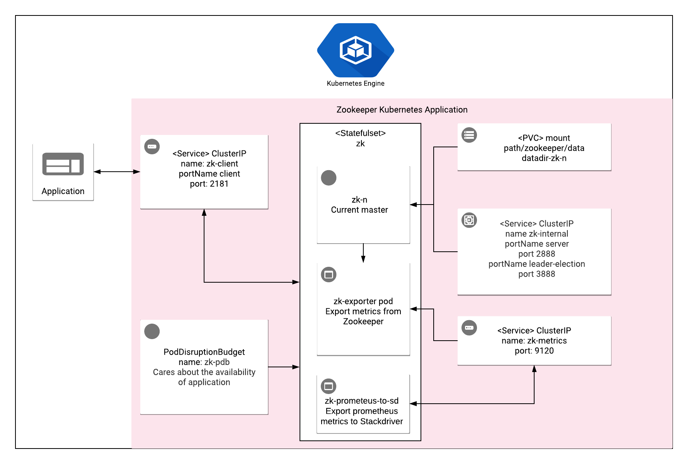

# Overview

ZooKeeper is a high-performance coordination service for distributed applications. It exposes common services - such as naming,
configuration management, synchronization, and group services - through a simple interface, so that you don't have to write them from scratch.
 You can use it off-the-shelf to implement consensus, group management, leader election, and presence protocols. You can also build on it to fit your own specific needs.

For more information about ZooKeeper, visit the [ZooKeeper website](https://zookeeper.apache.org/doc/r3.4.14/).

## About Google Click to Deploy

Popular open stacks on Kubernetes, packaged by Google.

## Architecture



The ZooKeeper app contains:

- an Application resource, which groups all of the deployment resources into one logical entity
- a PodDisruptionBudget for the ZooKeeper StatefulSet
- a PersistentVolume and PersistentVolumeClaim for each ZooKeeper Pod
- a StatefulSet with Application
- the Services `zk-client`, which exposes an endpoint for clients of ZooKeeper, and `zk-internal`, for master election and replications

By default, ZooKeeper is exposed by a Service of type ClusterIP, which means that it is only available within a cluster network.
All data is stored on PVC, which makes the app more stable.

# Installation

## Before you begin

If you are new to selling software on GCP Marketplace, [sign up to become a partner](https://cloud.google.com/marketplace/sell/).

## Quick install with Google Cloud Marketplace

Get up and running with a few clicks! Install this ZooKeeper app to a Google Kubernetes Engine cluster using Google Cloud Marketplace. Follow the
[on-screen instructions](https://console.cloud.google.com/marketplace/details/google/zookeeper).

## Command line instructions

You can use [Google Cloud Shell](https://cloud.google.com/shell/) or a local workstation to follow these instructions.

[](https://console.cloud.google.com/cloudshell/editor?cloudshell_git_repo=https://github.com/GoogleCloudPlatform/click-to-deploy&cloudshell_working_dir=k8s/zookeeper)

### Set up your environment

#### Set up command line tools

You'll need the following tools in your development environment. If you are using Cloud Shell, then `gcloud`, `kubectl`, Docker, and Git are installed in your environment by default.

- [gcloud](https://cloud.google.com/sdk/gcloud/)
- [kubectl](https://kubernetes.io/docs/tasks/tools/install-kubectl/)
- [docker](https://docs.docker.com/install/)
- [openssl](https://www.openssl.org/)
- [helm](https://helm.sh/docs/using_helm/#installing-helm)
- [git](https://git-scm.com/book/en/v2/Getting-Started-Installing-Git)

Configure `gcloud` as a Docker credential helper:

```shell
gcloud auth configure-docker
```

#### Create a Google Kubernetes Engine cluster

Create a new cluster from the command line. If you already have a cluster that
you want to use, this step is optional.

```shell
export CLUSTER=zookeeper-cluster
export ZONE=us-west1-a

gcloud container clusters create "$CLUSTER" --zone "$ZONE"
```

Configure `kubectl` to connect to the cluster:

```shell
gcloud container clusters get-credentials "$CLUSTER" --zone "$ZONE"
```

#### Clone this repo

Clone this repo, and the associated tools repo:

```shell
git clone --recursive https://github.com/GoogleCloudPlatform/click-to-deploy.git
```

#### Install the Application resource definition

An Application resource is a collection of individual Kubernetes components,
such as Services, Deployments, and so on, that you can manage as a group.

To set up your cluster to understand Application resources, run the following command:

```shell
kubectl apply -f "https://raw.githubusercontent.com/GoogleCloudPlatform/marketplace-k8s-app-tools/master/crd/app-crd.yaml"
```

You need to run this command once for each cluster.

The Application resource is defined by the
[Kubernetes SIG-apps](https://github.com/kubernetes/community/tree/master/sig-apps) community. You can find the source code at
[github.com/kubernetes-sigs/application](https://github.com/kubernetes-sigs/application).

### Install the app

Navigate to the `zookeeper` directory:

```shell
cd click-to-deploy/k8s/zookeeper
```

#### Configure the environment variables

Choose the instance name and
[namespace](https://kubernetes.io/docs/concepts/overview/working-with-objects/namespaces/)
for the app. In most cases, you can use the `default` namespace.

```shell
export APP_INSTANCE_NAME=zookeeper
export NAMESPACE=default
```

For the persistent disk provisioning of the ZooKeeper application StatefulSet, you will need to:

 * Set the StorageClass name. Check your available options using the command below:
   * ```kubectl get storageclass```
   * Or check how to create a new StorageClass in [Kubernetes Documentation](https://kubernetes.io/docs/concepts/storage/storage-classes/#the-storageclass-resource)

 * Set the persistent disk's size. The default disk size is "10Gi" for ZooKeeper.

```shell
export DEFAULT_STORAGE_CLASS="standard" # provide your StorageClass name if not "standard"
export PERSISTENT_DISK_SIZE="10Gi"
```

By default, the app does not export metrics to Stackdriver. To enable this option, change the value to `true`.

```shell
export METRICS_EXPORTER_ENABLED=false
```

> **NOTE:** Your GCP project must have Stackdriver enabled to export metrics to Stackdriver. If you are using a non-GCP cluster, you cannot export metrics to Stackdriver.

Set up the image tag:

It is advised to use stable image reference which you can find on
[Marketplace Container Registry](https://marketplace.gcr.io/google/zookeeper).
Example:

```shell
export TAG="3.8.2-<BUILD_ID>"
```

Alternatively you can use short tag which points to the latest image for selected version.
> Warning: this tag is not stable and referenced image might change over time.

```shell
export TAG="3.8"
```

Configure the container images:

```shell
export IMAGE_REGISTRY="marketplace.gcr.io/google"

export IMAGE_ZOOKEEPER="${IMAGE_REGISTRY}/zookeeper"
export IMAGE_ZOOKEEPER_EXPORTER="${IMAGE_REGISTRY}/zookeeper/exporter"
export IMAGE_METRICS_EXPORTER="${IMAGE_REGISTRY}/zookeeper/prometheus-to-sd:${TAG}"
```

Set the number of replicas for ZooKeeper:

> **NOTE:** You should use an odd number, to ensure that ZooKeeper is always
able to easily establish a majority. Even numbers of replicas are allowed,
but not advised. An even number of replicas means that more peers will be
required to establish a quorum.

```shell
export ZOOKEEPER_REPLICAS=3
```

Request the amount of memory and CPU for each ZooKeeper Pod:

```shell
export ZOOKEEPER_MEMORY_REQUEST=1250Mi
export ZOOKEEPER_CPU_REQUEST=300m
```

Define Zookeeper's basic parameters:

> **NOTE:** You can find a detailed explanation of possible variables in the [ZooKeeper Administrator's Guide](https://zookeeper.apache.org/doc/r3.4.14/zookeeperAdmin.html).

```shell
export ZOOKEEPER_TICKTIME=2000
export ZOOKEEPER_CLIENT_MAX_CNXNX=60
export ZOOKEEPER_AUTO_PURGE_SNAP_RETAIN_COUNT=3
export ZOOKEEPER_PURGE_INTERVAL=24
export ZOOKEEPER_HEAP_SIZE=1000M
```

#### Expand the manifest template

Use `helm template` to expand the template. We recommend that you save the
expanded manifest file for future updates to the application.

```shell
helm template "${APP_INSTANCE_NAME}" chart/zookeeper \
  --namespace "${NAMESPACE}" \
  --set zookeeper.image.name="${IMAGE_ZOOKEEPER}" \
  --set zookeeper.image.tag="${TAG}" \
  --set exporter.image="${IMAGE_ZOOKEEPER_EXPORTER}" \
  --set exporter.tag="${TAG}" \
  --set metrics.image="${IMAGE_METRICS_EXPORTER}" \
  --set metrics.exporter.enabled="${METRICS_EXPORTER_ENABLED}" \
  --set zookeeper.zkReplicas="${ZOOKEEPER_REPLICAS}" \
  --set zookeeper.zkTicktime="${ZOOKEEPER_TICKTIME}" \
  --set zookeeper.zkMaxClientCnxns="${ZOOKEEPER_CLIENT_MAX_CNXNX}" \
  --set zookeeper.zkAutopurgeSnapRetainCount="${ZOOKEEPER_AUTO_PURGE_SNAP_RETAIN_COUNT}" \
  --set zookeeper.zkPurgeInterval="${ZOOKEEPER_PURGE_INTERVAL}" \
  --set zookeeper.memoryRequest="${ZOOKEEPER_MEMORY_REQUEST}" \
  --set zookeeper.cpuRequest="${ZOOKEEPER_CPU_REQUEST}" \
  --set zookeeper.zkHeapSize="${ZOOKEEPER_HEAP_SIZE}" \
  --set zookeeper.persistence.size="${PERSISTENT_DISK_SIZE}" \
  --set zookeeper.persistence.storageClass="${DEFAULT_STORAGE_CLASS}" \
  > "${APP_INSTANCE_NAME}_manifest.yaml"
```
#### Apply the manifest to your Kubernetes cluster

Use `kubectl` to apply the manifest to your Kubernetes cluster:

```shell
kubectl apply -f "${APP_INSTANCE_NAME}_manifest.yaml" --namespace "${NAMESPACE}"
```

#### View the app in the Google Cloud Platform Console

To get the Console URL for your app, run the following command:

```shell
echo "https://console.cloud.google.com/kubernetes/application/${ZONE}/${CLUSTER}/${NAMESPACE}/${APP_INSTANCE_NAME}"
```

To view the app, open the URL in your browser.

# Using ZooKeeper

By default, the application is not exposed externally. To get access to ZooKeeper CLI, run the following command:

```bash
kubectl exec -it --namespace $NAMESPACE $APP_INSTANCE_NAME-zk-0 -- zkCli.sh -server localhost:2181
```

# Application metrics

## ZooKeeper metrics

The application is configured to expose its metrics through
[ZooKeeper Exporter](https://github.com/carlpett/zookeeper_exporter) in
the
[Prometheus format](https://github.com/prometheus/docs/blob/master/content/docs/instrumenting/exposition_formats.md).

You can access the metrics at `[ZOOKEEPER_CLUSTER_IP]:9141/metrics`, where
`[ZOOKEEPER_CLUSTER_IP]` is the IP address of Pod on the Kubernetes
cluster.

### Configuring Prometheus to collect metrics

Prometheus can be configured to automatically collect the app's metrics.
To set this up, follow the steps in
[Configuring Prometheus](https://prometheus.io/docs/introduction/first_steps/#configuring-prometheus).

You configure the metrics in the
[`scrape_configs` section](https://prometheus.io/docs/prometheus/latest/configuration/configuration/#scrape_config).

## Exporting metrics to Stackdriver

The deployment includes a
[Prometheus to Stackdriver (`prometheus-to-sd`)](https://github.com/GoogleCloudPlatform/k8s-stackdriver/tree/master/prometheus-to-sd)
container. If you enabled the option to export metrics to Stackdriver, the
metrics are automatically exported to Stackdriver and visible in
[Stackdriver Metrics Explorer](https://cloud.google.com/monitoring/charts/metrics-explorer).

Metrics are labeled with `app.kubernetes.io/name`, which uses the app's name as defined in the `APP_INSTANCE_NAME` environment variable.

The export option may not be available for GKE on-prem clusters.

> Note: Stackdriver has [quotas](https://cloud.google.com/monitoring/quotas) for
> the number of custom metrics created in a single GCP project. If the quota is
> met, additional metrics might not show up in the Stackdriver Metrics Explorer.

You can remove existing metric descriptors by using
[Stackdriver's REST API](https://cloud.google.com/monitoring/api/ref_v3/rest/v3/projects.metricDescriptors/delete).

# Scaling

ZooKeeper does not support auto-scaling, but it can be reinstalled with a larger amount of nodes.

# Backup and restore

For information on backing up your ZooKeeper data, visit the [ZooKeeper documentation](https://zookeeper.apache.org/doc/r3.4.14/zookeeperAdmin.html#sc_dataFileManagement).

# Uninstall the Application

## Using the Google Cloud Platform Console

1. In the GCP Console, open [Kubernetes Applications](https://console.cloud.google.com/kubernetes/application).

1. From the list of applications, click **ZooKeeper**.

1. On the Application Details page, click **Delete**.

## Using the command line

### Prepare the environment

Set your installation name and Kubernetes namespace:

```shell
export APP_INSTANCE_NAME=zookeeper
export NAMESPACE=default
```

### Delete the resources

> **NOTE:** We recommend to use a kubectl version that is the same as the version of your cluster. Using the same version for `kubectl` and the cluster helps prevent unforeseen issues.

To delete the resources, use the expanded manifest file that was used for the installation.

Run `kubectl` on the expanded manifest file:

```shell
kubectl delete -f ${APP_INSTANCE_NAME}_manifest.yaml --namespace $NAMESPACE
```

If you don't have the expanded manifest file, delete the resources by using types and a label:

```shell
kubectl delete application,deployment,service,pvc,secret \
  --namespace $NAMESPACE \
  --selector app.kubernetes.io/name=$APP_INSTANCE_NAME
```

### Delete the persistent volumes of your installation

By design, removing StatefulSets in Kubernetes does not remove any
PersistentVolumeClaims that were attached to their Pods. This prevents your
installations from accidentally deleting stateful data.

To remove the PersistentVolumeClaims with their attached persistent disks, run
the following `kubectl` commands:

```shell
for pv in $(kubectl get pvc --namespace $NAMESPACE \
  --selector app.kubernetes.io/name=$APP_INSTANCE_NAME \
  --output jsonpath='{.items[*].spec.volumeName}');
do
  kubectl delete pv/$pv --namespace $NAMESPACE
done

kubectl delete persistentvolumeclaims \
  --namespace $NAMESPACE \
  --selector app.kubernetes.io/name=$APP_INSTANCE_NAME
```

### Delete the GKE cluster

Optionally, if you don't need the deployed app or the GKE cluster,
you can delete the cluster by using this command:

```shell
gcloud container clusters delete "$CLUSTER" --zone "$ZONE"
```
